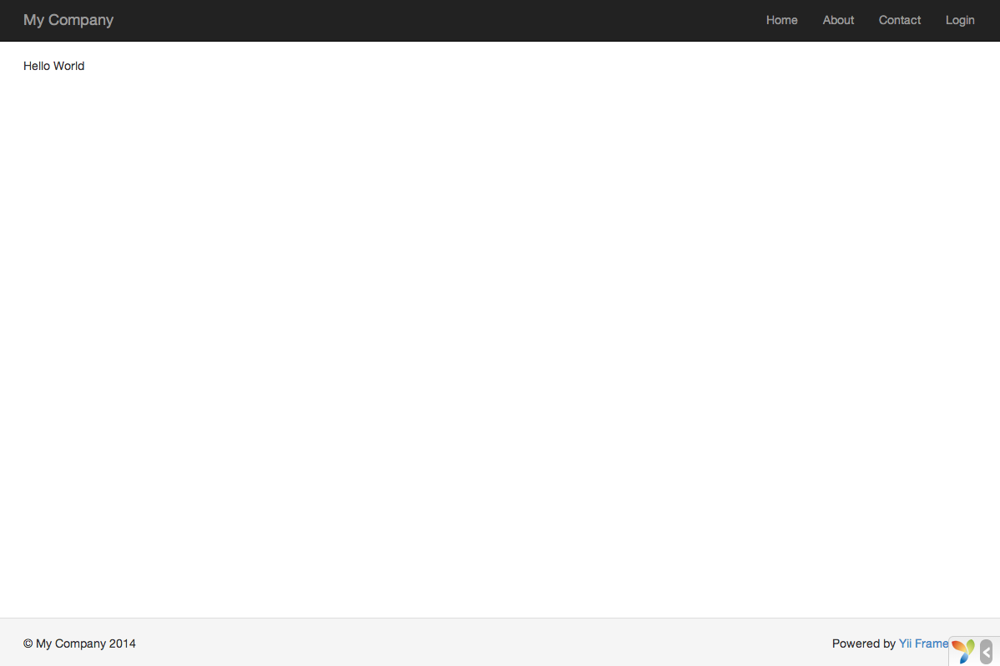
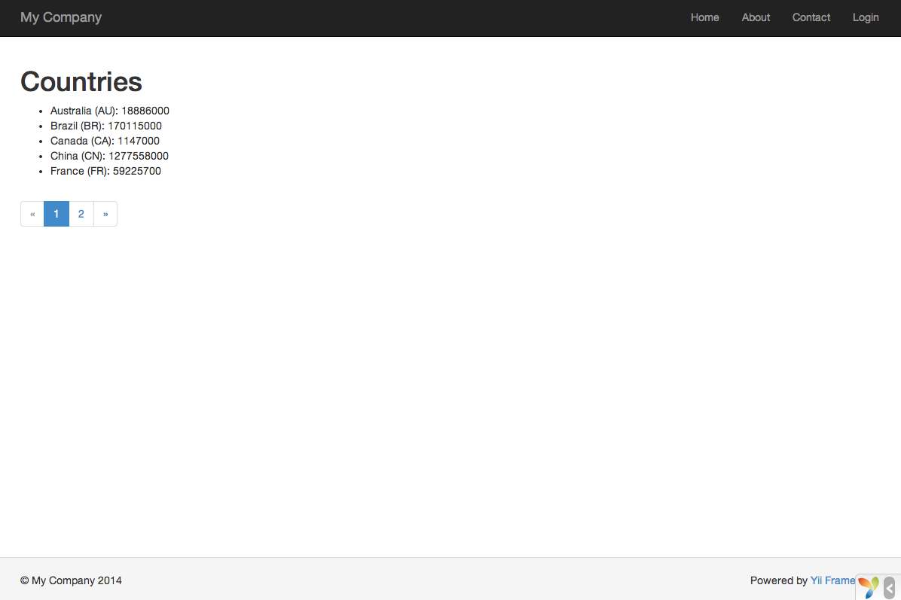
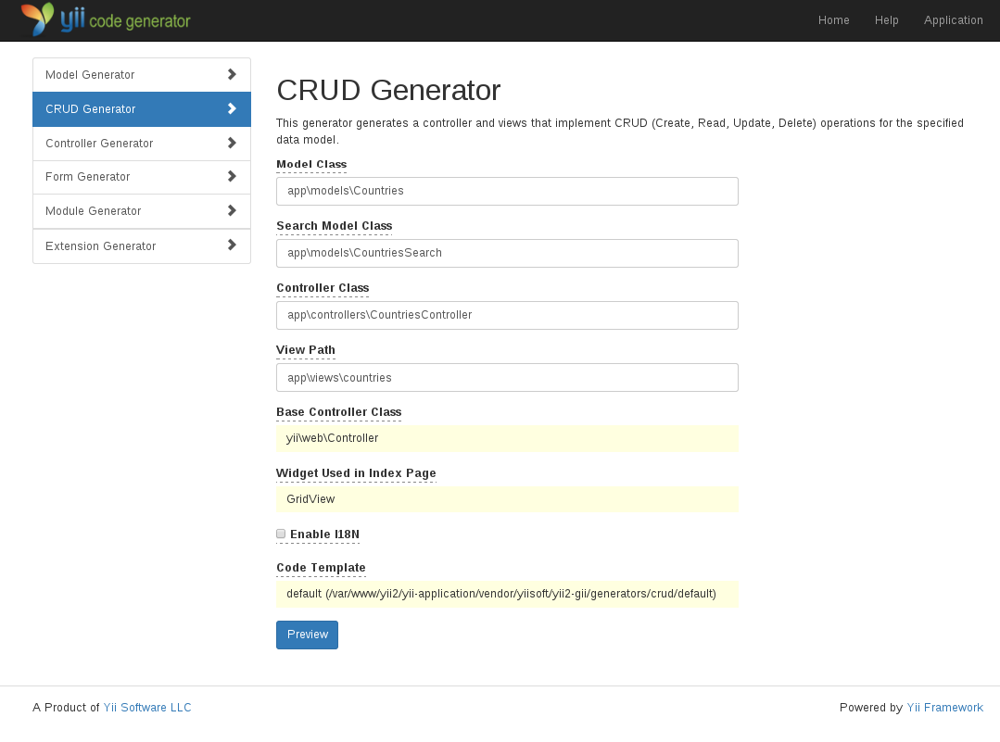
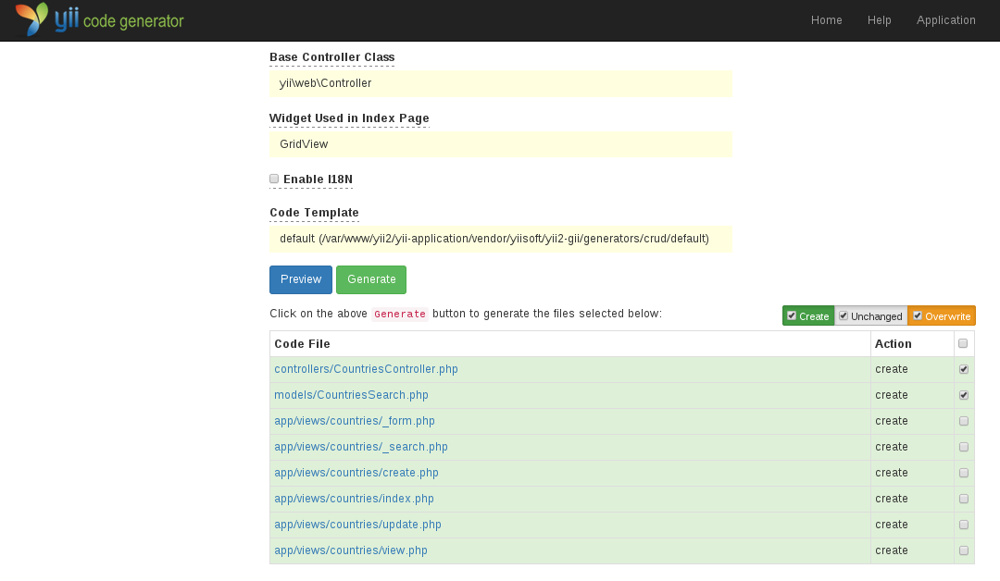
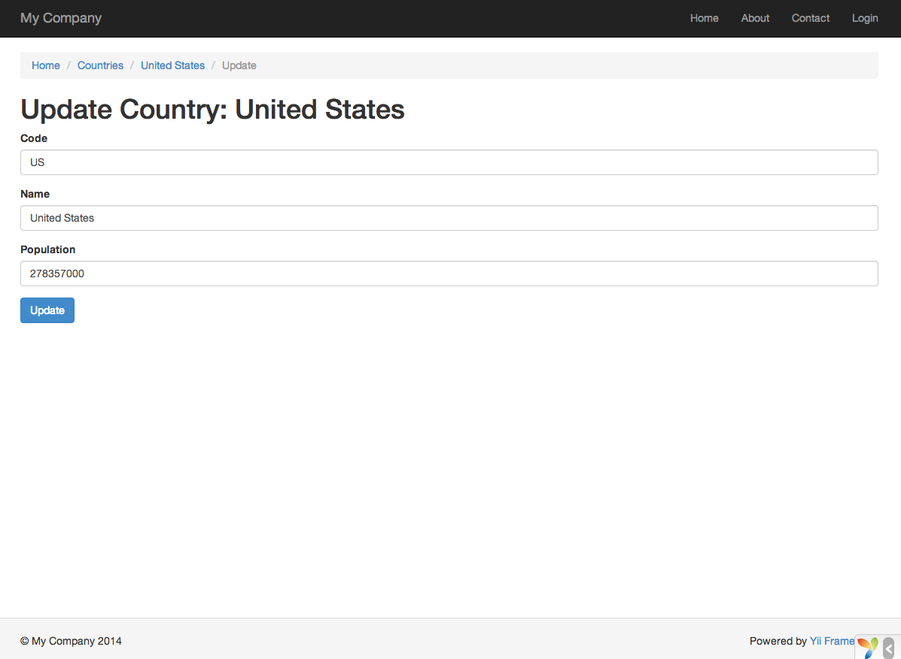
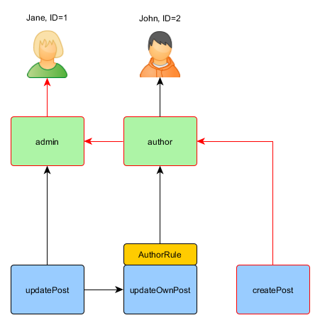

What is Yii
===========

Yii is a high performance, component-based PHP framework for rapidly developing modern Web applications.
The name Yii (pronounced `Yee` or `[ji:]`) means "simple and evolutionary" in Chinese. It can also
be thought of as an acronym for **Yes It Is**!


What is Yii Best for?
---------------------

Yii is a generic Web programming framework, meaning that it can be used for developing all kinds
of Web applications using PHP. Because of its component-based architecture and sophisticated caching
support, it is especially suitable for developing large-scale applications such as portals, forums, content
management systems (CMS), e-commerce projects, RESTful Web services, and so on.


How does Yii Compare with Other Frameworks?
-------------------------------------------

If you're already familiar with another framework, you may appreciate knowing how Yii compares:

- Like most PHP frameworks, Yii implements the MVC (Model-View-Controller) design pattern and promotes code
  organization based on that pattern.
- Yii takes the philosophy that code should be written in a simple yet elegant way. Yii will never try to
  over-design things mainly for the purpose of strictly following some design pattern.
- Yii is a full-stack framework providing many proven and ready-to-use features: query builders
  and ActiveRecord for both relational and NoSQL databases; RESTful API development support; multi-tier
  caching support; and more.
- Yii is extremely extensible. You can customize or replace nearly every piece of the core's code. You can also
  take advantage of Yii's solid extension architecture to use or develop redistributable extensions.
- High performance is always a primary goal of Yii.

Yii is not a one-man show, it is backed up by a [strong core developer team][], as well as a large community
of professionals constantly contributing to Yii's development. The Yii developer team
keeps a close eye on the latest Web development trends and on the best practices and features
found in other frameworks and projects. The most relevant best practices and features found elsewhere are regularly incorporated into the core framework and exposed
via simple and elegant interfaces.

[strong core developer team]: http://www.yiiframework.com/about/

Yii Versions
------------

Yii currently has two major versions available: 1.1 and 2.0. Version 1.1 is the old generation and is now in maintenance mode. Version 2.0 is a complete rewrite of Yii, adopting the latest
technologies and protocols, including Composer, PSR, namespaces, traits, and so forth. Version 2.0 represents the current
generation of the framework and will receive the main development efforts over the next few years.
This guide is mainly about version 2.0.


Requirements and Prerequisites
------------------------------

Yii 2.0 requires PHP 5.4.0 or above. You can find more detailed requirements for individual features
by running the requirement checker included in every Yii release.

Using Yii requires basic knowledge of object-oriented programming (OOP), as Yii is a pure OOP-based framework.
Yii 2.0 also makes use of the latest features of PHP, such as [namespaces](http://www.php.net/manual/en/language.namespaces.php) and [traits](http://www.php.net/manual/en/language.oop5.traits.php). Understanding these concepts will help
you more easily pick up Yii 2.0.

Upgrading from Version 1.1
==========================

There are many differences between versions 1.1 and 2.0 of Yii as the framework was completely rewritten for 2.0.
As a result, upgrading from version 1.1 is not as trivial as upgrading between minor versions. In this guide you'll
find the major differences between the two versions.

If you have not used Yii 1.1 before, you can safely skip this section and turn directly to "[Getting started](start-installation.md)".

Please note that Yii 2.0 introduces more new features than are covered in this summary. It is highly recommended
that you read through the whole definitive guide to learn about them all. Chances are that
some features you previously had to develop for yourself are now part of the core code.


Installation
------------

Yii 2.0 fully embraces [Composer](https://getcomposer.org/), the de facto PHP package manager. Installation
of the core framework, as well as extensions, are handled through Composer. Please refer to
the [Installing Yii](start-installation.md) section to learn how to install Yii 2.0. If you want to
create new extensions, or turn your existing 1.1 extensions into 2.0-compatible extensions, please refer to
the [Creating Extensions](structure-extensions.md#creating-extensions) section of the guide.


PHP Requirements
----------------

Yii 2.0 requires PHP 5.4 or above, which is a huge improvement over PHP version 5.2 that is required by Yii 1.1.
As a result, there are many differences on the language level that you should pay attention to.
Below is a summary of the major changes regarding PHP:

- [Namespaces](http://php.net/manual/en/language.namespaces.php).
- [Anonymous functions](http://php.net/manual/en/functions.anonymous.php).
- Short array syntax `[...elements...]` is used instead of `array(...elements...)`.
- Short echo tags `<?=` are used in view files. This is safe to use starting from PHP 5.4.
- [SPL classes and interfaces](http://php.net/manual/en/book.spl.php).
- [Late Static Bindings](http://php.net/manual/en/language.oop5.late-static-bindings.php).
- [Date and Time](http://php.net/manual/en/book.datetime.php).
- [Traits](http://php.net/manual/en/language.oop5.traits.php).
- [intl](http://php.net/manual/en/book.intl.php). Yii 2.0 makes use of the `intl` PHP extension
  to support internationalization features.


Namespace
---------

The most obvious change in Yii 2.0 is the use of namespaces. Almost every core class
is namespaced, e.g., `yii\web\Request`. The "C" prefix is no longer used in class names.
The naming scheme now follows the directory structure. For example, `yii\web\Request`
indicates that the corresponding class file is `web/Request.php` under the Yii framework folder.

(You can use any core class without explicitly including that class file, thanks to the Yii
class loader.)


Component and Object
--------------------

Yii 2.0 breaks the `CComponent` class in 1.1 into two classes: [[yii\base\Object]] and [[yii\base\Component]].
The [[yii\base\Object|Object]] class is a lightweight base class that allows defining [object properties](concept-properties.md)
via getters and setters. The [[yii\base\Component|Component]] class extends from [[yii\base\Object|Object]] and supports
[events](concept-events.md) and [behaviors](concept-behaviors.md).

If your class does not need the event or behavior feature, you should consider using
[[yii\base\Object|Object]] as the base class. This is usually the case for classes that represent basic
data structures.


Object Configuration
--------------------

The [[yii\base\Object|Object]] class introduces a uniform way of configuring objects. Any descendant class
of [[yii\base\Object|Object]] should declare its constructor (if needed) in the following way so that
it can be properly configured:

```php
class MyClass extends \yii\base\Object
{
    public function __construct($param1, $param2, $config = [])
    {
        // ... initialization before configuration is applied

        parent::__construct($config);
    }

    public function init()
    {
        parent::init();

        // ... initialization after configuration is applied
    }
}
```

In the above, the last parameter of the constructor must take a configuration array
that contains name-value pairs for initializing the properties at the end of the constructor.
You can override the [[yii\base\Object::init()|init()]] method to do initialization work that should be done after
the configuration has been applied.

By following this convention, you will be able to create and configure new objects
using a configuration array:

```php
$object = Yii::createObject([
    'class' => 'MyClass',
    'property1' => 'abc',
    'property2' => 'cde',
], [$param1, $param2]);
```

More details about configurations can be found in the [Object Configurations](concept-configurations.md) section.


Events
------

In Yii 1, events were created by defining an `on`-method (e.g., `onBeforeSave`). In Yii 2, you can now use any event name. You trigger an event by calling
the [[yii\base\Component::trigger()|trigger()]] method:

```php
$event = new \yii\base\Event;
$component->trigger($eventName, $event);
```

To attach a handler to an event, use the [[yii\base\Component::on()|on()]] method:

```php
$component->on($eventName, $handler);
// To detach the handler, use:
// $component->off($eventName, $handler);
```

There are many enhancements to the event features. For more details, please refer to the [Events](concept-events.md) section.


Path Aliases
------------

Yii 2.0 expands the usage of path aliases to both file/directory paths and URLs. Yii 2.0 also now requires
an alias name to start with the `@` character, to differentiate aliases from normal file/directory paths or URLs.
For example, the alias `@yii` refers to the Yii installation directory. Path aliases are
supported in most places in the Yii core code. For example, [[yii\caching\FileCache::cachePath]] can take
both a path alias and a normal directory path.

A path alias is also closely related to a class namespace. It is recommended that a path
alias be defined for each root namespace, thereby allowing you to use Yii class autoloader without
any further configuration. For example, because `@yii` refers to the Yii installation directory,
a class like `yii\web\Request` can be autoloaded. If you use a third party library,
such as the Zend Framework, you may define a path alias `@Zend` that refers to that framework's installation
directory. Once you've done that, Yii will be able to autoload any class in that Zend Framework library, too.

More on path aliases can be found in the [Aliases](concept-aliases.md) section.


Views
-----

The most significant change about views in Yii 2 is that the special variable `$this` in a view no longer refers to
the current controller or widget. Instead, `$this` now refers to a *view* object, a new concept
introduced in 2.0. The *view* object is of type [[yii\web\View]], which represents the view part
of the MVC pattern. If you want to access the controller or widget in a view, you can use `$this->context`.

To render a partial view within another view, you use `$this->render()`, not `$this->renderPartial()`. The call to `render` also now has to be explicitly echoed, as the `render()` method returns the rendering
result, rather than directly displaying it. For example:

```php
echo $this->render('_item', ['item' => $item]);
```

Besides using PHP as the primary template language, Yii 2.0 is also equipped with official
support for two popular template engines: Smarty and Twig. The Prado template engine is no longer supported.
To use these template engines, you need to configure the `view` application component by setting the
[[yii\base\View::$renderers|View::$renderers]] property. Please refer to the [Template Engines](tutorial-template-engines.md)
section for more details.


Models
------

Yii 2.0 uses [[yii\base\Model]] as the base model, similar to `CModel` in 1.1.
The class `CFormModel` has been dropped entirely. Instead, in Yii 2 you should extend [[yii\base\Model]] to create a form model class.

Yii 2.0 introduces a new method called [[yii\base\Model::scenarios()|scenarios()]] to declare
supported scenarios, and to indicate under which scenario an attribute needs to be validated, can be considered as safe or not, etc. For example:

```php
public function scenarios()
{
    return [
        'backend' => ['email', 'role'],
        'frontend' => ['email', '!role'],
    ];
}
```

In the above, two scenarios are declared: `backend` and `frontend`. For the `backend` scenario, both the
`email` and `role` attributes are safe, and can be massively assigned. For the `frontend` scenario,
`email` can be massively assigned while `role` cannot. Both `email` and `role` should be validated using rules.

The [[yii\base\Model::rules()|rules()]] method is still used to declare the validation rules. Note that due to the introduction of [[yii\base\Model::scenarios()|scenarios()]], there is no longer an `unsafe` validator.

In most cases, you do not need to override [[yii\base\Model::scenarios()|scenarios()]]
if the [[yii\base\Model::rules()|rules()]] method fully specifies the scenarios that will exist, and if there is no need to declare
`unsafe` attributes.

To learn more details about models, please refer to the [Models](structure-models.md) section.


Controllers
-----------

Yii 2.0 uses [[yii\web\Controller]] as the base controller class, which is similar to `CController` in Yii 1.1.
[[yii\base\Action]] is the base class for action classes.

The most obvious impact of these changes on your code is that a controller action should return the content
that you want to render instead of echoing it:

```php
public function actionView($id)
{
    $model = \app\models\Post::findOne($id);
    if ($model) {
        return $this->render('view', ['model' => $model]);
    } else {
        throw new \yii\web\NotFoundHttpException;
    }
}
```

Please refer to the [Controllers](structure-controllers.md) section for more details about controllers.


Widgets
-------

Yii 2.0 uses [[yii\base\Widget]] as the base widget class, similar to `CWidget` in Yii 1.1.

To get better support for the framework in IDEs, Yii 2.0 introduces a new syntax for using widgets. The static methods
[[yii\base\Widget::begin()|begin()]], [[yii\base\Widget::end()|end()]], and [[yii\base\Widget::widget()|widget()]]
have been introduced, to be used like so:

```php
use yii\widgets\Menu;
use yii\widgets\ActiveForm;

// Note that you have to "echo" the result to display it
echo Menu::widget(['items' => $items]);

// Passing an array to initialize the object properties
$form = ActiveForm::begin([
    'options' => ['class' => 'form-horizontal'],
    'fieldConfig' => ['inputOptions' => ['class' => 'input-xlarge']],
]);
... form input fields here ...
ActiveForm::end();
```

Please refer to the [Widgets](structure-widgets.md) section for more details.


Themes
------

Themes work completely differently in 2.0. They are now based on a path mapping mechanism that maps a source
view file path to a themed view file path. For example, if the path map for a theme is
`['/web/views' => '/web/themes/basic']`, then the themed version for the view file
`/web/views/site/index.php` will be `/web/themes/basic/site/index.php`. For this reason, themes can now
be applied to any view file, even a view rendered outside of the context of a controller or a widget.

Also, there is no more `CThemeManager` component. Instead, `theme` is a configurable property of the `view`
application component.

Please refer to the [Theming](output-theming.md) section for more details.


Console Applications
--------------------

Console applications are now organized as controllers, like Web applications. Console controllers
should extend from [[yii\console\Controller]], similar to `CConsoleCommand` in 1.1.

To run a console command, use `yii <route>`, where `<route>` stands for a controller route
(e.g. `sitemap/index`). Additional anonymous arguments are passed as the parameters to the
corresponding controller action method, while named arguments are parsed according to
the declarations in [[yii\console\Controller::options()]].

Yii 2.0 supports automatic generation of command help information from comment blocks.

Please refer to the [Console Commands](tutorial-console.md) section for more details.


I18N
----

Yii 2.0 removes the built-in date formatter and number formatter pieces in favor of the [PECL intl PHP module](http://pecl.php.net/package/intl).

Message translation is now performed via the `i18n` application component.
This component manages a set of message sources, which allows you to use different message
sources based on message categories.

Please refer to the [Internationalization](tutorial-i18n.md) section for more details.


Action Filters
--------------

Action filters are implemented via behaviors now. To define a new, custom filter, extend from [[yii\base\ActionFilter]]. To use a filter, attach the filter class to the controller
as a behavior. For example, to use the [[yii\filters\AccessControl]] filter, you would have the following
code in a controller:

```php
public function behaviors()
{
    return [
        'access' => [
            'class' => 'yii\filters\AccessControl',
            'rules' => [
                ['allow' => true, 'actions' => ['admin'], 'roles' => ['@']],
            ],
        ],
    ];
}
```

Please refer to the [Filtering](structure-filters.md) section for more details.


Assets
------

Yii 2.0 introduces a new concept called *asset bundle* that replaces the script package concept found in Yii 1.1.

An asset bundle is a collection of asset files (e.g. JavaScript files, CSS files, image files, etc.)
within a directory. Each asset bundle is represented as a class extending [[yii\web\AssetBundle]].
By registering an asset bundle via [[yii\web\AssetBundle::register()]], you make
the assets in that bundle accessible via the Web. Unlike in Yii 1, the page registering the bundle will automatically
contain the references to the JavaScript and CSS files specified in that bundle.

Please refer to the [Managing Assets](structure-assets.md) section for more details.


Helpers
-------

Yii 2.0 introduces many commonly used static helper classes, including.

* [[yii\helpers\Html]]
* [[yii\helpers\ArrayHelper]]
* [[yii\helpers\StringHelper]]
* [[yii\helpers\FileHelper]]
* [[yii\helpers\Json]]

Please refer to the [Helper Overview](helper-overview.md) section for more details.

Forms
-----

Yii 2.0 introduces the *field* concept for building a form using [[yii\widgets\ActiveForm]]. A field
is a container consisting of a label, an input, an error message, and/or a hint text.
A field is represented as an [[yii\widgets\ActiveField|ActiveField]] object.
Using fields, you can build a form more cleanly than before:

```php
<?php $form = yii\widgets\ActiveForm::begin(); ?>
    <?= $form->field($model, 'username') ?>
    <?= $form->field($model, 'password')->passwordInput() ?>
    <div class="form-group">
        <?= Html::submitButton('Login') ?>
    </div>
<?php yii\widgets\ActiveForm::end(); ?>
```

Please refer to the [Creating Forms](input-forms.md) section for more details.


Query Builder
-------------

In 1.1, query building was scattered among several classes, including `CDbCommand`,
`CDbCriteria`, and `CDbCommandBuilder`. Yii 2.0 represents a DB query in terms of a [[yii\db\Query|Query]] object
that can be turned into a SQL statement with the help of [[yii\db\QueryBuilder|QueryBuilder]] behind the scene.
For example:

```php
$query = new \yii\db\Query();
$query->select('id, name')
      ->from('user')
      ->limit(10);

$command = $query->createCommand();
$sql = $command->sql;
$rows = $command->queryAll();
```

Best of all, such query building methods can also be used when working with [Active Record](db-active-record.md).

Please refer to the [Query Builder](db-query-builder.md) section for more details.


Active Record
-------------

Yii 2.0 introduces a lot of changes to [Active Record](db-active-record.md). The two most obvious ones involve
query building and relational query handling.

The `CDbCriteria` class in 1.1 is replaced by [[yii\db\ActiveQuery]] in Yii 2. That class extends from [[yii\db\Query]], and thus
inherits all query building methods. You call [[yii\db\ActiveRecord::find()]] to start building a query:

```php
// To retrieve all *active* customers and order them by their ID:
$customers = Customer::find()
    ->where(['status' => $active])
    ->orderBy('id')
    ->all();
```

To declare a relation, simply define a getter method that returns an [[yii\db\ActiveQuery|ActiveQuery]] object.
The property name defined by the getter represents the relation name. For example, the following code declares
an `orders` relation (in 1.1, you would have to declare relations in a central place `relations()`):

```php
class Customer extends \yii\db\ActiveRecord
{
    public function getOrders()
    {
        return $this->hasMany('Order', ['customer_id' => 'id']);
    }
}
```

Now you can use `$customer->orders` to access a customer's orders from the related table. You can also use the following code
to perform an on-the-fly relational query with a customized query condition:

```php
$orders = $customer->getOrders()->andWhere('status=1')->all();
```

When eager loading a relation, Yii 2.0 does it differently from 1.1. In particular, in 1.1 a JOIN query
would be created to select both the primary and the relational records. In Yii 2.0, two SQL statements are executed
without using JOIN: the first statement brings back the primary records and the second brings back the relational
records by filtering with the primary keys of the primary records.

Instead of returning [[yii\db\ActiveRecord|ActiveRecord]] objects, you may chain the [[yii\db\ActiveQuery::asArray()|asArray()]]
method when building a query to return a large number of records. This will cause the query result to be returned
as arrays, which can significantly reduce the needed CPU time and memory if large number of records . For example:

```php
$customers = Customer::find()->asArray()->all();
```

Another change is that you can't define attribute default values through public properties anymore.
If you need those, you should set them in the init method of your record class.

```php
public function init()
{
    parent::init();
    $this->status = self::STATUS_NEW;
}
```

There were some problems with overriding the constructor of an ActiveRecord class in 1.1. These are not present in
version 2.0 anymore. Note that when adding parameters to the constructor you might have to override [[yii\db\ActiveRecord::instantiate()]].

There are many other changes and enhancements to Active Record. Please refer to
the [Active Record](db-active-record.md) section for more details.


Active Record Behaviors
-----------------------

In 2.0, we have dropped the base behavior class `CActiveRecordBehavior`. If you want to create an Active Record Behavior,
you will have to extend directly from `yii\base\Behavior`. If the behavior class needs to respond to some events
of the owner, you have to override the `events()` method like the following,

```php
namespace app\components;

use yii\db\ActiveRecord;
use yii\base\Behavior;

class MyBehavior extends Behavior
{
    // ...

    public function events()
    {
        return [
            ActiveRecord::EVENT_BEFORE_VALIDATE => 'beforeValidate',
        ];
    }

    public function beforeValidate($event)
    {
        // ...
    }
}
```


User and IdentityInterface
--------------------------

The `CWebUser` class in 1.1 is now replaced by [[yii\web\User]], and there is no more
`CUserIdentity` class. Instead, you should implement the [[yii\web\IdentityInterface]] which
is much more straightforward to use. The advanced application template provides such an example.

Please refer to the [Authentication](security-authentication.md), [Authorization](security-authorization.md), and [Advanced Application Template](tutorial-advanced-app.md) sections for more details.


URL Management
--------------

URL management in Yii 2 is similar to that in 1.1. A major enhancement is that URL management now supports optional
parameters. For example, if you have a rule declared as follows, then it will match
both `post/popular` and `post/1/popular`. In 1.1, you would have had to use two rules to achieve
the same goal.

```php
[
    'pattern' => 'post/<page:\d+>/<tag>',
    'route' => 'post/index',
    'defaults' => ['page' => 1],
]
```

Please refer to the [Url manager docs](runtime-routing.md) section for more details.

Using Yii 1.1 and 2.x together
------------------------------

If you have legacy Yii 1.1 code that you want to use together with Yii 2.0, please refer to
the [Using Yii 1.1 and 2.0 Together](tutorial-yii-integration.md) section.

Installing Yii
==============

You can install Yii in two ways, using [Composer](http://getcomposer.org/) or by downloading an archive file.
The former is the preferred way, as it allows you to install new [extensions](structure-extensions.md) or update Yii by simply running a single command.

Standard installations of Yii result in both the framework and an application template being downloaded and installed.
An application template is a working Yii application implementing some basic features, such as login, contact form, etc. 
Its code is organized in a recommended way. Therefore, it can serve as a good starting point for your projects.
    
In this and the next few sections, we will describe how to install Yii with the so-called *Basic Application Template* and
how to implement new features on top of this template. Yii also provides another template called
the [Advanced Application Template](tutorial-advanced-app.md) which is better used in a team development environment
to develop applications with multiple tiers.

> Info: The Basic Application Template is suitable for developing 90 percent of Web applications. It differs
  from the Advanced Application Template mainly in how their code is organized. If you are new to Yii, we strongly
  recommend you stick to the Basic Application Template for its simplicity yet sufficient functionalities.


Installing via Composer <a name="installing-via-composer"></a>
-----------------------

If you do not already have Composer installed, you may do so by following the instructions at
[getcomposer.org](https://getcomposer.org/download/). On Linux and Mac OS X, you'll run the following commands:

    curl -s http://getcomposer.org/installer | php
    mv composer.phar /usr/local/bin/composer

On Windows, you'll download and run [Composer-Setup.exe](https://getcomposer.org/Composer-Setup.exe).

Please refer to the [Composer Documentation](https://getcomposer.org/doc/) if you encounter any
problems or want to learn more about Composer usage.

If you had Composer already installed before, make sure you use an up to date version. You can update Composer
by running `composer self-update`.

With Composer installed, you can install Yii by running the following commands under a Web-accessible folder:

    composer global require "fxp/composer-asset-plugin:1.0.0-beta4"
    composer create-project --prefer-dist yiisoft/yii2-app-basic basic

The first command installs the [composer asset plugin](https://github.com/francoispluchino/composer-asset-plugin/)
which allows managing bower and npm package dependencies through Composer. You only need to run this command
once for all. The second command installs Yii in a directory named `basic`. You can choose a different directory name if you want.

> Note: During the installation Composer may ask for your Github login credentials. This is normal because Composer 
> needs to get enough API rate-limit to retrieve the dependent package information from Github. For more details, 
> please refer to the [Composer documentation](https://getcomposer.org/doc/articles/troubleshooting.md#api-rate-limit-and-oauth-tokens).

> Tip: If you want to install the latest development version of Yii, you may use the following command instead,
> which adds a [stability option](https://getcomposer.org/doc/04-schema.md#minimum-stability):
>
>     composer create-project --prefer-dist --stability=dev yiisoft/yii2-app-basic basic
>
> Note that the development version of Yii should not be used for production as it may break your running code.


Installing from an Archive File <a name="installing-from-archive-file"></a>
-------------------------------

Installing Yii from an archive file involves three steps:

1. Download the archive file from [yiiframework.com](http://www.yiiframework.com/download/).
2. Unpack the downloaded file to a Web-accessible folder.
3. Modify the `config/web.php` file by entering a secret key for the `cookieValidationKey` configuration item
   (this is done automatically if you are installing Yii using Composer):

   ```php
   // !!! insert a secret key in the following (if it is empty) - this is required by cookie validation
   'cookieValidationKey' => 'enter your secret key here',
   ```


Other Installation Options <a name="other-installation-options"></a>
--------------------------

The above installation instructions show how to install Yii, which also creates a basic Web application that works out of the box.
This approach is a good starting point for most projects, either small or big. It is especially suitable if you just
start learning Yii.

But there are other installation options available:

* If you only want to install the core framework and would like to build an entire  application from scratch,
  you may follow the instructions as explained in [Building Application from Scratch](tutorial-start-from-scratch.md).
* If you want to start with a more sophisticated application, better suited to team development environments,
  you may consider installing the [Advanced Application Template](tutorial-advanced-app.md).


Verifying the Installation <a name="verifying-installation"></a>
--------------------------

After installation, you can use your browser to access the installed Yii application with the following URL:

```
http://localhost/basic/web/index.php
```

This URL assumes you have installed Yii in a directory named `basic`, directly under the Web server's document root directory,
and that the Web server is running on your local machine (`localhost`). You may need to adjust it to your installation environment.


You should see the above "Congratulations!" page in your browser. If not, please check if your PHP installation satisfies
Yii's requirements. You can check if the minimum requirements are met using one of the following approaches:

* Use a browser to access the URL `http://localhost/basic/requirements.php`
* Run the following commands:

  ```
  cd basic
  php requirements.php
  ```

You should configure your PHP installation so that it meets the minimum requirements of Yii. Most importantly, you should have PHP 5.4 or above. You should also install
the [PDO PHP Extension](http://www.php.net/manual/en/pdo.installation.php) and a corresponding database driver
(such as `pdo_mysql` for MySQL databases), if your application needs a database.


Configuring Web Servers <a name="configuring-web-servers"></a>
-----------------------

> Info: You may skip this subsection for now if you are just test driving Yii with no intention
  of deploying it to a production server.

The application installed according to the above instructions should work out of box with either
an [Apache HTTP server](http://httpd.apache.org/) or an [Nginx HTTP server](http://nginx.org/), on
Windows, Mac OS X, or Linux running PHP 5.4 or higher. Yii 2.0 is also compatible with facebooks
[HHVM](http://hhvm.com/) however there are some edge cases where HHVM behaves different than native
PHP so you have to take some extra care when using HHVM.

On a production server, you may want to configure your Web server so that the application can be accessed
via the URL `http://www.example.com/index.php` instead of `http://www.example.com/basic/web/index.php`. Such configuration
requires pointing the document root of your Web server to the `basic/web` folder. You may also
want to hide `index.php` from the URL, as described in the [Routing and URL Creation](runtime-routing.md) section.
In this subsection, you'll learn how to configure your Apache or Nginx server to achieve these goals.

> Info: By setting `basic/web` as the document root, you also prevent end users from accessing
your private application code and sensitive data files that are stored in the sibling directories
of `basic/web`. Denying access to those other folders is a security improvement.

> Info: If your application will run in a shared hosting environment where you do not have permission
to modify its Web server configuration, you may still adjust the structure of your application for better security. Please refer to
the [Shared Hosting Environment](tutorial-shared-hosting.md) section for more details.


### Recommended Apache Configuration <a name="recommended-apache-configuration"></a>

Use the following configuration in Apache's `httpd.conf` file or within a virtual host configuration. Note that you
should replace `path/to/basic/web` with the actual path for `basic/web`.

```
# Set document root to be "basic/web"
DocumentRoot "path/to/basic/web"

<Directory "path/to/basic/web">
    # use mod_rewrite for pretty URL support
    RewriteEngine on
    # If a directory or a file exists, use the request directly
    RewriteCond %{REQUEST_FILENAME} !-f
    RewriteCond %{REQUEST_FILENAME} !-d
    # Otherwise forward the request to index.php
    RewriteRule . index.php

    # ...other settings...
</Directory>
```


### Recommended Nginx Configuration <a name="recommended-nginx-configuration"></a>

To use [Nginx](http://wiki.nginx.org/), you should install PHP as an [FPM SAPI](http://php.net/install.fpm).
You may use the following Nginx configuration, replacing `path/to/basic/web` with the actual path for 
`basic/web` and `mysite.local` with the actual hostname to serve.

```
server {
    charset utf-8;
    client_max_body_size 128M;

    listen 80; ## listen for ipv4
    #listen [::]:80 default_server ipv6only=on; ## listen for ipv6

    server_name mysite.local;
    root        /path/to/basic/web;
    index       index.php;

    access_log  /path/to/basic/log/access.log main;
    error_log   /path/to/basic/log/error.log;

    location / {
        # Redirect everything that isn't a real file to index.php
        try_files $uri $uri/ /index.php?$args;
    }

    # uncomment to avoid processing of calls to non-existing static files by Yii
    #location ~ \.(js|css|png|jpg|gif|swf|ico|pdf|mov|fla|zip|rar)$ {
    #    try_files $uri =404;
    #}
    #error_page 404 /404.html;

    location ~ \.php$ {
        include fastcgi.conf;
        fastcgi_pass   127.0.0.1:9000;
        #fastcgi_pass unix:/var/run/php5-fpm.sock;
        try_files $uri =404;
    }

    location ~ /\.(ht|svn|git) {
        deny all;
    }
}
```

When using this configuration, you should also set `cgi.fix_pathinfo=0` in the `php.ini` file
in order to avoid many unnecessary system `stat()` calls.

Also note that when running an HTTPS server, you need to add `fastcgi_param HTTPS on;` so that Yii
can properly detect if a connection is secure.
Running Applications
====================

After installing Yii, you have a working Yii application that can be accessed via
the URL `http://hostname/basic/web/index.php` or `http://hostname/index.php`, depending
upon your configuration. This section will introduce the application's built-in functionality,
how the code is organized, and how the application handles requests in general.

> Info: For simplicity, throughout this "Getting Started" tutorial, it's assumed that you have set `basic/web`
  as the document root of your Web server, and configured, the URL for accessing
  your application to be `http://hostname/index.php` or something similar.
  For your needs, please adjust the URLs in our descriptions accordingly.


Functionality <a name="functionality"></a>
-------------

The basic application installed contains four pages:

* The homepage, displayed when you access the URL `http://hostname/index.php`,
* the "About" page,
* the "Contact" page, which displays a contact form that allows end users to contact you via email,
* and the "Login" page, which displays a login form that can be used to authenticate end users. Try logging in
  with "admin/admin", and you will find the "Login" main menu item will change to "Logout".

These pages share a common header and footer. The header contains a main menu bar to allow navigation
among different pages.

You should also see a toolbar at the bottom of the browser window.
This is a useful [debugger tool](tool-debugger.md) provided by Yii to record and display a lot of debugging information, such as log messages, response statuses, the database queries run, and so on.


Application Structure <a name="application-structure"></a>
---------------------

The most important directories and files in your application are (assuming the application's root directory is `basic`):

```
basic/                  application base path
    composer.json       used by Composer, describes package information
    config/             contains application and other configurations
        console.php     the console application configuration
        web.php         the Web application configuration
    commands/           contains console command classes
    controllers/        contains controller classes
    models/             contains model classes
    runtime/            contains files generated by Yii during runtime, such as logs and cache files
    vendor/             contains the installed Composer packages, including the Yii framework itself
    views/              contains view files
    web/                application Web root, contains Web accessible files
        assets/         contains published asset files (javascript and css) by Yii
        index.php       the entry (or bootstrap) script for the application
    yii                 the Yii console command execution script
```

In general, the files in the application can be divided into two types: those under `basic/web` and those
under other directories. The former can be directly accessed via HTTP (i.e., in a browser), while the latter can not and should not be.

Yii implements the [model-view-controller (MVC)](http://wikipedia.org/wiki/Model-view-controller) design pattern,
which is reflected in the above directory organization. The `models` directory contains all [model classes](structure-models.md),
the `views` directory contains all [view scripts](structure-views.md), and the `controllers` directory contains
all [controller classes](structure-controllers.md).

The following diagram shows the static structure of an application.


Each application has an entry script `web/index.php` which is the only Web accessible PHP script in the application.
The entry script takes an incoming request and creates an [application](structure-applications.md) instance to handle it.
The [application](structure-applications.md) resolves the request with the help of its [components](concept-components.md),
and dispatches the request to the MVC elements. [Widgets](structure-widgets.md) are used in the [views](structure-views.md)
to help build complex and dynamic user interface elements.


Request Lifecycle <a name="request-lifecycle"></a>
-----------------

The following diagram shows how an application handles a request.


1. A user makes a request to the [entry script](structure-entry-scripts.md) `web/index.php`.
2. The entry script loads the application [configuration](concept-configurations.md) and creates
   an [application](structure-applications.md) instance to handle the request.
3. The application resolves the requested [route](runtime-routing.md) with the help of
   the [request](runtime-requests.md) application component.
4. The application creates a [controller](structure-controllers.md) instance to handle the request.
5. The controller creates an [action](structure-controllers.md) instance and performs the filters for the action.
6. If any filter fails, the action is cancelled.
7. If all filters pass, the action is executed.
8. The action loads a data model, possibly from a database.
9. The action renders a view, providing it with the data model.
10. The rendered result is returned to the [response](runtime-responses.md) application component.
11. The response component sends the rendered result to the user's browser.

Saying Hello
============

This section describes how to create a new "Hello" page in your application.
To achieve this goal, you will create an [action](structure-controllers.md#creating-actions) and
a [view](structure-views.md):

* The application will dispatch the page request to the action
* and the action will in turn render the view that shows the word "Hello" to the end user.

Through this tutorial, you will learn three things:

1. How to create an [action](structure-controllers.md) to respond to requests,
2. how to create a [view](structure-views.md) to compose the response's content, and
3. how an application dispatches requests to [actions](structure-controllers.md#creating-actions).


Creating an Action <a name="creating-action"></a>
------------------

For the "Hello" task, you will create a `say` [action](structure-controllers.md#creating-actions) that reads
a `message` parameter from the request and displays that message back to the user. If the request
does not provide a `message` parameter, the action will display the default "Hello" message.

> Info: [Actions](structure-controllers.md#creating-actions) are the objects that end users can directly refer to for
  execution. Actions are grouped by [controllers](structure-controllers.md). The execution result of
  an action is the response that an end user will receive.

Actions must be declared in [controllers](structure-controllers.md). For simplicity, you may
declare the `say` action in the existing  `SiteController`. This controller is defined
in the class file `controllers/SiteController.php`. Here is the start of the new action:

```php
<?php

namespace app\controllers;

use yii\web\Controller;

class SiteController extends Controller
{
    // ...existing code...

    public function actionSay($message = 'Hello')
    {
        return $this->render('say', ['message' => $message]);
    }
}
```

In the above code, the `say` action is defined as a method named `actionSay` in the `SiteController` class.
Yii uses the prefix `action` to differentiate action methods from non-action methods in a controller class.
The name after the `action` prefix maps to the action's ID.

When it comes to naming your actions, you should understand how Yii treats action IDs. Action IDs are always
referenced in lower case. If an action ID requires multiple words, they will be concatenated by dashes
(e.g., `create-comment`). Action method names are mapped to action IDs by removing any dashes from the IDs,
capitalizing the first letter in each word, and prefixing the resulting with `action`. For example,
the action ID `create-comment` corresponds to the action method name `actionCreateComment`.

The action method in our example takes a parameter `$message`, whose value defaults to `"Hello"` (in exactly
the same way you set a default value for any function or method argument in PHP). When the application
receives a request and determines that the `say` action is responsible for handling said request, the application will
populate this parameter with the same named parameter found in the request. In other words, if the request includes
a `message` parameter with a value of `"Goodbye"`, the `$message` variable within the action will be assigned that value.

Within the action method, [[yii\web\Controller::render()|render()]] is called to render
a [view](structure-views.md) file named `say`. The `message` parameter is also passed to the view
so that it can be used there. The rendering result is returned by the action method. That result will be received
by the application and displayed to the end user in the browser (as part of a complete HTML page). 


Creating a View <a name="creating-view"></a>
---------------

[Views](structure-views.md) are scripts you write to generate a response's content.
For the "Hello" task, you will create a `say` view that prints the `message` parameter received from the action method, and passed by the action to the view:

```php
<?php
use yii\helpers\Html;
?>
<?= Html::encode($message) ?>
```

The `say` view should be saved in the file `views/site/say.php`. When the method [[yii\web\Controller::render()|render()]]
is called in an action, it will look for a PHP file named as `views/ControllerID/ViewName.php`.

Note that in the above code, the `message` parameter is [[yii\helpers\Html::encode()|HTML-encoded]]
before being printed. This is necessary as the parameter comes from an end user, making it vulnerable to
[cross-site scripting (XSS) attacks](http://en.wikipedia.org/wiki/Cross-site_scripting) by embedding
malicious JavaScript code in the parameter.

Naturally, you may put more content in the `say` view. The content can consist of HTML tags, plain text, and even PHP statements.
In fact, the `say` view is just a PHP script that is executed by the [[yii\web\Controller::render()|render()]] method.
The content printed by the view script will be returned to the application as the response's result. The application will in turn output this result to the end user.


Trying it Out <a name="trying-it-out"></a>
-------------

After creating the action and the view, you may access the new page by accessing the following URL:

```
http://hostname/index.php?r=site/say&message=Hello+World
```



This URL will result in a page displaying "Hello World". The page shares the same header and footer as the other application pages. 

If you omit the `message` parameter in the URL, you would see the page display just "Hello". This is because `message` is passed as a parameter to the `actionSay()` method, and when it is omitted,
the default value of `"Hello"` will be used instead.

> Info: The new page shares the same header and footer as other pages because the [[yii\web\Controller::render()|render()]]
  method will automatically embed the result of the `say` view in a so-called [layout](structure-views.md#layouts) which in this
  case is located at `views/layouts/main.php`.

The `r` parameter in the above URL requires more explanation. It stands for [route](runtime-routing.md), an application wide unique ID
that refers to an action. The route's format is `ControllerID/ActionID`. When the application receives
a request, it will check this parameter, using the `ControllerID` part to determine which controller
class should be instantiated to handle the request. Then, the controller will use the `ActionID` part
to determine which action should be instantiated to do the real work. In this example case, the route `site/say`
will be resolved to the `SiteController` controller class and the `say` action. As a result,
the `SiteController::actionSay()` method will be called to handle the request.

> Info: Like actions, controllers also have IDs that uniquely identify them in an application.
  Controller IDs use the same naming rules as action IDs. Controller class names are derived from
  controller IDs by removing dashes from the IDs, capitalizing the first letter in each word,
  and suffixing the resulting string with the word `Controller`. For example, the controller ID `post-comment` corresponds
  to the controller class name `PostCommentController`.


Summary <a name="summary"></a>
-------

In this section, you have touched the controller and view parts of the MVC design pattern.
You created an action as part of a controller to handle a specific request. And you also created a view
to compose the response's content. In this simple example, no model was involved as the only data used was the `message` parameter.

You have also learned about routes in Yii, which act as the bridge between user requests and controller actions.

In the next section, you will learn how to create a model, and add a new page containing an HTML form.
Working with Forms
==================

This section describes how to create a new page with a form for getting data from users.
The page will display a form with a name input field and an email input field.
After getting those two pieces of information from the user, the page will echo the entered values back for confirmation.

To achieve this goal, besides creating an [action](structure-controllers.md) and
two [views](structure-views.md), you will also create a [model](structure-models.md).

Through this tutorial, you will learn how to:

* Create a [model](structure-models.md) to represent the data entered by a user through a form
* Declare rules to validate the data entered
* Build an HTML form in a [view](structure-views.md)


Creating a Model <a name="creating-model"></a>
----------------

The data to be requested from the user will be represented by an `EntryForm` model class as shown below and
saved in the file `models/EntryForm.php`. Please refer to the [Class Autoloading](concept-autoloading.md)
section for more details about the class file naming convention.

```php
<?php

namespace app\models;

use yii\base\Model;

class EntryForm extends Model
{
    public $name;
    public $email;

    public function rules()
    {
        return [
            [['name', 'email'], 'required'],
            ['email', 'email'],
        ];
    }
}
```

The class extends from [[yii\base\Model]], a base class provided by Yii, commonly used to
represent form data.

> Info: [[yii\base\Model]] is used as a parent for model classes *not* associated with database tables.
[[yii\db\ActiveRecord]] is normally the parent for model classes that do correspond to database tables.

The `EntryForm` class contains two public members, `name` and `email`, which are used to store
the data entered by the user. It also contains a method named `rules()`, which returns a set
of rules for validating the data. The validation rules declared above state that

* both the `name` and `email` values are required
* the `email` data must be a syntactically valid email address

If you have an `EntryForm` object populated with the data entered by a user, you may call
its [[yii\base\Model::validate()|validate()]] to trigger the data validation routines. A data validation
failure will set the [[yii\base\Model::hasErrors|hasErrors]] property to true, and you may learn what validation
errors occurred through [[yii\base\Model::getErrors|errors]].

```php
<?php
$model = new EntryForm();
$model->name = 'Qiang';
$model->email = 'bad';
if ($model->validate()) {
    // Good!
} else {
    // Failure!
    // Use $model->getErrors()
}
```


Creating an Action <a name="creating-action"></a>
------------------

Next, you'll need to create an `entry` action in the `site` controller that will use the new model. The process
of creating and using actions was explained in the [Saying Hello](start-hello.md) section.

```php
<?php

namespace app\controllers;

use Yii;
use yii\web\Controller;
use app\models\EntryForm;

class SiteController extends Controller
{
    // ...existing code...

    public function actionEntry()
    {
        $model = new EntryForm;

        if ($model->load(Yii::$app->request->post()) && $model->validate()) {
            // valid data received in $model

            // do something meaningful here about $model ...

            return $this->render('entry-confirm', ['model' => $model]);
        } else {
            // either the page is initially displayed or there is some validation error
            return $this->render('entry', ['model' => $model]);
        }
    }
}
```

The action first creates an `EntryForm` object. It then tries to populate the model
with the data from `$_POST`, provided in Yii by [[yii\web\Request::post()]].
If the model is successfully populated (i.e., if the user has submitted the HTML form), the action will call
[[yii\base\Model::validate()|validate()]] to make sure the values entered are valid.

> Info: The expression `Yii::$app` represents the [application](structure-applications.md) instance,
  which is a globally accessible singleton. It is also a [service locator](concept-service-locator.md) that
  provides components such as `request`, `response`, `db`, etc. to support specific functionality.
  In the above code, the `request` component of the application instance is used to access the `$_POST` data.

If everything is fine, the action will render a view named `entry-confirm` to confirm the successful submission
of the data to the user. If no data is submitted or the data contains errors, the `entry` view will
be rendered, wherein the HTML form will be shown, along with any validation error messages.

> Note: In this very simple example we just render the confirmation page upon valid data submission. In practice,
  you should consider using [[yii\web\Controller::refresh()|refresh()]] or [[yii\web\Controller::redirect()|redirect()]]
  to avoid [form resubmission problems](http://en.wikipedia.org/wiki/Post/Redirect/Get).


Creating Views <a name="creating-views"></a>
--------------

Finally, create two view files named `entry-confirm` and `entry`. These will be rendered by the `entry` action,
as just described.

The `entry-confirm` view simply displays the name and email data. It should be stored in the file `views/site/entry-confirm.php`.

```php
<?php
use yii\helpers\Html;
?>
<p>You have entered the following information:</p>

<ul>
    <li><label>Name</label>: <?= Html::encode($model->name) ?></li>
    <li><label>Email</label>: <?= Html::encode($model->email) ?></li>
</ul>
```

The `entry` view displays an HTML form. It should be stored in the file `views/site/entry.php`.

```php
<?php
use yii\helpers\Html;
use yii\widgets\ActiveForm;
?>
<?php $form = ActiveForm::begin(); ?>

    <?= $form->field($model, 'name') ?>

    <?= $form->field($model, 'email') ?>

    <div class="form-group">
        <?= Html::submitButton('Submit', ['class' => 'btn btn-primary']) ?>
    </div>

<?php ActiveForm::end(); ?>
```

The view uses a powerful [widget](structure-widgets.md) called [[yii\widgets\ActiveForm|ActiveForm]] to
build the HTML form. The `begin()` and `end()` methods of the widget render the opening and closing
form tags, respectively. Between the two method calls, input fields are created by the
[[yii\widgets\ActiveForm::field()|field()]] method. The first input field is for the "name" data,
and the second for the "email" data. After the input fields, the [[yii\helpers\Html::submitButton()]] method
is called to generate a submit button.


Trying it Out <a name="trying-it-out"></a>
-------------

To see how it works, use your browser to access the following URL:

```
http://hostname/index.php?r=site/entry
```

You will see a page displaying a form with two input fields. In front of each input field, a label indicates what data is to be entered. If you click the submit button without
entering anything, or if you do not provide a valid email address, you will see an error message displayed next to each problematic input field.


After entering a valid name and email address and clicking the submit button, you will see a new page
displaying the data that you just entered.


### Magic Explained <a name="magic-explained"></a>

You may wonder how the HTML form works behind the scene, because it seems almost magical that it can
display a label for each input field and show error messages if you do not enter the data correctly
without reloading the page.

Yes, the data validation is initially done on the client side using JavaScript, and secondarily performed on the server side via PHP.
[[yii\widgets\ActiveForm]] is smart enough to extract the validation rules that you have declared in `EntryForm`,
turn them into executable JavaScript code, and use the JavaScript to perform data validation. In case you have disabled
JavaScript on your browser, the validation will still be performed on the server side, as shown in
the `actionEntry()` method. This ensures data validity in all circumstances.

> Warning: Client-side validation is a convenience that provides for a better user experience. Server-side validation
  is always required, whether or not client-side validation is in place.

The labels for input fields are generated by the `field()` method, using the property names from the model.
For example, the label `Name` will be generated for the `name` property. 

You may customize a label within a view using 
the following code:

```php
<?= $form->field($model, 'name')->label('Your Name') ?>
<?= $form->field($model, 'email')->label('Your Email') ?>
```

> Info: Yii provides many such widgets to help you quickly build complex and dynamic views.
  As you will learn later, writing a new widget is also extremely easy. You may want to turn much of your
  view code into reusable widgets to simplify view development in future.


Summary <a name="summary"></a>
-------

In this section of the guide, you have touched every part in the MVC design pattern. You have learned how
to create a model class to represent the user data and validate said data.

You have also learned how to get data from users and how to display data back in the browser. This is a task that
could take you a lot of time when developing an application, but Yii provides powerful widgets
to make this task very easy.

In the next section, you will learn how to work with databases, which are needed in nearly every application.
Working with Databases
======================

This section will describe how to create a new page that displays country data fetched from
a database table named `country`. To achieve this goal, you will configure a database connection,
create an [Active Record](db-active-record.md) class, define an [action](structure-controllers.md),
and create a [view](structure-views.md).

Through this tutorial, you will learn how to:

* Configure a DB connection
* Define an Active Record class
* Query data using the Active Record class
* Display data in a view in a paginated fashion

Note that in order to finish this section, you should have basic knowledge and experience using databases.
In particular, you should know how to create a database, and how to execute SQL statements using a DB client tool.


Preparing the Database <a name="preparing-database"></a>
----------------------

To begin, create a database named `yii2basic`, from which you will fetch data in your application.
You may create an SQLite, MySQL, PostgreSQL, MSSQL or Oracle database, as Yii has built-in support for many database applications. For simplicity, MySQL will be assumed in the following description.

Next, create a table named `country` in the database, and insert some sample data. You may run the following SQL statements to do so:

```sql
CREATE TABLE `country` (
  `code` CHAR(2) NOT NULL PRIMARY KEY,
  `name` CHAR(52) NOT NULL,
  `population` INT(11) NOT NULL DEFAULT '0'
) ENGINE=InnoDB DEFAULT CHARSET=utf8;

INSERT INTO `country` VALUES ('AU','Australia',18886000);
INSERT INTO `country` VALUES ('BR','Brazil',170115000);
INSERT INTO `country` VALUES ('CA','Canada',1147000);
INSERT INTO `country` VALUES ('CN','China',1277558000);
INSERT INTO `country` VALUES ('DE','Germany',82164700);
INSERT INTO `country` VALUES ('FR','France',59225700);
INSERT INTO `country` VALUES ('GB','United Kingdom',59623400);
INSERT INTO `country` VALUES ('IN','India',1013662000);
INSERT INTO `country` VALUES ('RU','Russia',146934000);
INSERT INTO `country` VALUES ('US','United States',278357000);
```

At this point, you have a database named `yii2basic`, and within it a `country` table with three columns, containing ten rows of data.

Configuring a DB Connection <a name="configuring-db-connection"></a>
---------------------------

Before proceeding, make sure you have installed both the [PDO](http://www.php.net/manual/en/book.pdo.php) PHP extension and
the PDO driver for the database you are using (e.g. `pdo_mysql` for MySQL). This is a basic requirement
if your application uses a relational database.

With those installed, open the file `config/db.php` and change the parameters to be correct for your database. By default,
the file contains the following:

```php
<?php

return [
    'class' => 'yii\db\Connection',
    'dsn' => 'mysql:host=localhost;dbname=yii2basic',
    'username' => 'root',
    'password' => '',
    'charset' => 'utf8',
];
```

The `config/db.php` file is a typical file-based [configuration](concept-configurations.md) tool. This particular configuration file specifies the parameters
needed to create and initialize a [[yii\db\Connection]] instance through which you can make SQL queries
against the underlying database.

The DB connection configured above can be accessed in the application code via the expression `Yii::$app->db`.

> Info: The `config/db.php` file will be included by the main application configuration `config/web.php`, 
  which specifies how the [application](structure-applications.md) instance should be initialized.
  For more information, please refer to the [Configurations](concept-configurations.md) section.


Creating an Active Record <a name="creating-active-record"></a>
-------------------------

To represent and fetch the data in the `country` table, create an [Active Record](db-active-record.md)-derived
class named `Country`, and save it in the file `models/Country.php`.

```php
<?php

namespace app\models;

use yii\db\ActiveRecord;

class Country extends ActiveRecord
{
}
```

The `Country` class extends from [[yii\db\ActiveRecord]]. You do not need to write any code inside of it! With just the above code, 
Yii will guess the associated table name from the class name. 

> Info: If no direct match can be made from the class name to the table name, you can
override the [[yii\db\ActiveRecord::tableName()]] method to explicitly specify the associated table name.

Using the `Country` class, you can easily manipulate data in the `country` table, as shown in these snippets:

```php
use app\models\Country;

// get all rows from the country table and order them by "name"
$countries = Country::find()->orderBy('name')->all();

// get the row whose primary key is "US"
$country = Country::findOne('US');

// displays "United States"
echo $country->name;

// modifies the country name to be "U.S.A." and save it to database
$country->name = 'U.S.A.';
$country->save();
```

> Info: Active Record is a powerful way to access and manipulate database data in an object-oriented fashion.
You may find more detailed information in the [Active Record](db-active-record.md) section. Alternatively, you may also interact with a database using a lower-level data accessing method called [Data Access Objects](db-dao.md).


Creating an Action <a name="creating-action"></a>
------------------

To expose the country data to end users, you need to create a new action. Instead of placing the new action in the `site`
controller, like you did in the previous sections, it makes more sense to create a new controller specifically
for all actions related to the country data. Name this new controller  `CountryController`, and create
an `index` action in it, as shown in the following.

```php
<?php

namespace app\controllers;

use yii\web\Controller;
use yii\data\Pagination;
use app\models\Country;

class CountryController extends Controller
{
    public function actionIndex()
    {
        $query = Country::find();

        $pagination = new Pagination([
            'defaultPageSize' => 5,
            'totalCount' => $query->count(),
        ]);

        $countries = $query->orderBy('name')
            ->offset($pagination->offset)
            ->limit($pagination->limit)
            ->all();

        return $this->render('index', [
            'countries' => $countries,
            'pagination' => $pagination,
        ]);
    }
}
```

Save the above code in the file `controllers/CountryController.php`.

The `index` action calls `Country::find()`. This Active Record method builds a DB query and retrieves all of the data from the `country` table.
To limit the number of countries returned in each request, the query is paginated with the help of a
[[yii\data\Pagination]] object. The `Pagination` object serves two purposes:

* Sets the `offset` and `limit` clauses for the SQL statement represented by the query so that it only
  returns a single page of data at a time (at most 5 rows in a page).
* It's used in the view to display a pager consisting of a list of page buttons, as will be explained in
  the next subsection.

At the end of the code, the `index` action renders a view named `index`, and passes the country data as well as the pagination
information to it.


Creating a View <a name="creating-view"></a>
---------------

Under the `views` directory, first create a sub-directory named `country`. This folder will be used to hold all the
views rendered by the `country` controller. Within the `views/country` directory, create a file named `index.php`
containing the following:

```php
<?php
use yii\helpers\Html;
use yii\widgets\LinkPager;
?>
<h1>Countries</h1>
<ul>
<?php foreach ($countries as $country): ?>
    <li>
        <?= Html::encode("{$country->name} ({$country->code})") ?>:
        <?= $country->population ?>
    </li>
<?php endforeach; ?>
</ul>

<?= LinkPager::widget(['pagination' => $pagination]) ?>
```

The view has two sections relative to displaying the country data. In the first part, the provided country data is traversed and rendered as an unordered HTML list.
In the second part, a [[yii\widgets\LinkPager]] widget is rendered using the pagination information passed from the action.
The `LinkPager` widget displays a list of page buttons. Clicking on any of them will refresh the country data
in the corresponding page.


Trying it Out <a name="trying-it-out"></a>
-------------

To see how all of the above code works, use your browser to access the following URL:

```
http://hostname/index.php?r=country/index
```



At first, you will see a page showing five countries. Below the countries, you will see a pager with four buttons.
If you click on the button "2", you will see the page display another five countries in the database: the second page of records.
Observe more carefully and you will find that the URL in the browser also changes to

```
http://hostname/index.php?r=country/index&page=2
```

Behind the scenes, [[yii\data\Pagination|Pagination]] is providing all of the necessary functionality to paginate a data set:

* Initially, [[yii\data\Pagination|Pagination]] represents the first page, which reflects the country SELECT query
  with the clause `LIMIT 5 OFFSET 0`. As a result, the first five countries will be fetched and displayed.
* The [[yii\widgets\LinkPager|LinkPager]] widget renders the page buttons using the URLs
  created by [[yii\data\Pagination::createUrl()|Pagination]]. The URLs will contain the query parameter `page`, which 
  represents the different page numbers.
* If you click the page button "2", a new request for the route `country/index` will be triggered and handled.
  [[yii\data\Pagination|Pagination]] reads the `page` query parameter from the URL and sets the current page number to 2.
  The new country query will thus have the clause `LIMIT 5 OFFSET 5` and return  the next five countries
  for display.


Summary <a name="summary"></a>
-------

In this section, you learned how to work with a database. You also learned how to fetch and display
data in pages with the help of [[yii\data\Pagination]] and [[yii\widgets\LinkPager]].

In the next section, you will learn how to use the powerful code generation tool, called [Gii](tool-gii.md),
to help you rapidly implement some commonly required features, such as the Create-Read-Update-Delete (CRUD)
operations for working with the data in a database table. As a matter of fact, the code you have just written can all
be automatically generated in Yii using the Gii tool.
Generating Code with Gii
========================

This section will describe how to use [Gii](tool-gii.md) to automatically generate  code
that implements some common Web site features. Using Gii to auto-generate code is simply a matter of entering the right information per to the instructions shown on the Gii Web pages.

Through this tutorial, you will learn how to:

* Enable Gii in your application
* Use Gii to generate an Active Record class
* Use Gii to generate the code implementing the CRUD operations for a DB table
* Customize the code generated by Gii


Starting Gii <a name="starting-gii"></a>
------------

[Gii](tool-gii.md) is provided in Yii as a [module](structure-modules.md). You can enable Gii
by configuring it in the [[yii\base\Application::modules|modules]] property of the application. Depending upon how you created your application, you may find the following code is already provided in the `config/web.php` configuration file:

```php
$config = [ ... ];

if (YII_ENV_DEV) {
    $config['bootstrap'][] = 'gii';
    $config['modules']['gii'] = 'yii\gii\Module';
}
```

The above configuration states that when in [development environment](concept-configurations.md#environment-constants),
the application should include a module named `gii`, which is of class [[yii\gii\Module]].

If you check the [entry script](structure-entry-scripts.md) `web/index.php` of your application, you will
find the following line, which essentially makes `YII_ENV_DEV` to be true.

```php
defined('YII_ENV') or define('YII_ENV', 'dev');
```

Thanks to that line, your application is in development mode, and will have already enabled Gii, per the above configuration. You can now access Gii via the following URL:

```
http://hostname/index.php?r=gii
```

> Note: If you are accessing Gii from a machine other than localhost, the access will be denied by default
> for security purpose. You can configure Gii to add the allowed IP addresses as follows,
>
```php
'gii' => [
    'class' => 'yii\gii\Module',
    'allowedIPs' => ['127.0.0.1', '::1', '192.168.0.*', '192.168.178.20'] // adjust this to your needs
],
```


Generating an Active Record Class <a name="generating-ar"></a>
---------------------------------

To use Gii to generate an Active Record class, select the "Model Generator" (by clicking the link on the Gii index page). Then fill out the form as follows:

* Table Name: `country`
* Model Class: `Country`


Next, click on the "Preview" button. You will see `models/Country.php` is listed in the resulting class file to be created. You may click on the name of the class file to preview its content.

When using Gii, if you have already created the same file and would be overwriting it, click
the `diff` button next to the file name to see the differences between the code to be generated
and the existing version.


When overwriting an existing file, check the box next to "overwrite" and then click  the "Generate" button. If creating a new file, you can just click "Generate". 

Next, you will see
a confirmation page indicating the code has been successfully generated. If you had an existing file, you'll also see a message indicating that it was overwritten with the newly generated code.


Generating CRUD Code <a name="generating-crud"></a>
--------------------

CRUD stands for Create, Read, Update, and Delete, representing the four common tasks taken with data on most Web sites. To create CRUD functionality using Gii, select the "CRUD Generator" (by clicking the link on the Gii index page). For the "country" example, fill out the resulting form as follows:

* Model Class: `app\models\Country`
* Search Model Class: `app\models\CountrySearch`
* Controller Class: `app\controllers\CountryController`



Next, click on the "Preview" button. You will see a list of files to be generated, as shown below.



If you previously created the `controllers/CountryController.php` and
`views/country/index.php` files (in the databases section of the guide), check the "overwrite" box to replace them. (The previous versions did not have full CRUD support.)


Trying it Out <a name="trying-it-out"></a>
-------------

To see how it works, use your browser to access the following URL:

```
http://hostname/index.php?r=country/index
```

You will see a data grid showing the countries from the database table. You may sort the grid,
or filter it by entering filter conditions in the column headers.

For each country displayed in the grid, you may choose to view its details, update it, or delete it.
You may also click on the "Create Country" button on top of the grid to be provided with a form for creating a new country.




The following is the list of the files generated by Gii, in case you want to investigate how these features are implemented,
or to customize them:

* Controller: `controllers/CountryController.php`
* Models: `models/Country.php` and `models/CountrySearch.php`
* Views: `views/country/*.php`

> Info: Gii is designed to be a highly customizable and extensible code generation tool. Using it wisely
  can greatly accelerate your application development speed. For more details, please refer to
  the [Gii](tool-gii.md) section.


Summary <a name="summary"></a>
-------

In this section, you have learned how to use Gii to generate the code that implements complete
CRUD functionality for content stored in a database table.
Looking Ahead
=============

If you've read through the entire "Getting Started" chapter, you have now created a complete Yii application. In the process, you have learned how to implement some commonly
needed features, such as getting data from users via an HTML form, fetching data from a database, and
displaying data in a paginated fashion. You have also learned how to use [Gii](tool-gii.md) to generate
code automatically. Using Gii for code generation turns the bulk of your Web development process into a task as simple as just filling out some forms. 

This section will summarize the Yii resources available to help you be more productive when using the framework.

* Documentation
    - [The Definitive Guide](http://www.yiiframework.com/doc-2.0/guide-README.html):
      As the name indicates, the guide precisely defines how Yii should work and provides general guidance
      about using Yii. It is the single most important Yii tutorial, and one that you should read 
      before writing any Yii code.
    - [The Class Reference](http://www.yiiframework.com/doc-2.0/index.html):
      This specifies the usage of every class provided by Yii. It should be mainly used when you are writing
      code and want to understand the usage of a particular class, method, property. Usage of the class reference is best only after a contextual understanding of the entire framework.
    - [The Wiki Articles](http://www.yiiframework.com/wiki/?tag=yii2):
      The wiki articles are written by Yii users based on their own experiences. Most of them are written
      like cookbook recipes, and show how to solve particular problems using Yii. While the quality of these
      articles may not be as good as the Definitive Guide, they are useful in that they cover broader topics
      and can often provide ready-to-use solutions.
    - [Books](http://www.yiiframework.com/doc/)
* [Extensions](http://www.yiiframework.com/extensions/):
  Yii boasts a library of thousands of user-contributed extensions that can be easily plugged into your applications, thereby making your application development even faster and easier.
* Community
    - Forum: <http://www.yiiframework.com/forum/>
    - IRC chat: The #yii channel on the freenode network (<irc://irc.freenode.net/yii>)
    - GitHub: <https://github.com/yiisoft/yii2>
    - Facebook: <https://www.facebook.com/groups/yiitalk/>
    - Twitter: <https://twitter.com/yiiframework>
    - LinkedIn: <https://www.linkedin.com/groups/yii-framework-1483367>
    - Stackoverflow: <http://stackoverflow.com/questions/tagged/yii2>
Overview
========

Yii applications are organized according to the [model-view-controller (MVC)](http://wikipedia.org/wiki/Model-view-controller)
design pattern. [Models](structure-models.md) represent data, business logic and rules; [views](structure-views.md)
are output representation of models; and [controllers](structure-controllers.md) take input and convert
it to commands for [models](structure-models.md) and [views](structure-views.md).

Besides MVC, Yii applications also have the following entities:

* [entry scripts](structure-entry-scripts.md): they are PHP scripts that are directly accessible by end users.
  They are responsible for starting a request handling cycle.
* [applications](structure-applications.md): they are globally accessible objects that manage application components
  and coordinate them to fulfill requests.
* [application components](structure-application-components.md): they are objects registered with applications and
  provide various services for fulfilling requests.
* [modules](structure-modules.md): they are self-contained packages that contain complete MVC by themselves.
  An application can be organized in terms of multiple modules.
* [filters](structure-filters.md): they represent code that need to be invoked before and after the actual
  handling of each request by controllers.
* [widgets](structure-widgets.md): they are objects that can be embedded in [views](structure-views.md). They
  may contain controller logic and can be reused in different views.

The following diagram shows the static structure of an application:


Entry Scripts
=============

Entry scripts are the first chain in the application bootstrapping process. An application (either
Web application or console application) has a single entry script. End users make requests to
entry scripts which instantiate application instances and forward the requests to them.

Entry scripts for Web applications must be stored under Web accessible directories so that they
can be accessed by end users. They are often named as `index.php`, but can also use any other names,
provided Web servers can locate them.

Entry scripts for console applications are usually stored under the [base path](structure-applications.md)
of applications and are named as `yii` (with the `.php` suffix). They should be made executable
so that users can run console applications through the command `./yii <route> [arguments] [options]`.

Entry scripts mainly do the following work:

* Define global constants;
* Register [Composer autoloader](http://getcomposer.org/doc/01-basic-usage.md#autoloading);
* Include the [[Yii]] class file;
* Load application configuration;
* Create and configure an [application](structure-applications.md) instance;
* Call [[yii\base\Application::run()]] to process the incoming request.


## Web Applications <a name="web-applications"></a>

The following is the code in the entry script for the [Basic Web Application Template](start-installation.md).

```php
<?php

defined('YII_DEBUG') or define('YII_DEBUG', true);
defined('YII_ENV') or define('YII_ENV', 'dev');

// register Composer autoloader
require(__DIR__ . '/../vendor/autoload.php');

// include Yii class file
require(__DIR__ . '/../vendor/yiisoft/yii2/Yii.php');

// load application configuration
$config = require(__DIR__ . '/../config/web.php');

// create, configure and run application
(new yii\web\Application($config))->run();
```


## Console Applications <a name="console-applications"></a>

Similarly, the following is the code for the entry script of a console application:

```php
#!/usr/bin/env php
<?php
/**
 * Yii console bootstrap file.
 *
 * @link http://www.yiiframework.com/
 * @copyright Copyright (c) 2008 Yii Software LLC
 * @license http://www.yiiframework.com/license/
 */

defined('YII_DEBUG') or define('YII_DEBUG', true);

// fcgi doesn't have STDIN and STDOUT defined by default
defined('STDIN') or define('STDIN', fopen('php://stdin', 'r'));
defined('STDOUT') or define('STDOUT', fopen('php://stdout', 'w'));

// register Composer autoloader
require(__DIR__ . '/vendor/autoload.php');

// include Yii class file
require(__DIR__ . '/vendor/yiisoft/yii2/Yii.php');

// load application configuration
$config = require(__DIR__ . '/config/console.php');

$application = new yii\console\Application($config);
$exitCode = $application->run();
exit($exitCode);
```


## Defining Constants <a name="defining-constants"></a>

Entry scripts are the best place for defining global constants. Yii supports the following three constants:

* `YII_DEBUG`: specifies whether the application is running in debug mode. When in debug mode, an application
  will keep more log information, and will reveal detailed error call stacks if exceptions are thrown. For this
  reason, debug mode should be used mainly during development. The default value of `YII_DEBUG` is false.
* `YII_ENV`: specifies which environment the application is running in. This will be described in
  more detail in the [Configurations](concept-configurations.md#environment-constants) section.
  The default value of `YII_ENV` is `'prod'`, meaning the application is running in production environment.
* `YII_ENABLE_ERROR_HANDLER`: specifies whether to enable the error handler provided by Yii. The default
  value of this constant is true.

When defining a constant, we often use the code like the following:

```php
defined('YII_DEBUG') or define('YII_DEBUG', true);
```

which is equivalent to the following code:

```php
if (!defined('YII_DEBUG')) {
    define('YII_DEBUG', true);
}
```

Clearly the former is more succinct and easier to understand.

Constant definitions should be done at the very beginning of an entry script so that they can take effect
when other PHP files are being included.
Applications
============

Applications are objects that govern the overall structure and lifecycle of Yii application systems.
Each Yii application system contains a single application object which is created in
the [entry script](structure-entry-scripts.md) and is globally accessible through the expression `\Yii::$app`.

> Info: Depending on the context, when we say "an application", it can mean either an application
  object or an application system.

There are two types of applications: [[yii\web\Application|Web applications]] and
[[yii\console\Application|console applications]]. As the names indicate, the former mainly handles
Web requests while the latter console command requests.


## Application Configurations <a name="application-configurations"></a>

When an [entry script](structure-entry-scripts.md) creates an application, it will load
a [configuration](concept-configurations.md) and apply it to the application, like the following:

```php
require(__DIR__ . '/../vendor/autoload.php');
require(__DIR__ . '/../vendor/yiisoft/yii2/Yii.php');

// load application configuration
$config = require(__DIR__ . '/../config/web.php');

// instantiate and configure the application
(new yii\web\Application($config))->run();
```

Like normal [configurations](concept-configurations.md), application configurations specify how
to initialize properties of application objects. Because application configurations are often
very complex, they usually are kept in [configuration files](concept-configurations.md#configuration-files),
like the `web.php` file in the above example.


## Application Properties <a name="application-properties"></a>

There are many important application properties that you should configure in application configurations.
These properties typically describe the environment that applications are running in.
For example, applications need to know how to load [controllers](structure-controllers.md),
where to store temporary files, etc. In the following, we will summarize these properties.


### Required Properties <a name="required-properties"></a>

In any application, you should at least configure two properties: [[yii\base\Application::id|id]]
and [[yii\base\Application::basePath|basePath]].


#### [[yii\base\Application::id|id]] <a name="id"></a>

The [[yii\base\Application::id|id]] property specifies a unique ID that differentiates an application
from others. It is mainly used programmatically. Although not a requirement, for best interoperability
it is recommended that you use alphanumeric characters only when specifying an application ID.


#### [[yii\base\Application::basePath|basePath]] <a name="basePath"></a>

The [[yii\base\Application::basePath|basePath]] property specifies the root directory of an application.
It is the directory that contains all protected source code of an application system. Under this directory,
you normally will see sub-directories such as `models`, `views`, `controllers`, which contain source code
corresponding to the MVC pattern.

You may configure the [[yii\base\Application::basePath|basePath]] property using a directory path
or a [path alias](concept-aliases.md). In both forms, the corresponding directory must exist, or an exception
will be thrown. The path will be normalized by calling the `realpath()` function.

The [[yii\base\Application::basePath|basePath]] property is often used to derive other important
paths (e.g. the runtime path). For this reason, a path alias named `@app` is predefined to represent this
path. Derived paths may then be formed using this alias (e.g. `@app/runtime` to refer to the runtime directory).


### Important Properties <a name="important-properties"></a>

The properties described in this subsection often need to be configured because they differ across
different applications.


#### [[yii\base\Application::aliases|aliases]] <a name="aliases"></a>

This property allows you to define a set of [aliases](concept-aliases.md) in terms of an array.
The array keys are alias names, and the array values are the corresponding path definitions.
For example,

```php
[
    'aliases' => [
        '@name1' => 'path/to/path1',
        '@name2' => 'path/to/path2',
    ],
]
```

This property is provided such that you can define aliases in terms of application configurations instead of
the method calls [[Yii::setAlias()]].


#### [[yii\base\Application::bootstrap|bootstrap]] <a name="bootstrap"></a>

This is a very useful property. It allows you to specify an array of components that should
be run during the application [[yii\base\Application::bootstrap()|bootstrapping process]].
For example, if you want a [module](structure-modules.md) to customize the [URL rules](runtime-routing.md),
you may list its ID as an element in this property.

Each component listed in this property may be specified in one of the following formats:

- an application component ID as specified via [components](#components).
- a module ID as specified via [modules](#modules).
- a class name.
- a configuration array.
- an anonymous function that creates and returns a component.

For example,

```php
[
    'bootstrap' => [
        // an application component ID or module ID
        'demo',

        // a class name
        'app\components\Profiler',

        // a configuration array
        [
            'class' => 'app\components\Profiler',
            'level' => 3,
        ],

        // an anonymous function
        function () {
            return new app\components\Profiler();
        }
    ],
]
```

> Info: If a module ID is the same as an application component ID, the application component will be used during
  the bootstrapping process. If you want to use the module instead, you may specify it using an anonymous function
  like the following:
> ```php
[
    function () {
        return Yii::$app->getModule('user');
    },
]
```


During the bootstrapping process, each component will be instantiated. If the component class
implements [[yii\base\BootstrapInterface]], its [[yii\base\BootstrapInterface::bootstrap()|bootstrap()]] method
will also be called.

Another practical example is in the application configuration for the [Basic Application Template](start-installation.md),
where the `debug` and `gii` modules are configured as bootstrapping components when the application is running
in development environment,

```php
if (YII_ENV_DEV) {
    // configuration adjustments for 'dev' environment
    $config['bootstrap'][] = 'debug';
    $config['modules']['debug'] = 'yii\debug\Module';

    $config['bootstrap'][] = 'gii';
    $config['modules']['gii'] = 'yii\gii\Module';
}
```

> Note: Putting too many components in `bootstrap` will degrade the performance of your application because
  for each request, the same set of components need to be run. So use bootstrapping components judiciously.


#### [[yii\web\Application::catchAll|catchAll]] <a name="catchAll"></a>

This property is supported by [[yii\web\Application|Web applications]] only. It specifies
a [controller action](structure-controllers.md) which should handle all user requests. This is mainly
used when the application is in maintenance mode and needs to handle all incoming requests via a single action.

The configuration is an array whose first element specifies the route of the action.
The rest of the array elements (key-value pairs) specify the parameters to be bound to the action. For example,

```php
[
    'catchAll' => [
        'offline/notice',
        'param1' => 'value1',
        'param2' => 'value2',
    ],
]
```


#### [[yii\base\Application::components|components]] <a name="components"></a>

This is the single most important property. It allows you to register a list of named components
called [application components](structure-application-components.md) that you can use in other places. For example,

```php
[
    'components' => [
        'cache' => [
            'class' => 'yii\caching\FileCache',
        ],
        'user' => [
            'identityClass' => 'app\models\User',
            'enableAutoLogin' => true,
        ],
    ],
]
```

Each application component is specified as a key-value pair in the array. The key represents the component ID,
while the value represents the component class name or [configuration](concept-configurations.md).

You can register any component with an application, and the component can later be accessed globally
using the expression `\Yii::$app->ComponentID`.

Please read the [Application Components](structure-application-components.md) section for details.


#### [[yii\base\Application::controllerMap|controllerMap]] <a name="controllerMap"></a>

This property allows you to map a controller ID to an arbitrary controller class. By default, Yii maps
controller IDs to controller classes based on a [convention](#controllerNamespace) (e.g. the ID `post` would be mapped
to `app\controllers\PostController`). By configuring this property, you can break the convention for
specific controllers. In the following example, `account` will be mapped to
`app\controllers\UserController`, while `article` will be mapped to `app\controllers\PostController`.

```php
[
    'controllerMap' => [
        [
            'account' => 'app\controllers\UserController',
            'article' => [
                'class' => 'app\controllers\PostController',
                'enableCsrfValidation' => false,
            ],
        ],
    ],
]
```

The array keys of this property represent the controller IDs, while the array values represent the corresponding
controller class names or [configurations](concept-configurations.md).


#### [[yii\base\Application::controllerNamespace|controllerNamespace]] <a name="controllerNamespace"></a>

This property specifies the default namespace under which controller classes should be located. It defaults to
`app\controllers`. If a controller ID is `post`, by convention the corresponding controller class name (without
namespace) would be `PostController`, and the fully qualified class name would be `app\controllers\PostController`.

Controller classes may also be located under sub-directories of the directory corresponding to this namespace.
For example, given a controller ID `admin/post`, the corresponding fully qualified controller class would
be `app\controllers\admin\PostController`.

It is important that the fully qualified controller classes should be [autoloadable](concept-autoloading.md)
and the actual namespace of your controller classes match the value of this property. Otherwise,
you will receive "Page Not Found" error when accessing the application.

In case you want to break the convention as described above, you may configure the [controllerMap](#controllerMap)
property.


#### [[yii\base\Application::language|language]] <a name="language"></a>

This property specifies the language in which the application should display content to end users.
The default value of this property is `en`, meaning English. You should configure this property
if your application needs to support multiple languages.

The value of this property determines various [internationalization](tutorial-i18n.md) aspects,
including message translation, date formatting, number formatting, etc. For example, the [[yii\jui\DatePicker]] widget
will use this property value by default to determine in which language the calendar should be displayed and how
should the date be formatted.

It is recommended that you specify a language in terms of an [IETF language tag](http://en.wikipedia.org/wiki/IETF_language_tag).
For example, `en` stands for English, while `en-US` stands for English (United States).

More details about this property can be found in the [Internationalization](tutorial-i18n.md) section.


#### [[yii\base\Application::modules|modules]] <a name="modules"></a>

This property specifies the [modules](structure-modules.md) that the application contains.

The property takes an array of module classes or [configurations](concept-configurations.md) with the array keys
being the module IDs. For example,

```php
[
    'modules' => [
        // a "booking" module specified with the module class
        'booking' => 'app\modules\booking\BookingModule',

        // a "comment" module specified with a configuration array
        'comment' => [
            'class' => 'app\modules\comment\CommentModule',
            'db' => 'db',
        ],
    ],
]
```

Please refer to the [Modules](structure-modules.md) section for more details.


#### [[yii\base\Application::name|name]] <a name="name"></a>

This property specifies the application name that may be displayed to end users. Unlike the
[[yii\base\Application::id|id]] property which should take a unique value, the value of this property is mainly for
display purpose and does not need to be unique.

You do not always need to configure this property if none of your code is using it.


#### [[yii\base\Application::params|params]] <a name="params"></a>

This property specifies an array of globally accessible application parameters. Instead of using hardcoded
numbers and strings everywhere in your code, it is a good practice to define them as application parameters
in a single place and use the parameters in places where needed. For example, you may define the thumbnail
image size as a parameter like the following:

```php
[
    'params' => [
        'thumbnail.size' => [128, 128],
    ],
]
```

Then in your code where you need to use the size value, you can simply use the code like the following:

```php
$size = \Yii::$app->params['thumbnail.size'];
$width = \Yii::$app->params['thumbnail.size'][0];
```

Later if you decide to change the thumbnail size, you only need to modify it in the application configuration
without touching any dependent code.


#### [[yii\base\Application::sourceLanguage|sourceLanguage]] <a name="sourceLanguage"></a>

This property specifies the language that the application code is written in. The default value is `'en-US'`,
meaning English (United States). You should configure this property if the text content in your code is not in English.

Like the [language](#language) property, you should configure this property in terms of
an [IETF language tag](http://en.wikipedia.org/wiki/IETF_language_tag). For example, `en` stands for English,
while `en-US` stands for English (United States).

More details about this property can be found in the [Internationalization](tutorial-i18n.md) section.


#### [[yii\base\Application::timeZone|timeZone]] <a name="timeZone"></a>

This property is provided as an alternative way of setting the default time zone of PHP runtime.
By configuring this property, you are essentially calling the PHP function
[date_default_timezone_set()](http://php.net/manual/en/function.date-default-timezone-set.php). For example,

```php
[
    'timeZone' => 'America/Los_Angeles',
]
```


#### [[yii\base\Application::version|version]] <a name="version"></a>

This property specifies the version of the application. It defaults to `'1.0'`. You do not always need to configure
this property if none of your code is using it.


### Useful Properties <a name="useful-properties"></a>

The properties described in this subsection are not commonly configured because their default values
stipulate common conventions. However, you may still configure them in case you want to break the conventions.


#### [[yii\base\Application::charset|charset]] <a name="charset"></a>

This property specifies the charset that the application uses. The default value is `'UTF-8'` which should
be kept as is for most applications unless you are working with some legacy systems that use a lot of non-unicode data.


#### [[yii\base\Application::defaultRoute|defaultRoute]] <a name="defaultRoute"></a>

This property specifies the [route](runtime-routing.md) that an application should use when a request
does not specify one. The route may consist of child module ID, controller ID, and/or action ID.
For example, `help`, `post/create`, `admin/post/create`. If action ID is not given, it will take the default
value as specified in [[yii\base\Controller::defaultAction]].

For [[yii\web\Application|Web applications]], the default value of this property is `'site'`, which means
the `SiteController` controller and its default action should be used. As a result, if you access
the application without specifying a route, it will show the result of `app\controllers\SiteController::actionIndex()`.

For [[yii\console\Application|console applications]], the default value is `'help'`, which means the core command
[[yii\console\controllers\HelpController::actionIndex()]] should be used. As a result, if you run the command `yii`
without providing any arguments, it will display the help information.


#### [[yii\base\Application::extensions|extensions]] <a name="extensions"></a>

This property specifies the list of [extensions](structure-extensions.md) that are installed and used by the application.
By default, it will take the array returned by the file `@vendor/yiisoft/extensions.php`. The `extensions.php` file
is generated and maintained automatically when you use [Composer](http://getcomposer.org) to install extensions.
So in most cases, you do not need to configure this property.

In the special case when you want to maintain extensions manually, you may configure this property like the following:

```php
[
    'extensions' => [
        [
            'name' => 'extension name',
            'version' => 'version number',
            'bootstrap' => 'BootstrapClassName',  // optional, may also be a configuration array
            'alias' => [  // optional
                '@alias1' => 'to/path1',
                '@alias2' => 'to/path2',
            ],
        ],

        // ... more extensions like the above ...

    ],
]
```

As you can see, the property takes an array of extension specifications. Each extension is specified with an array
consisting of `name` and `version` elements. If an extension needs to run during the [bootstrap](runtime-bootstrapping.md)
process, a `bootstrap` element may be specified with a bootstrapping class name or a [configuration](concept-configurations.md)
array. An extension may also define a few [aliases](concept-aliases.md).


#### [[yii\base\Application::layout|layout]] <a name="layout"></a>

This property specifies the name of the default layout that should be used when rendering a [view](structure-views.md).
The default value is `'main'`, meaning the layout file `main.php` under the [layout path](#layoutPath) should be used.
If both of the [layout path](#layoutPath) and the [view path](#viewPath) are taking the default values,
the default layout file can be represented as the path alias `@app/views/layouts/main.php`.

You may configure this property to be `false` if you want to disable layout by default, although this is very rare.


#### [[yii\base\Application::layoutPath|layoutPath]] <a name="layoutPath"></a>

This property specifies the path where layout files should be looked for. The default value is
the `layouts` sub-directory under the [view path](#viewPath). If the [view path](#viewPath) is taking
its default value, the default layout path can be represented as the path alias `@app/views/layouts`.

You may configure it as a directory or a path [alias](concept-aliases.md).


#### [[yii\base\Application::runtimePath|runtimePath]] <a name="runtimePath"></a>

This property specifies the path where temporary files, such as log files, cache files, can be generated.
The default value is the directory represented by the alias `@app/runtime`.

You may configure it as a directory or a path [alias](concept-aliases.md). Note that the runtime path must
be writable by the process running the application. And the path should be protected from being accessed
by end users because the temporary files under it may contain sensitive information.

To simplify accessing to this path, Yii has predefined a path alias named `@runtime` for it.


#### [[yii\base\Application::viewPath|viewPath]] <a name="viewPath"></a>

This property specifies the root directory where view files are located. The default value is the directory
represented by the alias `@app/views`. You may configure it as a directory or a path [alias](concept-aliases.md).


#### [[yii\base\Application::vendorPath|vendorPath]] <a name="vendorPath"></a>

This property specifies the vendor directory managed by [Composer](http://getcomposer.org). It contains
all third party libraries used by your application, including the Yii framework. The default value is
the directory represented by the alias `@app/vendor`.

You may configure this property as a directory or a path [alias](concept-aliases.md). When you modify
this property, make sure you also adjust the Composer configuration accordingly.

To simplify accessing to this path, Yii has predefined a path alias named `@vendor` for it.


#### [[yii\console\Application::enableCoreCommands|enableCoreCommands]] <a name="enableCoreCommands"></a>

This property is supported by [[yii\console\Application|console applications]] only. It specifies
whether the core commands included in the Yii release should be enabled. The default value is `true`.


## Application Events <a name="application-events"></a>

An application triggers several events during the lifecycle of handling an request. You may attach event
handlers to these events in application configurations like the following,

```php
[
    'on beforeRequest' => function ($event) {
        // ...
    },
]
```

The use of the `on eventName` syntax is described in the [Configurations](concept-configurations.md#configuration-format)
section.

Alternatively, you may attach event handlers during the [bootstrapping process](runtime-bootstrapping.md) process
after the application instance is created. For example,

```php
\Yii::$app->on(\yii\base\Application::EVENT_BEFORE_REQUEST, function ($event) {
    // ...
});
```

### [[yii\base\Application::EVENT_BEFORE_REQUEST|EVENT_BEFORE_REQUEST]] <a name="beforeRequest"></a>

This event is triggered *before* an application handles a request. The actual event name is `beforeRequest`.

When this event is triggered, the application instance has been configured and initialized. So it is a good place
to insert your custom code via the event mechanism to intercept the request handling process. For example,
in the event handler, you may dynamically set the [[yii\base\Application::language]] property based on some parameters.


### [[yii\base\Application::EVENT_AFTER_REQUEST|EVENT_AFTER_REQUEST]] <a name="afterRequest"></a>

This event is triggered *after* an application finishes handling a request but *before* sending the response.
The actual event name is `afterRequest`.

When this event is triggered, the request handling is completed and you may take this chance to do some postprocessing
of the request or customize the response.

Note that the [[yii\web\Response|response]] component also triggers some events while it is sending out
response content to end users. Those events are triggered *after* this event.


### [[yii\base\Application::EVENT_BEFORE_ACTION|EVENT_BEFORE_ACTION]] <a name="beforeAction"></a>

This event is triggered *before* running every [controller action](structure-controllers.md).
The actual event name is `beforeAction`.

The event parameter is an instance of [[yii\base\ActionEvent]]. An event handler may set
the [[yii\base\ActionEvent::isValid]] property to be `false` to stop running the action.
For example,

```php
[
    'on beforeAction' => function ($event) {
        if (some condition) {
            $event->isValid = false;
        } else {
        }
    },
]
```

Note that the same `beforeAction` event is also triggered by [modules](structure-modules.md)
and [controllers](structure-controllers.md). Application objects are the first ones
triggering this event, followed by modules (if any), and finally controllers. If an event handler
sets [[yii\base\ActionEvent::isValid]] to be `false`, all the following events will NOT be triggered.


### [[yii\base\Application::EVENT_AFTER_ACTION|EVENT_AFTER_ACTION]] <a name="afterAction"></a>

This event is triggered *after* running every [controller action](structure-controllers.md).
The actual event name is `afterAction`.

The event parameter is an instance of [[yii\base\ActionEvent]]. Through
the [[yii\base\ActionEvent::result]] property, an event handler may access or modify the action result.
For example,

```php
[
    'on afterAction' => function ($event) {
        if (some condition) {
            // modify $event->result
        } else {
        }
    },
]
```

Note that the same `afterAction` event is also triggered by [modules](structure-modules.md)
and [controllers](structure-controllers.md). These objects trigger this event in the reverse order
as for that of `beforeAction`. That is, controllers are the first objects triggering this event,
followed by modules (if any), and finally applications.


## Application Lifecycle <a name="application-lifecycle"></a>


When an [entry script](structure-entry-scripts.md) is being executed to handle a request,
an application will undergo the following lifecycle:

1. The entry script loads the application configuration as an array.
2. The entry script creates a new instance of the application:
  * [[yii\base\Application::preInit()|preInit()]] is called, which configures some high priority
    application properties, such as [[yii\base\Application::basePath|basePath]].
  * Register the [[yii\base\Application::errorHandler|error handler]].
  * Configure application properties.
  * [[yii\base\Application::init()|init()]] is called which further calls
    [[yii\base\Application::bootstrap()|bootstrap()]] to run bootstrapping components.
3. The entry script calls [[yii\base\Application::run()]] to run the application:
  * Trigger the [[yii\base\Application::EVENT_BEFORE_REQUEST|EVENT_BEFORE_REQUEST]] event.
  * Handle the request: resolve the request into a [route](runtime-routing.md) and the associated parameters;
    create the module, controller and action objects as specified by the route; and run the action.
  * Trigger the [[yii\base\Application::EVENT_AFTER_REQUEST|EVENT_AFTER_REQUEST]] event.
  * Send response to the end user.
4. The entry script receives the exit status from the application and completes the request processing.
Application Components
======================

Applications are [service locators](concept-service-locator.md). They host a set of the so-called
*application components* that provide different services for processing requests. For example,
the `urlManager` component is responsible for routing Web requests to appropriate controllers;
the `db` component provides DB-related services; and so on.

Each application component has an ID that uniquely identifies itself among other application components
in the same application. You can access an application component through the expression

```php
\Yii::$app->componentID
```

For example, you can use `\Yii::$app->db` to get the [[yii\db\Connection|DB connection]],
and `\Yii::$app->cache` to get the [[yii\caching\Cache|primary cache]] registered with the application.

An application component is created the first time it is accessed through the above expression. Any
further accesses will return the same component instance.

Application components can be any objects. You can register them by configuring
the [[yii\base\Application::components]] property in [application configurations](structure-applications.md#application-configurations).
For example,

```php
[
    'components' => [
        // register "cache" component using a class name
        'cache' => 'yii\caching\ApcCache',

        // register "db" component using a configuration array
        'db' => [
            'class' => 'yii\db\Connection',
            'dsn' => 'mysql:host=localhost;dbname=demo',
            'username' => 'root',
            'password' => '',
        ],

        // register "search" component using an anonymous function
        'search' => function () {
            return new app\components\SolrService;
        },
    ],
]
```

> Info: While you can register as many application components as you want, you should do this judiciously.
  Application components are like global variables. Using too many application components can potentially
  make your code harder to test and maintain. In many cases, you can simply create a local component
  and use it when needed.


## Bootstrapping Components <a name="bootstrapping-components"></a>

As mentioned above, an application component will only be instantiated when it is being accessed the first time.
If it is not accessed at all during a request, it will not be instantiated. Sometimes, however, you may want
to instantiate an application component for every request, even if it is not explicitly accessed.
To do so, you may list its ID in the [[yii\base\Application::bootstrap|bootstrap]] property of the application.

For example, the following application configuration makes sure the `log` component is always loaded:

```php
[
    'bootstrap' => [
        'log',
    ],
    'components' => [
        'log' => [
            // configuration for "log" component
        ],
    ],
]
```


## Core Application Components <a name="core-application-components"></a>

Yii defines a set of *core* application components with fixed IDs and default configurations. For example,
the [[yii\web\Application::request|request]] component is used to collect information about
a user request and resolve it into a [route](runtime-routing.md); the [[yii\base\Application::db|db]]
component represents a database connection through which you can perform database queries.
It is with help of these core application components that Yii applications are able to handle user requests.

Below is the list of the predefined core application components. You may configure and customize them
like you do with normal application components. When you are configuring a core application component,
if you do not specify its class, the default one will be used.

* [[yii\web\AssetManager|assetManager]]: manages asset bundles and asset publishing.
  Please refer to the [Managing Assets](structure-assets.md) section for more details.
* [[yii\db\Connection|db]]: represents a database connection through which you can perform DB queries.
  Note that when you configure this component, you must specify the component class as well as other required
  component properties, such as [[yii\db\Connection::dsn]].
  Please refer to the [Data Access Objects](db-dao.md) section for more details.
* [[yii\base\Application::errorHandler|errorHandler]]: handles PHP errors and exceptions.
  Please refer to the [Handling Errors](runtime-handling-errors.md) section for more details.
* [[yii\i18n\Formatter|formatter]]: formats data when they are displayed to end users. For example, a number
  may be displayed with thousand separator, a date may be formatted in long format.
  Please refer to the [Data Formatting](output-formatter.md) section for more details.
* [[yii\i18n\I18N|i18n]]: supports message translation and formatting.
  Please refer to the [Internationalization](tutorial-i18n.md) section for more details.
* [[yii\log\Dispatcher|log]]: manages log targets.
  Please refer to the [Logging](runtime-logging.md) section for more details.
* [[yii\swiftmailer\Mailer|mail]]: supports mail composing and sending.
  Please refer to the [Mailing](tutorial-mailing.md) section for more details.
* [[yii\base\Application::response|response]]: represents the response being sent to end users.
  Please refer to the [Responses](runtime-responses.md) section for more details.
* [[yii\base\Application::request|request]]: represents the request received from end users.
  Please refer to the [Requests](runtime-requests.md) section for more details.
* [[yii\web\Session|session]]: represents the session information. This component is only available
  in [[yii\web\Application|Web applications]].
  Please refer to the [Sessions and Cookies](runtime-sessions-cookies.md) section for more details.
* [[yii\web\UrlManager|urlManager]]: supports URL parsing and creation.
  Please refer to the [URL Parsing and Generation](runtime-routing.md) section for more details.
* [[yii\web\User|user]]: represents the user authentication information. This component is only available
  in [[yii\web\Application|Web applications]]
  Please refer to the [Authentication](security-authentication.md) section for more details.
* [[yii\web\View|view]]: supports view rendering.
  Please refer to the [Views](structure-views.md) section for more details.
Controllers
===========

Controllers are part of the [MVC](http://en.wikipedia.org/wiki/Model%E2%80%93view%E2%80%93controller) architecture.
They are objects of classes extending from [[yii\base\Controller]] and are responsible for processing requests and
generating responses. In particular, after taking over the control from [applications](structure-applications.md),
controllers will analyze incoming request data, pass them to [models](structure-models.md), inject model results
into [views](structure-views.md), and finally generate outgoing responses.


## Actions <a name="actions"></a>

Controllers are composed by *actions* which are the most basic units that end users can address and request for
execution. A controller can have one or multiple actions.

The following example shows a `post` controller with two actions: `view` and `create`:

```php
namespace app\controllers;

use Yii;
use app\models\Post;
use yii\web\Controller;
use yii\web\NotFoundHttpException;

class PostController extends Controller
{
    public function actionView($id)
    {
        $model = Post::findOne($id);
        if ($model === null) {
            throw new NotFoundHttpException;
        }

        return $this->render('view', [
            'model' => $model,
        ]);
    }

    public function actionCreate()
    {
        $model = new Post;

        if ($model->load(Yii::$app->request->post()) && $model->save()) {
            return $this->redirect(['view', 'id' => $model->id]);
        } else {
            return $this->render('create', [
                'model' => $model,
            ]);
        }
    }
}
```

In the `view` action (defined by the `actionView()` method), the code first loads the [model](structure-models.md)
according to the requested model ID; If the model is loaded successfully, it will display it using
a [view](structure-views.md) named `view`. Otherwise, it will throw an exception.

In the `create` action (defined by the `actionCreate()` method), the code is similar. It first tries to populate
the [model](structure-models.md) using the request data and save the model. If both succeed it will redirect
the browser to the `view` action with the ID of the newly created model. Otherwise it will display
the `create` view through which users can provide the needed input.


## Routes <a name="routes"></a>

End users address actions through the so-called *routes*. A route is a string that consists of the following parts:

* a module ID: this exists only if the controller belongs to a non-application [module](structure-modules.md);
* a controller ID: a string that uniquely identifies the controller among all controllers within the same application
  (or the same module if the controller belongs to a module);
* an action ID: a string that uniquely identifies the action among all actions within the same controller.

Routes take the following format:

```
ControllerID/ActionID
```

or the following format if the controller belongs to a module:

```php
ModuleID/ControllerID/ActionID
```

So if a user requests with the URL `http://hostname/index.php?r=site/index`, the `index` action in the `site` controller
will be executed. For more details on how routes are resolved into actions, please refer to
the [Routing and URL Generation](runtime-routing.md) section.


## Creating Controllers <a name="creating-controllers"></a>

In [[yii\web\Application|Web applications]], controllers should extend from [[yii\web\Controller]] or its
child classes. Similarly in [[yii\console\Application|console applications]], controllers should extend from
[[yii\console\Controller]] or its child classes. The following code defines a `site` controller:

```php
namespace app\controllers;

use yii\web\Controller;

class SiteController extends Controller
{
}
```


### Controller IDs <a name="controller-ids"></a>

Usually, a controller is designed to handle the requests regarding a particular type of resource.
For this reason, controller IDs are often nouns referring to the types of the resources that they are handling.
For example, you may use `article` as the ID of a controller that handles article data.

By default, controller IDs should contain these characters only: English letters in lower case, digits,
underscores, dashes and forward slashes. For example, `article` and `post-comment` are both valid controller IDs,
while `article?`, `PostComment`, `admin\post` are not.

A controller ID may also contain a subdirectory prefix. For example, `admin/article` stands for an `article` controller
in the `admin` subdirectory under the [[yii\base\Application::controllerNamespace|controller namespace]].
Valid characters for subdirectory prefixes include: English letters in lower and upper cases, digits, underscores and
forward slashes, where forward slashes are used as separators for multi-level subdirectories (e.g. `panels/admin`).


### Controller Class Naming <a name="controller-class-naming"></a>

Controller class names can be derived from controller IDs according to the following rules:

* Turn the first letter in each word separated by dashes into upper case. Note that if the controller ID
  contains slashes, this rule only applies to the part after the last slash in the ID.
* Remove dashes and replace any forward slashes with backward slashes.
* Append the suffix `Controller`.
* And prepend the [[yii\base\Application::controllerNamespace|controller namespace]].

The followings are some examples, assuming the [[yii\base\Application::controllerNamespace|controller namespace]]
takes the default value `app\controllers`:

* `article` derives `app\controllers\ArticleController`;
* `post-comment` derives `app\controllers\PostCommentController`;
* `admin/post-comment` derives `app\controllers\admin\PostCommentController`;
* `adminPanels/post-comment` derives `app\controllers\adminPanels\PostCommentController`.

Controller classes must be [autoloadable](concept-autoloading.md). For this reason, in the above examples,
the `article` controller class should be saved in the file whose [alias](concept-aliases.md)
is `@app/controllers/ArticleController.php`; while the `admin/post2-comment` controller should be
in `@app/controllers/admin/Post2CommentController.php`.

> Info: The last example `admin/post2-comment` shows how you can put a controller under a sub-directory
  of the [[yii\base\Application::controllerNamespace|controller namespace]]. This is useful when you want
  to organize your controllers into several categories and you do not want to use [modules](structure-modules.md).


### Controller Map <a name="controller-map"></a>

You can configure [[yii\base\Application::controllerMap|controller map]] to overcome the constraints
of the controller IDs and class names described above. This is mainly useful when you are using some
third-party controllers which you do not control over their class names.

You may configure [[yii\base\Application::controllerMap|controller map]] in the
[application configuration](structure-applications.md#application-configurations) like the following:

```php
[
    'controllerMap' => [
        // declares "account" controller using a class name
        'account' => 'app\controllers\UserController',

        // declares "article" controller using a configuration array
        'article' => [
            'class' => 'app\controllers\PostController',
            'enableCsrfValidation' => false,
        ],
    ],
]
```


### Default Controller <a name="default-controller"></a>

Each application has a default controller specified via the [[yii\base\Application::defaultRoute]] property.
When a request does not specify a [route](#ids-routes), the route specified by this property will be used.
For [[yii\web\Application|Web applications]], its value is `'site'`, while for [[yii\console\Application|console applications]],
it is `help`. Therefore, if a URL is `http://hostname/index.php`, it means the `site` controller will handle the request.

You may change the default controller with the following [application configuration](structure-applications.md#application-configurations):

```php
[
    'defaultRoute' => 'main',
]
```


## Creating Actions <a name="creating-actions"></a>

Creating actions can be as simple as defining the so-called *action methods* in a controller class. An action method is
a *public* method whose name starts with the word `action`. The return value of an action method represents
the response data to be sent to end users. The following code defines two actions `index` and `hello-world`:

```php
namespace app\controllers;

use yii\web\Controller;

class SiteController extends Controller
{
    public function actionIndex()
    {
        return $this->render('index');
    }

    public function actionHelloWorld()
    {
        return 'Hello World';
    }
}
```


### Action IDs <a name="action-ids"></a>

An action is often designed to perform a particular manipulation about a resource. For this reason,
action IDs are usually verbs, such as `view`, `update`, etc.

By default, action IDs should contain these characters only: English letters in lower case, digits,
underscores and dashes. The dashes in an actionID are used to separate words. For example,
`view`, `update2`, `comment-post` are all valid action IDs, while `view?`, `Update` are not.

You can create actions in two ways: inline actions and standalone actions. An inline action is
defined as a method in the controller class, while a standalone action is a class extending
[[yii\base\Action]] or its child class. Inline actions take less effort to create and are often preferred
if you have no intention to reuse these actions. Standalone actions, on the other hand, are mainly
created to be used in different controllers or be redistributed as [extensions](structure-extensions.md).


### Inline Actions <a name="inline-actions"></a>

Inline actions refer to the actions that are defined in terms of action methods as we just described.

The names of the action methods are derived from action IDs according to the following criteria:

* Turn the first letter in each word of the action ID into upper case;
* Remove dashes;
* Prepend the prefix `action`.

For example, `index` becomes `actionIndex`, and `hello-world` becomes `actionHelloWorld`.

> Note: The names of the action methods are *case-sensitive*. If you have a method named `ActionIndex`,
  it will not be considered as an action method, and as a result, the request for the `index` action
  will result in an exception. Also note that action methods must be public. A private or protected
  method does NOT define an inline action.


Inline actions are the most commonly defined actions because they take little effort to create. However,
if you plan to reuse the same action in different places, or if you want to redistribute an action,
you should consider defining it as a *standalone action*.


### Standalone Actions <a name="standalone-actions"></a>

Standalone actions are defined in terms of action classes extending [[yii\base\Action]] or its child classes.
For example, in the Yii releases, there are [[yii\web\ViewAction]] and [[yii\web\ErrorAction]], both of which
are standalone actions.

To use a standalone action, you should declare it in the *action map* by overriding the
[[yii\base\Controller::actions()]] method in your controller classes like the following:

```php
public function actions()
{
    return [
        // declares "error" action using a class name
        'error' => 'yii\web\ErrorAction',

        // declares "view" action using a configuration array
        'view' => [
            'class' => 'yii\web\ViewAction',
            'viewPrefix' => '',
        ],
    ];
}
```

As you can see, the `actions()` method should return an array whose keys are action IDs and values the corresponding
action class names or [configurations](concept-configurations.md). Unlike inline actions, action IDs for standalone
actions can contain arbitrary characters, as long as they are declared in the `actions()` method.


To create a standalone action class, you should extend [[yii\base\Action]] or its child class, and implement
a public method named `run()`. The role of the `run()` method is similar to that of an action method. For example,

```php
<?php
namespace app\components;

use yii\base\Action;

class HelloWorldAction extends Action
{
    public function run()
    {
        return "Hello World";
    }
}
```


### Action Results <a name="action-results"></a>

The return value of an action method or the `run()` method of a standalone action is significant. It stands
for the result of the corresponding action.

The return value can be a [response](runtime-responses.md) object which will be sent to as the response
to end users.

* For [[yii\web\Application|Web applications]], the return value can also be some arbitrary data which will
  be assigned to [[yii\web\Response::data]] and be further converted into a string representing the response body.
* For [[yii\console\Application|console applications]], the return value can also be an integer representing
  the [[yii\console\Response::exitStatus|exit status]] of the command execution.

In the examples shown above, the action results are all strings which will be treated as the response body
to be sent to end users. The following example shows how an action can redirect the user browser to a new URL
by returning a response object (because the [[yii\web\Controller::redirect()|redirect()]] method returns
a response object):

```php
public function actionForward()
{
    // redirect the user browser to http://example.com
    return $this->redirect('http://example.com');
}
```


### Action Parameters <a name="action-parameters"></a>

The action methods for inline actions and the `run()` methods for standalone actions can take parameters,
called *action parameters*. Their values are obtained from requests. For [[yii\web\Application|Web applications]],
the value of each action parameter is retrieved from `$_GET` using the parameter name as the key;
for [[yii\console\Application|console applications]], they correspond to the command line arguments.

In the following example, the `view` action (an inline action) has declared two parameters: `$id` and `$version`.

```php
namespace app\controllers;

use yii\web\Controller;

class PostController extends Controller
{
    public function actionView($id, $version = null)
    {
        // ...
    }
}
```

The action parameters will be populated as follows for different requests:

* `http://hostname/index.php?r=post/view&id=123`: the `$id` parameter will be filled with the value
  `'123'`,  while `$version` is still null because there is no `version` query parameter.
* `http://hostname/index.php?r=post/view&id=123&version=2`: the `$id` and `$version` parameters will
  be filled with `'123'` and `'2'`, respectively.
* `http://hostname/index.php?r=post/view`: a [[yii\web\BadRequestHttpException]] exception will be thrown
  because the required `$id` parameter is not provided in the request.
* `http://hostname/index.php?r=post/view&id[]=123`: a [[yii\web\BadRequestHttpException]] exception will be thrown
  because `$id` parameter is receiving an unexpected array value `['123']`.

If you want an action parameter to accept array values, you should type-hint it with `array`, like the following:

```php
public function actionView(array $id, $version = null)
{
    // ...
}
```

Now if the request is `http://hostname/index.php?r=post/view&id[]=123`, the `$id` parameter will take the value
of `['123']`. If the request is `http://hostname/index.php?r=post/view&id=123`, the `$id` parameter will still
receive the same array value because the scalar value `'123'` will be automatically turned into an array.

The above examples mainly show how action parameters work for Web applications. For console applications,
please refer to the [Console Commands](tutorial-console.md) section for more details.


### Default Action <a name="default-action"></a>

Each controller has a default action specified via the [[yii\base\Controller::defaultAction]] property.
When a [route](#ids-routes) contains the controller ID only, it implies that the default action of
the specified controller is requested.

By default, the default action is set as `index`. If you want to change the default value, simply override
this property in the controller class, like the following:

```php
namespace app\controllers;

use yii\web\Controller;

class SiteController extends Controller
{
    public $defaultAction = 'home';

    public function actionHome()
    {
        return $this->render('home');
    }
}
```


## Controller Lifecycle <a name="controller-lifecycle"></a>

When processing a request, an [application](structure-applications.md) will create a controller
based on the requested [route](#routes). The controller will then undergo the following lifecycle
to fulfill the request:

1. The [[yii\base\Controller::init()]] method is called after the controller is created and configured.
2. The controller creates an action object based on the requested action ID:
   * If the action ID is not specified, the [[yii\base\Controller::defaultAction|default action ID]] will be used.
   * If the action ID is found in the [[yii\base\Controller::actions()|action map]], a standalone action
     will be created;
   * If the action ID is found to match an action method, an inline action will be created;
   * Otherwise an [[yii\base\InvalidRouteException]] exception will be thrown.
3. The controller sequentially calls the `beforeAction()` method of the application, the module (if the controller
   belongs to a module) and the controller.
   * If one of the calls returns false, the rest of the uncalled `beforeAction()` will be skipped and the
     action execution will be cancelled.
   * By default, each `beforeAction()` method call will trigger a `beforeAction` event to which you can attach a handler.
4. The controller runs the action:
   * The action parameters will be analyzed and populated from the request data;
5. The controller sequentially calls the `afterAction()` method of the controller, the module (if the controller
   belongs to a module) and the application.
   * By default, each `afterAction()` method call will trigger an `afterAction` event to which you can attach a handler.
6. The application will take the action result and assign it to the [response](runtime-responses.md).


## Best Practices <a name="best-practices"></a>

In a well-designed application, controllers are often very thin with each action containing only a few lines of code.
If your controller is rather complicated, it usually indicates that you should refactor it and move some code
to other classes.

In summary, controllers

* may access the [request](runtime-requests.md) data;
* may call methods of [models](structure-models.md) and other service components with request data;
* may use [views](structure-views.md) to compose responses;
* should NOT process the request data - this should be done in [models](structure-models.md);
* should avoid embedding HTML or other presentational code - this is better done in [views](structure-views.md).
Models
======

Models are part of the [MVC](http://en.wikipedia.org/wiki/Model%E2%80%93view%E2%80%93controller) architecture.
They are objects representing business data, rules and logic.

You can create model classes by extending [[yii\base\Model]] or its child classes. The base class
[[yii\base\Model]] supports many useful features:

* [Attributes](#attributes): represent the business data and can be accessed like normal object properties
  or array elements;
* [Attribute labels](#attribute-labels): specify the display labels for attributes;
* [Massive assignment](#massive-assignment): supports populating multiple attributes in a single step;
* [Validation rules](#validation-rules): ensures input data based on the declared validation rules;
* [Data Exporting](#data-exporting): allows model data to be exported in terms of arrays with customizable formats.

The `Model` class is also the base class for more advanced models, such as [Active Record](db-active-record.md).
Please refer to the relevant documentation for more details about these advanced models.

> Info: You are not required to base your model classes on [[yii\base\Model]]. However, because there are many Yii
  components built to support [[yii\base\Model]], it is usually the preferable base class for a model.


## Attributes <a name="attributes"></a>

Models represent business data in terms of *attributes*. Each attribute is like a publicly accessible property
of a model. The method [[yii\base\Model::attributes()]] specifies what attributes a model class has.

You can access an attribute like accessing a normal object property:

```php
$model = new \app\models\ContactForm;

// "name" is an attribute of ContactForm
$model->name = 'example';
echo $model->name;
```

You can also access attributes like accessing array elements, thanks to the support for
[ArrayAccess](http://php.net/manual/en/class.arrayaccess.php) and [ArrayIterator](http://php.net/manual/en/class.arrayiterator.php)
by [[yii\base\Model]]:

```php
$model = new \app\models\ContactForm;

// accessing attributes like array elements
$model['name'] = 'example';
echo $model['name'];

// iterate attributes
foreach ($model as $name => $value) {
    echo "$name: $value\n";
}
```


### Defining Attributes <a name="defining-attributes"></a>

By default, if your model class extends directly from [[yii\base\Model]], all its *non-static public* member
variables are attributes. For example, the `ContactForm` model class below has four attributes: `name`, `email`,
`subject` and `body`. The `ContactForm` model is used to represent the input data received from an HTML form.

```php
namespace app\models;

use yii\base\Model;

class ContactForm extends Model
{
    public $name;
    public $email;
    public $subject;
    public $body;
}
```


You may override [[yii\base\Model::attributes()]] to define attributes in a different way. The method should
return the names of the attributes in a model. For example, [[yii\db\ActiveRecord]] does so by returning
the column names of the associated database table as its attribute names. Note that you may also need to
override the magic methods such as `__get()`, `__set()` so that the attributes can be accessed like
normal object properties.


### Attribute Labels <a name="attribute-labels"></a>

When displaying values or getting input for attributes, you often need to display some labels associated
with attributes. For example, given an attribute named `firstName`, you may want to display a label `First Name`
which is more user-friendly when displayed to end users in places such as form inputs and error messages.

You can get the label of an attribute by calling [[yii\base\Model::getAttributeLabel()]]. For example,

```php
$model = new \app\models\ContactForm;

// displays "Name"
echo $model->getAttributeLabel('name');
```

By default, attribute labels are automatically generated from attribute names. The generation is done by
the method [[yii\base\Model::generateAttributeLabel()]]. It will turn camel-case variable names into
multiple words with the first letter in each word in upper case. For example, `username` becomes `Username`,
and `firstName` becomes `First Name`.

If you do not want to use automatically generated labels, you may override [[yii\base\Model::attributeLabels()]]
to explicitly declare attribute labels. For example,

```php
namespace app\models;

use yii\base\Model;

class ContactForm extends Model
{
    public $name;
    public $email;
    public $subject;
    public $body;

    public function attributeLabels()
    {
        return [
            'name' => 'Your name',
            'email' => 'Your email address',
            'subject' => 'Subject',
            'body' => 'Content',
        ];
    }
}
```

For applications supporting multiple languages, you may want to translate attribute labels. This can be done
in the [[yii\base\Model::attributeLabels()|attributeLabels()]] method as well, like the following:

```php
public function attributeLabels()
{
    return [
        'name' => \Yii::t('app', 'Your name'),
        'email' => \Yii::t('app', 'Your email address'),
        'subject' => \Yii::t('app', 'Subject'),
        'body' => \Yii::t('app', 'Content'),
    ];
}
```

You may even conditionally define attribute labels. For example, based on the [scenario](#scenarios) the model
is being used in, you may return different labels for the same attribute.

> Info: Strictly speaking, attribute labels are part of [views](structure-views.md). But declaring labels
  in models is often very convenient and can result in very clean and reusable code.


## Scenarios <a name="scenarios"></a>

A model may be used in different *scenarios*. For example, a `User` model may be used to collect user login inputs,
but it may also be used for the user registration purpose. In different scenarios, a model may use different
business rules and logic. For example, the `email` attribute may be required during user registration,
but not so during user login.

A model uses the [[yii\base\Model::scenario]] property to keep track of the scenario it is being used in.
By default, a model supports only a single scenario named `default`. The following code shows two ways of
setting the scenario of a model:

```php
// scenario is set as a property
$model = new User;
$model->scenario = 'login';

// scenario is set through configuration
$model = new User(['scenario' => 'login']);
```

By default, the scenarios supported by a model are determined by the [validation rules](#validation-rules) declared
in the model. However, you can customize this behavior by overriding the [[yii\base\Model::scenarios()]] method,
like the following:

```php
namespace app\models;

use yii\db\ActiveRecord;

class User extends ActiveRecord
{
    public function scenarios()
    {
        return [
            'login' => ['username', 'password'],
            'register' => ['username', 'email', 'password'],
        ];
    }
}
```

> Info: In the above and following examples, the model classes are extending from [[yii\db\ActiveRecord]]
  because the usage of multiple scenarios usually happens to [Active Record](db-active-record.md) classes.

The `scenarios()` method returns an array whose keys are the scenario names and values the corresponding
*active attributes*. An active attribute can be [massively assigned](#massive-assignment) and is subject
to [validation](#validation-rules). In the above example, the `username` and `password` attributes are active
in the `login` scenario; while in the `register` scenario, `email` is also active besides `username` and `password`.

The default implementation of `scenarios()` will return all scenarios found in the validation rule declaration
method [[yii\base\Model::rules()]]. When overriding `scenarios()`, if you want to introduce new scenarios
in addition to the default ones, you may write code like the following:

```php
namespace app\models;

use yii\db\ActiveRecord;

class User extends ActiveRecord
{
    public function scenarios()
    {
        $scenarios = parent::scenarios();
        $scenarios['login'] = ['username', 'password'];
        $scenarios['register'] = ['username', 'email', 'password'];
        return $scenarios;
    }
}
```

The scenario feature is primarily used by [validation](#validation-rules) and [massive attribute assignment](#massive-assignment).
You can, however, use it for other purposes. For example, you may declare [attribute labels](#attribute-labels)
differently based on the current scenario.


## Validation Rules <a name="validation-rules"></a>

When the data for a model is received from end users, it should be validated to make sure it satisfies
certain rules (called *validation rules*, also known as *business rules*). For example, given a `ContactForm` model,
you may want to make sure all attributes are not empty and the `email` attribute contains a valid email address.
If the values for some attributes do not satisfy the corresponding business rules, appropriate error messages
should be displayed to help the user to fix the errors.

You may call [[yii\base\Model::validate()]] to validate the received data. The method will use
the validation rules declared in [[yii\base\Model::rules()]] to validate every relevant attribute. If no error
is found, it will return true. Otherwise, it will keep the errors in the [[yii\base\Model::errors]] property
and return false. For example,

```php
$model = new \app\models\ContactForm;

// populate model attributes with user inputs
$model->attributes = \Yii::$app->request->post('ContactForm');

if ($model->validate()) {
    // all inputs are valid
} else {
    // validation failed: $errors is an array containing error messages
    $errors = $model->errors;
}
```


To declare validation rules associated with a model, override the [[yii\base\Model::rules()]] method by returning
the rules that the model attributes should satisfy. The following example shows the validation rules declared
for the `ContactForm` model:

```php
public function rules()
{
    return [
        // the name, email, subject and body attributes are required
        [['name', 'email', 'subject', 'body'], 'required'],

        // the email attribute should be a valid email address
        ['email', 'email'],
    ];
}
```

A rule can be used to validate one or multiple attributes, and an attribute may be validated by one or multiple rules.
Please refer to the [Validating Input](input-validation.md) section for more details on how to declare
validation rules.

Sometimes, you may want a rule to be applied only in certain [scenarios](#scenarios). To do so, you can
specify the `on` property of a rule, like the following:

```php
public function rules()
{
    return [
        // username, email and password are all required in "register" scenario
        [['username', 'email', 'password'], 'required', 'on' => 'register'],

        // username and password are required in "login" scenario
        [['username', 'password'], 'required', 'on' => 'login'],
    ];
}
```

If you do not specify the `on` property, the rule would be applied in all scenarios. A rule is called
an *active rule* if it can be applied in the current [[yii\base\Model::scenario|scenario]].

An attribute will be validated if and only if it is an active attribute declared in `scenarios()` and
is associated with one or multiple active rules declared in `rules()`.


## Massive Assignment <a name="massive-assignment"></a>

Massive assignment is a convenient way of populating a model with user inputs using a single line of code.
It populates the attributes of a model by assigning the input data directly to the [[yii\base\Model::$attributes]]
property. The following two pieces of code are equivalent, both trying to assign the form data submitted by end users
to the attributes of the `ContactForm` model. Clearly, the former, which uses massive assignment, is much cleaner
and less error prone than the latter:

```php
$model = new \app\models\ContactForm;
$model->attributes = \Yii::$app->request->post('ContactForm');
```

```php
$model = new \app\models\ContactForm;
$data = \Yii::$app->request->post('ContactForm', []);
$model->name = isset($data['name']) ? $data['name'] : null;
$model->email = isset($data['email']) ? $data['email'] : null;
$model->subject = isset($data['subject']) ? $data['subject'] : null;
$model->body = isset($data['body']) ? $data['body'] : null;
```


### Safe Attributes <a name="safe-attributes"></a>

Massive assignment only applies to the so-called *safe attributes* which are the attributes listed in
[[yii\base\Model::scenarios()]] for the current [[yii\base\Model::scenario|scenario]] of a model.
For example, if the `User` model has the following scenario declaration, then when the current scenario
is `login`, only the `username` and `password` can be massively assigned. Any other attributes will
be kept untouched.

```php
public function scenarios()
{
    return [
        'login' => ['username', 'password'],
        'register' => ['username', 'email', 'password'],
    ];
}
```

> Info: The reason that massive assignment only applies to safe attributes is because you want to
  control which attributes can be modified by end user data. For example, if the `User` model
  has a `permission` attribute which determines the permission assigned to the user, you would
  like this attribute to be modifiable by administrators through a backend interface only.

Because the default implementation of [[yii\base\Model::scenarios()]] will return all scenarios and attributes
found in [[yii\base\Model::rules()]], if you do not override this method, it means an attribute is safe as long
as it appears in one of the active validation rules.

For this reason, a special validator aliased `safe` is provided so that you can declare an attribute
to be safe without actually validating it. For example, the following rules declare that both `title`
and `description` are safe attributes.

```php
public function rules()
{
    return [
        [['title', 'description'], 'safe'],
    ];
}
```


### Unsafe Attributes <a name="unsafe-attributes"></a>

As described above, the [[yii\base\Model::scenarios()]] method serves for two purposes: determining which attributes
should be validated, and determining which attributes are safe. In some rare cases, you may want to validate
an attribute but do not want to mark it safe. You can do so by prefixing an exclamation mark `!` to the attribute
name when declaring it in `scenarios()`, like the `secret` attribute in the following:

```php
public function scenarios()
{
    return [
        'login' => ['username', 'password', '!secret'],
    ];
}
```

When the model is in the `login` scenario, all three attributes will be validated. However, only the `username`
and `password` attributes can be massively assigned. To assign an input value to the `secret` attribute, you
have to do it explicitly as follows,

```php
$model->secret = $secret;
```


## Data Exporting <a name="data-exporting"></a>

Models often need to be exported in different formats. For example, you may want to convert a collection of
models into JSON or Excel format. The exporting process can be broken down into two independent steps.
In the first step, models are converted into arrays; in the second step, the arrays are converted into
target formats. You may just focus on the first step, because the second step can be achieved by generic
data formatters, such as [[yii\web\JsonResponseFormatter]].

The simplest way of converting a model into an array is to use the [[yii\base\Model::$attributes]] property.
For example,

```php
$post = \app\models\Post::findOne(100);
$array = $post->attributes;
```

By default, the [[yii\base\Model::$attributes]] property will return the values of *all* attributes
declared in [[yii\base\Model::attributes()]].

A more flexible and powerful way of converting a model into an array is to use the [[yii\base\Model::toArray()]]
method. Its default behavior is the same as that of [[yii\base\Model::$attributes]]. However, it allows you
to choose which data items, called *fields*, to be put in the resulting array and how they should be formatted.
In fact, it is the default way of exporting models in RESTful Web service development, as described in
the [Response Formatting](rest-response-formatting.md).


### Fields <a name="fields"></a>

A field is simply a named element in the array that is obtained by calling the [[yii\base\Model::toArray()]] method
of a model.

By default, field names are equivalent to attribute names. However, you can change this behavior by overriding
the [[yii\base\Model::fields()|fields()]] and/or [[yii\base\Model::extraFields()|extraFields()]] methods. Both methods
should return a list of field definitions. The fields defined by `fields()` are default fields, meaning that
`toArray()` will return these fields by default. The `extraFields()` method defines additionally available fields
which can also be returned by `toArray()` as long as you specify them via the `$expand` parameter. For example,
the following code will return all fields defined in `fields()` and the `prettyName` and `fullAddress` fields
if they are defined in `extraFields()`.

```php
$array = $model->toArray([], ['prettyName', 'fullAddress']);
```

You can override `fields()` to add, remove, rename or redefine fields. The return value of `fields()`
should be an array. The array keys are the field names, and the array values are the corresponding
field definitions which can be either property/attribute names or anonymous functions returning the
corresponding field values. In the special case when a field name is the same as its defining attribute
name, you can omit the array key. For example,

```php
// explicitly list every field, best used when you want to make sure the changes
// in your DB table or model attributes do not cause your field changes (to keep API backward compatibility).
public function fields()
{
    return [
        // field name is the same as the attribute name
        'id',

        // field name is "email", the corresponding attribute name is "email_address"
        'email' => 'email_address',

        // field name is "name", its value is defined by a PHP callback
        'name' => function () {
            return $this->first_name . ' ' . $this->last_name;
        },
    ];
}

// filter out some fields, best used when you want to inherit the parent implementation
// and blacklist some sensitive fields.
public function fields()
{
    $fields = parent::fields();

    // remove fields that contain sensitive information
    unset($fields['auth_key'], $fields['password_hash'], $fields['password_reset_token']);

    return $fields;
}
```

> Warning: Because by default all attributes of a model will be included in the exported array, you should
> examine your data to make sure they do not contain sensitive information. If there is such information,
> you should override `fields()` to filter them out. In the above example, we choose
> to filter out `auth_key`, `password_hash` and `password_reset_token`.


## Best Practices <a name="best-practices"></a>

Models are the central places to represent business data, rules and logic. They often need to be reused
in different places. In a well-designed application, models are usually much fatter than
[controllers](structure-controllers.md).

In summary, models

* may contain attributes to represent business data;
* may contain validation rules to ensure the data validity and integrity;
* may contain methods implementing business logic;
* should NOT directly access request, session, or any other environmental data. These data should be injected
  by [controllers](structure-controllers.md) into models;
* should avoid embedding HTML or other presentational code - this is better done in [views](structure-views.md);
* avoid having too many [scenarios](#scenarios) in a single model.

You may usually consider the last recommendation above when you are developing large complex systems.
In these systems, models could be very fat because they are used in many places and may thus contain many sets
of rules and business logic. This often ends up in a nightmare in maintaining the model code
because a single touch of the code could affect several different places. To make the model code more maintainable,
you may take the following strategy:

* Define a set of base model classes that are shared by different [applications](structure-applications.md) or
  [modules](structure-modules.md). These model classes should contain minimal sets of rules and logic that
  are common among all their usages.
* In each [application](structure-applications.md) or [module](structure-modules.md) that uses a model,
  define a concrete model class by extending from the corresponding base model class. The concrete model classes
  should contain rules and logic that are specific for that application or module.

For example, in the [Advanced Application Template](tutorial-advanced-app.md), you may define a base model
class `common\models\Post`. Then for the front end application, you define and use a concrete model class
`frontend\models\Post` which extends from `common\models\Post`. And similarly for the back end application,
you define `backend\models\Post`. With this strategy, you will be sure that the code in `frontend\models\Post`
is only specific to the front end application, and if you make any change to it, you do not need to worry if
the change may break the back end application.
Views
=====

Views are part of the [MVC](http://en.wikipedia.org/wiki/Model%E2%80%93view%E2%80%93controller) architecture.
They are code responsible for presenting data to end users. In a Web application, views are usually created
in terms of *view templates* which are PHP script files containing mainly HTML code and presentational PHP code.
They are managed by the [[yii\web\View|view]] [application component](structure-application-components.md) which provides commonly used methods
to facilitate view composition and rendering. For simplicity, we often call view templates or view template files
as views.


## Creating Views <a name="creating-views"></a>

As aforementioned, a view is simply a PHP script mixed with HTML and PHP code. The following is the view
that presents a login form. As you can see, PHP code is used to generate the dynamic content, such as the
page title and the form, while HTML code organizes them into a presentable HTML page.

```php
<?php
use yii\helpers\Html;
use yii\widgets\ActiveForm;

/* @var $this yii\web\View */
/* @var $form yii\widgets\ActiveForm */
/* @var $model app\models\LoginForm */

$this->title = 'Login';
?>
<h1><?= Html::encode($this->title) ?></h1>

<p>Please fill out the following fields to login:</p>

<?php $form = ActiveForm::begin(); ?>
    <?= $form->field($model, 'username') ?>
    <?= $form->field($model, 'password')->passwordInput() ?>
    <?= Html::submitButton('Login') ?>
<?php ActiveForm::end(); ?>
```

Within a view, you can access `$this` which refers to the [[yii\web\View|view component]] managing
and rendering this view template.

Besides `$this`, there may be other predefined variables in a view, such as `$model` in the above
example. These variables represent the data that are *pushed* into the view by [controllers](structure-controllers.md)
or other objects which trigger the [view rendering](#rendering-views).

> Tip: The predefined variables are listed in a comment block at beginning of a view so that they can
  be recognized by IDEs. It is also a good way of documenting your views.


### Security <a name="security"></a>

When creating views that generate HTML pages, it is important that you encode and/or filter the data coming
from end users before presenting them. Otherwise, your application may be subject to
[cross-site scripting](http://en.wikipedia.org/wiki/Cross-site_scripting) attacks.

To display a plain text, encode it first by calling [[yii\helpers\Html::encode()]]. For example, the following code
encodes the user name before displaying it:

```php
<?php
use yii\helpers\Html;
?>

<div class="username">
    <?= Html::encode($user->name) ?>
</div>
```

To display HTML content, use [[yii\helpers\HtmlPurifier]] to filter the content first. For example, the following
code filters the post content before displaying it:

```php
<?php
use yii\helpers\HtmlPurifier;
?>

<div class="post">
    <?= HtmlPurifier::process($post->text) ?>
</div>
```

> Tip: While HTMLPurifier does excellent job in making output safe, it is not fast. You should consider
  [caching](caching-overview.md) the filtering result if your application requires high performance.


### Organizing Views <a name="organizing-views"></a>

Like [controllers](structure-controllers.md) and [models](structure-models.md), there are conventions to organize views.

* For views rendered by a controller, they should be put under the directory `@app/views/ControllerID` by default,
  where `ControllerID` refers to the [controller ID](structure-controllers.md#routes). For example, if
  the controller class is `PostController`, the directory would be `@app/views/post`; If it is `PostCommentController`,
  the directory would be `@app/views/post-comment`. In case the controller belongs to a module, the directory
  would be `views/ControllerID` under the [[yii\base\Module::basePath|module directory]].
* For views rendered in a [widget](structure-widgets.md), they should be put under the `WidgetPath/views` directory by
  default, where `WidgetPath` stands for the directory containing the widget class file.
* For views rendered by other objects, it is recommended that you follow the similar convention as that for widgets.

You may customize these default view directories by overriding the [[yii\base\ViewContextInterface::getViewPath()]]
method of controllers or widgets.


## Rendering Views <a name="rendering-views"></a>

You can render views in [controllers](structure-controllers.md), [widgets](structure-widgets.md), or any
other places by calling view rendering methods. These methods share a similar signature shown as follows,

```
/**
 * @param string $view view name or file path, depending on the actual rendering method
 * @param array $params the data to be passed to the view
 * @return string rendering result
 */
methodName($view, $params = [])
```


### Rendering in Controllers <a name="rendering-in-controllers"></a>

Within [controllers](structure-controllers.md), you may call the following controller methods to render views:

* [[yii\base\Controller::render()|render()]]: renders a [named view](#named-views) and applies a [layout](#layouts)
  to the rendering result.
* [[yii\base\Controller::renderPartial()|renderPartial()]]: renders a [named view](#named-views) without any layout.
* [[yii\web\Controller::renderAjax()|renderAjax()]]: renders a [named view](#named-views) without any layout,
  and injects all registered JS/CSS scripts and files. It is usually used in response to AJAX Web requests.
* [[yii\base\Controller::renderFile()|renderFile()]]: renders a view specified in terms of a view file path or
  [alias](concept-aliases.md).
* [[yii\base\Controller::renderContent()|renderContent()]]: renders a static string by embedding it into
  the currently applicable [layout](#layouts). This method is available since version 2.0.1.

For example,

```php
namespace app\controllers;

use Yii;
use app\models\Post;
use yii\web\Controller;
use yii\web\NotFoundHttpException;

class PostController extends Controller
{
    public function actionView($id)
    {
        $model = Post::findOne($id);
        if ($model === null) {
            throw new NotFoundHttpException;
        }

        // renders a view named "view" and applies a layout to it
        return $this->render('view', [
            'model' => $model,
        ]);
    }
}
```


### Rendering in Widgets <a name="rendering-in-widgets"></a>

Within [widgets](structure-widgets.md), you may call the following widget methods to render views.

* [[yii\base\Widget::render()|render()]]: renders a [named view](#named-views).
* [[yii\base\Widget::renderFile()|renderFile()]]: renders a view specified in terms of a view file path or
  [alias](concept-aliases.md).

For example,

```php
namespace app\components;

use yii\base\Widget;
use yii\helpers\Html;

class ListWidget extends Widget
{
    public $items = [];

    public function run()
    {
        // renders a view named "list"
        return $this->render('list', [
            'items' => $this->items,
        ]);
    }
}
```


### Rendering in Views <a name="rendering-in-views"></a>

You can render a view within another view by calling one of the following methods provided by the [[yii\base\View|view component]]:

* [[yii\base\View::render()|render()]]: renders a [named view](#named-views).
* [[yii\web\View::renderAjax()|renderAjax()]]: renders a [named view](#named-views) and injects all registered
  JS/CSS scripts and files. It is usually used in response to AJAX Web requests.
* [[yii\base\View::renderFile()|renderFile()]]: renders a view specified in terms of a view file path or
  [alias](concept-aliases.md).

For example, the following code in a view renders the `_overview.php` view file which is in the same directory
as the view being currently rendered. Remember that `$this` in a view refers to the [[yii\base\View|view]] component:

```php
<?= $this->render('_overview') ?>
```


### Rendering in Other Places <a name="rendering-in-other-places"></a>

In any place, you can get access to the [[yii\base\View|view]] application component by the expression
`Yii::$app->view` and then call its aforementioned methods to render a view. For example,

```php
// displays the view file "@app/views/site/license.php"
echo \Yii::$app->view->renderFile('@app/views/site/license.php');
```


### Named Views <a name="named-views"></a>

When you render a view, you can specify the view using either a view name or a view file path/alias. In most cases,
you would use the former because it is more concise and flexible. We call views specified using names as *named views*.

A view name is resolved into the corresponding view file path according to the following rules:

* A view name may omit the file extension name. In this case, `.php` will be used as the extension. For example,
  the view name `about` corresponds to the file name `about.php`.
* If the view name starts with double slashes `//`, the corresponding view file path would be `@app/views/ViewName`.
  That is, the view is looked for under the [[yii\base\Application::viewPath|application's view path]].
  For example, `//site/about` will be resolved into `@app/views/site/about.php`.
* If the view name starts with a single slash `/`, the view file path is formed by prefixing the view name
  with the [[yii\base\Module::viewPath|view path]] of the currently active [module](structure-modules.md).
  If there is no active module, `@app/views/ViewName` will be used. For example, `/user/create` will be resolved into
  `@app/modules/user/views/user/create.php`, if the currently active module is `user`. If there is no active module,
  the view file path would be `@app/views/user/create.php`.
* If the view is rendered with a [[yii\base\View::context|context]] and the context implements [[yii\base\ViewContextInterface]],
  the view file path is formed by prefixing the [[yii\base\ViewContextInterface::getViewPath()|view path]] of the
  context to the view name. This mainly applies to the views rendered within controllers and widgets. For example,
  `site/about` will be resolved into `@app/views/site/about.php` if the context is the controller `SiteController`.
* If a view is rendered within another view, the directory containing the other view file will be prefixed to
  the new view name to form the actual view file path. For example, `item` will be resolved into `@app/views/post/item.php`
  if it is being rendered in the view `@app/views/post/index.php`.

According to the above rules, calling `$this->render('view')` in a controller `app\controllers\PostController` will
actually render the view file `@app/views/post/view.php`, while calling `$this->render('_overview')` in that view
will render the view file `@app/views/post/_overview.php`.


### Accessing Data in Views <a name="accessing-data-in-views"></a>

There are two approaches to access data within a view: push and pull.

By passing the data as the second parameter to the view rendering methods, you are using the push approach.
The data should be represented as an array of name-value pairs. When the view is being rendered, the PHP
`extract()` function will be called on this array so that the array is extracted into variables in the view.
For example, the following view rendering code in a controller will push two variables to the `report` view:
`$foo = 1` and `$bar = 2`.

```php
echo $this->render('report', [
    'foo' => 1,
    'bar' => 2,
]);
```

The pull approach actively retrieves data from the [[yii\base\View|view component]] or other objects accessible
in views (e.g. `Yii::$app`). Using the code below as an example, within the view you can get the controller object
by the expression `$this->context`. And as a result, it is possible for you to access any properties or methods
of the controller in the `report` view, such as the controller ID shown in the following:

```php
The controller ID is: <?= $this->context->id ?>
?>
```

The push approach is usually the preferred way of accessing data in views, because it makes views less dependent
on context objects. Its drawback is that you need to manually build the data array all the time, which could
become tedious and error prone if a view is shared and rendered in different places.


### Sharing Data among Views <a name="sharing-data-among-views"></a>

The [[yii\base\View|view component]] provides the [[yii\base\View::params|params]] property that you can use
to share data among views.

For example, in an `about` view, you can have the following code which specifies the current segment of the
breadcrumbs.

```php
$this->params['breadcrumbs'][] = 'About Us';
```

Then, in the [layout](#layouts) file, which is also a view, you can display the breadcrumbs using the data
passed along [[yii\base\View::params|params]]:

```php
<?= yii\widgets\Breadcrumbs::widget([
    'links' => isset($this->params['breadcrumbs']) ? $this->params['breadcrumbs'] : [],
]) ?>
```


## Layouts <a name="layouts"></a>

Layouts are a special type of views that represent the common parts of multiple views. For example, the pages
for most Web applications share the same page header and footer. While you can repeat the same page header and footer
in every view, a better way is to do this once in a layout and embed the rendering result of a content view at
an appropriate place in the layout.


### Creating Layouts <a name="creating-layouts"></a>

Because layouts are also views, they can be created in the similar way as normal views. By default, layouts
are stored in the directory `@app/views/layouts`. For layouts used within a [module](structure-modules.md),
they should be stored in the `views/layouts` directory under the [[yii\base\Module::basePath|module directory]].
You may customize the default layout directory by configuring the [[yii\base\Module::layoutPath]] property of
the application or modules.

The following example shows how a layout looks like. Note that for illustrative purpose, we have greatly simplified
the code in the layout. In practice, you may want to add more content to it, such as head tags, main menu, etc.

```php
<?php
use yii\helpers\Html;

/* @var $this yii\web\View */
/* @var $content string */
?>
<?php $this->beginPage() ?>
<!DOCTYPE html>
<html lang="en">
<head>
    <meta charset="UTF-8"/>
    <?= Html::csrfMetaTags() ?>
    <title><?= Html::encode($this->title) ?></title>
    <?php $this->head() ?>
</head>
<body>
<?php $this->beginBody() ?>
    <header>My Company</header>
    <?= $content ?>
    <footer>&copy; 2014 by My Company</footer>
<?php $this->endBody() ?>
</body>
</html>
<?php $this->endPage() ?>
```

As you can see, the layout generates the HTML tags that are common to all pages. Within the `<body>` section,
the layout echoes the `$content` variable which represents the rendering result of content views and is pushed
into the layout when [[yii\base\Controller::render()]] is called.

Most layouts should call the following methods like shown in the above code. These methods mainly trigger events
about the rendering process so that scripts and tags registered in other places can be properly injected into
the places where these methods are called.

- [[yii\base\View::beginPage()|beginPage()]]: This method should be called at the very beginning of the layout.
  It triggers the [[yii\base\View::EVENT_BEGIN_PAGE|EVENT_BEGIN_PAGE]] event which indicates the beginning of a page.
- [[yii\base\View::endPage()|endPage()]]: This method should be called at the end of the layout.
  It triggers the [[yii\base\View::EVENT_END_PAGE|EVENT_END_PAGE]] event which indicates the end of a page.
- [[yii\web\View::head()|head()]]: This method should be called within the `<head>` section of an HTML page.
  It generates a placeholder which will be replaced with the registered head HTML code (e.g. link tags, meta tags)
  when a page finishes rendering.
- [[yii\web\View::beginBody()|beginBody()]]: This method should be called at the beginning of the `<body>` section.
  It triggers the [[yii\web\View::EVENT_BEGIN_BODY|EVENT_BEGIN_BODY]] event and generates a placeholder which will
  be replaced by the registered HTML code (e.g. JavaScript) targeted at the body begin position.
- [[yii\web\View::endBody()|endBody()]]: This method should be called at the end of the `<body>` section.
  It triggers the [[yii\web\View::EVENT_END_BODY|EVENT_END_BODY]] event and generates a placeholder which will
  be replaced by the registered HTML code (e.g. JavaScript) targeted at the body end position.


### Accessing Data in Layouts <a name="accessing-data-in-layouts"></a>

Within a layout, you have access to two predefined variables: `$this` and `$content`. The former refers to
the [[yii\base\View|view]] component, like in normal views, while the latter contains the rendering result of a content
view which is rendered by calling the [[yii\base\Controller::render()|render()]] method in controllers.

If you want to access other data in layouts, you have to use the pull method as described in
the [Accessing Data in Views](#accessing-data-in-views) subsection. If you want to pass data from a content view
to a layout, you may use the method described in the [Sharing Data among Views](#sharing-data-among-views) subsection.


### Using Layouts <a name="using-layouts"></a>

As described in the [Rendering in Controllers](#rendering-in-controllers) subsection, when you render a view
by calling the [[yii\base\Controller::render()|render()]] method in a controller, a layout will be applied
to the rendering result. By default, the layout `@app/views/layouts/main.php` will be used. 

You may use a different layout by configuring either [[yii\base\Application::layout]] or [[yii\base\Controller::layout]].
The former governs the layout used by all controllers, while the latter overrides the former for individual controllers.
For example, the following code makes the `post` controller to use `@app/views/layouts/post.php` as the layout
when rendering its views. Other controllers, assuming their `layout` property is untouched, will still use the default
`@app/views/layouts/main.php` as the layout.
 
```php
namespace app\controllers;

use yii\web\Controller;

class PostController extends Controller
{
    public $layout = 'post';
    
    // ...
}
```

For controllers belonging to a module, you may also configure the module's [[yii\base\Module::layout|layout]] property to
use a particular layout for these controllers. 

Because the `layout` property may be configured at different levels (controllers, modules, application),
behind the scene Yii takes two steps to determine what is the actual layout file being used for a particular controller.

In the first step, it determines the layout value and the context module:

- If the [[yii\base\Controller::layout]] property of the controller is not null, use it as the layout value and
  the [[yii\base\Controller::module|module]] of the controller as the context module.
- If [[yii\base\Controller::layout|layout]] is null, search through all ancestor modules (including the application itself) of the controller and 
  find the first module whose [[yii\base\Module::layout|layout]] property is not null. Use that module and
  its [[yii\base\Module::layout|layout]] value as the context module and the chosen layout value.
  If such a module cannot be found, it means no layout will be applied.
  
In the second step, it determines the actual layout file according to the layout value and the context module
determined in the first step. The layout value can be:

- a path alias (e.g. `@app/views/layouts/main`).
- an absolute path (e.g. `/main`): the layout value starts with a slash. The actual layout file will be
  looked for under the application's [[yii\base\Application::layoutPath|layout path]] which defaults to
  `@app/views/layouts`.
- a relative path (e.g. `main`): the actual layout file will be looked for under the context module's
  [[yii\base\Module::layoutPath|layout path]] which defaults to the `views/layouts` directory under the
  [[yii\base\Module::basePath|module directory]].
- the boolean value `false`: no layout will be applied.

If the layout value does not contain a file extension, it will use the default one `.php`.


### Nested Layouts <a name="nested-layouts"></a>

Sometimes you may want to nest one layout in another. For example, in different sections of a Web site, you
want to use different layouts, while all these layouts share the same basic layout that generates the overall
HTML5 page structure. You can achieve this goal by calling [[yii\base\View::beginContent()|beginContent()]] and
[[yii\base\View::endContent()|endContent()]] in the child layouts like the following:

```php
<?php $this->beginContent('@app/views/layouts/base.php'); ?>

...child layout content here...

<?php $this->endContent(); ?>
```

As shown above, the child layout content should be enclosed within [[yii\base\View::beginContent()|beginContent()]] and
[[yii\base\View::endContent()|endContent()]]. The parameter passed to [[yii\base\View::beginContent()|beginContent()]]
specifies what is the parent layout. It can be either a layout file or alias.

Using the above approach, you can nest layouts in more than one levels.


### Using Blocks <a name="using-blocks"></a>

Blocks allow you to specify the view content in one place while displaying it in another. They are often used together
with layouts. For example, you can define a block in a content view and display it in the layout.

You call [[yii\base\View::beginBlock()|beginBlock()]] and [[yii\base\View::endBlock()|endBlock()]] to define a block.
The block can then be accessed via `$view->blocks[$blockID]`, where `$blockID` stands for a unique ID that you assign
to the block when defining it.

The following example shows how you can use blocks to customize specific parts of a layout in a content view.

First, in a content view, define one or multiple blocks:

```php
...

<?php $this->beginBlock('block1'); ?>

...content of block1...

<?php $this->endBlock(); ?>

...

<?php $this->beginBlock('block3'); ?>

...content of block3...

<?php $this->endBlock(); ?>
```

Then, in the layout view, render the blocks if they are available, or display some default content if a block is
not defined.

```php
...
<?php if (isset($this->blocks['block1'])): ?>
    <?= $this->blocks['block1'] ?>
<?php else: ?>
    ... default content for block1 ...
<?php endif; ?>

...

<?php if (isset($this->blocks['block2'])): ?>
    <?= $this->blocks['block2'] ?>
<?php else: ?>
    ... default content for block2 ...
<?php endif; ?>

...

<?php if (isset($this->blocks['block3'])): ?>
    <?= $this->blocks['block3'] ?>
<?php else: ?>
    ... default content for block3 ...
<?php endif; ?>
...
```


## Using View Components <a name="using-view-components"></a>

[[yii\base\View|View components]] provides many view-related features. While you can get view components
by creating individual instances of [[yii\base\View]] or its child class, in most cases you will mainly use
the `view` application component. You can configure this component in [application configurations](structure-applications.md#application-configurations)
like the following:

```php
[
    // ...
    'components' => [
        'view' => [
            'class' => 'app\components\View',
        ],
        // ...
    ],
]
```

View components provide the following useful view-related features, each described in more details in a separate section:

* [theming](output-theming.md): allows you to develop and change the theme for your Web site.
* [fragment caching](caching-fragment.md): allows you to cache a fragment within a Web page.
* [client script handling](output-client-scripts.md): supports CSS and JavaScript registration and rendering.
* [asset bundle handling](structure-assets.md): supports registering and rendering of [asset bundles](structure-assets.md).
* [alternative template engines](tutorial-template-engines.md): allows you to use other template engines, such as
  [Twig](http://twig.sensiolabs.org/), [Smarty](http://www.smarty.net/).

You may also frequently use the following minor yet useful features when you are developing Web pages.


### Setting Page Titles <a name="setting-page-titles"></a>

Every Web page should have a title. Normally the title tag is being displayed in a [layout](#layouts). However, in practice
the title is often determined in content views rather than layouts. To solve this problem, [[yii\web\View]] provides
the [[yii\web\View::title|title]] property for you to pass the title information from content views to layouts.

To make use of this feature, in each content view, you can set the page title like the following:

```php
<?php
$this->title = 'My page title';
?>
```

Then in the layout, make sure you have the following code in the `<head>` section:

```php
<title><?= Html::encode($this->title) ?></title>
```


### Registering Meta Tags <a name="registering-meta-tags"></a>

Web pages usually need to generate various meta tags needed by different parties. Like page titles, meta tags
appear in the `<head>` section and are usually generated in layouts.

If you want to specify what meta tags to generate in content views, you can call [[yii\web\View::registerMetaTag()]]
in a content view, like the following:

```php
<?php
$this->registerMetaTag(['name' => 'keywords', 'content' => 'yii, framework, php']);
?>
```

The above code will register a "keywords" meta tag with the view component. The registered meta tag is
rendered after the layout finishes rendering. The following HTML code will be generated and inserted
at the place where you call [[yii\web\View::head()]] in the layout:

```php
<meta name="keywords" content="yii, framework, php">
```

Note that if you call [[yii\web\View::registerMetaTag()]] multiple times, it will register multiple meta tags,
regardless whether the meta tags are the same or not.

To make sure there is only a single instance of a meta tag type, you can specify a key as a second parameter when calling the method.
For example, the following code registers two "description" meta tags. However, only the second one will be rendered.

```html
$this->registerMetaTag(['name' => 'description', 'content' => 'This is my cool website made with Yii!'], 'description');
$this->registerMetaTag(['name' => 'description', 'content' => 'This website is about funny raccoons.'], 'description');
```


### Registering Link Tags <a name="registering-link-tags"></a>

Like [meta tags](#registering-meta-tags), link tags are useful in many cases, such as customizing favicon, pointing to
RSS feed or delegating OpenID to another server. You can work with link tags in the similar way as meta tags
by using [[yii\web\View::registerLinkTag()]]. For example, in a content view, you can register a link tag like follows,

```php
$this->registerLinkTag([
    'title' => 'Live News for Yii',
    'rel' => 'alternate',
    'type' => 'application/rss+xml',
    'href' => 'http://www.yiiframework.com/rss.xml/',
]);
```

The code above will result in

```html
<link title="Live News for Yii" rel="alternate" type="application/rss+xml" href="http://www.yiiframework.com/rss.xml/">
```

Similar as [[yii\web\View::registerMetaTag()|registerMetaTags()]], you can specify a key when calling
[[yii\web\View::registerLinkTag()|registerLinkTag()]] to avoid generating repeated link tags.


## View Events <a name="view-events"></a>

[[yii\base\View|View components]] trigger several events during the view rendering process. You may respond
to these events to inject content into views or process the rendering results before they are sent to end users.

- [[yii\base\View::EVENT_BEFORE_RENDER|EVENT_BEFORE_RENDER]]: triggered at the beginning of rendering a file
  in a controller. Handlers of this event may set [[yii\base\ViewEvent::isValid]] to be false to cancel the rendering process.
- [[yii\base\View::EVENT_AFTER_RENDER|EVENT_AFTER_RENDER]]: triggered after rendering a file by the call of [[yii\base\View::afterRender()]].
  Handlers of this event may obtain the rendering result through [[yii\base\ViewEvent::output]] and may modify
  this property to change the rendering result.
- [[yii\base\View::EVENT_BEGIN_PAGE|EVENT_BEGIN_PAGE]]: triggered by the call of [[yii\base\View::beginPage()]] in layouts.
- [[yii\base\View::EVENT_END_PAGE|EVENT_END_PAGE]]: triggered by the call of [[yii\base\View::endPage()]] in layouts.
- [[yii\web\View::EVENT_BEGIN_BODY|EVENT_BEGIN_BODY]]: triggered by the call of [[yii\web\View::beginBody()]] in layouts.
- [[yii\web\View::EVENT_END_BODY|EVENT_END_BODY]]: triggered by the call of [[yii\web\View::endBody()]] in layouts.

For example, the following code injects the current date at the end of the page body:

```php
\Yii::$app->view->on(View::EVENT_END_BODY, function () {
    echo date('Y-m-d');
});
```


## Rendering Static Pages <a name="rendering-static-pages"></a>

Static pages refer to those Web pages whose main content are mostly static without the need of accessing
dynamic data pushed from controllers.

You can output static pages by putting their code in the view, and then using the code like the following in a controller:

```php
public function actionAbout()
{
    return $this->render('about');
}
```

If a Web site contains many static pages, it would be very tedious repeating the similar code many times.
To solve this problem, you may introduce a [standalone action](structure-controllers.md#standalone-actions)
called [[yii\web\ViewAction]] in a controller. For example,

```php
namespace app\controllers;

use yii\web\Controller;

class SiteController extends Controller
{
    public function actions()
    {
        return [
            'page' => [
                'class' => 'yii\web\ViewAction',
            ],
        ];
    }
}
```

Now if you create a view named `about` under the directory `@app/views/site/pages`, you will be able to
display this view by the following URL:

```
http://localhost/index.php?r=site/page&view=about
```

The `GET` parameter `view` tells [[yii\web\ViewAction]] which view is requested. The action will then look
for this view under the directory `@app/views/site/pages`. You may configure [[yii\web\ViewAction::viewPrefix]]
to change the directory for searching these views.


## Best Practices <a name="best-practices"></a>

Views are responsible for presenting models in the format that end users desire. In general, views

* should mainly contain presentational code, such as HTML, and simple PHP code to traverse, format and render data.
* should not contain code that performs DB queries. Such code should be done in models.
* should avoid direct access to request data, such as `$_GET`, `$_POST`. This belongs to controllers.
  If request data is needed, they should be pushed into views by controllers.
* may read model properties, but should not modify them.

To make views more manageable, avoid creating views that are too complex or contain too much redundant code.
You may use the following techniques to achieve this goal:

* use [layouts](#layouts) to represent common presentational sections (e.g. page header, footer).
* divide a complicated view into several smaller ones. The smaller views can be rendered and assembled into a bigger
  one using the rendering methods that we have described.
* create and use [widgets](structure-widgets.md) as building blocks of views.
* create and use helper classes to transform and format data in views.

Modules
=======

Modules are self-contained software units that consist of [models](structure-models.md), [views](structure-views.md),
[controllers](structure-controllers.md), and other supporting components. End users can access the controllers
of a module when it is installed in [application](structure-applications.md). For these reasons, modules are
often viewed as mini-applications. Modules differ from [applications](structure-applications.md) in that
modules cannot be deployed alone and must reside within applications.


## Creating Modules <a name="creating-modules"></a>

A module is organized as a directory which is called the [[yii\base\Module::basePath|base path]] of the module.
Within the directory, there are sub-directories, such as `controllers`, `models`, `views`, which hold controllers,
models, views, and other code, just like in an application. The following example shows the content within a module:

```
forum/
    Module.php                   the module class file
    controllers/                 containing controller class files
        DefaultController.php    the default controller class file
    models/                      containing model class files
    views/                       containing controller view and layout files
        layouts/                 containing layout view files
        default/                 containing view files for DefaultController
            index.php            the index view file
```


### Module Classes <a name="module-classes"></a>

Each module should have a unique module class which extends from [[yii\base\Module]]. The class should be located
directly under the module's [[yii\base\Module::basePath|base path]] and should be [autoloadable](concept-autoloading.md).
When a module is being accessed, a single instance of the corresponding module class will be created.
Like [application instances](structure-applications.md), module instances are used to share data and components
for code within modules.

The following is an example how a module class may look like:

```php
namespace app\modules\forum;

class Module extends \yii\base\Module
{
    public function init()
    {
        parent::init();

        $this->params['foo'] = 'bar';
        // ...  other initialization code ...
    }
}
```

If the `init()` method contains a lot of code initializing the module's properties, you may also save them in terms
of a [configuration](concept-configurations.md) and load it with the following code in `init()`:

```php
public function init()
{
    parent::init();
    // initialize the module with the configuration loaded from config.php
    \Yii::configure($this, require(__DIR__ . '/config.php'));
}
```

where the configuration file `config.php` may contain the following content, similar to that in an
[application configuration](structure-applications.md#application-configurations).

```php
<?php
return [
    'components' => [
        // list of component configurations
    ],
    'params' => [
        // list of parameters
    ],
];
```


### Controllers in Modules <a name="controllers-in-modules"></a>

When creating controllers in a module, a convention is to put the controller classes under the `controllers`
sub-namespace of the namespace of the module class. This also means the controller class files should be
put in the `controllers` directory within the module's [[yii\base\Module::basePath|base path]].
For example, to create a `post` controller in the `forum` module shown in the last subsection, you should
declare the controller class like the following:

```php
namespace app\modules\forum\controllers;

use yii\web\Controller;

class PostController extends Controller
{
    // ...
}
```

You may customize the namespace of controller classes by configuring the [[yii\base\Module::controllerNamespace]]
property. In case some of the controllers are outside of this namespace, you may make them accessible
by configuring the [[yii\base\Module::controllerMap]] property, similar to [what you do in an application](structure-applications.md#controller-map).


### Views in Modules <a name="views-in-modules"></a>

Views in a module should be put in the `views` directory within the module's [[yii\base\Module::basePath|base path]].
For views rendered by a controller in the module, they should be put under the directory `views/ControllerID`,
where `ControllerID` refers to the [controller ID](structure-controllers.md#routes). For example, if
the controller class is `PostController`, the directory would be `views/post` within the module's
[[yii\base\Module::basePath|base path]].

A module can specify a [layout](structure-views.md#layouts) that is applied to the views rendered by the module's
controllers. The layout should be put in the `views/layouts` directory by default, and you should configure
the [[yii\base\Module::layout]] property to point to the layout name. If you do not configure the `layout` property,
the application's layout will be used instead.


## Using Modules <a name="using-modules"></a>

To use a module in an application, simply configure the application by listing the module in
the [[yii\base\Application::modules|modules]] property of the application. The following code in the
[application configuration](structure-applications.md#application-configurations) uses the `forum` module:

```php
[
    'modules' => [
        'forum' => [
            'class' => 'app\modules\forum\Module',
            // ... other configurations for the module ...
        ],
    ],
]
```

The [[yii\base\Application::modules|modules]] property takes an array of module configurations. Each array key
represents a *module ID* which uniquely identifies the module among all modules in the application, and the corresponding
array value is a [configuration](concept-configurations.md) for creating the module.


### Routes <a name="routes"></a>

Like accessing controllers in an application, [routes](structure-controllers.md#routes) are used to address
controllers in a module. A route for a controller within a module must begin with the module ID followed by
the controller ID and action ID. For example, if an application uses a module named `forum`, then the route
`forum/post/index` would represent the `index` action of the `post` controller in the module. If the route
only contains the module ID, then the [[yii\base\Module::defaultRoute]] property, which defaults to `default`,
will determine which controller/action should be used. This means a route `forum` would represent the `default`
controller in the `forum` module.


### Accessing Modules <a name="accessing-modules"></a>

Within a module, you may often need to get the instance of the [module class](#module-classes) so that you can
access the module ID, module parameters, module components, etc. You can do so by using the following statement:

```php
$module = MyModuleClass::getInstance();
```

where `MyModuleClass` refers to the name of the module class that you are interested in. The `getInstance()` method
will return the currently requested instance of the module class. If the module is not requested, the method will
return null. Note that you do not want to manually create a new instance of the module class because it will be
different from the one created by Yii in response to a request.

> Info: When developing a module, you should not assume the module will use a fixed ID. This is because a module
  can be associated with an arbitrary ID when used in an application or within another module. In order to get
  the module ID, you should use the above approach to get the module instance first, and then get the ID via
  `$module->id`.

You may also access the instance of a module using the following approaches:

```php
// get the child module whose ID is "forum"
$module = \Yii::$app->getModule('forum');

// get the module to which the currently requested controller belongs
$module = \Yii::$app->controller->module;
```

The first approach is only useful when you know the module ID, while the second approach is best used when you
know about the controllers being requested.

Once you have the module instance, you can access parameters and components registered with the module. For example,

```php
$maxPostCount = $module->params['maxPostCount'];
```


### Bootstrapping Modules <a name="bootstrapping-modules"></a>

Some modules may need to be run for every request. The [[yii\debug\Module|debug]] module is such an example.
To do so, list the IDs of such modules in the [[yii\base\Application::bootstrap|bootstrap]] property of the application.

For example, the following application configuration makes sure the `debug` module is always loaded:

```php
[
    'bootstrap' => [
        'debug',
    ],

    'modules' => [
        'debug' => 'yii\debug\Module',
    ],
]
```


## Nested Modules <a name="nested-modules"></a>

Modules can be nested in unlimited levels. That is, a module can contain another module which can contain yet
another module. We call the former *parent module* while the latter *child module*. Child modules must be declared
in the [[yii\base\Module::modules|modules]] property of their parent modules. For example,

```php
namespace app\modules\forum;

class Module extends \yii\base\Module
{
    public function init()
    {
        parent::init();

        $this->modules = [
            'admin' => [
                // you should consider using a shorter namespace here!
                'class' => 'app\modules\forum\modules\admin\Module',
            ],
        ];
    }
}
```

For a controller within a nested module, its route should include the IDs of all its ancestor modules.
For example, the route `forum/admin/dashboard/index` represents the `index` action of the `dashboard` controller
in the `admin` module which is a child module of the `forum` module.

> Info: The [[yii\base\Module::getModule()|getModule()]] method only returns the child module directly belonging
to its parent. The [[yii\base\Application::loadedModules]] property keeps a list of loaded modules, including both
direct children and nested ones, indexed by their class names.


## Best Practices <a name="best-practices"></a>

Modules are best used in large applications whose features can be divided into several groups, each consisting of
a set of closely related features. Each such feature group can be developed as a module which is developed and
maintained by a specific developer or team.

Modules are also a good way of reusing code at the feature group level. Some commonly used features, such as
user management, comment management, can all be developed in terms of modules so that they can be reused easily
in future projects.
Filters
=======

Filters are objects that run before and/or after [controller actions](structure-controllers.md#actions). For example,
an access control filter may run before actions to ensure that they are allowed to be accessed by particular end users;
a content compression filter may run after actions to compress the response content before sending them out to end users.

A filter may consist of a pre-filter (filtering logic applied *before* actions) and/or a post-filter (logic applied
*after* actions).


## Using Filters <a name="using-filters"></a>

Filters are essentially a special kind of [behaviors](concept-behaviors.md). Therefore, using filters is the same
as [using behaviors](concept-behaviors.md#attaching-behaviors). You can declare filters in a controller class
by overriding its [[yii\base\Controller::behaviors()|behaviors()]] method like the following:

```php
public function behaviors()
{
    return [
        [
            'class' => 'yii\filters\HttpCache',
            'only' => ['index', 'view'],
            'lastModified' => function ($action, $params) {
                $q = new \yii\db\Query();
                return $q->from('user')->max('updated_at');
            },
        ],
    ];
}
```

By default, filters declared in a controller class will be applied to *all* actions in that controller. You can,
however, explicitly specify which actions the filter should be applied to by configuring the
[[yii\base\ActionFilter::only|only]] property. In the above example, the `HttpCache` filter only applies to the
`index` and `view` actions. You can also configure the [[yii\base\ActionFilter::except|except]] property to blacklist
some actions from being filtered.

Besides controllers, you can also declare filters in a [module](structure-modules.md) or [application](structure-applications.md).
When you do so, the filters will be applied to *all* controller actions belonging to that module or application,
unless you configure the filters' [[yii\base\ActionFilter::only|only]] and [[yii\base\ActionFilter::except|except]]
properties like described above.

> Note: When declaring filters in modules or applications, you should use [routes](structure-controllers.md#routes)
  instead of action IDs in the [[yii\base\ActionFilter::only|only]] and [[yii\base\ActionFilter::except|except]] properties.
  This is because action IDs alone cannot fully specify actions within the scope of a module or application.

When multiple filters are configured for a single action, they are applied according to the rules described below:

* Pre-filtering
    - Apply filters declared in the application in the order they are listed in `behaviors()`.
    - Apply filters declared in the module in the order they are listed in `behaviors()`.
    - Apply filters declared in the controller in the order they are listed in `behaviors()`.
    - If any of the filters cancel the action execution, the filters (both pre-filters and post-filters) after it will
      not be applied.
* Running the action if it passes the pre-filtering.
* Post-filtering
    - Apply filters declared in the controller in the reverse order they are listed in `behaviors()`.
    - Apply filters declared in the module in the reverse order they are listed in `behaviors()`.
    - Apply filters declared in the application in the reverse order they are listed in `behaviors()`.


## Creating Filters <a name="creating-filters"></a>

To create a new action filter, extend from [[yii\base\ActionFilter]] and override the
[[yii\base\ActionFilter::beforeAction()|beforeAction()]] and/or [[yii\base\ActionFilter::afterAction()|afterAction()]]
methods. The former will be executed before an action runs while the latter after an action runs.
The return value of [[yii\base\ActionFilter::beforeAction()|beforeAction()]] determines whether an action should
be executed or not. If it is false, the filters after this one will be skipped and the action will not be executed.

The following example shows a filter that logs the action execution time:

```php
namespace app\components;

use Yii;
use yii\base\ActionFilter;

class ActionTimeFilter extends ActionFilter
{
    private $_startTime;

    public function beforeAction($action)
    {
        $this->_startTime = microtime(true);
        return parent::beforeAction($action);
    }

    public function afterAction($action, $result)
    {
        $time = microtime(true) - $this->_startTime;
        Yii::trace("Action '{$action->uniqueId}' spent $time second.");
        return parent::afterAction($action, $result);
    }
}
```


## Core Filters <a name="core-filters"></a>

Yii provides a set of commonly used filters, found primarily under the `yii\filters` namespace. In the following,
we will briefly introduce these filters.


### [[yii\filters\AccessControl|AccessControl]] <a name="access-control"></a>

AccessControl provides simple access control based on a set of [[yii\filters\AccessControl::rules|rules]].
In particular, before an action is executed, AccessControl will examine the listed rules and find the first one
that matches the current context variables (such as user IP address, user login status, etc.) The matching
rule will dictate whether to allow or deny the execution of the requested action. If no rule matches, the access
will be denied.

The following example shows how to allow authenticated users to access the `create` and `update` actions
while denying all other users from accessing these two actions.

```php
use yii\filters\AccessControl;

public function behaviors()
{
    return [
        'access' => [
            'class' => AccessControl::className(),
            'only' => ['create', 'update'],
            'rules' => [
                // allow authenticated users
                [
                    'allow' => true,
                    'roles' => ['@'],
                ],
                // everything else is denied by default
            ],
        ],
    ];
}
```

For more details about access control in general, please refer to the [Authorization](security-authorization.md) section.


### Authentication Method Filters <a name="auth-method-filters"></a>

Authentication method filters are used to authenticate a user using various methods, such as
[HTTP Basic Auth](http://en.wikipedia.org/wiki/Basic_access_authentication), [OAuth 2](http://oauth.net/2/).
These filter classes are all under the `yii\filters\auth` namespace.

The following example shows how you can use [[yii\filters\auth\HttpBasicAuth]] to authenticate a user using
an access token based on HTTP Basic Auth method. Note that in order for this to work, your
[[yii\web\User::identityClass|user identity class]] must implement the [[yii\web\IdentityInterface::findIdentityByAccessToken()|findIdentityByAccessToken()]]
method.

```php
use yii\filters\auth\HttpBasicAuth;

public function behaviors()
{
    return [
        'basicAuth' => [
            'class' => HttpBasicAuth::className(),
        ],
    ];
}
```

Authentication method filters are commonly used in implementing RESTful APIs. For more details, please refer to the
RESTful [Authentication](rest-authentication.md) section.


### [[yii\filters\ContentNegotiator|ContentNegotiator]] <a name="content-negotiator"></a>

ContentNegotiator supports response format negotiation and application language negotiation. It will try to
determine the response format and/or language by examining `GET` parameters and `Accept` HTTP header.

In the following example, ContentNegotiator is configured to support JSON and XML response formats, and
English (United States) and German languages.

```php
use yii\filters\ContentNegotiator;
use yii\web\Response;

public function behaviors()
{
    return [
        [
            'class' => ContentNegotiator::className(),
            'formats' => [
                'application/json' => Response::FORMAT_JSON,
                'application/xml' => Response::FORMAT_XML,
            ],
            'languages' => [
                'en-US',
                'de',
            ],
        ],
    ];
}
```

Response formats and languages often need to be determined much earlier during
the [application lifecycle](structure-applications.md#application-lifecycle). For this reason, ContentNegotiator
is designed in a way such that it can also be used as a [bootstrapping component](structure-applications.md#bootstrap)
besides being used as a filter. For example, you may configure it in the [application configuration](structure-applications.md#application-configurations)
like the following:

```php
use yii\filters\ContentNegotiator;
use yii\web\Response;

[
    'bootstrap' => [
        [
            'class' => ContentNegotiator::className(),
            'formats' => [
                'application/json' => Response::FORMAT_JSON,
                'application/xml' => Response::FORMAT_XML,
            ],
            'languages' => [
                'en-US',
                'de',
            ],
        ],
    ],
];
```

> Info: In case the preferred content type and language cannot be determined from a request, the first format and
  language listed in [[formats]] and [[languages]] will be used.


### [[yii\filters\HttpCache|HttpCache]] <a name="http-cache"></a>

HttpCache implements client-side caching by utilizing the `Last-Modified` and `Etag` HTTP headers.
For example,

```php
use yii\filters\HttpCache;

public function behaviors()
{
    return [
        [
            'class' => HttpCache::className(),
            'only' => ['index'],
            'lastModified' => function ($action, $params) {
                $q = new \yii\db\Query();
                return $q->from('user')->max('updated_at');
            },
        ],
    ];
}
```

Please refer to the [HTTP Caching](caching-http.md) section for more details about using HttpCache.


### [[yii\filters\PageCache|PageCache]] <a name="page-cache"></a>

PageCache implements server-side caching of whole pages. In the following example, PageCache is applied
to the `index` action to cache the whole page for maximum 60 seconds or until the count of entries in the `post`
table changes. It also stores different versions of the page depending on the chosen application language.

```php
use yii\filters\PageCache;
use yii\caching\DbDependency;

public function behaviors()
{
    return [
        'pageCache' => [
            'class' => PageCache::className(),
            'only' => ['index'],
            'duration' => 60,
            'dependency' => [
                'class' => DbDependency::className(),
                'sql' => 'SELECT COUNT(*) FROM post',
            ],
            'variations' => [
                \Yii::$app->language,
            ]
        ],
    ];
}
```

Please refer to the [Page Caching](caching-page.md) section for more details about using PageCache.


### [[yii\filters\RateLimiter|RateLimiter]] <a name="rate-limiter"></a>

RateLimiter implements a rate limiting algorithm based on the [leaky bucket algorithm](http://en.wikipedia.org/wiki/Leaky_bucket).
It is primarily used in implementing RESTful APIs. Please refer to the [Rate Limiting](rest-rate-limiting.md) section
for details about using this filter.


### [[yii\filters\VerbFilter|VerbFilter]] <a name="verb-filter"></a>

VerbFilter checks if the HTTP request methods are allowed by the requested actions. If not allowed, it will
throw an HTTP 405 exception. In the following example, VerbFilter is declared to specify a typical set of allowed
request methods for CRUD actions.

```php
use yii\filters\VerbFilter;

public function behaviors()
{
    return [
        'verbs' => [
            'class' => VerbFilter::className(),
            'actions' => [
                'index'  => ['get'],
                'view'   => ['get'],
                'create' => ['get', 'post'],
                'update' => ['get', 'put', 'post'],
                'delete' => ['post', 'delete'],
            ],
        ],
    ];
}
```

### [[yii\filters\Cors|Cors]] <a name="cors"></a>

Cross-origin resource sharing [CORS](https://developer.mozilla.org/fr/docs/HTTP/Access_control_CORS) is a mechanism that allows many resources (e.g. fonts, JavaScript, etc.)
on a Web page to be requested from another domain outside the domain the resource originated from.
In particular, JavaScript's AJAX calls can use the XMLHttpRequest mechanism. Such "cross-domain" requests would
otherwise be forbidden by Web browsers, per the same origin security policy.
CORS defines a way in which the browser and the server can interact to determine whether or not to allow the cross-origin request.

The [[yii\filters\Cors|Cors filter]] should be defined before Authentication / Authorization filters to make sure the CORS headers
will always be sent.

```php
use yii\filters\Cors;
use yii\helpers\ArrayHelper;

public function behaviors()
{
    return ArrayHelper::merge([
        [
            'class' => Cors::className(),
        ],
    ], parent::behaviors());
}
```

The Cors filtering could be tuned using the `cors` property.

* `cors['Origin']`: array used to define allowed origins. Can be `['*']` (everyone) or `['http://www.myserver.net', 'http://www.myotherserver.com']`. Default to `['*']`.
* `cors['Access-Control-Request-Method']`: array of allowed verbs like `['GET', 'OPTIONS', 'HEAD']`.  Default to `['GET', 'POST', 'PUT', 'PATCH', 'DELETE', 'HEAD', 'OPTIONS']`.
* `cors['Access-Control-Request-Headers']`: array of allowed headers. Can be `['*']` all headers or specific ones `['X-Request-With']`. Default to `['*']`.
* `cors['Access-Control-Allow-Credentials']`: define if current request can be made using credentials. Can be `true`, `false` or `null` (not set). Default to `null`.
* `cors['Access-Control-Max-Age']`: define lifetime of pre-flight request. Default to `86400`.

For example, allowing CORS for origin : `http://www.myserver.net` with method `GET`, `HEAD` and `OPTIONS` :

```php
use yii\filters\Cors;
use yii\helpers\ArrayHelper;

public function behaviors()
{
    return ArrayHelper::merge([
        [
            'class' => Cors::className(),
            'cors' => [
                'Origin' => ['http://www.myserver.net'],
                'Access-Control-Request-Method' => ['GET', 'HEAD', 'OPTIONS'],
            ],
        ],
    ], parent::behaviors());
}
```

You may tune the CORS headers by overriding default parameters on a per action basis.
For example adding the `Access-Control-Allow-Credentials` for the `login` action could be done like this :

```php
use yii\filters\Cors;
use yii\helpers\ArrayHelper;

public function behaviors()
{
    return ArrayHelper::merge([
        [
            'class' => Cors::className(),
            'cors' => [
                'Origin' => ['http://www.myserver.net'],
                'Access-Control-Request-Method' => ['GET', 'HEAD', 'OPTIONS'],
            ],
            'actions' => [
                'login' => [
                    'Access-Control-Allow-Credentials' => true,
                ]
            ]
        ],
    ], parent::behaviors());
}
```
Widgets
=======

Widgets are reusable building blocks used in [views](structure-views.md) to create complex and configurable user
interface elements in an object-oriented fashion. For example, a date picker widget may generate a fancy date picker
that allows users to pick a date as their input. All you need to do is just to insert the code in a view
like the following:

```php
<?php
use yii\jui\DatePicker;
?>
<?= DatePicker::widget(['name' => 'date']) ?>
```

There are a good number of widgets bundled with Yii, such as [[yii\widgets\ActiveForm|active form]],
[[yii\widgets\Menu|menu]], [jQuery UI widgets](widget-jui.md), [Twitter Bootstrap widgets](widget-bootstrap.md).
In the following, we will introduce the basic knowledge about widgets. Please refer to the class API documentation
if you want to learn about the usage of a particular widget.


## Using Widgets <a name="using-widgets"></a>

Widgets are primarily used in [views](structure-views.md). You can call the [[yii\base\Widget::widget()]] method
to use a widget in a view. The method takes a [configuration](concept-configurations.md) array for initializing
the widget and returns the rendering result of the widget. For example, the following code inserts a date picker
widget which is configured to use the Russian language and keep the input in the `from_date` attribute of `$model`.

```php
<?php
use yii\jui\DatePicker;
?>
<?= DatePicker::widget([
    'model' => $model,
    'attribute' => 'from_date',
    'language' => 'ru',
    'clientOptions' => [
        'dateFormat' => 'yy-mm-dd',
    ],
]) ?>
```

Some widgets can take a block of content which should be enclosed between the invocation of
[[yii\base\Widget::begin()]] and [[yii\base\Widget::end()]]. For example, the following code uses the
[[yii\widgets\ActiveForm]] widget to generate a login form. The widget will generate the opening and closing
`<form>` tags at the place where `begin()` and `end()` are called, respectively. Anything in between will be
rendered as is.

```php
<?php
use yii\widgets\ActiveForm;
use yii\helpers\Html;
?>

<?php $form = ActiveForm::begin(['id' => 'login-form']); ?>

    <?= $form->field($model, 'username') ?>

    <?= $form->field($model, 'password')->passwordInput() ?>

    <div class="form-group">
        <?= Html::submitButton('Login') ?>
    </div>

<?php ActiveForm::end(); ?>
```

Note that unlike [[yii\base\Widget::widget()]] which returns the rendering result of a widget, the method
[[yii\base\Widget::begin()]] returns an instance of the widget which you can use to build the widget content.


## Creating Widgets <a name="creating-widgets"></a>

To create a widget, extend from [[yii\base\Widget]] and override the [[yii\base\Widget::init()]] and/or
[[yii\base\Widget::run()]] methods. Usually, the `init()` method should contain the code that normalizes the widget
properties, while the `run()` method should contain the code that generates the rendering result of the widget.
The rendering result may be directly "echoed" or returned as a string by `run()`.

In the following example, `HelloWidget` HTML-encodes and displays the content assigned to its `message` property.
If the property is not set, it will display "Hello World" by default.

```php
namespace app\components;

use yii\base\Widget;
use yii\helpers\Html;

class HelloWidget extends Widget
{
    public $message;

    public function init()
    {
        parent::init();
        if ($this->message === null) {
            $this->message = 'Hello World';
        }
    }

    public function run()
    {
        return Html::encode($this->message);
    }
}
```

To use this widget, simply insert the following code in a view:

```php
<?php
use app\components\HelloWidget;
?>
<?= HelloWidget::widget(['message' => 'Good morning']) ?>
```

Below is a variant of `HelloWidget` which takes the content enclosed within the `begin()` and `end()` calls,
HTML-encodes it and then displays it.

```php
namespace app\components;

use yii\base\Widget;
use yii\helpers\Html;

class HelloWidget extends Widget
{
    public function init()
    {
        parent::init();
        ob_start();
    }

    public function run()
    {
        $content = ob_get_clean();
        return Html::encode($content);
    }
}
```

As you can see, PHP's output buffer is started in `init()` so that any output between the calls of `init()` and `run()`
can be captured, processed and returned in `run()`.

> Info: When you call [[yii\base\Widget::begin()]], a new instance of the widget will be created and the `init()` method
  will be called at the end of the widget constructor. When you call [[yii\base\Widget::end()]], the `run()` method
  will be called whose return result will be echoed by `end()`.

The following code shows how to use this new variant of `HelloWidget`:

```php
<?php
use app\components\HelloWidget;
?>
<?php HelloWidget::begin(); ?>

    content that may contain <tag>'s

<?php HelloWidget::end(); ?>
```

Sometimes, a widget may need to render a big chunk of content. While you can embed the content within the `run()`
method, a better approach is to put it in a [view](structure-views.md) and call [[yii\base\Widget::render()]] to
render it. For example,

```php
public function run()
{
    return $this->render('hello');
}
```

By default, views for a widget should be stored in files in the `WidgetPath/views` directory, where `WidgetPath`
stands for the directory containing the widget class file. Therefore, the above example will render the view file
`@app/components/views/hello.php`, assuming the widget class is located under `@app/components`. You may override
the [[yii\base\Widget::getViewPath()]] method to customize the directory containing the widget view files.


## Best Practices <a name="best-practices"></a>

Widgets are an object-oriented way of reusing view code.

When creating widgets, you should still follow the MVC pattern. In general, you should keep logic in widget
classes and keep presentation in [views](structure-views.md).

Widgets should be designed to be self-contained. That is, when using a widget, you should be able to just drop
it in a view without doing anything else. This could be tricky if a widget requires external resources, such as
CSS, JavaScript, images, etc. Fortunately, Yii provides the support for [asset bundles](structure-assets.md),
which can be utilized to solve the problem.

When a widget contains view code only, it is very similar to a [view](structure-views.md). In fact, in this case,
their only difference is that a widget is a redistributable class, while a view is just a plain PHP script
that you would prefer to keep within your application.
Assets
======

An asset in Yii is a file that may be referenced in a Web page. It can be a CSS file, a JavaScript file, an image
or video file, etc. Assets are located in Web-accessible directories and are directly served by Web servers.

It is often preferable to manage assets programmatically. For example, when you use the [[yii\jui\DatePicker]] widget
in a page, it will automatically include the required CSS and JavaScript files, instead of asking you to manually
find these files and include them. And when you upgrade the widget to a new version, it will automatically use
the new version of the asset files. In this tutorial, we will describe the powerful asset management capability
provided in Yii.


## Asset Bundles <a name="asset-bundles"></a>

Yii manages assets in the unit of *asset bundle*. An asset bundle is simply a collection of assets located
in a directory. When you register an asset bundle in a [view](structure-views.md), it will include the CSS and
JavaScript files in the bundle in the rendered Web page.


## Defining Asset Bundles <a name="defining-asset-bundles"></a>

Asset bundles are specified as PHP classes extending from [[yii\web\AssetBundle]]. The name of a bundle is simply
its corresponding fully qualified PHP class name (without the leading backslash). An asset bundle class should
be [autoloadable](concept-autoloading.md). It usually specifies where the assets are located, what CSS and 
JavaScript files the bundle contains, and how the bundle depends on other bundles.

The following code defines the main asset bundle used by [the basic application template](start-installation.md):

```php
<?php

namespace app\assets;

use yii\web\AssetBundle;

class AppAsset extends AssetBundle
{
    public $basePath = '@webroot';
    public $baseUrl = '@web';
    public $css = [
        'css/site.css',
    ];
    public $js = [
    ];
    public $depends = [
        'yii\web\YiiAsset',
        'yii\bootstrap\BootstrapAsset',
    ];
}
```

The above `AppAsset` class specifies that the asset files are located under the `@webroot` directory which
corresponds to the URL `@web`; the bundle contains a single CSS file `css/site.css` and no JavaScript file;
the bundle depends on two other bundles: [[yii\web\YiiAsset]] and [[yii\bootstrap\BootstrapAsset]]. More detailed
explanation about the properties of [[yii\web\AssetBundle]] can be found in the following:

* [[yii\web\AssetBundle::sourcePath|sourcePath]]: specifies the root directory that contains the asset files in
  this bundle. This property should be set if the root directory is not Web accessible. Otherwise, you should
  set the [[yii\web\AssetBundle::basePath|basePath]] property and [[yii\web\AssetBundle::baseUrl|baseUrl]], instead.
  [Path aliases](concept-aliases.md) can be used here.
* [[yii\web\AssetBundle::basePath|basePath]]: specifies a Web-accessible directory that contains the asset files in
  this bundle. When you specify the [[yii\web\AssetBundle::sourcePath|sourcePath]] property,
  the [asset manager](#asset-manager) will publish the assets in this bundle to a Web-accessible directory
  and overwrite this property accordingly. You should set this property if your asset files are already in
  a Web-accessible directory and do not need asset publishing. [Path aliases](concept-aliases.md) can be used here.
* [[yii\web\AssetBundle::baseUrl|baseUrl]]: specifies the URL corresponding to the directory
  [[yii\web\AssetBundle::basePath|basePath]]. Like [[yii\web\AssetBundle::basePath|basePath]],
  if you specify the [[yii\web\AssetBundle::sourcePath|sourcePath]] property, the [asset manager](#asset-manager)
  will publish the assets and overwrite this property accordingly. [Path aliases](concept-aliases.md) can be used here.
* [[yii\web\AssetBundle::js|js]]: an array listing the JavaScript files contained in this bundle. Note that only
  forward slash "/" should be used as directory separators. Each JavaScript file can be specified in one of the
  following two formats:
  - a relative path representing a local JavaScript file (e.g. `js/main.js`). The actual path of the file
    can be determined by prepending [[yii\web\AssetManager::basePath]] to the relative path, and the actual URL
    of the file can be determined by prepending [[yii\web\AssetManager::baseUrl]] to the relative path.
  - an absolute URL representing an external JavaScript file. For example,
    `http://ajax.googleapis.com/ajax/libs/jquery/2.1.1/jquery.min.js` or
    `//ajax.googleapis.com/ajax/libs/jquery/2.1.1/jquery.min.js`.
* [[yii\web\AssetBundle::css|css]]: an array listing the CSS files contained in this bundle. The format of this array
  is the same as that of [[yii\web\AssetBundle::js|js]].
* [[yii\web\AssetBundle::depends|depends]]: an array listing the names of the asset bundles that this bundle depends on
  (to be explained shortly).
* [[yii\web\AssetBundle::jsOptions|jsOptions]]: specifies the options that will be passed to the
  [[yii\web\View::registerJsFile()]] method when it is called to register *every* JavaScript file in this bundle.
* [[yii\web\AssetBundle::cssOptions|cssOptions]]: specifies the options that will be passed to the
  [[yii\web\View::registerCssFile()]] method when it is called to register *every* CSS file in this bundle.
* [[yii\web\AssetBundle::publishOptions|publishOptions]]: specifies the options that will be passed to the
  [[yii\web\AssetManager::publish()]] method when it is called to publish source asset files to a Web directory.
  This is only used if you specify the [[yii\web\AssetBundle::sourcePath|sourcePath]] property.


### Asset Locations <a name="asset-locations"></a>

Assets, based on their location, can be classified as:

* source assets: the asset files are located together with PHP source code which cannot be directly accessed via Web.
  In order to use source assets in a page, they should be copied to a Web directory and turned into the so-called
  published assets. This process is called *asset publishing* which will be described in detail shortly.
* published assets: the asset files are located in a Web directory and can thus be directly accessed via Web.
* external assets: the asset files are located on a Web server that is different from the one hosting your Web
  application.

When defining an asset bundle class, if you specify the [[yii\web\AssetBundle::sourcePath|sourcePath]] property,
it means any assets listed using relative paths will be considered as source assets. If you do not specify this property,
it means those assets are published assets (you should therefore specify [[yii\web\AssetBundle::basePath|basePath]] and
[[yii\web\AssetBundle::baseUrl|baseUrl]] to let Yii know where they are located).

It is recommended that you place assets belonging to an application in a Web directory to avoid the unnecessary asset
publishing process. This is why `AppAsset` in the prior example specifies [[yii\web\AssetBundle::basePath|basePath]]
instead of [[yii\web\AssetBundle::sourcePath|sourcePath]].

For [extensions](structure-extensions.md), because their assets are located together with their source code
in directories that are not Web accessible, you have to specify the [[yii\web\AssetBundle::sourcePath|sourcePath]]
property when defining asset bundle classes for them.

> Note: Do not use `@webroot/assets` as the [[yii\web\AssetBundle::sourcePath|source path]].
  This directory is used by default by the [[yii\web\AssetManager|asset manager]] to save the asset files
  published from their source location. Any content in this directory is considered temporarily and may be subject
  to removal.


### Asset Dependencies <a name="asset-dependencies"></a>

When you include multiple CSS or JavaScript files in a Web page, they have to follow a certain order to avoid
overriding issues. For example, if you are using a jQuery UI widget in a Web page, you have to make sure
the jQuery JavaScript file is included before the jQuery UI JavaScript file. We call such ordering the dependencies
among assets.

Asset dependencies are mainly specified through the [[yii\web\AssetBundle::depends]] property.
In the `AppAsset` example, the asset bundle depends on two other asset bundles: [[yii\web\YiiAsset]] and
[[yii\bootstrap\BootstrapAsset]], which means the CSS and JavaScript files in `AppAsset` will be included *after*
those files in the two dependent bundles.

Asset dependencies are transitive. This means if bundle A depends on B which depends on C, A will depend on C, too.


### Asset Options <a name="asset-options"></a>

You can specify the [[yii\web\AssetBundle::cssOptions|cssOptions]] and [[yii\web\AssetBundle::jsOptions|jsOptions]]
properties to customize the way that CSS and JavaScript files are included in a page. The values of these properties
will be passed to the [[yii\web\View::registerCssFile()]] and [[yii\web\View::registerJsFile()]] methods, respectively, when
they are called by the [view](structure-views.md) to include CSS and JavaScript files.

> Note: The options you set in a bundle class apply to *every* CSS/JavaScript file in the bundle. If you want to
  use different options for different files, you should create separate asset bundles, and use one set of options
  in each bundle.

For example, to conditionally include a CSS file for browsers that are IE9 or below, you can use the following option:

```php
public $cssOptions = ['condition' => 'lte IE9'];
```

This will cause a CSS file in the bundle to be included using the following HTML tags:

```html
<!--[if lte IE9]>
<link rel="stylesheet" href="path/to/foo.css">
<![endif]-->
```

To wrap the generated CSS link tags within `<noscript>`, you can configure `cssOptions` as follows,

```php
public $cssOptions = ['noscript' => true];
```

To include a JavaScript file in the head section of a page (by default, JavaScript files are included at the end
of the body section), use the following option:

```php
public $jsOptions = ['position' => \yii\web\View::POS_HEAD];
```

By default, when an asset bundle is being published, all contents in the directory specified by [[yii\web\AssetBundle::sourcePath]]
will be published. You can customize this behavior by configuring the [[yii\web\AssetBundle::publishOptions|publishOptions]] 
property. For example, to publish only one or a few subdirectories of [[yii\web\AssetBundle::sourcePath]], 
you can do the following in the asset bundle class:

```php
<?php
namespace app\assets;

use yii\web\AssetBundle;

class FontAwesomeAsset extends AssetBundle 
{
    public $sourcePath = '@bower/font-awesome'; 
    public $css = [ 
        'css/font-awesome.min.css', 
    ]; 
    
    public function init()
    {
        parent::init();
        $this->publishOptions['beforeCopy'] = function ($from, $to) {
            $dirname = basename(dirname($from));
            return $dirname === 'fonts' || $dirname === 'css';
        };
    }
}  
```

The above example defines an asset bundle for the ["fontawesome" package](http://fontawesome.io/). By specifying 
the `beforeCopy` publishing option, only the `fonts` and `css` subdirectories will be published.


### Bower and NPM Assets <a name="bower-npm-assets"></a>

Most JavaScript/CSS packages are managed by [Bower](http://bower.io/) and/or [NPM](https://www.npmjs.org/).
If your application or extension is using such a package, it is recommended that you follow these steps to manage
the assets in the library:

1. Modify the `composer.json` file of your application or extension and list the package in the `require` entry.
   You should use `bower-asset/PackageName` (for Bower packages) or `npm-asset/PackageName` (for NPM packages)
   to refer to the library.
2. Create an asset bundle class and list the JavaScript/CSS files that you plan to use in your application or extension.
   You should specify the [[yii\web\AssetBundle::sourcePath|sourcePath]] property as `@bower/PackageName` or `@npm/PackageName`.
   This is because Composer will install the Bower or NPM package in the directory corresponding to this alias.

> Note: Some packages may put all their distributed files in a subdirectory. If this is the case, you should specify
  the subdirectory as the value of [[yii\web\AssetBundle::sourcePath|sourcePath]]. For example, [[yii\web\JqueryAsset]]
  uses `@bower/jquery/dist` instead of `@bower/jquery`.


## Using Asset Bundles <a name="using-asset-bundles"></a>

To use an asset bundle, register it with a [view](structure-views.md) by calling the [[yii\web\AssetBundle::register()]]
method. For example, in a view template you can register an asset bundle like the following:

```php
use app\assets\AppAsset;
AppAsset::register($this);  // $this represents the view object
```

> Info: The [[yii\web\AssetBundle::register()]] method returns an asset bundle object containing the information
  about the published assets, such as [[yii\web\AssetBundle::basePath|basePath]] or [[yii\web\AssetBundle::baseUrl|baseUrl]].

If you are registering an asset bundle in other places, you should provide the needed view object. For example,
to register an asset bundle in a [widget](structure-widgets.md) class, you can get the view object by `$this->view`.

When an asset bundle is registered with a view, behind the scenes Yii will register all its dependent asset bundles.
And if an asset bundle is located in a directory inaccessible through the Web, it will be published to a Web directory.
Later, when the view renders a page, it will generate `<link>` and `<script>` tags for the CSS and JavaScript files
listed in the registered bundles. The order of these tags is determined by the dependencies among
the registered bundles and the order of the assets listed in the [[yii\web\AssetBundle::css]] and [[yii\web\AssetBundle::js]]
properties.


### Customizing Asset Bundles <a name="customizing-asset-bundles"></a>

Yii manages asset bundles through an application component named `assetManager` which is implemented by [[yii\web\AssetManager]].
By configuring the [[yii\web\AssetManager::bundles]] property, it is possible to customize the behavior of an asset bundle.
For example, the default [[yii\web\JqueryAsset]] asset bundle uses the `jquery.js` file from the installed
jquery Bower package. To improve the availability and performance, you may want to use a version hosted by Google.
This can be achieved by configuring `assetManager` in the application configuration like the following:

```php
return [
    // ...
    'components' => [
        'assetManager' => [
            'bundles' => [
                'yii\web\JqueryAsset' => [
                    'sourcePath' => null,   // do not publish the bundle
                    'js' => [
                        '//ajax.googleapis.com/ajax/libs/jquery/2.1.1/jquery.min.js',
                    ]
                ],
            ],
        ],
    ],
];
```

You can configure multiple asset bundles similarly through [[yii\web\AssetManager::bundles]]. The array keys
should be the class names (without the leading backslash) of the asset bundles, and the array values should
be the corresponding [configuration arrays](concept-configurations.md).

> Tip: You can conditionally choose which assets to use in an asset bundle. The following example shows how
> to use `jquery.js` in the development environment and `jquery.min.js` otherwise:
>
> ```php
> 'yii\web\JqueryAsset' => [
>     'js' => [
>         YII_ENV_DEV ? 'jquery.js' : 'jquery.min.js'
>     ]
> ],
> ```

You can disable one or multiple asset bundles by associating `false` with the names of the asset bundles
that you want to disable. When you register a disabled asset bundle with a view, none of its dependent bundles
will be registered, and the view also will not include any of the assets in the bundle in the page it renders.
For example, to disable [[yii\web\JqueryAsset]], you can use the following configuration:

```php
return [
    // ...
    'components' => [
        'assetManager' => [
            'bundles' => [
                'yii\web\JqueryAsset' => false,
            ],
        ],
    ],
];
```

You can also disable *all* asset bundles by setting [[yii\web\AssetManager::bundles]] as `false`.


### Asset Mapping <a name="asset-mapping"></a>

Sometimes you may want to "fix" incorrect/incompatible asset file paths used in multiple asset bundles. For example,
bundle A uses `jquery.min.js` version 1.11.1, and bundle B uses `jquery.js` version 2.1.1. While you can
fix the problem by customizing each bundle, an easier way is to use the *asset map* feature to map incorrect assets
to the desired ones. To do so, configure the [[yii\web\AssetManager::assetMap]] property like the following:

```php
return [
    // ...
    'components' => [
        'assetManager' => [
            'assetMap' => [
                'jquery.js' => '//ajax.googleapis.com/ajax/libs/jquery/2.1.1/jquery.min.js',
            ],
        ],
    ],
];
```

The keys of [[yii\web\AssetManager::assetMap|assetMap]] are the asset names that you want to fix, and the values
are the desired asset paths. When you register an asset bundle with a view, each relative asset file in its
[[yii\web\AssetBundle::css|css]] and [[yii\web\AssetBundle::js|js]] arrays will be examined against this map.
If any of the keys are found to be the last part of an asset file (which is prefixed with [[yii\web\AssetBundle::sourcePath]]
if available), the corresponding value will replace the asset and be registered with the view.
For example, the asset file `my/path/to/jquery.js` matches the key `jquery.js`.

> Note: Only assets specified using relative paths are subject to asset mapping. The target asset paths
  should be either absolute URLs or paths relative to [[yii\web\AssetManager::basePath]].


### Asset Publishing <a name="asset-publishing"></a>

As aforementioned, if an asset bundle is located in a directory that is not Web accessible, its assets will be copied
to a Web directory when the bundle is being registered with a view. This process is called *asset publishing*, and is done
automatically by the [[yii\web\AssetManager|asset manager]].

By default, assets are published to the directory `@webroot/assets` which corresponds to the URL `@web/assets`.
You may customize this location by configuring the [[yii\web\AssetManager::basePath|basePath]] and
[[yii\web\AssetManager::baseUrl|baseUrl]] properties.

Instead of publishing assets by file copying, you may consider using symbolic links, if your OS and Web server allow.
This feature can be enabled by setting [[yii\web\AssetManager::linkAssets|linkAssets]] to be true.

```php
return [
    // ...
    'components' => [
        'assetManager' => [
            'linkAssets' => true,
        ],
    ],
];
```

With the above configuration, the asset manager will create a symbolic link to the source path of an asset bundle
when it is being published. This is faster than file copying and can also ensure that the published assets are
always up-to-date.


## Commonly Used Asset Bundles <a name="common-asset-bundles"></a>

The core Yii code has defined many asset bundles. Among them, the following bundles are commonly used and may
be referenced in your application or extension code.

- [[yii\web\YiiAsset]]: It mainly includes the `yii.js` file which implements a mechanism of organizing JavaScript code
  in modules. It also provides special support for `data-method` and `data-confirm` attributes and other useful features.
- [[yii\web\JqueryAsset]]: It includes the `jquery.js` file from the jQuery Bower package.
- [[yii\bootstrap\BootstrapAsset]]: It includes the CSS file from the Twitter Bootstrap framework.
- [[yii\bootstrap\BootstrapPluginAsset]]: It includes the JavaScript file from the Twitter Bootstrap framework for
  supporting Bootstrap JavaScript plugins.
- [[yii\jui\JuiAsset]]: It includes the CSS and JavaScript files from the jQuery UI library.

If your code depends on jQuery, jQuery UI or Bootstrap, you should use these predefined asset bundles rather than
creating your own versions. If the default setting of these bundles do not satisfy your needs, you may customize them 
as described in the [Customizing Asset Bundle](#customizing-asset-bundles) subsection. 


## Asset Conversion <a name="asset-conversion"></a>

Instead of directly writing CSS and/or JavaScript code, developers often write them in some extended syntax and
use special tools to convert it into CSS/JavaScript. For example, for CSS code you may use [LESS](http://lesscss.org/)
or [SCSS](http://sass-lang.com/); and for JavaScript you may use [TypeScript](http://www.typescriptlang.org/).

You can list the asset files in extended syntax in the [[yii\web\AssetBundle::css|css]] and [[yii\web\AssetBundle::js|js]] properties of an asset bundle. For example,

```php
class AppAsset extends AssetBundle
{
    public $basePath = '@webroot';
    public $baseUrl = '@web';
    public $css = [
        'css/site.less',
    ];
    public $js = [
        'js/site.ts',
    ];
    public $depends = [
        'yii\web\YiiAsset',
        'yii\bootstrap\BootstrapAsset',
    ];
}
```

When you register such an asset bundle with a view, the [[yii\web\AssetManager|asset manager]] will automatically
run the pre-processor tools to convert assets in recognized extended syntax into CSS/JavaScript. When the view
finally renders a page, it will include the CSS/JavaScript files in the page, instead of the original assets
in extended syntax.

Yii uses the file name extensions to identify which extended syntax an asset is in. By default it recognizes
the following syntax and file name extensions:

- [LESS](http://lesscss.org/): `.less`
- [SCSS](http://sass-lang.com/): `.scss`
- [Stylus](http://learnboost.github.io/stylus/): `.styl`
- [CoffeeScript](http://coffeescript.org/): `.coffee`
- [TypeScript](http://www.typescriptlang.org/): `.ts`

Yii relies on the installed pre-processor tools to convert assets. For example, to use [LESS](http://lesscss.org/)
you should install the `lessc` pre-processor command.

You can customize the pre-processor commands and the supported extended syntax by configuring
[[yii\web\AssetManager::converter]] like the following:

```php
return [
    'components' => [
        'assetManager' => [
            'converter' => [
                'class' => 'yii\web\AssetConverter',
                'commands' => [
                    'less' => ['css', 'lessc {from} {to} --no-color'],
                    'ts' => ['js', 'tsc --out {to} {from}'],
                ],
            ],
        ],
    ],
];
```

In the above, we specify the supported extended syntax via the [[yii\web\AssetConverter::commands]] property.
The array keys are the file extension names (without leading dot), and the array values are the resulting
asset file extension names and the commands for performing the asset conversion. The tokens `{from}` and `{to}`
in the commands will be replaced with the source asset file paths and the target asset file paths.

> Info: There are other ways of working with assets in extended syntax, besides the one described above.
  For example, you can use build tools such as [grunt](http://gruntjs.com/) to monitor and automatically
  convert assets in extended syntax. In this case, you should list the resulting CSS/JavaScript files in
  asset bundles rather than the original files.


## Combining and Compressing Assets <a name="combining-compressing-assets"></a>

A Web page can include many CSS and/or JavaScript files. To reduce the number of HTTP requests and the overall
download size of these files, a common practice is to combine and compress multiple CSS/JavaScript files into 
one or very few files, and then include these compressed files instead of the original ones in the Web pages.  
 
> Info: Combining and compressing assets is usually needed when an application is in production mode. 
  In development mode, using the original CSS/JavaScript files is often more convenient for debugging purposes.

In the following, we introduce an approach to combine and compress asset files without the need to modify
your existing application code.

1. Find all the asset bundles in your application that you plan to combine and compress.
2. Divide these bundles into one or a few groups. Note that each bundle can only belong to a single group.
3. Combine/compress the CSS files in each group into a single file. Do this similarly for the JavaScript files.
4. Define a new asset bundle for each group:
   * Set the [[yii\web\AssetBundle::css|css]] and [[yii\web\AssetBundle::js|js]] properties to be
     the combined CSS and JavaScript files, respectively.
   * Customize the asset bundles in each group by setting their [[yii\web\AssetBundle::css|css]] and 
     [[yii\web\AssetBundle::js|js]] properties to be empty, and setting their [[yii\web\AssetBundle::depends|depends]]
     property to be the new asset bundle created for the group.

Using this approach, when you register an asset bundle in a view, it causes the automatic registration of
the new asset bundle for the group that the original bundle belongs to. And as a result, the combined/compressed 
asset files are included in the page, instead of the original ones.


### An Example <a name="example"></a>

Let's use an example to further explain the above approach. 

Assume your application has two pages, X and Y. Page X uses asset bundles A, B and C, while Page Y uses asset bundles B, C and D. 

You have two ways to divide these asset bundles. One is to use a single group to include all asset bundles, the
other is to put A in Group X, D in Group Y, and (B, C) in Group S. Which one is better? It depends. The first way
has the advantage that both pages share the same combined CSS and JavaScript files, which makes HTTP caching
more effective. On the other hand, because the single group contains all bundles, the size of the combined CSS and 
JavaScript files will be bigger and thus increase the initial file transmission time. For simplicity in this example, 
we will use the first way, i.e., use a single group to contain all bundles.

> Info: Dividing asset bundles into groups is not trivial task. It usually requires analysis about the real world
  traffic data of various assets on different pages. At the beginning, you may start with a single group for simplicity. 

Use existing tools (e.g. [Closure Compiler](https://developers.google.com/closure/compiler/), 
[YUI Compressor](https://github.com/yui/yuicompressor/)) to combine and compress CSS and JavaScript files in 
all the bundles. Note that the files should be combined in the order that satisfies the dependencies among the bundles. 
For example, if Bundle A depends on B which depends on both C and D, then you should list the asset files starting 
from C and D, followed by B and finally A. 

After combining and compressing, we get one CSS file and one JavaScript file. Assume they are named as 
`all-xyz.css` and `all-xyz.js`, where `xyz` stands for a timestamp or a hash that is used to make the file name unique
to avoid HTTP caching problems.
 
We are at the last step now. Configure the [[yii\web\AssetManager|asset manager]] as follows in the application
configuration:

```php
return [
    'components' => [
        'assetManager' => [
            'bundles' => [
                'all' => [
                    'class' => 'yii\web\AssetBundle',
                    'basePath' => '@webroot/assets',
                    'baseUrl' => '@web/assets',
                    'css' => ['all-xyz.css'],
                    'js' => ['all-xyz.js'],
                ],
                'A' => ['css' => [], 'js' => [], 'depends' => ['all']],
                'B' => ['css' => [], 'js' => [], 'depends' => ['all']],
                'C' => ['css' => [], 'js' => [], 'depends' => ['all']],
                'D' => ['css' => [], 'js' => [], 'depends' => ['all']],
            ],
        ],
    ],
];
```

As explained in the [Customizing Asset Bundles](#customizing-asset-bundles) subsection, the above configuration
changes the default behavior of each bundle. In particular, Bundle A, B, C and D no longer have any asset files.
They now all depend on the `all` bundle which contains the combined `all-xyz.css` and `all-xyz.js` files.
Consequently, for Page X, instead of including the original source files from Bundle A, B and C, only these
two combined files will be included; the same thing happens to Page Y.

There is one final trick to make the above approach work more smoothly. Instead of directly modifying the
application configuration file, you may put the bundle customization array in a separate file and conditionally
include this file in the application configuration. For example,

```php
return [
    'components' => [
        'assetManager' => [
            'bundles' => require(__DIR__ . '/' . (YII_ENV_PROD ? 'assets-prod.php' : 'assets-dev.php')),  
        ],
    ],
];
```

That is, the asset bundle configuration array is saved in `assets-prod.php` for production mode, and
`assets-dev.php` for non-production mode.


### Using the `asset` Command <a name="using-asset-command"></a>

Yii provides a console command named `asset` to automate the approach that we just described.

To use this command, you should first create a configuration file to describe what asset bundles should
be combined and how they should be grouped. You can use the `asset/template` sub-command to generate
a template first and then modify it to fit for your needs.

```
yii asset/template assets.php
```

The command generates a file named `assets.php` in the current directory. The content of this file looks like the following:

```php
<?php
/**
 * Configuration file for the "yii asset" console command.
 * Note that in the console environment, some path aliases like '@webroot' and '@web' may not exist.
 * Please define these missing path aliases.
 */
return [
    // Adjust command/callback for JavaScript files compressing:
    'jsCompressor' => 'java -jar compiler.jar --js {from} --js_output_file {to}',
    // Adjust command/callback for CSS files compressing:
    'cssCompressor' => 'java -jar yuicompressor.jar --type css {from} -o {to}',
    // The list of asset bundles to compress:
    'bundles' => [
        // 'yii\web\YiiAsset',
        // 'yii\web\JqueryAsset',
    ],
    // Asset bundle for compression output:
    'targets' => [
        'all' => [
            'class' => 'yii\web\AssetBundle',
            'basePath' => '@webroot/assets',
            'baseUrl' => '@web/assets',
            'js' => 'js/all-{hash}.js',
            'css' => 'css/all-{hash}.css',
        ],
    ],
    // Asset manager configuration:
    'assetManager' => [
    ],
];
```

You should modify this file and specify which bundles you plan to combine in the `bundles` option. In the `targets` 
option you should specify how the bundles should be divided into groups. You can specify one or multiple groups, 
as aforementioned.

> Note: Because the alias `@webroot` and `@web` are not available in the console application, you should
  explicitly define them in the configuration.

JavaScript files are combined, compressed and written to `js/all-{hash}.js` where {hash} is replaced with the hash of
the resulting file.

The `jsCompressor` and `cssCompressor` options specify the console commands or PHP callbacks for performing
JavaScript and CSS combining/compressing. By default, Yii uses [Closure Compiler](https://developers.google.com/closure/compiler/) 
for combining JavaScript files and [YUI Compressor](https://github.com/yui/yuicompressor/) for combining CSS files. 
You should install those tools manually or adjust these options to use your favorite tools.


With the configuration file, you can run the `asset` command to combine and compress the asset files
and then generate a new asset bundle configuration file `assets-prod.php`:
 
```
yii asset assets.php config/assets-prod.php
```

The generated configuration file can be included in the application configuration, like described in
the last subsection.


> Info: Using the `asset` command is not the only option to automate the asset combining and compressing process.
  You can use the excellent task runner tool [grunt](http://gruntjs.com/) to achieve the same goal.
Extensions
==========

Extensions are redistributable software packages specifically designed to be used in Yii applications and provide
ready-to-use features. For example, the [yiisoft/yii2-debug](tool-debugger.md) extension adds a handy debug toolbar
at the bottom of every page in your application to help you more easily grasp how the pages are generated. You can
use extensions to accelerate your development process. You can also package your code as extensions to share with
other people your great work.

> Info: We use the term "extension" to refer to Yii-specific software packages. For general purpose software packages
  that can be used without Yii, we will refer to them using the term "package" or "library".


## Using Extensions <a name="using-extensions"></a>

To use an extension, you need to install it first. Most extensions are distributed as [Composer](https://getcomposer.org/)
packages which can be installed by taking the following two simple steps:

1. modify the `composer.json` file of your application and specify which extensions (Composer packages) you want to install.
2. run `composer install` to install the specified extensions.

Note that you may need to install [Composer](https://getcomposer.org/) if you do not have it.

By default, Composer installs packages registered on [Packagist](https://packagist.org/) - the biggest repository
for open source Composer packages. You can look for extensions on Packagist. You may also
[create your own repository](https://getcomposer.org/doc/05-repositories.md#repository) and configure Composer
to use it. This is useful if you are developing private extensions that you want to share within your projects only.

Extensions installed by Composer are stored in the `BasePath/vendor` directory, where `BasePath` refers to the
application's [base path](structure-applications.md#basePath).  Because Composer is a dependency manager, when
it installs a package, it will also install all its dependent packages.

For example, to install the `yiisoft/yii2-imagine` extension, modify your `composer.json` like the following:

```json
{
    // ...

    "require": {
        // ... other dependencies

        "yiisoft/yii2-imagine": "*"
    }
}
```

After the installation, you should see the directory `yiisoft/yii2-imagine` under `BasePath/vendor`. You should
also see another directory `imagine/imagine` which contains the installed dependent package.

> Info: The `yiisoft/yii2-imagine` is a core extension developed and maintained by the Yii developer team. All
  core extensions are hosted on [Packagist](https://packagist.org/) and named like `yiisoft/yii2-xyz`, where `xyz`
  varies for different extensions.

Now you can use the installed extensions like they are part of your application. The following example shows
how you can use the `yii\imagine\Image` class provided by the `yiisoft/yii2-imagine` extension:

```php
use Yii;
use yii\imagine\Image;

// generate a thumbnail image
Image::thumbnail('@webroot/img/test-image.jpg', 120, 120)
    ->save(Yii::getAlias('@runtime/thumb-test-image.jpg'), ['quality' => 50]);
```

> Info: Extension classes are autoloaded by the [Yii class autoloader](concept-autoloading.md).


### Installing Extensions Manually <a name="installing-extensions-manually"></a>

In some rare occasions, you may want to install some or all extensions manually, rather than relying on Composer.
To do so, you should:

1. download the extension archive files and unpack them in the `vendor` directory.
2. install the class autoloaders provided by the extensions, if any.
3. download and install all dependent extensions as instructed.

If an extension does not have a class autoloader but follows the [PSR-4 standard](http://www.php-fig.org/psr/psr-4/),
you may use the class autoloader provided by Yii to autoload the extension classes. All you need to do is just to
declare a [root alias](concept-aliases.md#defining-aliases) for the extension root directory. For example,
assuming you have installed an extension in the directory `vendor/mycompany/myext`, and the extension classes
are under the `myext` namespace, then you can include the following code in your application configuration:

```php
[
    'aliases' => [
        '@myext' => '@vendor/mycompany/myext',
    ],
]
```


## Creating Extensions <a name="creating-extensions"></a>

You may consider creating an extension when you feel the need to share with other people your great code.
An extension can contain any code you like, such as a helper class, a widget, a module, etc.

It is recommended that you create an extension in terms of a [Composer package](https://getcomposer.org/) so that
it can be more easily installed and used by other users, as described in the last subsection.

Below are the basic steps you may follow to create an extension as a Composer package.

1. Create a project for your extension and host it on a VCS repository, such as [github.com](https://github.com).
   The development and maintenance work for the extension should be done on this repository.
2. Under the root directory of the project, create a file named `composer.json` as required by Composer. Please
   refer to the next subsection for more details.
3. Register your extension with a Composer repository, such as [Packagist](https://packagist.org/), so that
   other users can find and install your extension using Composer.


### `composer.json` <a name="composer-json"></a>

Each Composer package must have a `composer.json` file in its root directory. The file contains the metadata about
the package. You may find complete specification about this file in the [Composer Manual](https://getcomposer.org/doc/01-basic-usage.md#composer-json-project-setup).
The following example shows the `composer.json` file for the `yiisoft/yii2-imagine` extension:

```json
{
    // package name
    "name": "yiisoft/yii2-imagine",

    // package type
    "type": "yii2-extension",

    "description": "The Imagine integration for the Yii framework",
    "keywords": ["yii2", "imagine", "image", "helper"],
    "license": "BSD-3-Clause",
    "support": {
        "issues": "https://github.com/yiisoft/yii2/issues?labels=ext%3Aimagine",
        "forum": "http://www.yiiframework.com/forum/",
        "wiki": "http://www.yiiframework.com/wiki/",
        "irc": "irc://irc.freenode.net/yii",
        "source": "https://github.com/yiisoft/yii2"
    },
    "authors": [
        {
            "name": "Antonio Ramirez",
            "email": "amigo.cobos@gmail.com"
        }
    ],

    // package dependencies
    "require": {
        "yiisoft/yii2": "*",
        "imagine/imagine": "v0.5.0"
    },

    // class autoloading specs
    "autoload": {
        "psr-4": {
            "yii\\imagine\\": ""
        }
    }
}
```


#### Package Name <a name="package-name"></a>

Each Composer package should have a package name which uniquely identifies the package among all others.
The format of package names is `vendorName/projectName`. For example, in the package name `yiisoft/yii2-imagine`,
the vendor name and the project name are `yiisoft` and `yii2-imagine`, respectively.

Do NOT use `yiisoft` as your vendor name as it is reserved for use by the Yii core code.

We recommend you prefix `yii2-` to the project name for packages representing Yii 2 extensions, for example,
`myname/yii2-mywidget`. This will allow users to more easily tell whether a package is a Yii 2 extension.


#### Package Type <a name="package-type"></a>

It is important that you specify the package type of your extension as `yii2-extension` so that the package can
be recognized as a Yii extension when being installed.

When a user runs `composer install` to install an extension, the file `vendor/yiisoft/extensions.php`
will be automatically updated to include the information about the new extension. From this file, Yii applications
can know which extensions are installed (the information can be accessed via [[yii\base\Application::extensions]]).


#### Dependencies <a name="dependencies"></a>

Your extension depends on Yii (of course). So you should list it (`yiisoft/yii2`) in the `require` entry in `composer.json`.
If your extension also depends on other extensions or third-party libraries, you should list them as well.
Make sure you also list appropriate version constraints (e.g. `1.*`, `@stable`) for each dependent package. Use stable
dependencies when your extension is released in a stable version.

Most JavaScript/CSS packages are managed using [Bower](http://bower.io/) and/or [NPM](https://www.npmjs.org/),
instead of Composer. Yii uses the [Composer asset plugin](https://github.com/francoispluchino/composer-asset-plugin)
to enable managing these kinds of packages through Composer. If your extension depends on a Bower package, you can
simply list the dependency in `composer.json` like the following:

```json
{
    // package dependencies
    "require": {
        "bower-asset/jquery": ">=1.11.*"
    }
}
```

The above code states that the extension depends on the `jquery` Bower package. In general, you can use
`bower-asset/PackageName` to refer to a Bower package in `composer.json`, and use `npm-asset/PackageName`
to refer to a NPM package. When Composer installs a Bower or NPM package, by default the package content will be
installed under the `@vendor/bower/PackageName` and `@vendor/npm/Packages` directories, respectively.
These two directories can also be referred to using the shorter aliases `@bower/PackageName` and `@npm/PackageName`.

For more details about asset management, please refer to the [Assets](structure-assets.md#bower-npm-assets) section.


#### Class Autoloading <a name="class-autoloading"></a>

In order for your classes to be autoloaded by the Yii class autoloader or the Composer class autoloader,
you should specify the `autoload` entry in the `composer.json` file, like shown below:

```json
{
    // ....

    "autoload": {
        "psr-4": {
            "yii\\imagine\\": ""
        }
    }
}
```

You may list one or multiple root namespaces and their corresponding file paths.

When the extension is installed in an application, Yii will create for each listed root namespace
an [alias](concept-aliases.md#extension-aliases) that refers to the directory corresponding to the namespace.
For example, the above `autoload` declaration will correspond to an alias named `@yii/imagine`.


### Recommended Practices <a name="recommended-practices"></a>

Because extensions are meant to be used by other people, you often need to make an extra effort during development. Below
we introduce some common and recommended practices in creating high quality extensions.


#### Namespaces <a name="namespaces"></a>

To avoid name collisions and make the classes in your extension autoloadable, you should use namespaces and
name the classes in your extension by following the [PSR-4 standard](http://www.php-fig.org/psr/psr-4/) or
[PSR-0 standard](http://www.php-fig.org/psr/psr-0/).

Your class namespaces should start with `vendorName\extensionName`, where `extensionName` is similar to the project name
in the package name except that it should not contain the `yii2-` prefix. For example, for the `yiisoft/yii2-imagine`
extension, we use `yii\imagine` as the namespace for its classes.

Do not use `yii`, `yii2` or `yiisoft` as your vendor name. These names are reserved for use by the Yii core code.


#### Bootstrapping Classes <a name="bootstrapping-classes"></a>

Sometimes, you may want your extension to execute some code during the [bootstrapping process](runtime-bootstrapping.md)
stage of an application. For example, your extension may want to respond to the application's `beginRequest` event
to adjust some environment settings. While you can instruct users of the extension to explicitly attach your event
handler in the extension to the `beginRequest` event, a better way is to do this automatically.

To achieve this goal, you can create a so-called *bootstrapping class* by implementing [[yii\base\BootstrapInterface]].
For example,

```php
namespace myname\mywidget;

use yii\base\BootstrapInterface;
use yii\base\Application;

class MyBootstrapClass implements BootstrapInterface
{
    public function bootstrap($app)
    {
        $app->on(Application::EVENT_BEFORE_REQUEST, function () {
             // do something here
        });
    }
}
```

You then list this class in the `composer.json` file of your extension like follows,

```json
{
    // ...

    "extra": {
        "bootstrap": "myname\\mywidget\\MyBootstrapClass"
    }
}
```

When the extension is installed in an application, Yii will automatically instantiate the bootstrapping class
and call its [[yii\base\BootstrapInterface::bootstrap()|bootstrap()]] method during the bootstrapping process for
every request.


#### Working with Databases <a name="working-with-databases"></a>

Your extension may need to access databases. Do not assume that the applications that use your extension will always
use `Yii::$db` as the DB connection. Instead, you should declare a `db` property for the classes that require DB access.
The property will allow users of your extension to customize which DB connection they would like your extension to use.
As an example, you may refer to the [[yii\caching\DbCache]] class and see how it declares and uses the `db` property.

If your extension needs to create specific DB tables or make changes to DB schema, you should

- provide [migrations](db-migrations.md) to manipulate DB schema, rather than using plain SQL files;
- try to make the migrations applicable to different DBMS;
- avoid using [Active Record](db-active-record.md) in the migrations.


#### Using Assets <a name="using-assets"></a>

If your extension is a widget or a module, chances are that it may require some [assets](structure-assets.md) to work.
For example, a module may display some pages which contain images, JavaScript, and CSS. Because the files of an
extension are all under the same directory which is not Web accessible when installed in an application, you have
two choices to make the asset files directly accessible via Web:

- ask users of the extension to manually copy the asset files to a specific Web-accessible folder;
- declare an [asset bundle](structure-assets.md) and rely on the asset publishing mechanism to automatically
  copy the files listed in the asset bundle to a Web-accessible folder.

We recommend you use the second approach so that your extension can be more easily used by other people.
Please refer to the [Assets](structure-assets.md) section for more details about how to work with assets in general.


#### Internationalization and Localization <a name="i18n-l10n"></a>

Your extension may be used by applications supporting different languages! Therefore, if your extension displays
content to end users, you should try to [internationalize and localize](tutorial-i18n.md) it. In particular,

- If the extension displays messages intended for end users, the messages should be wrapped into `Yii::t()`
  so that they can be translated. Messages meant for developers (such as internal exception messages) do not need
  to be translated.
- If the extension displays numbers, dates, etc., they should be formatted using [[yii\i18n\Formatter]] with
  appropriate formatting rules.

For more details, please refer to the [Internationalization](tutorial-i18n.md) section.


#### Testing <a name="testing"></a>

You want your extension to run flawlessly without bringing problems to other people. To reach this goal, you should
test your extension before releasing it to public.

It is recommended that you create various test cases to cover your extension code rather than relying on manual tests.
Each time before you release a new version of your extension, you may simply run these test cases to make sure
everything is in good shape. Yii provides testing support, which can help you to more easily write unit tests,
acceptance tests and functionality tests. For more details, please refer to the [Testing](test-overview.md) section.


#### Versioning <a name="versioning"></a>

You should give each release of your extension a version number (e.g. `1.0.1`). We recommend you follow the
[semantic versioning](http://semver.org) practice when determining what version numbers should be used.


#### Releasing <a name="releasing"></a>

To let other people know about your extension, you need to release it to the public.

If it is the first time you are releasing an extension, you should register it on a Composer repository, such as
[Packagist](https://packagist.org/). After that, all you need to do is simply create a release tag (e.g. `v1.0.1`)
on the VCS repository of your extension and notify the Composer repository about the new release. People will
then be able to find the new release, and install or update the extension through the Composer repository.

In the releases of your extension, in addition to code files, you should also consider including the following to
help other people learn about and use your extension:

* A readme file in the package root directory: it describes what your extension does and how to install and use it.
  We recommend you write it in [Markdown](http://daringfireball.net/projects/markdown/) format and name the file
  as `readme.md`.
* A changelog file in the package root directory: it lists what changes are made in each release. The file
  may be written in Markdown format and named as `changelog.md`.
* An upgrade file in the package root directory: it gives the instructions on how to upgrade from older releases
  of the extension. The file may be written in Markdown format and named as `upgrade.md`.
* Tutorials, demos, screenshots, etc.: these are needed if your extension provides many features that cannot be
  fully covered in the readme file.
* API documentation: your code should be well documented to allow other people to more easily read and understand it.
  You may refer to the [Object class file](https://github.com/yiisoft/yii2/blob/master/framework/base/Object.php)
  to learn how to document your code.

> Info: Your code comments can be written in Markdown format. The `yiisoft/yii2-apidoc` extension provides a tool
  for you to generate pretty API documentation based on your code comments.

> Info: While not a requirement, we suggest your extension adhere to certain coding styles. You may refer to
  the [core framework code style](https://github.com/yiisoft/yii2/wiki/Core-framework-code-style).


## Core Extensions <a name="core-extensions"></a>

Yii provides the following core extensions that are developed and maintained by the Yii developer team. They are all
registered on [Packagist](https://packagist.org/) and can be easily installed as described in the
[Using Extensions](#using-extensions) subsection.

- [yiisoft/yii2-apidoc](https://github.com/yiisoft/yii2-apidoc):
  provides an extensible and high-performance API documentation generator. It is also used to generate the core
  framework API documentation.
- [yiisoft/yii2-authclient](https://github.com/yiisoft/yii2-authclient):
  provides a set of commonly used auth clients, such as Facebook OAuth2 client, GitHub OAuth2 client.
- [yiisoft/yii2-bootstrap](https://github.com/yiisoft/yii2-bootstrap):
  provides a set of widgets that encapsulate the [Bootstrap](http://getbootstrap.com/) components and plugins.
- [yiisoft/yii2-codeception](https://github.com/yiisoft/yii2-codeception):
  provides testing support based on [Codeception](http://codeception.com/).
- [yiisoft/yii2-debug](https://github.com/yiisoft/yii2-debug):
  provides debugging support for Yii applications. When this extension is used, a debugger toolbar will appear
  at the bottom of every page. The extension also provides a set of standalone pages to display more detailed
  debug information.
- [yiisoft/yii2-elasticsearch](https://github.com/yiisoft/yii2-elasticsearch):
  provides the support for using [Elasticsearch](http://www.elasticsearch.org/). It includes basic querying/search
  support and also implements the [Active Record](db-active-record.md) pattern that allows you to store active records
  in Elasticsearch.
- [yiisoft/yii2-faker](https://github.com/yiisoft/yii2-faker):
  provides the support for using [Faker](https://github.com/fzaninotto/Faker) to generate fake data for you.
- [yiisoft/yii2-gii](https://github.com/yiisoft/yii2-gii):
  provides a Web-based code generator that is highly extensible and can be used to quickly generate models,
  forms, modules, CRUD, etc.
- [yiisoft/yii2-imagine](https://github.com/yiisoft/yii2-imagine):
  provides commonly used image manipulation functions based on [Imagine](http://imagine.readthedocs.org/).
- [yiisoft/yii2-jui](https://github.com/yiisoft/yii2-jui):
  provides a set of widgets that encapsulate the [JQuery UI](http://jqueryui.com/) interactions and widgets.
- [yiisoft/yii2-mongodb](https://github.com/yiisoft/yii2-mongodb):
  provides the support for using [MongoDB](http://www.mongodb.org/). It includes features such as basic query,
  Active Record, migrations, caching, code generation, etc.
- [yiisoft/yii2-redis](https://github.com/yiisoft/yii2-redis):
  provides the support for using [redis](http://redis.io/). It includes features such as basic query,
  Active Record, caching, etc.
- [yiisoft/yii2-smarty](https://github.com/yiisoft/yii2-smarty):
  provides a template engine based on [Smarty](http://www.smarty.net/).
- [yiisoft/yii2-sphinx](https://github.com/yiisoft/yii2-sphinx):
  provides the support for using [Sphinx](http://sphinxsearch.com). It includes features such as basic query,
  Active Record, code generation, etc.
- [yiisoft/yii2-swiftmailer](https://github.com/yiisoft/yii2-swiftmailer):
  provides email sending features based on [swiftmailer](http://swiftmailer.org/).
- [yiisoft/yii2-twig](https://github.com/yiisoft/yii2-twig):
  provides a template engine based on [Twig](http://twig.sensiolabs.org/).
Overview
========

Each time when a Yii application handles a request, it undergoes a similar workflow.

1. A user makes a request to the [entry script](structure-entry-scripts.md) `web/index.php`.
2. The entry script loads the application [configuration](concept-configurations.md) and creates
   an [application](structure-applications.md) instance to handle the request.
3. The application resolves the requested [route](runtime-routing.md) with the help of
   the [request](runtime-requests.md) application component.
4. The application creates a [controller](structure-controllers.md) instance to handle the request.
5. The controller creates an [action](structure-controllers.md) instance and performs the filters for the action.
6. If any filter fails, the action is cancelled.
7. If all filters pass, the action is executed.
8. The action loads a data model, possibly from a database.
9. The action renders a view, providing it with the data model.
10. The rendered result is returned to the [response](runtime-responses.md) application component.
11. The response component sends the rendered result to the user's browser.

The following diagram shows how an application handles a request.


In this section, we will describe in detail how some of these steps work.
Bootstrapping
=============

Bootstrapping refers to the process of preparing the environment before an application starts
to resolve and process an incoming request. Bootstrapping is done in two places:
the [entry script](structure-entry-scripts.md) and the [application](structure-applications.md).

In the [entry script](structure-entry-scripts.md), class autoloaders for different libraries are
registered. This includes the Composer autoloader through its `autoload.php` file and the Yii
autoloader through its `Yii` class file. The entry script then loads the application
[configuration](concept-configurations.md) and creates an [application](structure-applications.md) instance.

In the constructor of the application, the following bootstrapping work is done:

1. [[yii\base\Application::preInit()|preInit()]] is called, which configures some high priority
   application properties, such as [[yii\base\Application::basePath|basePath]].
2. Register the [[yii\base\Application::errorHandler|error handler]].
3. Initialize application properties using the given application configuration.
4. [[yii\base\Application::init()|init()]] is called which in turn calls
   [[yii\base\Application::bootstrap()|bootstrap()]] to run bootstrapping components.
   - Include the extension manifest file `vendor/yiisoft/extensions.php`.
   - Create and run [bootstrap components](structure-extensions.md#bootstrapping-classes)
     declared by extensions.
   - Create and run [application components](structure-application-components.md) and/or
     [modules](structure-modules.md) that are declared in the application's
     [bootstrap property](structure-applications.md#bootstrap).

Because the bootstrapping work has to be done before handling *every* request, it is very important
to keep this process light and optimize it as much as possible.

Try not to register too many bootstrapping components. A bootstrapping component is needed only
if it wants to participate the whole life cycle of requesting handling. For example, if a module
needs to register additional URL parsing rules, it should be listed in the
[bootstrap property](structure-applications.md#bootstrap) so that the new URL rules can take effect
before they are used to resolve requests.

In production mode, enable a bytecode cache, such as [PHP OPcache] or [APC], to minimize the time needed for including
and parsing PHP files.

[PHP OPcache]: http://php.net/manual/en/intro.opcache.php
[APC]: http://php.net/manual/en/book.apc.php

Some large applications have very complex application [configurations](concept-configurations.md)
which are divided into many smaller configuration files. If this is the case, consider caching
the whole configuration array and loading it directly from cache before creating the application instance
in the entry script.
Routing and URL Creation
========================

When a Yii application starts processing a requested URL, the first step it takes is to parse the URL
into a [route](structure-controllers.md#routes). The route is then used to instantiate the corresponding 
[controller action](structure-controllers.md) to handle the request. This whole process is called *routing*.
 
The reverse process of routing is called *URL creation*, which creates a URL from a given route
and the associated query parameters. When the created URL is later requested, the routing process can resolve it 
back into the original route and query parameters.
  
The central piece responsible for routing and URL creation is the [[yii\web\UrlManager|URL manager]],
which is registered as the `urlManager` application component. The [[yii\web\UrlManager|URL manager]]
provides the [[yii\web\UrlManager::parseRequest()|parseRequest()]] method to parse an incoming request into
a route and the associated query parameters and the [[yii\web\UrlManager::createUrl()|createUrl()]] method to
create a URL from a given route and its associated query parameters.
 
By configuring the `urlManager` component in the application configuration, you can let your application 
recognize arbitrary URL formats without modifying your existing application code. For example, you can 
use the following code to create a URL for the `post/view` action:

```php
use yii\helpers\Url;

// Url::to() calls UrlManager::createUrl() to create a URL
$url = Url::to(['post/view', 'id' => 100]);
```

Depending on the `urlManager` configuration, the created URL may look like one of the following (or other format). 
And if the created URL is requested later, it will still be parsed back into the original route and query parameter value.

```
/index.php?r=post/view&id=100
/index.php/post/100
/posts/100
```


## URL Formats <a name="url-formats"></a>

The [[yii\web\UrlManager|URL manager]] supports two URL formats: the default URL format and the pretty URL format.

The default URL format uses a query parameter named `r` to represent the route and normal query parameters 
to represent the query parameters associated with the route. For example, the URL `/index.php?r=post/view&id=100` represents 
the route `post/view` and the `id` query parameter 100. The default URL format does not require any configuration about 
the [[yii\web\UrlManager|URL manager]] and works in any Web server setup.

The pretty URL format uses the extra path following the entry script name to represent the route and the associated 
query parameters. For example, the extra path in the URL `/index.php/post/100` is `/post/100` which may represent
the route `post/view` and the `id` query parameter 100 with a proper [[yii\web\UrlManager::rules|URL rule]]. To use
the pretty URL format, you will need to design a set of [[yii\web\UrlManager::rules|URL rules]] according to the actual
requirement about how the URLs should look like.
 
You may switch between the two URL formats by toggling the [[yii\web\UrlManager::enablePrettyUrl|enablePrettyUrl]] 
property of the [[yii\web\UrlManager|URL manager]] without changing any other application code.


## Routing <a name="routing"></a>

Routing involves two steps. In the first step, the incoming request is parsed into a route and the associated 
query parameters. In the second step, a [controller action](structure-controllers.md) corresponding to the parsed route
is created to handle the request.

When using the default URL format, parsing a request into a route is as simple as getting the value of a `GET`
query parameter named `r`. 

When using the pretty URL format, the [[yii\web\UrlManager|URL manager]] will examine the registered
[[yii\web\UrlManager::rules|URL rules]] to find matching one that can resolve the request into a route. 
If such a rule cannot be found, a [[yii\web\NotFoundHttpException]] exception will be thrown. 

Once the request is parsed into a route, it is time to create the controller action identified by the route.
The route is broken down into multiple parts by the slashes in it. For example, `site/index` will be
broken into `site` and `index`. Each part is an ID which may refer to a module, a controller or an action.
Starting from the first part in the route, the application takes the following steps to create modules (if any),
controller and action:

1. Set the application as the current module.
2. Check if the [[yii\base\Module::controllerMap|controller map]] of the current module contains the current ID.
   If so, a controller object will be created according to the controller configuration found in the map,
   and Step 5 will be taken to handle the rest part of the route.
3. Check if the ID refers to a module listed in the [[yii\base\Module::modules|modules]] property of
   the current module. If so, a module is created according to the configuration found in the module list,
   and Step 2 will be taken to handle the next part of the route under the context of the newly created module.
4. Treat the ID as a controller ID and create a controller object. Do the next step with the rest part of
   the route.
5. The controller looks for the current ID in its [[yii\base\Controller::actions()|action map]]. If found,
   it creates an action according to the configuration found in the map. Otherwise, the controller will
   attempt to create an inline action which is defined by an action method corresponding to the current ID.

Among the above steps, if any error occurs, a [[yii\web\NotFoundHttpException]] will be thrown, indicating
the failure of the routing process.


### Default Route <a name="default-route"></a>

When a request is parsed into an empty route, the so-called *default route* will be used, instead. By default,
the default route is `site/index`,  which refers to the `index` action of the `site` controller. You may 
customize it by configuring the [[yii\web\Application::defaultRoute|defaultRoute]] property of the application
in the application configuration like the following:

```php
[
    // ...
    'defaultRoute' => 'main/index',
];
```


### `catchAll` Route <a name="catchall-route"></a>

Sometimes, you may want to put your Web application in maintenance mode temporarily and display the same
informational page for all requests. There are many ways to accomplish this goal. But one of the simplest
ways is to configure the [[yii\web\Application::catchAll]] property like the following in the application configuration:

```php
[
    // ...
    'catchAll' => ['site/offline'],
];
```

With the above configuration, the `site/offline` action will be used to handle all incoming requests.

The `catchAll` property should take an array whose first element specifies a route, and
the rest of the elements (name-value pairs) specify the parameters to be [bound to the action](structure-controllers.md#action-parameters).


## Creating URLs <a name="creating-urls"></a>

Yii provides a helper method [[yii\helpers\Url::to()]] to create various kinds of URLs from given routes and 
their associated query parameters. For example,

```php
use yii\helpers\Url;

// creates a URL to a route: /index.php?r=post/index
echo Url::to(['post/index']);

// creates a URL to a route with parameters: /index.php?r=post/view&id=100
echo Url::to(['post/view', 'id' => 100]);

// creates an anchored URL: /index.php?r=post/view&id=100#content
echo Url::to(['post/view', 'id' => 100, '#' => 'content']);

// creates an absolute URL: http://www.example.com/index.php?r=post/index
echo Url::to(['post/index'], true);

// creates an absolute URL using the https scheme: https://www.example.com/index.php?r=post/index
echo Url::to(['post/index'], 'https');
```

Note that in the above example, we assume the default URL format is being used. If the pretty URL format is enabled,
the created URLs will be different, according to the [[yii\web\UrlManager::rules|URL rules]] in use. 

The route passed to the [[yii\helpers\Url::to()]] method is context sensitive. It can be either a *relative* route
or an *absolute* route which will be normalized according to the following rules:

- If the route is an empty string, the currently requested [[yii\web\Controller::route|route]] will be used;
- If the route contains no slashes at all, it is considered to be an action ID of the current controller 
  and will be prepended with the [[\yii\web\Controller::uniqueId|uniqueId]] value of the current controller;
- If the route has no leading slash, it is considered to be a route relative to the current module and 
  will be prepended with the [[\yii\base\Module::uniqueId|uniqueId]] value of the current module.

Starting from version 2.0.2, you may specify a route in terms of an [alias](concept-aliases.md). If this is the case,
the alias will first be converted into the actual route which will then be turned into an absolute route according
to the above rules.

For example, assume the current module is `admin` and the current controller is `post`,

```php
use yii\helpers\Url;

// currently requested route: /index.php?r=admin/post/index
echo Url::to(['']);

// a relative route with action ID only: /index.php?r=admin/post/index
echo Url::to(['index']);

// a relative route: /index.php?r=admin/post/index
echo Url::to(['post/index']);

// an absolute route: /index.php?r=post/index
echo Url::to(['/post/index']);

// /index.php?r=post/index     assume the alias "@posts" is defined as "/post/index"
echo Url::to(['@posts']);
```

The [[yii\helpers\Url::to()]] method is implemented by calling the [[yii\web\UrlManager::createUrl()|createUrl()]] 
and [[yii\web\UrlManager::createAbsoluteUrl()|createAbsoluteUrl()]] methods of the [[yii\web\UrlManager|URL manager]].
In the next few subsections, we will explain how to configure the [[yii\web\UrlManager|URL manager]] to customize
the format of the created URLs.

The [[yii\helpers\Url::to()]] method also supports creating URLs that are NOT related with particular routes.
Instead of passing an array as its first parameter, you should pass a string in this case. For example,
 
```php
use yii\helpers\Url;

// currently requested URL: /index.php?r=admin/post/index
echo Url::to();

// an aliased URL: http://example.com
Yii::setAlias('@example', 'http://example.com/');
echo Url::to('@example');

// an absolute URL: http://example.com/images/logo.gif
echo Url::to('/images/logo.gif', true);
```

Besides the `to()` method, the [[yii\helpers\Url]] helper class also provides several other convenient URL creation 
methods. For example,

```php
use yii\helpers\Url;

// home page URL: /index.php?r=site/index
echo Url::home();

// the base URL, useful if the application is deployed in a sub-folder of the Web root
echo Url::base();

// the canonical URL of the currently requested URL
// see https://en.wikipedia.org/wiki/Canonical_link_element
echo Url::canonical();

// remember the currently requested URL and retrieve it back in later requests
Url::remember();
echo Url::previous();
```


## Using Pretty URLs <a name="using-pretty-urls"></a>

To use pretty URLs, configure the `urlManager` component in the application configuration like the following:

```php
[
    'components' => [
        'urlManager' => [
            'enablePrettyUrl' => true,
            'showScriptName' => false,
            'enableStrictParsing' => true,
            'rules' => [
                // ...
            ],
        ],
    ],
]
```

The [[yii\web\UrlManager::enablePrettyUrl|enablePrettyUrl]] property is mandatory as it toggles the pretty URL format.
The rest of the properties are optional. However, their configuration shown above is most commonly used.

* [[yii\web\UrlManager::showScriptName|showScriptName]]: this property determines whether the entry script
  should be included in the created URLs. For example, instead of creating a URL `/index.php/post/100`,
  by setting this property to be false, a URL `/post/100` will be generated. 
* [[yii\web\UrlManager::enableStrictParsing|enableStrictParsing]]: this property determines whether to enable
  strict request parsing. If strict parsing is enabled, the incoming requested URL must match at least one of 
  the [[yii\web\UrlManager::rules|rules]] in order to be treated as a valid request, or a [[yii\web\NotFoundHttpException]] 
  will be thrown. If strict parsing is disabled, when none of the [[yii\web\UrlManager::rules|rules]] matches
  the requested URL, the path info part of the URL will be treated as the requested route. 
* [[yii\web\UrlManager::rules|rules]]: this property contains a list of rules specifying how to parse and create
  URLs. It is the main property that you should work with in order to create URLs whose format satisfies your
  particular application requirement.

> Note: In order to hide the entry script name in the created URLs, besides setting
  [[yii\web\UrlManager::showScriptName|showScriptName]] to be false, you may also need to configure your Web server
  so that it can correctly identify which PHP script should be executed when a requested URL does not explicitly 
  specify one. If you are using Apache Web server, you may refer to the recommended configuration as described in the
  [Installation](start-installation.md#recommended-apache-configuration) section.


### URL Rules <a name="url-rules"></a>

A URL rule is an instance of [[yii\web\UrlRule]] or its child class. Each URL rule consists of a pattern used 
for matching the path info part of URLs, a route, and a few query parameters. A URL rule can be used to parse a request
if its pattern matches the requested URL and a URL rule can be used to create a URL if its route and query parameter 
names match those that are given. 

When the pretty URL format is enabled, the [[yii\web\UrlManager|URL manager]] uses the URL rules declared in its
[[yii\web\UrlManager::rules|rules]] property to parse incoming requests and create URLs. In particular,
to parse an incoming request, the [[yii\web\UrlManager|URL manager]] examines the rules in the order they are
declared and looks for the *first* rule that matches the requested URL. The matching rule is then used to
parse the URL into a route and its associated parameters. Similarly, to create a URL, the [[yii\web\UrlManager|URL manager]] 
looks for the first rule that matches the given route and parameters and uses that to create a URL.

You can configure [[yii\web\UrlManager::rules]] as an array with keys being the patterns and values the corresponding
routes. Each pattern-route pair constructs a URL rule. For example, the following [[yii\web\UrlManager::rules|rules]]
configuration declares two URL rules. The first rule matches a URL `posts` and maps it into the route `post/index`.
The second rule matches a URL matching the regular expression `post/(\d+)` and maps it into the route `post/view` and 
a parameter named `id`.

```php
[
    'posts' => 'post/index', 
    'post/<id:\d+>' => 'post/view',
]
```

> Info: The pattern in a rule is used to match the path info part of a URL. For example, the path info of 
  `/index.php/post/100?source=ad` is `post/100` (the leading and ending slashes are ignored) which matches
  the pattern `post/(\d+)`.

Besides declaring URL rules as pattern-route pairs, you may also declare them as configuration arrays. Each configuration
array is used to configure a single URL rule object. This is often needed when you want to configure other
properties of a URL rule. For example,

```php
[
    // ...other url rules...
    
    [
        'pattern' => 'posts',
        'route' => 'post/index',
        'suffix' => '.json',
    ],
]
```

By default if you do not specify the `class` option for a rule configuration, it will take the default
class [[yii\web\UrlRule]].


### Named Parameters <a name="named-parameters"></a>

A URL rule can be associated with a few named query parameters which are specified in the pattern in the format
of `<ParamName:RegExp>`, where `ParamName` specifies the parameter name and `RegExp` is an optional regular 
expression used to match parameter values. If `RegExp` is not specified, it means the parameter value should be
a string without any slash.

> Note: You can only specify regular expressions for parameters. The rest part of a pattern is considered as plain text.

When a rule is used to parse a URL, it will fill the associated parameters with values matching the corresponding
parts of the URL, and these parameters will be made available in `$_GET` later by the `request` application component.
When the rule is used to create a URL, it will take the values of the provided parameters and insert them at the 
places where the parameters are declared.

Let's use some examples to illustrate how named parameters work. Assume we have declared the following three URL rules:

```php
[
    'posts' => 'post/index',
    'post/<id:\d+>' => 'post/view',
    'posts/<year:\d{4}>/<category>' => 'post/index',
]
```

When the rules are used to parse URLs:

- `/index.php/posts` is parsed into the route `post/index` using the first rule;
- `/index.php/posts/2014/php` is parsed into the route `post/index`, the `year` parameter whose value is 2014
  and the `category` parameter whose value is `php` using the third rule;
- `/index.php/post/100` is parsed into the route `post/view` and the `id` parameter whose value is 100 using
  the second rule;
- `/index.php/posts/php` will cause a [[yii\web\NotFoundHttpException]] when [[yii\web\UrlManager::enableStrictParsing]]
  is true, because it matches none of the patterns. If [[yii\web\UrlManager::enableStrictParsing]] is false (the
  default value), the path info part `posts/php` will be returned as the route.
 
And when the rules are used to create URLs:

- `Url::to(['post/index'])` creates `/index.php/posts` using the first rule;
- `Url::to(['post/index', 'year' => 2014, 'category' => 'php'])` creates `/index.php/posts/2014/php` using the
  third rule;
- `Url::to(['post/view', 'id' => 100])` creates `/index.php/post/100` using the second rule;
- `Url::to(['post/view', 'id' => 100, 'source' => 'ad'])` creates `/index.php/post/100?source=ad` using the second rule.
  Because the `source` parameter is not specified in the rule, it is appended as a query parameter in the created URL.
- `Url::to(['post/index', 'category' => 'php'])` creates `/index.php/post/index?category=php` using none of rules.
  Note that since none of the rules applies, the URL is created by simply appending the route as the path info
  and all parameters as the query string part.
   

### Parameterizing Routes <a name="parameterizing-routes"></a>

You can embed parameter names in the route of a URL rule. This allows a URL rule to be used for matching multiple 
routes. For example, the following rules embed `controller` and `action` parameters in the routes.

```php
[
    '<controller:(post|comment)>/<id:\d+>/<action:(create|update|delete)>' => '<controller>/<action>',
    '<controller:(post|comment)>/<id:\d+>' => '<controller>/view',
    '<controller:(post|comment)>s' => '<controller>/index',
]
```

To parse a URL `/index.php/comment/100/create`, the first rule will apply, which sets the `controller` parameter to
be `comment` and `action` parameter to be `create`. The route `<controller>/<action>` is thus resolved as `comment/create`.
 
Similarly, to create a URL for the route `comment/index`, the third rule will apply, which creates a URL `/index.php/comments`.

> Info: By parameterizing routes, it is possible to greatly reduce the number of URL rules, which can significantly
  improve the performance of [[yii\web\UrlManager|URL manager]]. 
  
By default, all parameters declared in a rule are required. If a requested URL does not contain a particular parameter, 
or if a URL is being created without a particular parameter, the rule will not apply. To make some of the parameters
optional, you can configure the [[yii\web\UrlRule::defaults|defaults]] property of a rule. Parameters listed in this 
property are optional and will take the specified values when they are not provided. 

In the following rule declaration, the `page` and `tag` parameters are both optional and will take the value of 1 and 
empty string, respectively, when they are not provided. 

```php
[
    // ...other rules...
    [
        'pattern' => 'posts/<page:\d+>/<tag>',
        'route' => 'post/index',
        'defaults' => ['page' => 1, 'tag' => ''],
    ],
]
```

The above rule can be used to parse or create any of the following URLs:

* `/index.php/posts`: `page` is 1, `tag` is ''.
* `/index.php/posts/2`: `page` is 2, `tag` is ''.
* `/index.php/posts/2/news`: `page` is 2, `tag` is `'news'`.
* `/index.php/posts/news`: `page` is 1, `tag` is `'news'`.

Without using optional parameters, you would have to create 4 rules to achieve the same result.


### Rules with Server Names <a name="rules-with-server-names"></a>

It is possible to include Web server names in the patterns of URL rules. This is mainly useful when your application 
should behave differently for different Web server names. For example, the following rules will parse the URL 
`http://admin.example.com/login` into the route `admin/user/login` and `http://www.example.com/login` into `site/login`.

```php
[
    'http://admin.example.com/login' => 'admin/user/login',
    'http://www.example.com/login' => 'site/login',
]
```

You can also embed parameters in the server names to extract dynamic information from them. For example, the following rule
will parse the URL `http://en.example.com/posts` into the route `post/index` and the parameter `language=en`.

```php
[
    'http://<language:\w+>.example.com/posts' => 'post/index',
]
```

> Note: Rules with server names should NOT include the subfolder of the entry script in their patterns. For example, if the application is under `http://www.example.com/sandbox/blog`, then you should use the pattern
  `http://www.example.com/posts` instead of `http://www.example.com/sandbox/blog/posts`. This will allow your application
  to be deployed under any directory without the need to change your application code.


### URL Suffixes <a name="url-suffixes"></a>

You may want to add suffixes to the URLs for various purposes. For example, you may add `.html` to the URLs so that they
look like URLs for static HTML pages; you may also add `.json` to the URLs to indicate the expected content type
of the response. You can achieve this goal by configuring the [[yii\web\UrlManager::suffix]] property like
the following in the application configuration:

```php
[
    'components' => [
        'urlManager' => [
            'enablePrettyUrl' => true,
            'showScriptName' => false,
            'enableStrictParsing' => true,
            'suffix' => '.html',
            'rules' => [
                // ...
            ],
        ],
    ],
]
```

The above configuration will allow the [[yii\web\UrlManager|URL manager]] to recognize requested URLs and also create
URLs with `.html` as their suffix.

> Tip: You may set `/` as the URL suffix so that the URLs all end with a slash.

> Note: When you configure a URL suffix, if a requested URL does not have the suffix, it will be considered as
  an unrecognized URL. This is a recommended practice for SEO (search engine optimization).
  
Sometimes you may want to use different suffixes for different URLs. This can be achieved by configuring the
[[yii\web\UrlRule::suffix|suffix]] property of individual URL rules. When a URL rule has this property set, it will
override the suffix setting at the [[yii\web\UrlManager|URL manager]] level. For example, the following configuration
contains a customized URL rule which uses `.json` as its suffix instead of the global one `.html`.

```php
[
    'components' => [
        'urlManager' => [
            'enablePrettyUrl' => true,
            'showScriptName' => false,
            'enableStrictParsing' => true,
            'suffix' => '.html',
            'rules' => [
                // ...
                [
                    'pattern' => 'posts',
                    'route' => 'post/index',
                    'suffix' => '.json',
                ],
            ],
        ],
    ],
]
```


### HTTP Methods <a name="http-methods"></a>

When implementing RESTful APIs, it is commonly needed that the same URL be parsed into different routes according to
the HTTP methods being used. This can be easily achieved by prefixing the supported HTTP methods to the patterns of
the rules. If a rule supports multiple HTTP methods, separate the method names with commas. For example, the following
rules have the same pattern `post/<id:\d+>` with different HTTP method support. A request for `PUT post/100` will
be parsed into `post/create`, while a request for `GET post/100` will be parsed into `post/view`.

```php
[
    'PUT,POST post/<id:\d+>' => 'post/create',
    'DELETE post/<id:\d+>' => 'post/delete',
    'post/<id:\d+>' => 'post/view',
]
```

> Note: If a URL rule contains HTTP method(s) in its pattern, the rule will only be used for parsing purpose.
  It will be skipped when the [[yii\web\UrlManager|URL manager]] is called to create URLs.

> Tip: To simplify the routing of RESTful APIs, Yii provides a special URL rule class [[yii\rest\UrlRule]]
  which is very efficient and supports some fancy features such as automatic pluralization of controller IDs.
  For more details, please refer to the [Routing](rest-routing.md) section about developing RESTful APIs.


### Customizing Rules <a name="customizing-rules"></a>

In the previous examples, URL rules are mainly declared in terms of pattern-route pairs. This is a commonly used
shortcut format. In certain scenarios, you may want to customize a URL rule by configuring its other properties, such
as [[yii\web\UrlRule::suffix]]. This can be done by using a full configuration array to specify a rule. The following
example is extracted from the [URL Suffixes](#url-suffixes) subsection,

```php
[
    // ...other url rules...
    
    [
        'pattern' => 'posts',
        'route' => 'post/index',
        'suffix' => '.json',
    ],
]
```

> Info: By default if you do not specify the `class` option for a rule configuration, it will take the default
  class [[yii\web\UrlRule]].
  

### Adding Rules Dynamically <a name="adding-rules"></a>

URL rules can be dynamically added to the [[yii\web\UrlManager|URL manager]]. This is often needed by redistributable 
[modules](structure-modules.md) which want to manage their own URL rules. In order for the dynamically added rules
to take effect during the routing process, you should add them during the [bootstrapping](runtime-bootstrapping.md)
stage. For modules, this means they should implement [[yii\base\BootstrapInterface]] and add the rules in the
[[yii\base\BootstrapInterface::bootstrap()|bootstrap()]] method like the following:

```php
public function bootstrap($app)
{
    $app->getUrlManager()->addRules([
        // rule declarations here
    ], false);
}
```

Note that you should also list these modules in [[yii\web\Application::bootstrap]] so that they can participate the
[bootstrapping](runtime-bootstrapping.md) process.


### Creating Rule Classes <a name="creating-rules"></a>

Despite the fact that the default [[yii\web\UrlRule]] class is flexible enough for the majority of projects, there 
are situations when you have to create your own rule classes. For example, in a car dealer Web site, you may want 
to support the URL format like `/Manufacturer/Model`, where both `Manufacturer` and `Model` must match some data
stored in a database table. The default rule class will not work here because it relies on statically declared patterns.

We can create the following URL rule class to solve this problem.

```php
namespace app\components;

use yii\web\UrlRuleInterface;
use yii\base\Object;

class CarUrlRule extends Object implements UrlRuleInterface
{

    public function createUrl($manager, $route, $params)
    {
        if ($route === 'car/index') {
            if (isset($params['manufacturer'], $params['model'])) {
                return $params['manufacturer'] . '/' . $params['model'];
            } elseif (isset($params['manufacturer'])) {
                return $params['manufacturer'];
            }
        }
        return false;  // this rule does not apply
    }

    public function parseRequest($manager, $request)
    {
        $pathInfo = $request->getPathInfo();
        if (preg_match('%^(\w+)(/(\w+))?$%', $pathInfo, $matches)) {
            // check $matches[1] and $matches[3] to see
            // if they match a manufacturer and a model in the database
            // If so, set $params['manufacturer'] and/or $params['model']
            // and return ['car/index', $params]
        }
        return false;  // this rule does not apply
    }
}
```

And use the new rule class in the [[yii\web\UrlManager::rules]] configuration:

```php
[
    // ...other rules...
    
    [
        'class' => 'app\components\CarUrlRule', 
        // ...configure other properties...
    ],
]
```


## Performance Consideration <a name="performance-consideration"></a>

When developing a complex Web application, it is important to optimize URL rules so that it takes less time to parse
requests and create URLs.

By using parameterized routes, you may reduce the number of URL rules, which can significantly improve performance.

When parsing or creating URLs, [[yii\web\UrlManager|URL manager]] examines URL rules in the order they are declared.
Therefore, you may consider adjusting the order of the URL rules so that more specific and/or more commonly used rules are placed before less used ones.

If some URL rules share the same prefix in their patterns or routes, you may consider using [[yii\web\GroupUrlRule]]
so that they can be more efficiently examined by [[yii\web\UrlManager|URL manager]] as a group. This is often the case
when your application is composed by modules, each having its own set of URL rules with module ID as their common prefixes.
Requests
========

Requests made to an application are represented in terms of [[yii\web\Request]] objects which provide information
such as request parameters, HTTP headers, cookies, etc. For a given request, you can get access to the corresponding
request object via the `request` [application component](structure-application-components.md) which is an instance
of [[yii\web\Request]], by default. In this section, we will describe how you can make use of this component in your applications.


## Request Parameters <a name="request-parameters"></a>

To get request parameters, you can call [[yii\web\Request::get()|get()]] and [[yii\web\Request::post()|post()]] methods
of the `request` component. They return the values of `$_GET` and `$_POST`, respectively. For example,

```php
$request = Yii::$app->request;

$get = $request->get(); 
// equivalent to: $get = $_GET;

$id = $request->get('id');   
// equivalent to: $id = isset($_GET['id']) ? $_GET['id'] : null;

$id = $request->get('id', 1);   
// equivalent to: $id = isset($_GET['id']) ? $_GET['id'] : 1;

$post = $request->post(); 
// equivalent to: $post = $_POST;

$name = $request->post('name');   
// equivalent to: $name = isset($_POST['name']) ? $_POST['name'] : null;

$name = $request->post('name', '');   
// equivalent to: $name = isset($_POST['name']) ? $_POST['name'] : '';
```

> Info: Instead of directly accessing `$_GET` and `$_POST` to retrieve the request parameters, it is recommended
  that you get them via the `request` component as shown above. This will make writing tests easier because
  you can create a mock request component with faked request data.

When implementing [RESTful APIs](rest-quick-start.md), you often need to retrieve parameters that are submitted
via PUT, PATCH or other [request methods](#request-methods). You can get these parameters by calling
the [[yii\web\Request::getBodyParam()]] methods. For example,

```php
$request = Yii::$app->request;

// returns all parameters
$params = $request->bodyParams;

// returns the parameter "id"
$param = $request->getBodyParam('id');
```

> Info: Unlike `GET` parameters, parameters submitted via `POST`, `PUT`, `PATCH` etc. are sent in the request body.
  The `request` component will parse these parameters when you access them through the methods described above.
  You can customize the way how these parameters are parsed by configuring the [[yii\web\Request::parsers]] property.
  

## Request Methods <a name="request-methods"></a>

You can get the HTTP method used by the current request via the expression `Yii::$app->request->method`.
A whole set of boolean properties are also provided for you to check if the current method is of certain type.
For example,

```php
$request = Yii::$app->request;

if ($request->isAjax) { // the request is an AJAX request }
if ($request->isGet)  { // the request method is GET }
if ($request->isPost) { // the request method is POST }
if ($request->isPut)  { // the request method is PUT }
```

## Request URLs <a name="request-urls"></a>

The `request` component provides many ways of inspecting the currently requested URL. 

Assuming the URL being requested is `http://example.com/admin/index.php/product?id=100`, you can get various
parts of this URL as summarized in the following:

* [[yii\web\Request::url|url]]: returns `/admin/index.php/product?id=100`, which is the URL without the host info part. 
* [[yii\web\Request::absoluteUrl|absoluteUrl]]: returns `http://example.com/admin/index.php/product?id=100`,
  which is the whole URL including the host info part.
* [[yii\web\Request::hostInfo|hostInfo]]: returns `http://example.com`, which is the host info part of the URL.
* [[yii\web\Request::pathInfo|pathInfo]]: returns `/product`, which is the part after the entry script and 
  before the question mark (query string).
* [[yii\web\Request::queryString|queryString]]: returns `id=100`, which is the part after the question mark. 
* [[yii\web\Request::baseUrl|baseUrl]]: returns `/admin`, which is the part after the host info and before
  the entry script name.
* [[yii\web\Request::scriptUrl|scriptUrl]]: returns `/admin/index.php`, which is the URL without path info and query string.
* [[yii\web\Request::serverName|serverName]]: returns `example.com`, which is the host name in the URL.
* [[yii\web\Request::serverPort|serverPort]]: returns 80, which is the port used by the Web server.


## HTTP Headers <a name="http-headers"></a> 

You can get the HTTP header information through the [[yii\web\HeaderCollection|header collection]] returned 
by the [[yii\web\Request::headers]] property. For example,

```php
// $headers is an object of yii\web\HeaderCollection 
$headers = Yii::$app->request->headers;

// returns the Accept header value
$accept = $headers->get('Accept');

if ($headers->has('User-Agent')) { // there is User-Agent header }
```

The `request` component also provides support for quickly accessing some commonly used headers, including:

* [[yii\web\Request::userAgent|userAgent]]: returns the value of the `User-Agent` header.
* [[yii\web\Request::contentType|contentType]]: returns the value of the `Content-Type` header which indicates
  the MIME type of the data in the request body.
* [[yii\web\Request::acceptableContentTypes|acceptableContentTypes]]: returns the content MIME types acceptable by users.
  The returned types are ordered by their quality score. Types with the highest scores will be returned first.
* [[yii\web\Request::acceptableLanguages|acceptableLanguages]]: returns the languages acceptable by users.
  The returned languages are ordered by their preference level. The first element represents the most preferred language.

If your application supports multiple languages and you want to display pages in the language that is the most preferred
by the end user, you may use the language negotiation method [[yii\web\Request::getPreferredLanguage()]].
This method takes a list of languages supported by your application, compares them with [[yii\web\Request::acceptableLanguages|acceptableLanguages]],
and returns the most appropriate language.

> Tip: You may also use the [[yii\filters\ContentNegotiator|ContentNegotiator]] filter to dynamically determine 
  what content type and language should be used in the response. The filter implements the content negotiation
  on top of the properties and methods described above.


## Client Information <a name="client-information"></a>

You can get the host name and IP address of the client machine through [[yii\web\Request::userHost|userHost]]
and [[yii\web\Request::userIP|userIP]], respectively. For example,

```php
$userHost = Yii::$app->request->userHost;
$userIP = Yii::$app->request->userIP;
```
Responses
=========

When an application finishes handling a [request](runtime-requests.md), it generates a [[yii\web\Response|response]] object
and sends it to the end user. The response object contains information such as the HTTP status code, HTTP headers and body.
The ultimate goal of Web application development is essentially to build such response objects upon various requests.

In most cases you should mainly deal with the `response` [application component](structure-application-components.md)
which is an instance of [[yii\web\Response]], by default. However, Yii also allows you to create your own response
objects and send them to end users as we will explain in the following.

In this section, we will describe how to compose and send responses to end users. 


## Status Code <a name="status-code"></a>

One of the first things you would do when building a response is to state whether the request is successfully handled.
This is done by setting the [[yii\web\Response::statusCode]] property which can take one of the valid
[HTTP status codes](http://www.w3.org/Protocols/rfc2616/rfc2616-sec10.html). For example, to indicate the request
is successfully handled, you may set the status code to be 200, like the following:

```php
Yii::$app->response->statusCode = 200;
```

However, in most cases you do not need to explicitly set the status code. This is because the default value
of [[yii\web\Response::statusCode]] is 200. And if you want to indicate the request is unsuccessful, you may
throw an appropriate HTTP exception like the following:

```php
throw new \yii\web\NotFoundHttpException;
```

When the [error handler](runtime-handling-errors.md) catches an exception, it will extract the status code 
from the exception and assign it to the response. For the [[yii\web\NotFoundHttpException]] above, it is
associated with the HTTP status 404. The following HTTP exceptions are predefined in Yii:

* [[yii\web\BadRequestHttpException]]: status code 400.
* [[yii\web\ConflictHttpException]]: status code 409.
* [[yii\web\ForbiddenHttpException]]: status code 403.
* [[yii\web\GoneHttpException]]: status code 410.
* [[yii\web\MethodNotAllowedHttpException]]: status code 405.
* [[yii\web\NotAcceptableHttpException]]: status code 406. 
* [[yii\web\NotFoundHttpException]]: status code 404.
* [[yii\web\ServerErrorHttpException]]: status code 500.
* [[yii\web\TooManyRequestsHttpException]]: status code 429.
* [[yii\web\UnauthorizedHttpException]]: status code 401.
* [[yii\web\UnsupportedMediaTypeHttpException]]: status code 415.

If the exception that you want to throw is not among the above list, you may create one by extending
from [[yii\web\HttpException]], or directly throw it with a status code, for example,
 
```php
throw new \yii\web\HttpException(402);
```


## HTTP Headers <a name="http-headers"></a> 

You can send HTTP headers by manipulating the [[yii\web\Response::headers|header collection]] in the `response` component.
For example,

```php
$headers = Yii::$app->response->headers;

// add a Pragma header. Existing Pragma headers will NOT be overwritten.
$headers->add('Pragma', 'no-cache');

// set a Pragma header. Any existing Pragma headers will be discarded.
$headers->set('Pragma', 'no-cache');

// remove Pragma header(s) and return the removed Pragma header values in an array
$values = $headers->remove('Pragma');
```

> Info: Header names are case insensitive. And the newly registered headers are not sent to the user until
  the [[yii\web\Response::send()]] method is called.


## Response Body <a name="response-body"></a>

Most responses should have a body which gives the content that you want to show to end users.

If you already have a formatted body string, you may assign it to the [[yii\web\Response::content]] property
of the response. For example,

```php
Yii::$app->response->content = 'hello world!';
```

If your data needs to be formatted before sending it to end users, you should set both of the
[[yii\web\Response::format|format]] and [[yii\web\Response::data|data]] properties. The [[yii\web\Response::format|format]]
property specifies in which format the [[yii\web\Response::data|data]] should be formatted. For example,

```php
$response = Yii::$app->response;
$response->format = \yii\web\Response::FORMAT_JSON;
$response->data = ['message' => 'hello world'];
```

Yii supports the following formats out of the box, each implemented by a [[yii\web\ResponseFormatterInterface|formatter]] class.
You can customize these formatters or add new ones by configuring the [[yii\web\Response::formatters]] property.

* [[yii\web\Response::FORMAT_HTML|HTML]]: implemented by [[yii\web\HtmlResponseFormatter]].
* [[yii\web\Response::FORMAT_XML|XML]]: implemented by [[yii\web\XmlResponseFormatter]].
* [[yii\web\Response::FORMAT_JSON|JSON]]: implemented by [[yii\web\JsonResponseFormatter]].
* [[yii\web\Response::FORMAT_JSONP|JSONP]]: implemented by [[yii\web\JsonResponseFormatter]].
* [[yii\web\Response::FORMAT_RAW|RAW]]: use this format if you want to send the response directly without applying any formatting.

While the response body can be set explicitly as shown above, in most cases you may set it implicitly by the return value
of [action](structure-controllers.md) methods. A common use case is like the following:
 
```php
public function actionIndex()
{
    return $this->render('index');
}
```

The `index` action above returns the rendering result of the `index` view. The return value will be taken
by the `response` component, formatted and then sent to end users.

Because by default the response format is [[yii\web\Response::FORMAT_HTML|HTML]], you should only return a string
in an action method. If you want to use a different response format, you should set it first before returning the data.
For example,

```php
public function actionInfo()
{
    \Yii::$app->response->format = \yii\web\Response::FORMAT_JSON;
    return [
        'message' => 'hello world',
        'code' => 100,
    ];
}
```

As aforementioned, besides using the default `response` application component, you can also create your own
response objects and send them to end users. You can do so by returning such object in an action method, like the following,

```php
public function actionInfo()
{
    return \Yii::createObject([
        'class' => 'yii\web\Response',
        'format' => \yii\web\Response::FORMAT_JSON,
        'data' => [
            'message' => 'hello world',
            'code' => 100,
        ],
    ]);
}
```

> Note: If you are creating your own response objects, you will not be able to take advantage of the configurations
  that you set for the `response` component in the application configuration. You can, however, use 
  [dependency injection](concept-di-container.md) to apply a common configuration to your new response objects.


## Browser Redirection <a name="browser-redirection"></a>

Browser redirection relies on sending a `Location` HTTP header. Because this feature is commonly used, Yii provides
some special support for it.

You can redirect the user browser to a URL by calling the [[yii\web\Response::redirect()]] method. The method
sets the appropriate `Location` header with the given URL and returns the response object itself. In an action method,
you can call its shortcut version [[yii\web\Controller::redirect()]]. For example,

```php
public function actionOld()
{
    return $this->redirect('http://example.com/new', 301);
}
```

In the above code, the action method returns the result of the `redirect()` method. As explained before, the response
object returned by an action method will be used as the response sending to end users.

In places other than an action method, you should call [[yii\web\Response::redirect()]] directly followed by 
a chained call to the [[yii\web\Response::send()]] method to ensure no extra content will be appended to the response.

```php
\Yii::$app->response->redirect('http://example.com/new', 301)->send();
```

> Info: By default, the [[yii\web\Response::redirect()]] method sets the response status code to be 302 which instructs
  the browser that the resource being requested is *temporarily* located in a different URI. You can pass in a status
  code 301 to tell the browser that the resource has been *permanently* relocated.

When the current request is an AJAX request, sending a `Location` header will not automatically cause the browser
to redirect. To solve this problem, the [[yii\web\Response::redirect()]] method sets an `X-Redirect` header with 
the redirection URL as its value. On the client side, you may write JavaScript code to read this header value and
redirect the browser accordingly.

> Info: Yii comes with a `yii.js` JavaScript file which provides a set of commonly used JavaScript utilities,
  including browser redirection based on the `X-Redirect` header. Therefore, if you are using this JavaScript file
  (by registering the [[yii\web\YiiAsset]] asset bundle), you do not need to write anything to support AJAX redirection.


## Sending Files <a name="sending-files"></a>

Like browser redirection, file sending is another feature that relies on specific HTTP headers. Yii provides
a set of methods to support various file sending needs. They all have built-in support for the HTTP range header.

* [[yii\web\Response::sendFile()]]: sends an existing file to a client.
* [[yii\web\Response::sendContentAsFile()]]: sends a text string as a file to a client.
* [[yii\web\Response::sendStreamAsFile()]]: sends an existing file stream as a file to a client. 

These methods have the same method signature with the response object as the return value. If the file
to be sent is very big, you should consider using [[yii\web\Response::sendStreamAsFile()]] because it is more
memory efficient. The following example shows how to send a file in a controller action:

```php
public function actionDownload()
{
    return \Yii::$app->response->sendFile('path/to/file.txt');
}
```

If you are calling the file sending method in places other than an action method, you should also call
the [[yii\web\Response::send()]] method afterwards to ensure no extra content will be appended to the response.

```php
\Yii::$app->response->sendFile('path/to/file.txt')->send();
```

Some Web servers have a special file sending support called *X-Sendfile*. The idea is to redirect the
request for a file to the Web server which will directly serve the file. As a result, the Web application
can terminate earlier while the Web server is sending the file. To use this feature, you may call
the [[yii\web\Response::xSendFile()]]. The following list summarizes how to enable the `X-Sendfile` feature
for some popular Web servers:

- Apache: [X-Sendfile](http://tn123.org/mod_xsendfile)
- Lighttpd v1.4: [X-LIGHTTPD-send-file](http://redmine.lighttpd.net/projects/lighttpd/wiki/X-LIGHTTPD-send-file)
- Lighttpd v1.5: [X-Sendfile](http://redmine.lighttpd.net/projects/lighttpd/wiki/X-LIGHTTPD-send-file)
- Nginx: [X-Accel-Redirect](http://wiki.nginx.org/XSendfile)
- Cherokee: [X-Sendfile and X-Accel-Redirect](http://www.cherokee-project.com/doc/other_goodies.html#x-sendfile)


## Sending Response <a name="sending-response"></a>

The content in a response is not sent to the user until the [[yii\web\Response::send()]] method is called.
By default, this method will be called automatically at the end of [[yii\base\Application::run()]]. You can, however,
explicitly call this method to force sending out the response immediately.

The [[yii\web\Response::send()]] method takes the following steps to send out a response:

1. Trigger the [[yii\web\Response::EVENT_BEFORE_SEND]] event.
2. Call [[yii\web\Response::prepare()]] to format [[yii\web\Response::data|response data]] into 
   [[yii\web\Response::content|response content]].
3. Trigger the [[yii\web\Response::EVENT_AFTER_PREPARE]] event.
4. Call [[yii\web\Response::sendHeaders()]] to send out the registered HTTP headers.
5. Call [[yii\web\Response::sendContent()]] to send out the response body content.
6. Trigger the [[yii\web\Response::EVENT_AFTER_SEND]] event.

After the [[yii\web\Response::send()]] method is called once, any further call to this method will be ignored.
This means once the response is sent out, you will not be able to append more content to it.

As you can see, the [[yii\web\Response::send()]] method triggers several useful events. By responding to
these events, it is possible to adjust or decorate the response.
Sessions and Cookies
====================

Sessions and cookies allow data to be persisted across multiple user requests. In plain PHP you may access them
through the global variables `$_SESSION` and `$_COOKIE`, respectively. Yii encapsulates sessions and cookies as objects
and thus allows you to access them in an object-oriented fashion with additional useful enhancements.


## Sessions <a name="sessions"></a>

Like [requests](runtime-requests.md) and [responses](runtime-responses.md), you can get access to sessions via
the `session` [application component](structure-application-components.md) which is an instance of [[yii\web\Session]],
by default.


### Opening and Closing Sessions <a name="opening-closing-sessions"></a>

To open and close a session, you can do the following:

```php
$session = Yii::$app->session;

// check if a session is already open
if ($session->isActive) ...

// open a session
$session->open();

// close a session
$session->close();

// destroys all data registered to a session.
$session->destroy();
```

You can call [[yii\web\Session::open()|open()]] and [[yii\web\Session::close()|close()]] multiple times
without causing errors; internally the methods will first check if the session is already open.


### Accessing Session Data <a name="access-session-data"></a>

To access the data stored in session, you can do the following:

```php
$session = Yii::$app->session;

// get a session variable. The following usages are equivalent:
$language = $session->get('language');
$language = $session['language'];
$language = isset($_SESSION['language']) ? $_SESSION['language'] : null;

// set a session variable. The following usages are equivalent:
$session->set('language', 'en-US');
$session['language'] = 'en-US';
$_SESSION['language'] = 'en-US';

// remove a session variable. The following usages are equivalent:
$session->remove('language');
unset($session['language']);
unset($_SESSION['language']);

// check if a session variable exists. The following usages are equivalent:
if ($session->has('language')) ...
if (isset($session['language'])) ...
if (isset($_SESSION['language'])) ...

// traverse all session variables. The following usages are equivalent:
foreach ($session as $name => $value) ...
foreach ($_SESSION as $name => $value) ...
```

> Info: When you access session data through the `session` component, a session will be automatically opened
if it has not been done so before. This is different from accessing session data through `$_SESSION`, which requires
an explicit call of `session_start()`.

When working with session data that are arrays, the `session` component has a limitation which prevents you from
directly modifying an array element. For example,

```php
$session = Yii::$app->session;

// the following code will NOT work
$session['captcha']['number'] = 5;
$session['captcha']['lifetime'] = 3600;

// the following code works:
$session['captcha'] = [
    'number' => 5,
    'lifetime' => 3600,
];

// the following code also works:
echo $session['captcha']['lifetime'];
```

You can use one of the following workarounds to solve this problem:

```php
$session = Yii::$app->session;

// directly use $_SESSION (make sure Yii::$app->session->open() has been called)
$_SESSION['captcha']['number'] = 5;
$_SESSION['captcha']['lifetime'] = 3600;

// get the whole array first, modify it and then save it back
$captcha = $session['captcha'];
$captcha['number'] = 5;
$captcha['lifetime'] = 3600;
$session['captcha'] = $captcha;

// use ArrayObject instead of array
$session['captcha'] = new \ArrayObject;
...
$session['captcha']['number'] = 5;
$session['captcha']['lifetime'] = 3600;

// store array data by keys with a common prefix
$session['captcha.number'] = 5;
$session['captcha.lifetime'] = 3600;
```

For better performance and code readability, we recommend the last workaround. That is, instead of storing
an array as a single session variable, you store each array element as a session variable which shares the same
key prefix with other array elements.


### Custom Session Storage <a name="custom-session-storage"></a>

The default [[yii\web\Session]] class stores session data as files on the server. Yii also provides the following
session classes implementing different session storage:

* [[yii\web\DbSession]]: stores session data in a database table.
* [[yii\web\CacheSession]]: stores session data in a cache with the help of a configured [cache component](caching-data.md#cache-components).
* [[yii\redis\Session]]: stores session data using [redis](http://redis.io/) as the storage medium.
* [[yii\mongodb\Session]]: stores session data in a [MongoDB](http://www.mongodb.org/).

All these session classes support the same set of API methods. As a result, you can switch to a different
session storage class without the need to modify your application code that uses sessions.

> Note: If you want to access session data via `$_SESSION` while using custom session storage, you must make
  sure that the session has already been started by [[yii\web\Session::open()]]. This is because custom session storage
  handlers are registered within this method.

To learn how to configure and use these component classes, please refer to their API documentation. Below is
an example showing how to configure [[yii\web\DbSession]] in the application configuration to use a database table
for session storage:

```php
return [
    'components' => [
        'session' => [
            'class' => 'yii\web\DbSession',
            // 'db' => 'mydb',  // the application component ID of the DB connection. Defaults to 'db'.
            // 'sessionTable' => 'my_session', // session table name. Defaults to 'session'.
        ],
    ],
];
```

You also need to create the following database table to store session data:

```sql
CREATE TABLE session
(
    id CHAR(40) NOT NULL PRIMARY KEY,
    expire INTEGER,
    data BLOB
)
```

where 'BLOB' refers to the BLOB-type of your preferred DBMS. Below are the BLOB types that can be used for some popular DBMS:

- MySQL: LONGBLOB
- PostgreSQL: BYTEA
- MSSQL: BLOB

> Note: According to the php.ini setting of `session.hash_function`, you may need to adjust
  the length of the `id` column. For example, if `session.hash_function=sha256`, you should use a
  length 64 instead of 40.


### Flash Data <a name="flash-data"></a>

Flash data is a special kind of session data which, once set in one request, will only be available during
the next request and will be automatically deleted afterwards. Flash data is most commonly used to implement
messages that should only be displayed to end users once, such as a confirmation message displayed after
a user successfully submits a form.

You can set and access flash data through the `session` application component. For example,

```php
$session = Yii::$app->session;

// Request #1
// set a flash message named as "postDeleted"
$session->setFlash('postDeleted', 'You have successfully deleted your post.');

// Request #2
// display the flash message named "postDeleted"
echo $session->getFlash('postDeleted');

// Request #3
// $result will be false since the flash message was automatically deleted
$result = $session->hasFlash('postDeleted');
```

Like regular session data, you can store arbitrary data as flash data.

When you call [[yii\web\Session::setFlash()]], it will overwrite any existing flash data that has the same name.
To append new flash data to an existing message of the same name, you may call [[yii\web\Session::addFlash()]] instead.
For example:

```php
$session = Yii::$app->session;

// Request #1
// add a few flash messages under the name of "alerts"
$session->addFlash('alerts', 'You have successfully deleted your post.');
$session->addFlash('alerts', 'You have successfully added a new friend.');
$session->addFlash('alerts', 'You are promoted.');

// Request #2
// $alerts is an array of the flash messages under the name of "alerts"
$alerts = $session->getFlash('alerts');
```

> Note: Try not to use [[yii\web\Session::setFlash()]] together with [[yii\web\Session::addFlash()]] for flash data
  of the same name. This is because the latter method will automatically turn the flash data into an array so that it
  can append new flash data of the same name. As a result, when you call [[yii\web\Session::getFlash()]], you may
  find sometimes you are getting an array while sometimes you are getting a string, depending on the order of
  the invocation of these two methods.


## Cookies <a name="cookies"></a>

Yii represents each cookie as an object of [[yii\web\Cookie]]. Both [[yii\web\Request]] and [[yii\web\Response]]
maintain a collection of cookies via the property named `cookies`. The cookie collection in the former represents
the cookies submitted in a request, while the cookie collection in the latter represents the cookies that are to
be sent to the user.


### Reading Cookies <a name="reading-cookies"></a>

You can get the cookies in the current request using the following code:

```php
// get the cookie collection (yii\web\CookieCollection) from the "request" component
$cookies = Yii::$app->request->cookies;

// get the "language" cookie value. If the cookie does not exist, return "en" as the default value.
$language = $cookies->getValue('language', 'en');

// an alternative way of getting the "language" cookie value
if (($cookie = $cookies->get('language')) !== null) {
    $language = $cookie->value;
}

// you may also use $cookies like an array
if (isset($cookies['language'])) {
    $language = $cookies['language']->value;
}

// check if there is a "language" cookie
if ($cookies->has('language')) ...
if (isset($cookies['language'])) ...
```


### Sending Cookies <a name="sending-cookies"></a>

You can send cookies to end users using the following code:

```php
// get the cookie collection (yii\web\CookieCollection) from the "response" component
$cookies = Yii::$app->response->cookies;

// add a new cookie to the response to be sent
$cookies->add(new \yii\web\Cookie([
    'name' => 'language',
    'value' => 'zh-CN',
]));

// remove a cookie
$cookies->remove('language');
// equivalent to the following
unset($cookies['language']);
```

Besides the [[yii\web\Cookie::name|name]], [[yii\web\Cookie::value|value]] properties shown in the above
examples, the [[yii\web\Cookie]] class also defines other properties to fully represent all available cookie 
information, such as [[yii\web\Cookie::domain|domain]], [[yii\web\Cookie::expire|expire]]. You may configure these
properties as needed to prepare a cookie and then add it to the response's cookie collection.

> Note: For better security, the default value of [[yii\web\Cookie::httpOnly]] is set to true. This helps mitigate
the risk of a client side script accessing the protected cookie (if the browser supports it). You may read
the [httpOnly wiki article](https://www.owasp.org/index.php/HttpOnly) for more details.


### Cookie Validation <a name="cookie-validation"></a>

When you are reading and sending cookies through the `request` and `response` components as shown in the last
two subsections, you enjoy the added security of cookie validation which protects cookies from being modified
on the client side. This is achieved by signing each cookie with a hash string, which allows the application to
tell if a cookie has been modified on the client side. If so, the cookie will NOT be accessible through the
[[yii\web\Request::cookies|cookie collection]] of the `request` component.

> Note: Cookie validation only protects cookie values from being modified. If a cookie fails the validation, 
you may still access it through `$_COOKIE`. This is because third-party libraries may manipulate cookies 
in their own way, which does not involve cookie validation.

Cookie validation is enabled by default. You can disable it by setting the [[yii\web\Request::enableCookieValidation]]
property to be false, although we strongly recommend you do not do so.

> Note: Cookies that are directly read/sent via `$_COOKIE` and `setcookie()` will NOT be validated.

When using cookie validation, you must specify a [[yii\web\Request::cookieValidationKey]] that will be used to generate
the aforementioned hash strings. You can do so by configuring the `request` component in the application configuration:

```php
return [
    'components' => [
        'request' => [
            'cookieValidationKey' => 'fill in a secret key here',
        ],
    ],
];
```

> Info: [[yii\web\Request::cookieValidationKey|cookieValidationKey]] is critical to your application's security.
  It should only be known to people you trust. Do not store it in the version control system.
Handling Errors
===============

Yii includes a built-in [[yii\web\ErrorHandler|error handler]] which makes error handling a much more pleasant
experience than before. In particular, the Yii error handler does the followings to improve error handling:

* All non-fatal PHP errors (e.g. warnings, notices) are converted into catchable exceptions.
* Exceptions and fatal PHP errors are displayed with detailed call stack information and source code lines
  in debug mode.
* Supports using a dedicated [controller action](structure-controllers.md#actions) to display errors.
* Supports different error response formats.

The [[yii\web\ErrorHandler|error handler]] is enabled by default. You may disable it by defining the constant
`YII_ENABLE_ERROR_HANDLER` to be false in the [entry script](structure-entry-scripts.md) of your application.


## Using Error Handler <a name="using-error-handler"></a>

The [[yii\web\ErrorHandler|error handler]] is registered as an [application component](structure-application-components.md) named `errorHandler`.
You may configure it in the application configuration like the following:

```php
return [
    'components' => [
        'errorHandler' => [
            'maxSourceLines' => 20,
        ],
    ],
];
```

With the above configuration, the number of source code lines to be displayed in exception pages will be up to 20.

As aforementioned, the error handler turns all non-fatal PHP errors into catchable exceptions. This means you can
use the following code to deal with PHP errors:

```php
use Yii;
use yii\base\ErrorException;

try {
    10/0;
} catch (ErrorException $e) {
    Yii::warning("Division by zero.");
}

// execution continues...
```

If you want to show an error page telling the user that his request is invalid or unexpected, you may simply
throw an [[yii\web\HttpException|HTTP exception]], such as [[yii\web\NotFoundHttpException]]. The error handler
will correctly set the HTTP status code of the response and use an appropriate error view to display the error
message.

```php
use yii\web\NotFoundHttpException;

throw new NotFoundHttpException();
```


## Customizing Error Display <a name="customizing-error-display"></a>

The [[yii\web\ErrorHandler|error handler]] adjusts the error display according to the value of the constant `YII_DEBUG`.
When `YII_DEBUG` is true (meaning in debug mode), the error handler will display exceptions with detailed call
stack information and source code lines to help easier debugging. And when `YII_DEBUG` is false, only the error
message will be displayed to prevent revealing sensitive information about the application.

> Info: If an exception is a descendant of [[yii\base\UserException]], no call stack will be displayed regardless
the value of `YII_DEBUG`. This is because such exceptions are considered to be caused by user mistakes and the
developers do not need to fix anything.

By default, the [[yii\web\ErrorHandler|error handler]] displays errors using two [views](structure-views.md):

* `@yii/views/errorHandler/error.php`: used when errors should be displayed WITHOUT call stack information.
  When `YII_DEBUG` is false, this is the only error view to be displayed.
* `@yii/views/errorHandler/exception.php`: used when errors should be displayed WITH call stack information.

You can configure the [[yii\web\ErrorHandler::errorView|errorView]] and [[yii\web\ErrorHandler::exceptionView|exceptionView]]
properties of the error handler to use your own views to customize the error display.


### Using Error Actions <a name="using-error-actions"></a>

A better way of customizing the error display is to use dedicated error [actions](structure-controllers.md).
To do so, first configure the [[yii\web\ErrorHandler::errorAction|errorAction]] property of the `errorHandler`
component like the following:

```php
return [
    'components' => [
        'errorHandler' => [
            'errorAction' => 'site/error',
        ],
    ]
];
```

The [[yii\web\ErrorHandler::errorAction|errorAction]] property takes a [route](structure-controllers.md#routes)
to an action. The above configuration states that when an error needs to be displayed without call stack information,
the `site/error` action should be executed.

You can create the `site/error` action as follows,

```php
namespace app\controllers;

use Yii;
use yii\web\Controller;

class SiteController extends Controller
{
    public function actions()
    {
        return [
            'error' => [
                'class' => 'yii\web\ErrorAction',
            ],
        ];
    }
}
```

The above code defines the `error` action using the [[yii\web\ErrorAction]] class which renders an error
using a view named `error`.

Besides using [[yii\web\ErrorAction]], you may also define the `error` action using an action method like the following,

```php
public function actionError()
{
    $exception = Yii::$app->errorHandler->exception;
    if ($exception !== null) {
        return $this->render('error', ['exception' => $exception]);
    }
}
```

You should now create a view file located at `views/site/error.php`. In this view file, you can access
the following variables if the error action is defined as [[yii\web\ErrorAction]]:

* `name`: the name of the error;
* `message`: the error message;
* `exception`: the exception object through which you can retrieve more useful information, such as HTTP status code,
  error code, error call stack, etc.

> Info: If you are using the [basic application template](start-installation.md) or the [advanced application template](tutorial-advanced-app.md),
the error action and the error view are already defined for you.


### Customizing Error Response Format <a name="error-format"></a>

The error handler displays errors according to the format setting of the [response](runtime-responses.md).
If the the [[yii\web\Response::format|response format]] is `html`, it will use the error or exception view
to display errors, as described in the last subsection. For other response formats, the error handler will
assign the array representation of the exception to the [[yii\web\Response::data]] property which will then
be converted to different formats accordingly. For example, if the response format is `json`, you may see
the following response:

```
HTTP/1.1 404 Not Found
Date: Sun, 02 Mar 2014 05:31:43 GMT
Server: Apache/2.2.26 (Unix) DAV/2 PHP/5.4.20 mod_ssl/2.2.26 OpenSSL/0.9.8y
Transfer-Encoding: chunked
Content-Type: application/json; charset=UTF-8

{
    "name": "Not Found Exception",
    "message": "The requested resource was not found.",
    "code": 0,
    "status": 404
}
```

You may customize the error response format by responding to the `beforeSend` event of the `response` component
in the application configuration:

```php
return [
    // ...
    'components' => [
        'response' => [
            'class' => 'yii\web\Response',
            'on beforeSend' => function ($event) {
                $response = $event->sender;
                if ($response->data !== null) {
                    $response->data = [
                        'success' => $response->isSuccessful,
                        'data' => $response->data,
                    ];
                    $response->statusCode = 200;
                }
            },
        ],
    ],
];
```

The above code will reformat the error response like the following:

```
HTTP/1.1 200 OK
Date: Sun, 02 Mar 2014 05:31:43 GMT
Server: Apache/2.2.26 (Unix) DAV/2 PHP/5.4.20 mod_ssl/2.2.26 OpenSSL/0.9.8y
Transfer-Encoding: chunked
Content-Type: application/json; charset=UTF-8

{
    "success": false,
    "data": {
        "name": "Not Found Exception",
        "message": "The requested resource was not found.",
        "code": 0,
        "status": 404
    }
}
```
Logging
=======

Yii provides a powerful logging framework that is highly customizable and extensible. Using this framework, you
can easily log various types of messages, filter them, and gather them at different targets, such as files, databases,
emails. 

Using the Yii logging framework involves the following steps:
 
* Record [log messages](#log-messages) at various places in your code;
* Configure [log targets](#log-targets) in the application configuration to filter and export log messages;
* Examine the filtered logged messages exported by different targets (e.g. the [Yii debugger](tool-debugger.md)).

In this section, we will mainly describe the first two steps.


## Log Messages <a name="log-messages"></a>

Recording log messages is as simple as calling one of the following logging methods:

* [[Yii::trace()]]: record a message to trace how a piece of code runs. This is mainly for development use.
* [[Yii::info()]]: record a message that conveys some useful information.
* [[Yii::warning()]]: record a warning message that indicates something unexpected has happened.
* [[Yii::error()]]: record a fatal error that should be investigated as soon as possible.

These logging methods record log messages at various *severity levels* and *categories*. They share
the same function signature `function ($message, $category = 'application')`, where `$message` stands for
the log message to be recorded, while `$category` is the category of the log message. The code in the following
example records a trace message under the default category `application`:

```php
Yii::trace('start calculating average revenue');
```

> Info: Log messages can be strings as well as complex data, such as arrays or objects. It is the responsibility
of [log targets](#log-targets) to properly deal with log messages. By default, if a log message is not a string,
it will be exported as a string by calling [[yii\helpers\VarDumper::export()]].

To better organize and filter log messages, it is recommended that you specify an appropriate category for each
log message. You may choose a hierarchical naming scheme for categories, which will make it easier for 
[log targets](#log-targets) to filter messages based on their categories. A simple yet effective naming scheme
is to use the PHP magic constant `__METHOD__` for the category names. This is also the approach used in the core 
Yii framework code. For example,

```php
Yii::trace('start calculating average revenue', __METHOD__);
```

The `__METHOD__` constant evaluates as the name of the method (prefixed with the fully qualified class name) where 
the constant appears. For example, it is equal to the string `'app\controllers\RevenueController::calculate'` if 
the above line of code is called within this method.

> Info: The logging methods described above are actually shortcuts to the [[yii\log\Logger::log()|log()]] method 
of the [[yii\log\Logger|logger object]] which is a singleton accessible through the expression `Yii::getLogger()`. When
enough messages are logged or when the application ends, the logger object will call a 
[[yii\log\Dispatcher|message dispatcher]] to send recorded log messages to the registered [log targets](#log-targets).


## Log Targets <a name="log-targets"></a>

A log target is an instance of the [[yii\log\Target]] class or its child class. It filters the log messages by their
severity levels and categories and then exports them to some medium. For example, a [[yii\log\DbTarget|database target]]
exports the filtered log messages to a database table, while an [[yii\log\EmailTarget|email target]] exports
the log messages to specified email addresses.

You can register multiple log targets in an application by configuring them through the `log` [application component](structure-application-components.md)
in the application configuration, like the following:

```php
return [
    // the "log" component must be loaded during bootstrapping time
    'bootstrap' => ['log'],
    
    'components' => [
        'log' => [
            'targets' => [
                [
                    'class' => 'yii\log\DbTarget',
                    'levels' => ['error', 'warning'],
                ],
                [
                    'class' => 'yii\log\EmailTarget',
                    'levels' => ['error'],
                    'categories' => ['yii\db\*'],
                    'message' => [
                       'from' => ['log@example.com'],
                       'to' => ['admin@example.com', 'developer@example.com'],
                       'subject' => 'Database errors at example.com',
                    ],
                ],
            ],
        ],
    ],
];
```

> Note: The `log` component must be loaded during [bootstrapping](runtime-bootstrapping.md) time so that
it can dispatch log messages to targets promptly. That is why it is listed in the `bootstrap` array as shown above.

In the above code, two log targets are registered in the [[yii\log\Dispatcher::targets]] property: 

* the first target selects error and warning messages and saves them in a database table;
* the second target selects error messages under the categories whose names start with `yii\db\`, and sends
  them in an email to both `admin@example.com` and `developer@example.com`.

Yii comes with the following built-in log targets. Please refer to the API documentation about these classes to 
learn how to configure and use them. 

* [[yii\log\DbTarget]]: stores log messages in a database table.
* [[yii\log\EmailTarget]]: sends log messages to pre-specified email addresses.
* [[yii\log\FileTarget]]: saves log messages in files.
* [[yii\log\SyslogTarget]]: saves log messages to syslog by calling the PHP function `syslog()`.

In the following, we will describe the features common to all log targets.

  
### Message Filtering <a name="message-filtering"></a>

For each log target, you can configure its [[yii\log\Target::levels|levels]] and 
[[yii\log\Target::categories|categories]] properties to specify which severity levels and categories of the messages the target should process.

The [[yii\log\Target::levels|levels]] property takes an array consisting of one or several of the following values:

* `error`: corresponding to messages logged by [[Yii::error()]].
* `warning`: corresponding to messages logged by [[Yii::warning()]].
* `info`: corresponding to messages logged by [[Yii::info()]].
* `trace`: corresponding to messages logged by [[Yii::trace()]].
* `profile`: corresponding to messages logged by [[Yii::beginProfile()]] and [[Yii::endProfile()]], which will
be explained in more details in the [Profiling](#performance-profiling) subsection.

If you do not specify the [[yii\log\Target::levels|levels]] property, it means the target will process messages
of *any* severity level.

The [[yii\log\Target::categories|categories]] property takes an array consisting of message category names or patterns.
A target will only process messages whose category can be found or match one of the patterns in this array.
A category pattern is a category name prefix with an asterisk `*` at its end. A category name matches a category pattern
if it starts with the same prefix of the pattern. For example, `yii\db\Command::execute` and `yii\db\Command::query`
are used as category names for the log messages recorded in the [[yii\db\Command]] class. They both match
the pattern `yii\db\*`.

If you do not specify the [[yii\log\Target::categories|categories]] property, it means the target will process
messages of *any* category.

Besides whitelisting the categories by the [[yii\log\Target::categories|categories]] property, you may also
blacklist certain categories by the [[yii\log\Target::except|except]] property. If the category of a message
is found or matches one of the patterns in this property, it will NOT be processed by the target.
 
The following target configuration specifies that the target should only process error and warning messages
under the categories whose names match either `yii\db\*` or `yii\web\HttpException:*`, but not `yii\web\HttpException:404`.

```php
[
    'class' => 'yii\log\FileTarget',
    'levels' => ['error', 'warning'],
    'categories' => [
        'yii\db\*',
        'yii\web\HttpException:*',
    ],
    'except' => [
        'yii\web\HttpException:404',
    ],
]
```

> Info: When an HTTP exception is caught by the [error handler](runtime-handling-errors.md), an error message
  will be logged with the category name in the format of `yii\web\HttpException:ErrorCode`. For example,
  the [[yii\web\NotFoundHttpException]] will cause an error message of category `yii\web\HttpException:404`.


### Message Formatting <a name="message-formatting"></a>

Log targets export the filtered log messages in a certain format. For example, if you install
a log target of the class [[yii\log\FileTarget]], you may find a log message similar to the following in the
`runtime/log/app.log` file:

```
2014-10-04 18:10:15 [::1][][-][trace][yii\base\Module::getModule] Loading module: debug
```

By default, log messages will be formatted as follows by the [[yii\log\Target::formatMessage()]]:

```
Timestamp [IP address][User ID][Session ID][Severity Level][Category] Message Text
```

You may customize this format by configuring the [[yii\log\Target::prefix]] property which takes a PHP callable
returning a customized message prefix. For example, the following code configures a log target to prefix each
log message with the current user ID (IP address and Session ID are removed for privacy reasons).

```php
[
    'class' => 'yii\log\FileTarget',
    'prefix' => function ($message) {
        $user = Yii::$app->has('user', true) ? Yii::$app->get('user') : null;
        $userID = $user ? $user->getId(false) : '-';
        return "[$userID]";
    }
]
```

Besides message prefixes, log targets also append some context information to each batch of log messages.
By default, the values of these global PHP variables are included: `$_GET`, `$_POST`, `$_FILES`, `$_COOKIE`,
`$_SESSION` and `$_SERVER`. You may adjust this behavior by configuring the [[yii\log\Target::logVars]] property
with the names of the global variables that you want to include by the log target. For example, the following
log target configuration specifies that only the value of the `$_SERVER` variable will be appended to the log messages.

```php
[
    'class' => 'yii\log\FileTarget',
    'logVars' => ['_SERVER'],
]
```

You may configure `logVars` to be an empty array to totally disable the inclusion of context information.
Or if you want to implement your own way of providing context information, you may override the
[[yii\log\Target::getContextMessage()]] method.


### Message Trace Level <a name="trace-level"></a>

During development, it is often desirable to see where each log message is coming from. This can be achieved by
configuring the [[yii\log\Dispatcher::traceLevel|traceLevel]] property of the `log` component like the following:

```php
return [
    'bootstrap' => ['log'],
    'components' => [
        'log' => [
            'traceLevel' => YII_DEBUG ? 3 : 0,
            'targets' => [...],
        ],
    ],
];
```

The above application configuration sets [[yii\log\Dispatcher::traceLevel|traceLevel]] to be 3 if `YII_DEBUG` is on
and 0 if `YII_DEBUG` is off. This means, if `YII_DEBUG` is on, each log message will be appended with at most 3
levels of the call stack at which the log message is recorded; and if `YII_DEBUG` is off, no call stack information
will be included.

> Info: Getting call stack information is not trivial. Therefore, you should only use this feature during development
or when debugging an application.


### Message Flushing and Exporting <a name="flushing-exporting"></a>

As aforementioned, log messages are maintained in an array by the [[yii\log\Logger|logger object]]. To limit the
memory consumption by this array, the logger will flush the recorded messages to the [log targets](#log-targets)
each time the array accumulates a certain number of log messages. You can customize this number by configuring
the [[yii\log\Dispatcher::flushInterval|flushInterval]] property of the `log` component:


```php
return [
    'bootstrap' => ['log'],
    'components' => [
        'log' => [
            'flushInterval' => 100,   // default is 1000
            'targets' => [...],
        ],
    ],
];
```

> Info: Message flushing also occurs when the application ends, which ensures log targets can receive complete log messages.

When the [[yii\log\Logger|logger object]] flushes log messages to [log targets](#log-targets), they do not get exported
immediately. Instead, the message exporting only occurs when a log target accumulates certain number of the filtered
messages. You can customize this number by configuring the [[yii\log\Target::exportInterval|exportInterval]]
property of individual [log targets](#log-targets), like the following,

```php
[
    'class' => 'yii\log\FileTarget',
    'exportInterval' => 100,  // default is 1000
]
```

Because of the flushing and exporting level setting, by default when you call `Yii::trace()` or any other logging
method, you will NOT see the log message immediately in the log targets. This could be a problem for some long-running
console applications. To make each log message appear immediately in the log targets, you should set both
[[yii\log\Dispatcher::flushInterval|flushInterval]] and [[yii\log\Target::exportInterval|exportInterval]] to be 1,
as shown below:

```php
return [
    'bootstrap' => ['log'],
    'components' => [
        'log' => [
            'flushInterval' => 1,
            'targets' => [
                [
                    'class' => 'yii\log\FileTarget',
                    'exportInterval' => 1,
                ],
            ],
        ],
    ],
];
```

> Note: Frequent message flushing and exporting will degrade the performance of your application.


### Toggling Log Targets <a name="toggling-log-targets"></a>

You can enable or disable a log target by configuring its [[yii\log\Target::enabled|enabled]] property.
You may do so via the log target configuration or by the following PHP statement in your code:

```php
Yii::$app->log->targets['file']->enabled = false;
```

The above code requires you to name a target as `file`, as shown below by using string keys in the
`targets` array:

```php
return [
    'bootstrap' => ['log'],
    'components' => [
        'log' => [
            'targets' => [
                'file' => [
                    'class' => 'yii\log\FileTarget',
                ],
                'db' => [
                    'class' => 'yii\log\DbTarget',
                ],
            ],
        ],
    ],
];
```


### Creating New Targets <a name="new-targets"></a>

Creating a new log target class is very simple. You mainly need to implement the [[yii\log\Target::export()]] method
sending the content of the [[yii\log\Target::messages]] array to a designated medium. You may call the
[[yii\log\Target::formatMessage()]] method to format each message. For more details, you may refer to any of the
log target classes included in the Yii release.


## Performance Profiling <a name="performance-profiling"></a>

Performance profiling is a special type of message logging that is used to measure the time taken by certain
code blocks and find out what are the performance bottlenecks. For example, the [[yii\db\Command]] class uses
performance profiling to find out the time taken by each DB query.

To use performance profiling, first identify the code blocks that need to be profiled. Then enclose each
code block like the following:

```php
\Yii::beginProfile('myBenchmark');

...code block being profiled...

\Yii::endProfile('myBenchmark');
```

where `myBenchmark` stands for a unique token identifying a code block. Later when you examine the profiling
result, you will use this token to locate the time spent by the corresponding code block.

It is important to make sure that the pairs of `beginProfile` and `endProfile` are properly nested.
For example,

```php
\Yii::beginProfile('block1');

    // some code to be profiled

    \Yii::beginProfile('block2');
        // some other code to be profiled
    \Yii::endProfile('block2');

\Yii::endProfile('block1');
```

If you miss `\Yii::endProfile('block1')` or switch the order of `\Yii::endProfile('block1')` and
`\Yii::endProfile('block2')`, the performance profiling will not work.

For each code block being profiled, a log message with the severity level `profile` is recorded. You can configure
a [log target](#log-targets) to collect such messages and export them. The [Yii debugger](tool-debugger.md) has
a built-in performance profiling panel showing the profiling results.
Components
==========

Components are the main building blocks of Yii applications. Components are instances of [[yii\base\Component]],
or an extended class. The three main features that components provide to other classes are:

* [Properties](concept-properties.md)
* [Events](concept-events.md)
* [Behaviors](concept-behaviors.md)
 
Separately and combined, these features make Yii classes much more customizable and easier to use. For example, the included [[yii\jui\DatePicker|date picker widget]], a user interface component, can be used in a [view](structure-view.md)
to generate an interactive date picker:

```php
use yii\jui\DatePicker;

echo DatePicker::widget([
    'language' => 'ru',
    'name'  => 'country',
    'clientOptions' => [
        'dateFormat' => 'yy-mm-dd',
    ],
]);
```

The widget's properties are easily writable because the class extends [[yii\base\Component]].

While components are very powerful, they are a bit heavier than normal objects, due to the fact that
it takes extra memory and CPU time to support [event](concept-events.md) and [behavior](concept-behaviors.md) functionality in particular.
If your components do not need these two features, you may consider extending your component class from
[[yii\base\Object]] instead of [[yii\base\Component]]. Doing so will make your components as efficient as normal PHP objects,
but with added support for [properties](concept-properties.md).

When extending your class from [[yii\base\Component]] or [[yii\base\Object]], it is recommended that you follow
these conventions:

- If you override the constructor, specify a `$config` parameter as the constructor's *last* parameter, and then pass this parameter
  to the parent constructor.
- Always call the parent constructor *at the end* of your overriding constructor.
- If you override the [[yii\base\Object::init()]] method, make sure you call the parent implementation of `init` *at the beginning* of your `init` method.

For example:

```php
namespace yii\components\MyClass;

use yii\base\Object;

class MyClass extends Object
{
    public $prop1;
    public $prop2;

    public function __construct($param1, $param2, $config = [])
    {
        // ... initialization before configuration is applied

        parent::__construct($config);
    }

    public function init()
    {
        parent::init();

        // ... initialization after configuration is applied
    }
}
```

Following these guidelines will make your components [configurable](concept-configurations.md) when they are created. For example:

```php
$component = new MyClass(1, 2, ['prop1' => 3, 'prop2' => 4]);
// alternatively
$component = \Yii::createObject([
    'class' => MyClass::className(),
    'prop1' => 3,
    'prop2' => 4,
], [1, 2]);
```

> Info: While the approach of calling [[Yii::createObject()]] looks more complicated, it is more powerful because it is implemented on top of a [dependency injection container](concept-di-container.md).
  

The [[yii\base\Object]] class enforces the following object lifecycle:

1. Pre-initialization within the constructor. You can set default property values here.
2. Object configuration via `$config`. The configuration may overwrite the default values set within the constructor.
3. Post-initialization within [[yii\base\Object::init()|init()]]. You may override this method to perform sanity checks and normalization of the properties.
4. Object method calls.

The first three steps all happen within the object's constructor. This means that once you get a class instance (i.e., an object),
that object has already been initialized to a proper, reliable state.
Properties
==========

In PHP, class member variables are also called *properties*. These variables are part of the class definition, and are used
to represent the state of a class instance (i.e., to differentiate one instance of the class from another). In practice, you may often want to handle the reading or writing of properties in special ways. For example, you may want to always trim a string when it is being assigned
to a `label` property. You *could* use the following code to achieve this task:

```php
$object->label = trim($label);
```

The drawback of the above code is that you would have to call `trim()` everywhere in your code where you might set the `label`
property. If, in the future, the `label` property gets a new requirement, such as the first letter must be capitalized, you would again have to modify every bit of code that assigns a value to `label`. The repetition of code leads to bugs, and is a practice you want to avoid as much as possible.

To solve this problem, Yii introduces a base class called [[yii\base\Object]] that supports defining properties
based on *getter* and *setter* class methods. If a class needs that functionality, it should extend from
[[yii\base\Object]], or from a child class.

> Info: Nearly every core class in the Yii framework extends from [[yii\base\Object]] or a child class.
  This means that whenever you see a getter or setter in a core class, you can use it like a property.

A getter method is a method whose name starts with the word `get`; a setter method starts with `set`.
The name after the `get` or `set` prefix defines the name of a property. For example, a getter `getLabel()` and/or
a setter `setLabel()` defines a property named `label`, as shown in the following code:

```php
namespace app\components;

use yii\base\Object;

class Foo extends Object
{
    private $_label;

    public function getLabel()
    {
        return $this->_label;
    }

    public function setLabel($value)
    {
        $this->_label = trim($value);
    }
}
```

(To be clear, the getter and setter methods create the property `label`, which in this case internally refers to a private attribute named `_label`.)

Properties defined by getters and setters can be used like class member variables. The main difference is that
when such property is being read, the corresponding getter method will be called;  when the property is
being assigned a value, the corresponding setter method will be called. For example:

```php
// equivalent to $label = $object->getLabel();
$label = $object->label;

// equivalent to $object->setLabel('abc');
$object->label = 'abc';
```

A property defined by a getter without a setter is *read only*. Trying to assign a value to such a property will cause
an [[yii\base\InvalidCallException|InvalidCallException]]. Similarly, a property defined by a setter without a getter
is *write only*, and trying to read such a property will also cause an exception. It is not common to have write-only
properties.

There are several special rules for, and limitations on, the properties defined via getters and setters:

* The names of such properties are *case-insensitive*. For example, `$object->label` and `$object->Label` are the same.
  This is because method names in PHP are case-insensitive.
* If the name of such a property is the same as a class member variable, the latter will take precedence.
  For example, if the above `Foo` class has a member variable `label`, then the assignment `$object->label = 'abc'`
  will affect the *member variable* 'label'; that line would not call the  `setLabel()` setter method.
* These properties do not support visibility. It makes no difference to the defining getter or setter method if the property is public, protected or private.
* The properties can only be defined by *non-static* getters and/or setters. Static methods will not be treated in the same manner.

Returning back to the problem described at the beginning of this guide, instead of calling `trim()` everywhere a `label` value is assigned, `trim()` now only needs to be invoked within the setter `setLabel()`. And if a new requirement makes it necesary that the label be initially capitalized, the `setLabel()` method can quickly be modified without touching any other code. The one change will universally affect every assignment to `label`.
Events
======

Events allow you to inject custom code into existing code at certain execution points. You can attach custom
code to an event so that when the event is triggered, the code gets executed automatically. For example,
a mailer object may trigger a `messageSent` event when it successfully sends a message. If you want to keep
track of the messages that are successfully sent, you could then simply attach the tracking code to the `messageSent` event.

Yii introduces a base class called [[yii\base\Component]] to support events. If a class needs to trigger
events, it should extend from [[yii\base\Component]], or from a child class.


Event Handlers <a name="event-handlers"></a>
--------------

An event handler is a [PHP callback](http://www.php.net/manual/en/language.types.callable.php) that gets executed
when the event it is attached to is triggered. You can use any of the following callbacks:

- a global PHP function specified as a string (without parentheses), e.g., `'trim'`;
- an object method specified as an array of an object and a method name as a string (without parentheses), e.g., `[$object, 'methodName']`;
- a static class method specified as an array of a class name and a method name as a string (without parentheses), e.g., `[$class, 'methodName']`;
- an anonymous function, e.g., `function ($event) { ... }`.

The signature of an event handler is:

```php
function ($event) {
    // $event is an object of yii\base\Event or a child class
}
```

Through the `$event` parameter, an event handler may get the following information about the event that occurred:

- [[yii\base\Event::name|event name]]
- [[yii\base\Event::sender|event sender]]: the object whose `trigger()` method was called
- [[yii\base\Event::data|custom data]]: the data that is provided when attaching the event handler (to be explained next)


Attaching Event Handlers <a name="attaching-event-handlers"></a>
------------------------

You can attach a handler to an event by calling the [[yii\base\Component::on()]] method. For example:

```php
$foo = new Foo;

// this handler is a global function
$foo->on(Foo::EVENT_HELLO, 'function_name');

// this handler is an object method
$foo->on(Foo::EVENT_HELLO, [$object, 'methodName']);

// this handler is a static class method
$foo->on(Foo::EVENT_HELLO, ['app\components\Bar', 'methodName']);

// this handler is an anonymous function
$foo->on(Foo::EVENT_HELLO, function ($event) {
    // event handling logic
});
```

You may also attach event handlers through [configurations](concept-configurations.md). For more details, please
refer to the [Configurations](concept-configurations.md#configuration-format) section.


When attaching an event handler, you may provide additional data as the third parameter to [[yii\base\Component::on()]].
The data will be made available to the handler when the event is triggered and the handler is called. For example:

```php
// The following code will display "abc" when the event is triggered
// because $event->data contains the data passed as the 3rd argument to "on"
$foo->on(Foo::EVENT_HELLO, 'function_name', 'abc');

function function_name($event) {
    echo $event->data;
}
```

Event Handler Order
-------------------

You may attach one or more handlers to a single event. When an event is triggered, the attached handlers
will be called in the order that they were attached to the event. If a handler needs to stop the invocation of the
handlers that follow it, it may set the [[yii\base\Event::handled]] property of the `$event` parameter to be true:

```php
$foo->on(Foo::EVENT_HELLO, function ($event) {
    $event->handled = true;
});
```

By default, a newly attached handler is appended to the existing handler queue for the event.
As a result, the handler will be called in the last place when the event is triggered.
To insert the new handler at the start of the handler queue so that the handler gets called first, you may call [[yii\base\Component::on()]], passing false for the fourth parameter `$append`:

```php
$foo->on(Foo::EVENT_HELLO, function ($event) {
    // ...
}, $data, false);
```

Triggering Events <a name="triggering-events"></a>
-----------------

Events are triggered by calling the [[yii\base\Component::trigger()]] method. The method requires an *event name*,
and optionally an event object that describes the parameters to be passed to the event handlers. For example:

```php
namespace app\components;

use yii\base\Component;
use yii\base\Event;

class Foo extends Component
{
    const EVENT_HELLO = 'hello';

    public function bar()
    {
        $this->trigger(self::EVENT_HELLO);
    }
}
```

With the above code, any calls to `bar()` will trigger an event named `hello`.

> Tip: It is recommended to use class constants to represent event names. In the above example, the constant
  `EVENT_HELLO` represents the `hello` event. This approach has three benefits. First, it prevents typos. Second, it can make events recognizable for IDE
  auto-completion support. Third, you can tell what events are supported in a class by simply checking its constant declarations.

Sometimes when triggering an event you may want to pass along additional information to the event handlers.
For example, a mailer may want pass the message information to the handlers of the `messageSent` event so that the handlers
can know the particulars of the sent messages. To do so, you can provide an event object as the second parameter to
the [[yii\base\Component::trigger()]] method. The event object must be an instance of the [[yii\base\Event]] class
or a child class. For example:

```php
namespace app\components;

use yii\base\Component;
use yii\base\Event;

class MessageEvent extends Event
{
    public $message;
}

class Mailer extends Component
{
    const EVENT_MESSAGE_SENT = 'messageSent';

    public function send($message)
    {
        // ...sending $message...

        $event = new MessageEvent;
        $event->message = $message;
        $this->trigger(self::EVENT_MESSAGE_SENT, $event);
    }
}
```

When the [[yii\base\Component::trigger()]] method is called, it will call all handlers attached to
the named event.


Detaching Event Handlers <a name="detaching-event-handlers"></a>
------------------------

To detach a handler from an event, call the [[yii\base\Component::off()]] method. For example:

```php
// the handler is a global function
$foo->off(Foo::EVENT_HELLO, 'function_name');

// the handler is an object method
$foo->off(Foo::EVENT_HELLO, [$object, 'methodName']);

// the handler is a static class method
$foo->off(Foo::EVENT_HELLO, ['app\components\Bar', 'methodName']);

// the handler is an anonymous function
$foo->off(Foo::EVENT_HELLO, $anonymousFunction);
```

Note that in general you should not try to detach an anonymous function unless you store it
somewhere when it is attached to the event. In the above example, it is assumed that the anonymous
function is stored as a variable `$anonymousFunction`.

To detach ALL handlers from an event, simply call [[yii\base\Component::off()]] without the second parameter:

```php
$foo->off(Foo::EVENT_HELLO);
```


Class-Level Event Handlers <a name="class-level-event-handlers"></a>
--------------------------

The above subsections described how to attach a handler to an event on an *instance level*.
Sometimes, you may want to respond to an event triggered by *every* instance of a class instead of only by
a specific instance. Instead of attaching an event handler to every instance, you may attach the handler
on the *class level* by calling the static method [[yii\base\Event::on()]].

For example, an [Active Record](db-active-record.md) object will trigger an [[yii\db\BaseActiveRecord::EVENT_AFTER_INSERT|EVENT_AFTER_INSERT]]
event whenever it inserts a new record into the database. In order to track insertions done by *every*
[Active Record](db-active-record.md) object, you may use the following code:

```php
use Yii;
use yii\base\Event;
use yii\db\ActiveRecord;

Event::on(ActiveRecord::className(), ActiveRecord::EVENT_AFTER_INSERT, function ($event) {
    Yii::trace(get_class($event->sender) . ' is inserted');
});
```

The event handler will be invoked whenever an instance of [[yii\db\ActiveRecord|ActiveRecord]], or one of its child classes, triggers
the [[yii\db\BaseActiveRecord::EVENT_AFTER_INSERT|EVENT_AFTER_INSERT]] event. In the handler, you can get the object
that triggered the event through `$event->sender`.

When an object triggers an event, it will first call instance-level handlers, followed by the class-level handlers.

You may trigger a *class-level* event by calling the static method [[yii\base\Event::trigger()]]. A class-level
event is not associated with a particular object. As a result, it will cause the invocation of class-level event
handlers only. For example:

```php
use yii\base\Event;

Event::on(Foo::className(), Foo::EVENT_HELLO, function ($event) {
    echo $event->sender;  // displays "app\models\Foo"
});

Event::trigger(Foo::className(), Foo::EVENT_HELLO);
```

Note that, in this case, `$event->sender` refers to the name of the class triggering the event instead of an object instance.

> Note: Because a class-level handler will respond to an event triggered by any instance of that class, or any child
  classes, you should use it carefully, especially if the class is a low-level base class, such as [[yii\base\Object]].

To detach a class-level event handler, call [[yii\base\Event::off()]]. For example:

```php
// detach $handler
Event::off(Foo::className(), Foo::EVENT_HELLO, $handler);

// detach all handlers of Foo::EVENT_HELLO
Event::off(Foo::className(), Foo::EVENT_HELLO);
```


Global Events <a name="global-events"></a>
-------------

Yii supports a so-called *global event*, which is actually a trick based on the event mechanism described above.
The global event requires a globally accessible Singleton, such as the [application](structure-applications.md) instance itself.

To create the global event, an event sender calls the Singleton's `trigger()` method
to trigger the event, instead of calling the sender's own `trigger()` method. Similarly, the event handlers are attached to the event on the Singleton. For example:

```php
use Yii;
use yii\base\Event;
use app\components\Foo;

Yii::$app->on('bar', function ($event) {
    echo get_class($event->sender);  // displays "app\components\Foo"
});

Yii::$app->trigger('bar', new Event(['sender' => new Foo]));
```

A benefit of using global events is that you do not need an object when attaching a handler to the event
which will be triggered by the object. Instead, the handler attachment and the event triggering are both
done through the Singleton (e.g. the application instance).

However, because the namespace of the global events is shared by all parties, you should name the global events
wisely, such as introducing some sort of namespace (e.g. "frontend.mail.sent", "backend.mail.sent").
Behaviors
=========

Behaviors are instances of [[yii\base\Behavior]], or of a child class. Behaviors, also known
as [mixins](http://en.wikipedia.org/wiki/Mixin), allow you to enhance the functionality
of an existing [[yii\base\Component|component]] class without needing to change the class's inheritance.
Attaching a behavior to a component "injects" the behavior's methods and properties into the component, making those methods and properties accessible as if they were defined in the component class itself. Moreover, a behavior
can respond to the [events](concept-events.md) triggered by the component, which allows behaviors to also customize the normal
code execution of the component.


Defining Behaviors <a name="defining-behaviors"></a>
------------------

To define a behavior, create a class that extends [[yii\base\Behavior]], or extends a child class. For example:

```php
namespace app\components;

use yii\base\Behavior;

class MyBehavior extends Behavior
{
    public $prop1;

    private $_prop2;

    public function getProp2()
    {
        return $this->_prop2;
    }

    public function setProp2($value)
    {
        $this->_prop2 = $value;
    }

    public function foo()
    {
        // ...
    }
}
```

The above code defines the behavior class `app\components\MyBehavior`, with two properties--
`prop1` and `prop2`--and one method `foo()`. Note that property `prop2`
is defined via the getter `getProp2()` and the setter `setProp2()`. This is the case because [[yii\base\Behavior]] extends [[yii\base\Object]] and therefore supports defining [properties](concept-properties.md) via getters and setters.

Because this class is a behavior, when it is attached to a component, that component will then also have the the `prop1` and `prop2` properties and the `foo()` method.

> Tip: Within a behavior, you can access the component that the behavior is attached to through the [[yii\base\Behavior::owner]] property.

Handling Component Events
------------------

If a behavior needs to respond to the events triggered by the component it is attached to, it should override the
[[yii\base\Behavior::events()]] method. For example:

```php
namespace app\components;

use yii\db\ActiveRecord;
use yii\base\Behavior;

class MyBehavior extends Behavior
{
    // ...

    public function events()
    {
        return [
            ActiveRecord::EVENT_BEFORE_VALIDATE => 'beforeValidate',
        ];
    }

    public function beforeValidate($event)
    {
        // ...
    }
}
```

The [[yii\base\Behavior::events()|events()]] method should return a list of events and their corresponding handlers.
The above example declares that the [[yii\db\ActiveRecord::EVENT_BEFORE_VALIDATE|EVENT_BEFORE_VALIDATE]] event exists and defines
its handler, `beforeValidate()`. When specifying an event handler, you may use one of the following formats:

* a string that refers to the name of a method of the behavior class, like the example above
* an array of an object or class name, and a method name as a string (without parentheses), e.g., `[$object, 'methodName']`;
* an anonymous function

The signature of an event handler should be as follows, where `$event` refers to the event parameter. Please refer
to the [Events](concept-events.md) section for more details about events.

```php
function ($event) {
}
```

Attaching Behaviors <a name="attaching-behaviors"></a>
-------------------

You can attach a behavior to a [[yii\base\Component|component]] either statically or dynamically. The former is more common in practice.

To attach a behavior statically, override the [[yii\base\Component::behaviors()|behaviors()]] method of the component
class to which the behavior is being attached. The [[yii\base\Component::behaviors()|behaviors()]] method should return a list of behavior [configurations](concept-configurations.md).
Each behavior configuration can be either a behavior class name or a configuration array:

```php
namespace app\models;

use yii\db\ActiveRecord;
use app\components\MyBehavior;

class User extends ActiveRecord
{
    public function behaviors()
    {
        return [
            // anonymous behavior, behavior class name only
            MyBehavior::className(),

            // named behavior, behavior class name only
            'myBehavior2' => MyBehavior::className(),

            // anonymous behavior, configuration array
            [
                'class' => MyBehavior::className(),
                'prop1' => 'value1',
                'prop2' => 'value2',
            ],

            // named behavior, configuration array
            'myBehavior4' => [
                'class' => MyBehavior::className(),
                'prop1' => 'value1',
                'prop2' => 'value2',
            ]
        ];
    }
}
```

You may associate a name with a behavior by specifying the array key corresponding to the behavior configuration. In this case, the behavior is called a *named behavior*. In the above example, there are two named behaviors:
`myBehavior2` and `myBehavior4`. If a behavior is not associated with a name, it is called an *anonymous behavior*.


To attach a behavior dynamically, call the [[yii\base\Component::attachBehavior()]] method of the component to which the behavior is being attached:

```php
use app\components\MyBehavior;

// attach a behavior object
$component->attachBehavior('myBehavior1', new MyBehavior);

// attach a behavior class
$component->attachBehavior('myBehavior2', MyBehavior::className());

// attach a configuration array
$component->attachBehavior('myBehavior3', [
    'class' => MyBehavior::className(),
    'prop1' => 'value1',
    'prop2' => 'value2',
]);
```

You may attach multiple behaviors at once using the [[yii\base\Component::attachBehaviors()]] method:

```php
$component->attachBehaviors([
    'myBehavior1' => new MyBehavior,  // a named behavior
    MyBehavior::className(),          // an anonymous behavior
]);
```

You may also attach behaviors through [configurations](concept-configurations.md) like the following: 

```php
[
    'as myBehavior2' => MyBehavior::className(),

    'as myBehavior3' => [
        'class' => MyBehavior::className(),
        'prop1' => 'value1',
        'prop2' => 'value2',
    ],
]
```

For more details,
please refer to the [Configurations](concept-configurations.md#configuration-format) section.

Using Behaviors <a name="using-behaviors"></a>
---------------

To use a behavior, first attach it to a [[yii\base\Component|component]] per the instructions above. Once a behavior is attached to a component, its usage is straightforward.

You can access a *public* member variable or a [property](concept-properties.md) defined by a getter and/or a setter
of the behavior through the component it is attached to:

```php
// "prop1" is a property defined in the behavior class
echo $component->prop1;
$component->prop1 = $value;
```

You can also call a *public* method of the behavior similarly:

```php
// foo() is a public method defined in the behavior class
$component->foo();
```

As you can see, although `$component` does not define `prop1` and `foo()`, they can be used as if they are part
of the component definition due to the attached behavior.

If two behaviors define the same property or method and they are both attached to the same component,
the behavior that is attached to the component *first* will take precedence when the property or method is accessed.

A behavior may be associated with a name when it is attached to a component. If this is the case, you may
access the behavior object using the name:

```php
$behavior = $component->getBehavior('myBehavior');
```

You may also get all behaviors attached to a component:

```php
$behaviors = $component->getBehaviors();
```


Detaching Behaviors <a name="detaching-behaviors"></a>
-------------------

To detach a behavior, call [[yii\base\Component::detachBehavior()]] with the name associated with the behavior:

```php
$component->detachBehavior('myBehavior1');
```

You may also detach *all* behaviors:

```php
$component->detachBehaviors();
```


Using `TimestampBehavior` <a name="using-timestamp-behavior"></a>
-------------------------

To wrap up, let's take a look at [[yii\behaviors\TimestampBehavior]]. This behavior supports automatically
updating the timestamp attributes of an [[yii\db\ActiveRecord|Active Record]] model anytime the model is saved (e.g., on insert or update).

First, attach this behavior to the [[yii\db\ActiveRecord|Active Record]] class that you plan to use:

```php
namespace app\models\User;

use yii\db\ActiveRecord;
use yii\behaviors\TimestampBehavior;

class User extends ActiveRecord
{
    // ...

    public function behaviors()
    {
        return [
            [
                'class' => TimestampBehavior::className(),
                'attributes' => [
                    ActiveRecord::EVENT_BEFORE_INSERT => ['created_at', 'updated_at'],
                    ActiveRecord::EVENT_BEFORE_UPDATE => ['updated_at'],
                ],
            ],
        ];
    }
}
```

The behavior configuration above specifies that when the record is being:

* inserted, the behavior should assign the current timestamp to
  the `created_at` and `updated_at` attributes
* updated, the behavior should assign the current timestamp to the `updated_at` attribute

With that code in place, if you have a `User` object and try to save it, you will find its `created_at` and `updated_at` are automatically
filled with the current timestamp:

```php
$user = new User;
$user->email = 'test@example.com';
$user->save();
echo $user->created_at;  // shows the current timestamp
```

The [[yii\behaviors\TimestampBehavior|TimestampBehavior]] also offers a useful method
[[yii\behaviors\TimestampBehavior::touch()|touch()]], which will assign the current timestamp
to a specified attribute and save it to the database:

```php
$user->touch('login_time');
```

Comparing Behaviors with Traits <a name="comparison-with-traits"></a>
----------------------

While behaviors are similar to [traits](http://www.php.net/traits) in that they both "inject" their
properties and methods to the primary class, they differ in many aspects. As explained below, they
both have pros and cons. They are more like complements to each other rather than alternatives.


### Reasons to Use Behaviors <a name="pros-for-behaviors"></a>

Behavior classes, like normal classes, support inheritance. Traits, on the other hand,
can be considered as language-supported copy and paste. They do not support inheritance.

Behaviors can be attached and detached to a component dynamically without requiring modification of the component class. To use a trait, you must modify the class using it.

Behaviors are configurable while traits are not.

Behaviors can customize the code execution of a component by responding to its events.

When there can be name conflicts among different behaviors attached to the same component, the conflicts are
automatically resolved by prioritizing the behavior attached to the component first.
Name conflicts caused by different traits requires manual resolution by renaming the affected
properties or methods.


### Reasons to Use Traits <a name="pros-for-traits"></a>

Traits are much more efficient than behaviors as behaviors are objects that take both time and memory.

IDEs are more friendly to traits as they are a native language construct.

Configurations
==============

Configurations are widely used in Yii when creating new objects or initializing existing objects. Configurations usually include the class name of the object being created, and a list of initial values
that should be assigned to the object's [properties](concept-properties.md). Configurations may also include a list of
handlers that should be attached to the object's [events](concept-events.md) and/or a list of
[behaviors](concept-behaviors.md) that should also be attached to the object.

In the following, a configuration is used to create and initialize a database connection:

```php
$config = [
    'class' => 'yii\db\Connection',
    'dsn' => 'mysql:host=127.0.0.1;dbname=demo',
    'username' => 'root',
    'password' => '',
    'charset' => 'utf8',
];

$db = Yii::createObject($config);
```

The [[Yii::createObject()]] method takes a configuration array as its argument, and creates an object by instantiating the class named in the configuration. When the object is instantiated, the rest of the configuration
will be used to initialize the object's properties, event handlers, and behaviors.

If you already have an object, you may use [[Yii::configure()]] to initialize the object's properties with
a configuration array:

```php
Yii::configure($object, $config);
```

Note that, in this case, the configuration array should not contain a `class` element.


## Configuration Format <a name="configuration-format"></a>

The format of a configuration can be formally described as:

```php
[
    'class' => 'ClassName',
    'propertyName' => 'propertyValue',
    'on eventName' => $eventHandler,
    'as behaviorName' => $behaviorConfig,
]
```

where

* The `class` element specifies a fully qualified class name for the object being created.
* The `propertyName` elements specify the initial values for the named property. The keys are the property names, and the
  values are the corresponding initial values. Only public member variables and [properties](concept-properties.md)
  defined by getters/setters can be configured.
* The `on eventName` elements specify what handlers should be attached to the object's [events](concept-events.md).
  Notice that the array keys are formed by prefixing event names with `on `. Please refer to
  the [Events](concept-events.md) section for supported event handler formats.
* The `as behaviorName` elements specify what [behaviors](concept-behaviors.md) should be attached to the object.
  Notice that the array keys are formed by prefixing behavior names with `as `; the value, `$behaviorConfig`, represents
  the configuration for creating a behavior, like a normal configuration  described here.

Below is an example showing a configuration with initial property values, event handlers, and behaviors:

```php
[
    'class' => 'app\components\SearchEngine',
    'apiKey' => 'xxxxxxxx',
    'on search' => function ($event) {
        Yii::info("Keyword searched: " . $event->keyword);
    },
    'as indexer' => [
        'class' => 'app\components\IndexerBehavior',
        // ... property init values ...
    ],
]
```


## Using Configurations <a name="using-configurations"></a>

Configurations are used in many places in Yii. At the beginning of this section, we have shown how to 
create an object according to a configuration by using [[Yii::createObject()]]. In this subsection, we will
describe application configurations and widget configurations - two major usages of configurations.


### Application Configurations <a name="application-configurations"></a>

The configuration for an [application](structure-applications.md) is probably one of the most complex arrays in Yii.
This is because the [[yii\web\Application|application]] class has a lot of configurable properties and events.
More importantly, its [[yii\web\Application::components|components]] property can receive an array of configurations
for creating components that are registered through the application. The following is an abstract from the application
configuration file for the [basic application template](start-installation.md).

```php
$config = [
    'id' => 'basic',
    'basePath' => dirname(__DIR__),
    'extensions' => require(__DIR__ . '/../vendor/yiisoft/extensions.php'),
    'components' => [
        'cache' => [
            'class' => 'yii\caching\FileCache',
        ],
        'mailer' => [
            'class' => 'yii\swiftmailer\Mailer',
        ],
        'log' => [
            'class' => 'yii\log\Dispatcher',
            'traceLevel' => YII_DEBUG ? 3 : 0,
            'targets' => [
                [
                    'class' => 'yii\log\FileTarget',
                ],
            ],
        ],
        'db' => [
            'class' => 'yii\db\Connection',
            'dsn' => 'mysql:host=localhost;dbname=stay2',
            'username' => 'root',
            'password' => '',
            'charset' => 'utf8',
        ],
    ],
];
```

The configuration does not have a `class` key. This is because it is used as follows in
an [entry script](structure-entry-scripts.md), where the class name is already given,

```php
(new yii\web\Application($config))->run();
```

More details about configuring the `components` property of an application can be found
in the [Applications](structure-applications.md) section and the [Service Locator](concept-service-locator.md) section.


### Widget Configurations <a name="widget-configurations"></a>

When using [widgets](structure-widgets.md), you often need to use configurations to customize the widget properties.
Both of the [[yii\base\Widget::widget()]] and [[yii\base\Widget::begin()]] methods can be used to create
a widget. They take a configuration array, like the following,

```php
use yii\widgets\Menu;

echo Menu::widget([
    'activateItems' => false,
    'items' => [
        ['label' => 'Home', 'url' => ['site/index']],
        ['label' => 'Products', 'url' => ['product/index']],
        ['label' => 'Login', 'url' => ['site/login'], 'visible' => Yii::$app->user->isGuest],
    ],
]);
```

The above code creates a `Menu` widget and initializes its `activateItems` property to be false.
The `items` property is also configured with menu items to be displayed.

Note that because the class name is already given, the configuration array should NOT have the `class` key.


## Configuration Files <a name="configuration-files"></a>

When a configuration is very complex, a common practice is to store it in one or multiple PHP files, known as
*configuration files*. A configuration file returns a PHP array representing the configuration.
For example, you may keep an application configuration in a file named `web.php`, like the following,

```php
return [
    'id' => 'basic',
    'basePath' => dirname(__DIR__),
    'extensions' => require(__DIR__ . '/../vendor/yiisoft/extensions.php'),
    'components' => require(__DIR__ . '/components.php'),
];
```

Because the `components` configuration is complex too, you store it in a separate file called `components.php`
and "require" this file in `web.php` as shown above. The content of `components.php` is as follows,

```php
return [
    'cache' => [
        'class' => 'yii\caching\FileCache',
    ],
    'mailer' => [
        'class' => 'yii\swiftmailer\Mailer',
    ],
    'log' => [
        'class' => 'yii\log\Dispatcher',
        'traceLevel' => YII_DEBUG ? 3 : 0,
        'targets' => [
            [
                'class' => 'yii\log\FileTarget',
            ],
        ],
    ],
    'db' => [
        'class' => 'yii\db\Connection',
        'dsn' => 'mysql:host=localhost;dbname=stay2',
        'username' => 'root',
        'password' => '',
        'charset' => 'utf8',
    ],
];
```

To get a configuration stored in a configuration file, simply "require" it, like the following:

```php
$config = require('path/to/web.php');
(new yii\web\Application($config))->run();
```


## Default Configurations <a name="default-configurations"></a>

The [[Yii::createObject()]] method is implemented based on a [dependency injection container](concept-di-container.md).
It allows you to specify a set of the so-called *default configurations* which will be applied to ALL instances of
the specified classes when they are being created using [[Yii::createObject()]]. The default configurations
can be specified by calling `Yii::$container->set()` in the [bootstrapping](runtime-bootstrapping.md) code.

For example, if you want to customize [[yii\widgets\LinkPager]] so that ALL link pagers will show at most 5 page buttons
(the default value is 10), you may use the following code to achieve this goal,

```php
\Yii::$container->set('yii\widgets\LinkPager', [
    'maxButtonCount' => 5,
]);
```

Without using default configurations, you would have to configure `maxButtonCount` in every place where you use
link pagers.


## Environment Constants <a name="environment-constants"></a>

Configurations often vary according to the environment in which an application runs. For example,
in development environment, you may want to use a database named `mydb_dev`, while on production server
you may want to use the `mydb_prod` database. To facilitate switching environments, Yii provides a constant
named `YII_ENV` that you may define in the [entry script](structure-entry-scripts.md) of your application.
For example,

```php
defined('YII_ENV') or define('YII_ENV', 'dev');
```

You may define `YII_ENV` as one of the following values:

- `prod`: production environment. The constant `YII_ENV_PROD` will evaluate as true.
  This is the default value of `YII_ENV` if you do not define it.
- `dev`: development environment. The constant `YII_ENV_DEV` will evaluate as true.
- `test`: testing environment. The constant `YII_ENV_TEST` will evaluate as true.

With these environment constants, you may specify your configurations conditionally based on
the current environment. For example, your application configuration may contain the following
code to enable the [debug toolbar and debugger](tool-debugger.md) in development environment.

```php
$config = [...];

if (YII_ENV_DEV) {
    // configuration adjustments for 'dev' environment
    $config['bootstrap'][] = 'debug';
    $config['modules']['debug'] = 'yii\debug\Module';
}

return $config;
```
Aliases
=======

Aliases are used to represent file paths or URLs so that you don't have to hard-code absolute paths or URLs in your project. An alias must start with the `@` character to be differentiated from normal file paths and URLs. Yii has many pre-defined aliases already available. 
For example, the alias `@yii` represents the installation path of the Yii framework; `@web` represents
the base URL for the currently running Web application.


Defining Aliases <a name="defining-aliases"></a>
----------------

You can define an alias for a file path or URL by calling [[Yii::setAlias()]]:

```php
// an alias of a file path
Yii::setAlias('@foo', '/path/to/foo');

// an alias of a URL
Yii::setAlias('@bar', 'http://www.example.com');
```

> Note: The file path or URL being aliased may *not* necessarily refer to an existing file or resource.

Given a defined alias, you may derive a new alias (without the need of calling [[Yii::setAlias()]]) by appending
a slash `/` followed with one or more path segments. The aliases defined via [[Yii::setAlias()]] becomes the 
*root alias*, while aliases derived from it are *derived aliases*. For example, `@foo` is a root alias,
while `@foo/bar/file.php` is a derived alias.

You can define an alias using another alias (either root or derived):

```php
Yii::setAlias('@foobar', '@foo/bar');
```

Root aliases are usually defined during the [bootstrapping](runtime-bootstrapping.md) stage.
For example, you may call [[Yii::setAlias()]] in the [entry script](structure-entry-scripts.md).
For convenience, [Application](structure-applications.md) provides a writable property named `aliases`
that you can configure in the application [configuration](concept-configurations.md):

```php
return [
    // ...
    'aliases' => [
        '@foo' => '/path/to/foo',
        '@bar' => 'http://www.example.com',
    ],
];
```


Resolving Aliases <a name="resolving-aliases"></a>
-----------------

You can call [[Yii::getAlias()]] to resolve a root alias into the file path or URL it represents.
The same method can also resolve a derived alias into the corresponding file path or URL:

```php
echo Yii::getAlias('@foo');               // displays: /path/to/foo
echo Yii::getAlias('@bar');               // displays: http://www.example.com
echo Yii::getAlias('@foo/bar/file.php');  // displays: /path/to/foo/bar/file.php
```

The path/URL represented by a derived alias is determined by replacing the root alias part with its corresponding
path/URL in the derived alias.

> Note: The [[Yii::getAlias()]] method does not check whether the resulting path/URL refers to an existing file or resource.


A root alias may also contain slash `/` characters. The [[Yii::getAlias()]] method
is intelligent enough to tell which part of an alias is a root alias and thus correctly determines
the corresponding file path or URL:

```php
Yii::setAlias('@foo', '/path/to/foo');
Yii::setAlias('@foo/bar', '/path2/bar');
Yii::getAlias('@foo/test/file.php');  // displays: /path/to/foo/test/file.php
Yii::getAlias('@foo/bar/file.php');   // displays: /path2/bar/file.php
```

If `@foo/bar` is not defined as a root alias, the last statement would display `/path/to/foo/bar/file.php`.


Using Aliases <a name="using-aliases"></a>
-------------

Aliases are recognized in many places in Yii without needing to call [[Yii::getAlias()]] to convert
them into paths or URLs. For example, [[yii\caching\FileCache::cachePath]] can accept both a file path
and an alias representing a file path, thanks to the `@` prefix which allows it to differentiate a file path
from an alias.

```php
use yii\caching\FileCache;

$cache = new FileCache([
    'cachePath' => '@runtime/cache',
]);
```

Please pay attention to the API documentation to see if a property or method parameter supports aliases.


Predefined Aliases <a name="predefined-aliases"></a>
------------------

Yii predefines a set of aliases to easily reference commonly used file paths and URLs:

- `@yii`, the directory where the `BaseYii.php` file is located (also called the framework directory)
- `@app`, the [[yii\base\Application::basePath|base path]] of the currently running application
- `@runtime`, the [[yii\base\Application::runtimePath|runtime path]] of the currently running application. Defaults to `@app/runtime`.
- `@webroot`, the Web root directory of the currently running Web application. It is determined based on the directory
  containing the entry script.
- `@web`, the base URL of the currently running Web application. It has the same value as [[yii\web\Request::baseUrl]].
- `@vendor`, the [[yii\base\Application::vendorPath|Composer vendor directory]]. Defaults to `@app/vendor`.
- `@bower`, the root directory that contains [bower packages](http://bower.io/). Defaults to `@vendor/bower`.
- `@npm`, the root directory that contains [npm packages](https://www.npmjs.org/). Defaults to `@vendor/npm`.

The `@yii` alias is defined when you include the `Yii.php` file in your [entry script](structure-entry-scripts.md). The rest of the aliases are defined in the application constructor when applying the application
[configuration](concept-configurations.md).


Extension Aliases <a name="extension-aliases"></a>
-----------------

An alias is automatically defined for each [extension](structure-extensions.md) that is installed via Composer.
Each alias is named after the root namespace of the extension as declared in its `composer.json` file, and each alias
represents the root directory of the package. For example, if you install the `yiisoft/yii2-jui` extension,
you will automatically have the alias `@yii/jui` defined during the [bootstrapping](runtime-bootstrapping.md) stage, equivalent to:

```php
Yii::setAlias('@yii/jui', 'VendorPath/yiisoft/yii2-jui');
```
Class Autoloading
=================

Yii relies on the [class autoloading mechanism](http://www.php.net/manual/en/language.oop5.autoload.php)
to locate and include all required class files. It provides a high-performance class autoloader that is compliant with the
[PSR-4 standard](https://github.com/php-fig/fig-standards/blob/master/accepted/PSR-4-autoloader.md).
The autoloader is installed when you include the `Yii.php` file.

> Note: For simplicity of description, in this section we will only talk about autoloading of classes. However, keep in
  mind that the content we are describing here applies to autoloading of interfaces and traits as well.


Using the Yii Autoloader <a name="using-yii-autoloader"></a>
------------------------

To make use of the Yii class autoloader, you should follow two simple rules when creating and naming your classes:

* Each class must be under a namespace (e.g. `foo\bar\MyClass`)
* Each class must be saved in an individual file whose path is determined by the following algorithm:

```php
// $className is a fully qualified class name with the leading backslash
$classFile = Yii::getAlias('@' . str_replace('\\', '/', $className) . '.php');
```

For example, if a class name and namespace is `foo\bar\MyClass`, the [alias](concept-aliases.md) for the corresponding class file path
would be `@foo/bar/MyClass.php`. In order for this alias to be resolvable into a file path,
either `@foo` or `@foo/bar` must be a [root alias](concept-aliases.md#defining-aliases).

When using the [Basic Application Template](start-installation.md), you may put your classes under the top-level
namespace `app` so that they can be autoloaded by Yii without the need of defining a new alias. This is because
`@app` is a [predefined alias](concept-aliases.md#predefined-aliases), and a class name like `app\components\MyClass`
can be resolved into the class file `AppBasePath/components/MyClass.php`, according to the algorithm just described.

In the [Advanced Application Template](tutorial-advanced-app.md), each tier has its own root alias. For example,
the front-end tier has a root alias `@frontend`, while the back-end tier root alias is `@backend`. As a result, you may put the front-end classes under the namespace `frontend` while the back-end classes are under `backend`. This will
allow these classes to be autoloaded by the Yii autoloader.


Class Map <a name="class-map"></a>
---------

The Yii class autoloader supports the *class map* feature, which maps class names to the corresponding class file paths.
When the autoloader is loading a class, it will first check if the class is found in the map. If so, the corresponding
file path will be included directly without further checks. This makes class autoloading super fast. In fact,
all core Yii classes are autoloaded this way.

You may add a class to the class map, stored in `Yii::$classMap`, using:

```php
Yii::$classMap['foo\bar\MyClass'] = 'path/to/MyClass.php';
```

[Aliases](concept-aliases.md) can be used to specify class file paths. You should set the class map in the
[bootstrapping](runtime-bootstrapping.md) process so that the map is ready before your classes are used.


Using Other Autoloaders <a name="using-other-autoloaders"></a>
-----------------------

Because Yii embraces Composer as a package dependency manager, it is recommended that you also install
the Composer autoloader. If you are using 3rd-party libraries that have their own autoloaders, you should
also install those.

When using the Yii autoloader together with other autoloaders, you should include the `Yii.php` file
*after* all other autoloaders are installed. This will make the Yii autoloader the first one responding to
any class autoloading request. For example, the following code is extracted from
the [entry script](structure-entry-scripts.md) of the [Basic Application Template](start-installation.md). The first
line installs the Composer autoloader, while the second line installs the Yii autoloader:

```php
require(__DIR__ . '/../vendor/autoload.php');
require(__DIR__ . '/../vendor/yiisoft/yii2/Yii.php');
```

You may use the Composer autoloader alone without the Yii autoloader. However, by doing so, the performance
of your class autoloading may be degraded, and you must follow the rules set by Composer in order for your classes
to be autoloadable.

> Info: If you do not want to use the Yii autoloader, you must create your own version of the `Yii.php` file
  and include it in your [entry script](structure-entry-scripts.md).


Autoloading Extension Classes <a name="autoloading-extension-classes"></a>
-----------------------------

The Yii autoloader is capable of autoloading [extension](structure-extensions.md) classes. The sole requirement
is that an extension specifies the `autoload` section correctly in its `composer.json` file. Please refer to the
[Composer documentation](https://getcomposer.org/doc/04-schema.md#autoload) for more details about specifying `autoload`.

In case you do not use the Yii autoloader, the Composer autoloader can still autoload extension classes for you.
Service Locator
===============

A service locator is an object that knows how to provide all sorts of services (or components) that an application
might need. Within a service locator, each component exists as only a single instance, uniquely identified by an ID.
You use the ID to retrieve a component from the service locator.

In Yii, a service locator is simply an instance of [[yii\di\ServiceLocator]] or a child class.

The most commonly used service locator in Yii is the *application* object, which can be accessed through
`\Yii::$app`. The services it provides are called *application components*, such as the `request`, `response`, and
`urlManager` components. You may configure these components, or even replace them with your own implementations, easily
through functionality provided by the service locator.

Besides the application object, each module object is also a service locator.

To use a service locator, the first step is to register components with it. A component can be registered
via [[yii\di\ServiceLocator::set()]]. The following code shows different ways of registering components:

```php
use yii\di\ServiceLocator;
use yii\caching\FileCache;

$locator = new ServiceLocator;

// register "cache" using a class name that can be used to create a component
$locator->set('cache', 'yii\caching\ApcCache');

// register "db" using a configuration array that can be used to create a component
$locator->set('db', [
    'class' => 'yii\db\Connection',
    'dsn' => 'mysql:host=localhost;dbname=demo',
    'username' => 'root',
    'password' => '',
]);

// register "search" using an anonymous function that builds a component
$locator->set('search', function () {
    return new app\components\SolrService;
});

// register "pageCache" using a component
$locator->set('pageCache', new FileCache);
```

Once a component has been registered, you can access it using its ID, in one of the two following ways:

```php
$cache = $locator->get('cache');
// or alternatively
$cache = $locator->cache;
```

As shown above, [[yii\di\ServiceLocator]] allows you to access a component like a property using the component ID.
When you access a component for the first time, [[yii\di\ServiceLocator]] will use the component registration
information to create a new instance of the component and return it. Later, if the component is accessed again,
the service locator will return the same instance.

You may use [[yii\di\ServiceLocator::has()]] to check if a component ID has already been registered.
If you call [[yii\di\ServiceLocator::get()]] with an invalid ID, an exception will be thrown.


Because service locators are often being created with [configurations](concept-configurations.md),
a writable property named [[yii\di\ServiceLocator::setComponents()|components]] is provided. This allows you to configure and register multiple components at once. The following code shows a configuration array
that can be used to configure an application, while also registering the "db", "cache" and "search" components:

```php
return [
    // ...
    'components' => [
        'db' => [
            'class' => 'yii\db\Connection',
            'dsn' => 'mysql:host=localhost;dbname=demo',
            'username' => 'root',
            'password' => '',
        ],
        'cache' => 'yii\caching\ApcCache',
        'search' => function () {
            return new app\components\SolrService;
        },
    ],
];
```
Dependency Injection Container
==============================

A dependency injection (DI) container is an object that knows how to instantiate and configure objects and
all their dependent objects. [Martin's article](http://martinfowler.com/articles/injection.html) has well
explained why DI container is useful. Here we will mainly explain the usage of the DI container provided by Yii.


Dependency Injection <a name="dependency-injection"></a>
--------------------

Yii provides the DI container feature through the class [[yii\di\Container]]. It supports the following kinds of
dependency injection:

* Constructor injection;
* Setter and property injection;
* PHP callable injection.


### Constructor Injection <a name="constructor-injection"></a>

The DI container supports constructor injection with the help of type hints for constructor parameters.
The type hints tell the container which classes or interfaces are dependent when it is used to create a new object.
The container will try to get the instances of the dependent classes or interfaces and then inject them
into the new object through the constructor. For example,

```php
class Foo
{
    public function __construct(Bar $bar)
    {
    }
}

$foo = $container->get('Foo');
// which is equivalent to the following:
$bar = new Bar;
$foo = new Foo($bar);
```


### Setter and Property Injection <a name="setter-and-property-injection"></a>

Setter and property injection is supported through [configurations](concept-configurations.md).
When registering a dependency or when creating a new object, you can provide a configuration which
will be used by the container to inject the dependencies through the corresponding setters or properties.
For example,

```php
use yii\base\Object;

class Foo extends Object
{
    public $bar;

    private $_qux;

    public function getQux()
    {
        return $this->_qux;
    }

    public function setQux(Qux $qux)
    {
        $this->_qux = $qux;
    }
}

$container->get('Foo', [], [
    'bar' => $container->get('Bar'),
    'qux' => $container->get('Qux'),
]);
```


### PHP Callable Injection <a name="php-callable-injection"></a>

In this case, the container will use a registered PHP callable to build new instances of a class.
The callable is responsible to resolve the dependencies and inject them appropriately to the newly
created objects. For example,

```php
$container->set('Foo', function () {
    return new Foo(new Bar);
});

$foo = $container->get('Foo');
```


Registering Dependencies <a name="registering-dependencies"></a>
------------------------

You can use [[yii\di\Container::set()]] to register dependencies. The registration requires a dependency name
as well as a dependency definition. A dependency name can be a class name, an interface name, or an alias name;
and a dependency definition can be a class name, a configuration array, or a PHP callable.

```php
$container = new \yii\di\Container;

// register a class name as is. This can be skipped.
$container->set('yii\db\Connection');

// register an interface
// When a class depends on the interface, the corresponding class
// will be instantiated as the dependent object
$container->set('yii\mail\MailInterface', 'yii\swiftmailer\Mailer');

// register an alias name. You can use $container->get('foo')
// to create an instance of Connection
$container->set('foo', 'yii\db\Connection');

// register a class with configuration. The configuration
// will be applied when the class is instantiated by get()
$container->set('yii\db\Connection', [
    'dsn' => 'mysql:host=127.0.0.1;dbname=demo',
    'username' => 'root',
    'password' => '',
    'charset' => 'utf8',
]);

// register an alias name with class configuration
// In this case, a "class" element is required to specify the class
$container->set('db', [
    'class' => 'yii\db\Connection',
    'dsn' => 'mysql:host=127.0.0.1;dbname=demo',
    'username' => 'root',
    'password' => '',
    'charset' => 'utf8',
]);

// register a PHP callable
// The callable will be executed each time when $container->get('db') is called
$container->set('db', function ($container, $params, $config) {
    return new \yii\db\Connection($config);
});

// register a component instance
// $container->get('pageCache') will return the same instance each time it is called
$container->set('pageCache', new FileCache);
```

> Tip: If a dependency name is the same as the corresponding dependency definition, you do not
  need to register it with the DI container.

A dependency registered via `set()` will generate an instance each time the dependency is needed.
You can use [[yii\di\Container::setSingleton()]] to register a dependency that only generates
a single instance:

```php
$container->setSingleton('yii\db\Connection', [
    'dsn' => 'mysql:host=127.0.0.1;dbname=demo',
    'username' => 'root',
    'password' => '',
    'charset' => 'utf8',
]);
```


Resolving Dependencies <a name="resolving-dependencies"></a>
----------------------

Once you have registered dependencies, you can use the DI container to create new objects,
and the container will automatically resolve dependencies by instantiating them and injecting
them into the newly created objects. The dependency resolution is recursive, meaning that
if a dependency has other dependencies, those dependencies will also be resolved automatically.

You can use [[yii\di\Container::get()]] to create new objects. The method takes a dependency name,
which can be a class name, an interface name or an alias name. The dependency name may or may
not be registered via `set()` or `setSingleton()`. You may optionally provide a list of class
constructor parameters and a [configuration](concept-configurations.md) to configure the newly created object.
For example,

```php
// "db" is a previously registered alias name
$db = $container->get('db');

// equivalent to: $engine = new \app\components\SearchEngine($apiKey, ['type' => 1]);
$engine = $container->get('app\components\SearchEngine', [$apiKey], ['type' => 1]);
```

Behind the scene, the DI container does much more work than just creating a new object.
The container will first inspect the class constructor to find out dependent class or interface names
and then automatically resolve those dependencies recursively.

The following code shows a more sophisticated example. The `UserLister` class depends on an object implementing
the `UserFinderInterface` interface; the `UserFinder` class implements this interface and depends on
a `Connection` object. All these dependencies are declared through type hinting of the class constructor parameters.
With property dependency registration, the DI container is able to resolve these dependencies automatically
and creates a new `UserLister` instance with a simple call of `get('userLister')`.

```php
namespace app\models;

use yii\base\Object;
use yii\db\Connection;
use yii\di\Container;

interface UserFinderInterface
{
    function findUser();
}

class UserFinder extends Object implements UserFinderInterface
{
    public $db;

    public function __construct(Connection $db, $config = [])
    {
        $this->db = $db;
        parent::__construct($config);
    }

    public function findUser()
    {
    }
}

class UserLister extends Object
{
    public $finder;

    public function __construct(UserFinderInterface $finder, $config = [])
    {
        $this->finder = $finder;
        parent::__construct($config);
    }
}

$container = new Container;
$container->set('yii\db\Connection', [
    'dsn' => '...',
]);
$container->set('app\models\UserFinderInterface', [
    'class' => 'app\models\UserFinder',
]);
$container->set('userLister', 'app\models\UserLister');

$lister = $container->get('userLister');

// which is equivalent to:

$db = new \yii\db\Connection(['dsn' => '...']);
$finder = new UserFinder($db);
$lister = new UserLister($finder);
```


Practical Usage <a name="practical-usage"></a>
---------------

Yii creates a DI container when you include the `Yii.php` file in the [entry script](structure-entry-scripts.md)
of your application. The DI container is accessible via [[Yii::$container]]. When you call [[Yii::createObject()]],
the method will actually call the container's [[yii\di\Container::get()|get()]] method to create a new object.
As aforementioned, the DI container will automatically resolve the dependencies (if any) and inject them
into the newly created object. Because Yii uses [[Yii::createObject()]] in most of its core code to create
new objects, this means you can customize the objects globally by dealing with [[Yii::$container]].

For example, you can customize globally the default number of pagination buttons of [[yii\widgets\LinkPager]]:

```php
\Yii::$container->set('yii\widgets\LinkPager', ['maxButtonCount' => 5]);
```

Now if you use the widget in a view with the following code, the `maxButtonCount` property will be initialized
as 5 instead of the default value 10 as defined in the class.

```php
echo \yii\widgets\LinkPager::widget();
```

You can still override the value set via DI container, though:

```php
echo \yii\widgets\LinkPager::widget(['maxButtonCount' => 20]);
```

Another example is to take advantage of the automatic constructor injection of the DI container.
Assume your controller class depends on some other objects, such as a hotel booking service. You
can declare the dependency through a constructor parameter and let the DI container to resolve it for you.

```php
namespace app\controllers;

use yii\web\Controller;
use app\components\BookingInterface;

class HotelController extends Controller
{
    protected $bookingService;

    public function __construct($id, $module, BookingInterface $bookingService, $config = [])
    {
        $this->bookingService = $bookingService;
        parent::__construct($id, $module, $config);
    }
}
```

If you access this controller from browser, you will see an error complaining the `BookingInterface`
cannot be instantiated. This is because you need to tell the DI container how to deal with this dependency:

```php
\Yii::$container->set('app\components\BookingInterface', 'app\components\BookingService');
```

Now if you access the controller again, an instance of `app\components\BookingService` will be
created and injected as the 3rd parameter to the controller's constructor.


When to Register Dependencies <a name="when-to-register-dependencies"></a>
-----------------------------

Because dependencies are needed when new objects are being created, their registration should be done
as early as possible. The followings are the recommended practices:

* If you are the developer of an application, you can register dependencies in your
  application's [entry script](structure-entry-scripts.md) or in a script that is included by the entry script.
* If you are the developer of a redistributable [extension](structure-extensions.md), you can register dependencies
  in the bootstrapping class of the extension.


Summary <a name="summary"></a>
-------

Both dependency injection and [service locator](concept-service-locator.md) are popular design patterns
that allow building software in a loosely-coupled and more testable fashion. We highly recommend you to read
[Martin's article](http://martinfowler.com/articles/injection.html) to get a deeper understanding of
dependency injection and service locator.

Yii implements its [service locator](concept-service-locator.md) on top of the dependency injection (DI) container.
When a service locator is trying to create a new object instance, it will forward the call to the DI container.
The latter will resolve the dependencies automatically as described above.

Database Access Objects
===============

> Note: This section is under development.

Yii includes a database access layer built on top of PHP's [PDO](http://www.php.net/manual/en/book.pdo.php). The database access objects (DAO) interface provides a
uniform API, and solves some inconsistencies that exist between different database applications. Whereas Active Record provides database interactions through models, and the Query Builder assists in composing dynamic queries, DAO is a simple and efficient way to execute straight SQL on your database. You'll want to use DAO when the query to be run is expensive and/or no application models--and their corresponding business logic--are required.

By default, Yii supports the following DBMS:

- [MySQL](http://www.mysql.com/)
- [MariaDB](https://mariadb.com/)
- [SQLite](http://sqlite.org/)
- [PostgreSQL](http://www.postgresql.org/)
- [CUBRID](http://www.cubrid.org/): version 9.3 or higher. (Note that due to a [bug](http://jira.cubrid.org/browse/APIS-658) in
  the cubrid PDO extension, quoting of values will not work, so you need CUBRID 9.3 as the client as well as the server)
- [Oracle](http://www.oracle.com/us/products/database/overview/index.html)
- [MSSQL](https://www.microsoft.com/en-us/sqlserver/default.aspx): version 2008 or higher.


Configuration
-------------

To start interacting with a database (using DAO or otherwise), you need to configure the application's database 
connection component. The Data Source Name (DSN) configures to which database application and specific database the application should connect:

```php
return [
    // ...
    'components' => [
        // ...
        'db' => [
            'class' => 'yii\db\Connection',
            'dsn' => 'mysql:host=localhost;dbname=mydatabase', // MySQL, MariaDB
            //'dsn' => 'sqlite:/path/to/database/file', // SQLite
            //'dsn' => 'pgsql:host=localhost;port=5432;dbname=mydatabase', // PostgreSQL
            //'dsn' => 'cubrid:dbname=demodb;host=localhost;port=33000', // CUBRID
            //'dsn' => 'sqlsrv:Server=localhost;Database=mydatabase', // MS SQL Server, sqlsrv driver
            //'dsn' => 'dblib:host=localhost;dbname=mydatabase', // MS SQL Server, dblib driver
            //'dsn' => 'mssql:host=localhost;dbname=mydatabase', // MS SQL Server, mssql driver
            //'dsn' => 'oci:dbname=//localhost:1521/mydatabase', // Oracle
            'username' => 'root',
            'password' => '',
            'charset' => 'utf8',
        ],
    ],
    // ...
];
```

Please refer to the [PHP manual](http://www.php.net/manual/en/function.PDO-construct.php) for more details
on the format of the DSN string. Refer to [[yii\db\Connection]] for the full list of properties you can configure in the class.

Note that if you are connecting with a database via ODBC, you should configure the [[yii\db\Connection::driverName]]
property so that Yii knows the actual database type. For example,

```php
'db' => [
    'class' => 'yii\db\Connection',
    'driverName' => 'mysql',
    'dsn' => 'odbc:Driver={MySQL};Server=localhost;Database=test',
    'username' => 'root',
    'password' => '',
],
```

You may access the primary `db` connection via the expression `\Yii::$app->db`. You may also configure multiple
DB connections in a single application. Simply assign different IDs to them in the application configuration:

```php
return [
    // ...
    'components' => [
        // ...
        'db' => [
            'class' => 'yii\db\Connection',
            'dsn' => 'mysql:host=localhost;dbname=mydatabase', 
            'username' => 'root',
            'password' => '',
            'charset' => 'utf8',
        ],
        'secondDb' => [
            'class' => 'yii\db\Connection',
            'dsn' => 'sqlite:/path/to/database/file', 
        ],
    ],
    // ...
];
```

Now you can use both database connections at the same time as needed:

```php
$primaryConnection = \Yii::$app->db;
$secondaryConnection = \Yii::$app->secondDb;
```

If you don't want to define the connection as an [application component](structure-application-components.md), you can instantiate it directly:

```php
$connection = new \yii\db\Connection([
    'dsn' => $dsn,
    'username' => $username,
    'password' => $password,
]);
$connection->open();
```

> Tip: If you need to execute an SQL query immediately after establishing a connection (e.g., to set the timezone or character set), you can add the following to your application configuration file:
>
```php
return [
    // ...
    'components' => [
        // ...
        'db' => [
            'class' => 'yii\db\Connection',
            // ...
            'on afterOpen' => function($event) {
                $event->sender->createCommand("SET time_zone = 'UTC'")->execute();
            }
        ],
    ],
    // ...
];
```

Executing Basic SQL Queries
---------------------------

Once you have a database connection instance, you can execute SQL queries using [[yii\db\Command]].

### Running SELECT Queries

When the query to be executed returns a set of rows, you'll use `queryAll`:

```php
$command = $connection->createCommand('SELECT * FROM post');
$posts = $command->queryAll();
```

When the query to be executed only returns a single row, you'll use `queryOne`:

```php
$command = $connection->createCommand('SELECT * FROM post WHERE id=1');
$post = $command->queryOne();
```

When the query returns multiple rows but only one column, you'll use `queryColumn`:

```php
$command = $connection->createCommand('SELECT title FROM post');
$titles = $command->queryColumn();
```

When the query only returns a scalar value, you'll use `queryScalar`:

```php
$command = $connection->createCommand('SELECT COUNT(*) FROM post');
$postCount = $command->queryScalar();
```

### Running Queries That Don't Return Values

If SQL executed doesn't return any data--for example, INSERT, UPDATE, and DELETE, you can use command's `execute` method:

```php
$command = $connection->createCommand('UPDATE post SET status=1 WHERE id=1');
$command->execute();
```

Alternatively, you can use the dedicated `insert`, `update`, and `delete` methods. These methods will properly quote table and column names used in your query, and you only need to provide the necessary values:

[[Ought to put a link to the reference docs here.]]

```php
// INSERT
$connection->createCommand()->insert('user', [
    'name' => 'Sam',
    'age' => 30,
])->execute();

// INSERT multiple rows at once
$connection->createCommand()->batchInsert('user', ['name', 'age'], [
    ['Tom', 30],
    ['Jane', 20],
    ['Linda', 25],
])->execute();

// UPDATE
$connection->createCommand()->update('user', ['status' => 1], 'age > 30')->execute();

// DELETE
$connection->createCommand()->delete('user', 'status = 0')->execute();
```

Quoting Table and Column Names <a name="quoting-table-and-column-names"></a>
------------------------------

To make column and table names safe to use in queries, you can have Yii properly quote them for you:

```php
$sql = "SELECT COUNT([[$column]]) FROM {{table}}";
$rowCount = $connection->createCommand($sql)->queryScalar();
```

In the code above, `[[$column]]` will be converted to a properly quoted column name, while `{{table}}` will be converted to a properly quoted table name.

There's a special variant on this syntax specific to tablenames: `{{%Y}}` automatically appends the application's table prefix to the provided value, if a table prefix has been set:

```php
$sql = "SELECT COUNT([[$column]]) FROM {{%table}}";
$rowCount = $connection->createCommand($sql)->queryScalar();
```

The code above will result in selecting from `tbl_table`, if you have table prefix configured like so:

```php
return [
    // ...
    'components' => [
        // ...
        'db' => [
            // ...
            'tablePrefix' => 'tbl_',
        ],
    ],
];
```

The alternative is to quote table and column names manually using [[yii\db\Connection::quoteTableName()]] and
[[yii\db\Connection::quoteColumnName()]]:

```php
$column = $connection->quoteColumnName($column);
$table = $connection->quoteTableName($table);
$sql = "SELECT COUNT($column) FROM $table";
$rowCount = $connection->createCommand($sql)->queryScalar();
```

Using Prepared Statements
-------------------

To securely pass query parameters to your queries, you should make use of prepared statements. First, create a named placeholder in your query (using the syntax `:placeholder`). Then bind the placeholder to a variable and execute the query:

```php
$command = $connection->createCommand('SELECT * FROM post WHERE id=:id');
$command->bindValue(':id', $_GET['id']);
$post = $command->queryOne();
```

Another purpose for prepared statements (aside from improved security) is the ability to execute a query multiple times while preparing it only once:

```php
$command = $connection->createCommand('DELETE FROM post WHERE id=:id');
$command->bindParam(':id', $id);

$id = 1;
$command->execute();

$id = 2;
$command->execute();
```

Notice that you bind the placeholder to the variable before the execution, and then change the value of that variable before each subsequent execution (this is often done with loops). Executing queries in this manner can be vastly more efficient than running each query one at a time. 

Performing Transactions
-----------------------

When running multiple, related queries in a sequence, you may need to wrap them in a transaction to
protect your data's integrity. Transactions allow you to write a series of queries such that they'll all succeed or have no effect whatsoever. Yii provides a simple interface to work with transactions in simple
cases but also for advanced usage when you need to define isolation levels.

The following code shows a simple pattern that all code that uses transactional queries should follow:

```php
$transaction = $connection->beginTransaction();
try {
    $connection->createCommand($sql1)->execute();
    $connection->createCommand($sql2)->execute();
    // ... executing other SQL statements ...
    $transaction->commit();
} catch(\Exception $e) {
    $transaction->rollBack();
    throw $e;
}
```

The first line starts a new transaction using the [[yii\db\Connection::beginTransaction()|beginTransaction()]] method of the database connection
object. The transaction itself is represented by a [[yii\db\Transaction]] object stored in `$transaction`.
We wrap the execution of all queries in a try-catch block to be able to handle errors.
We call [[yii\db\Transaction::commit()|commit()]] on success to commit the transaction and
[[yii\db\Transaction::rollBack()|rollBack()]] in case of an error. This will revert the effect of all queries
that have been executed inside of the transaction.
`throw $e` is used to re-throw the exception in case we can not handle the error ourselves and delegate it
to some other code or the Yii error handler.

It is also possible to nest multiple transactions, if needed:

```php
// outer transaction
$transaction1 = $connection->beginTransaction();
try {
    $connection->createCommand($sql1)->execute();

    // inner transaction
    $transaction2 = $connection->beginTransaction();
    try {
        $connection->createCommand($sql2)->execute();
        $transaction2->commit();
    } catch (Exception $e) {
        $transaction2->rollBack();
    }

    $transaction1->commit();
} catch (Exception $e) {
    $transaction1->rollBack();
}
```

Note that your DBMS should have support for Savepoints for this to work as expected.
The above code will work for any DBMS but transactional safety is only guaranteed if
the underlying DBMS supports it.

Yii also supports setting [isolation levels] for your transactions.
When beginning a transaction it will run in the default isolation level set by your database system.
You can specifying an isolation level explicitly when starting a transaction:

```php
$transaction = $connection->beginTransaction(\yii\db\Transaction::REPEATABLE_READ);
```

Yii provides four constants for the most common isolation levels:

- [[\yii\db\Transaction::READ_UNCOMMITTED]] - the weakest level, Dirty reads, Non-repeatable reads and Phantoms may occur.
- [[\yii\db\Transaction::READ_COMMITTED]] - avoid Dirty reads.
- [[\yii\db\Transaction::REPEATABLE_READ]] - avoid Dirty reads and Non-repeatable reads.
- [[\yii\db\Transaction::SERIALIZABLE]] - the strongest level, avoids all of the above named problems.

You may use the constants named above but you can also use a string that represents a valid syntax that can be
used in your DBMS following `SET TRANSACTION ISOLATION LEVEL`. For postgres this could be for example
`SERIALIZABLE READ ONLY DEFERRABLE`.

Note that some DBMS allow setting of the isolation level only for the whole connection so subsequent transactions
may get the same isolation level even if you did not specify any. When using this feature
you may need to set the isolation level for all transactions explicitly to avoid conflicting settings.
At the time of this writing affected DBMS are MSSQL and SQLite.

> Note: SQLite only supports two isolation levels, so you can only use `READ UNCOMMITTED` and `SERIALIZABLE`.
Usage of other levels will result in an exception being thrown.

> Note: PostgreSQL does not allow setting the isolation level before the transaction starts so you can not
specify the isolation level directly when starting the transaction.
You have to call [[yii\db\Transaction::setIsolationLevel()]] in this case after the transaction has started.

[isolation levels]: http://en.wikipedia.org/wiki/Isolation_%28database_systems%29#Isolation_levels


Replication and Read-Write Splitting
------------------------------------

Many DBMS support [database replication](http://en.wikipedia.org/wiki/Replication_(computing)#Database_replication)
to get better database availability and faster server response time. With database replication, data are replicated
from the so-called *master servers* to *slave servers*. All writes and updates must take place on the master servers,
while reads may take place on the slave servers.

To take advantage of database replication and achieve read-write splitting, you can configure a [[yii\db\Connection]]
component like the following:

```php
[
    'class' => 'yii\db\Connection',

    // configuration for the master
    'dsn' => 'dsn for master server',
    'username' => 'master',
    'password' => '',

    // common configuration for slaves
    'slaveConfig' => [
        'username' => 'slave',
        'password' => '',
        'attributes' => [
            // use a smaller connection timeout
            PDO::ATTR_TIMEOUT => 10,
        ],
    ],

    // list of slave configurations
    'slaves' => [
        ['dsn' => 'dsn for slave server 1'],
        ['dsn' => 'dsn for slave server 2'],
        ['dsn' => 'dsn for slave server 3'],
        ['dsn' => 'dsn for slave server 4'],
    ],
]
```

The above configuration specifies a setup with a single master and multiple slaves. One of the slaves will
be connected and used to perform read queries, while the master will be used to perform write queries.
Such read-write splitting is accomplished automatically with this configuration. For example,

```php
// create a Connection instance using the above configuration
$db = Yii::createObject($config);

// query against one of the slaves
$rows = $db->createCommand('SELECT * FROM user LIMIT 10')->queryAll();

// query against the master
$db->createCommand("UPDATE user SET username='demo' WHERE id=1")->execute();
```

> Info: Queries performed by calling [[yii\db\Command::execute()]] are considered as write queries, while
  all other queries done through one of the "query" methods of [[yii\db\Command]] are read queries.
  You can get the currently active slave connection via `$db->slave`.

The `Connection` component supports load balancing and failover between slaves.
When performing a read query for the first time, the `Connection` component will randomly pick a slave and
try connecting to it. If the slave is found "dead", it will try another one. If none of the slaves is available,
it will connect to the master. By configuring a [[yii\db\Connection::serverStatusCache|server status cache]],
a "dead" server can be remembered so that it will not be tried again during a
[[yii\db\Connection::serverRetryInterval|certain period of time]].

> Info: In the above configuration, a connection timeout of 10 seconds is specified for every slave.
  This means if a slave cannot be reached in 10 seconds, it is considered as "dead". You can adjust this parameter
  based on your actual environment.


You can also configure multiple masters with multiple slaves. For example,


```php
[
    'class' => 'yii\db\Connection',

    // common configuration for masters
    'masterConfig' => [
        'username' => 'master',
        'password' => '',
        'attributes' => [
            // use a smaller connection timeout
            PDO::ATTR_TIMEOUT => 10,
        ],
    ],

    // list of master configurations
    'masters' => [
        ['dsn' => 'dsn for master server 1'],
        ['dsn' => 'dsn for master server 2'],
    ],

    // common configuration for slaves
    'slaveConfig' => [
        'username' => 'slave',
        'password' => '',
        'attributes' => [
            // use a smaller connection timeout
            PDO::ATTR_TIMEOUT => 10,
        ],
    ],

    // list of slave configurations
    'slaves' => [
        ['dsn' => 'dsn for slave server 1'],
        ['dsn' => 'dsn for slave server 2'],
        ['dsn' => 'dsn for slave server 3'],
        ['dsn' => 'dsn for slave server 4'],
    ],
]
```

The above configuration specifies two masters and four slaves. The `Connection` component also supports
load balancing and failover between masters just as it does between slaves. A difference is that when none 
of the masters are available an exception will be thrown.

> Note: When you use the [[yii\db\Connection::masters|masters]] property to configure one or multiple
  masters, all other properties for specifying a database connection (e.g. `dsn`, `username`, `password`)
  with the `Connection` object itself will be ignored.


By default, transactions use the master connection. And within a transaction, all DB operations will use
the master connection. For example,

```php
// the transaction is started on the master connection
$transaction = $db->beginTransaction();

try {
    // both queries are performed against the master
    $rows = $db->createCommand('SELECT * FROM user LIMIT 10')->queryAll();
    $db->createCommand("UPDATE user SET username='demo' WHERE id=1")->execute();

    $transaction->commit();
} catch(\Exception $e) {
    $transaction->rollBack();
    throw $e;
}
```

If you want to start a transaction with the slave connection, you should explicitly do so, like the following:

```php
$transaction = $db->slave->beginTransaction();
```

Sometimes, you may want to force using the master connection to perform a read query. This can be achieved
with the `useMaster()` method:

```php
$rows = $db->useMaster(function ($db) {
    return $db->createCommand('SELECT * FROM user LIMIT 10')->queryAll();
});
```

You may also directly set `$db->enableSlaves` to be false to direct all queries to the master connection.


Working with database schema
----------------------------

### Getting schema information

You can get a [[yii\db\Schema]] instance like the following:

```php
$schema = $connection->getSchema();
```

It contains a set of methods allowing you to retrieve various information about the database:

```php
$tables = $schema->getTableNames();
```

For the full reference, check [[yii\db\Schema]].

### Modifying schema

Aside from basic SQL queries, [[yii\db\Command]] contains a set of methods allowing the modification of the database schema:

- createTable, renameTable, dropTable, truncateTable
- addColumn, renameColumn, dropColumn, alterColumn
- addPrimaryKey, dropPrimaryKey
- addForeignKey, dropForeignKey
- createIndex, dropIndex

These can be used as follows:

```php
// CREATE TABLE
$connection->createCommand()->createTable('post', [
    'id' => 'pk',
    'title' => 'string',
    'text' => 'text',
]);
```

For the full reference, check [[yii\db\Command]].
Query Builder and Query
=======================

> Note: This section is under development.

Yii provides a basic database access layer as described in the [Database basics](db-dao.md) section.
The database access layer provides a low-level way to interact with the database. While useful in some situations,
it can be tedious and error-prone to write raw SQLs. An alternative approach is to use the Query Builder.
The Query Builder provides an object-oriented vehicle for generating queries to be executed.

A typical usage of the query builder looks like the following:

```php
$rows = (new \yii\db\Query())
    ->select('id, name')
    ->from('user')
    ->limit(10)
    ->all();

// which is equivalent to the following code:

$query = (new \yii\db\Query())
    ->select('id, name')
    ->from('user')
    ->limit(10);

// Create a command. You can get the actual SQL using $command->sql
$command = $query->createCommand();

// Execute the command:
$rows = $command->queryAll();
```

Query Methods
-------------

As you can see, [[yii\db\Query]] is the main player that you need to deal with. Behind the scene,
`Query` is actually only responsible for representing various query information. The actual query
building logic is done by [[yii\db\QueryBuilder]] when you call the `createCommand()` method,
and the query execution is done by [[yii\db\Command]].

For convenience, [[yii\db\Query]] provides a set of commonly used query methods that will build
the query, execute it, and return the result. For example,

- [[yii\db\Query::all()|all()]]: builds the query, executes it and returns all results as an array.
- [[yii\db\Query::one()|one()]]: returns the first row of the result.
- [[yii\db\Query::column()|column()]]: returns the first column of the result.
- [[yii\db\Query::scalar()|scalar()]]: returns the first column in the first row of the result.
- [[yii\db\Query::exists()|exists()]]: returns a value indicating whether the query results in anything.
- [[yii\db\Query::count()|count()]]: returns the result of a `COUNT` query. Other similar methods
  include `sum($q)`, `average($q)`, `max($q)`, `min($q)`, which support the so-called aggregational data query. `$q`
  parameter is mandatory for these methods and can be either the column name or expression.


Building Query
--------------

In the following, we will explain how to build various clauses in a SQL statement. For simplicity,
we use `$query` to represent a [[yii\db\Query]] object.


### `SELECT`

In order to form a basic `SELECT` query, you need to specify what columns to select and from what table:

```php
$query->select('id, name')
    ->from('user');
```

Select options can be specified as a comma-separated string, as in the above, or as an array.
The array syntax is especially useful when forming the selection dynamically:

```php
$query->select(['id', 'name'])
    ->from('user');
```

> Info: You should always use the array format if your `SELECT` clause contains SQL expressions.
> This is because a SQL expression like `CONCAT(first_name, last_name) AS full_name` may contain commas.
> If you list it together with other columns in a string, the expression may be split into several parts
> by commas, which is not what you want to see.

When specifying columns, you may include the table prefixes or column aliases, e.g., `user.id`, `user.id AS user_id`.
If you are using array to specify the columns, you may also use the array keys to specify the column aliases,
e.g., `['user_id' => 'user.id', 'user_name' => 'user.name']`.

Starting from version 2.0.1, you may also select sub-queries as columns. For example,
 
```php
$subQuery = (new Query)->select('COUNT(*)')->from('user');
$query = (new Query)->select(['id', 'count' => $subQuery])->from('post');
// $query represents the following SQL:
// SELECT `id`, (SELECT COUNT(*) FROM `user`) AS `count` FROM `post`
```

To select distinct rows, you may call `distinct()`, like the following:

```php
$query->select('user_id')->distinct()->from('post');
```

### `FROM`

To specify which table(s) to select data from, call `from()`:

```php
$query->select('*')->from('user');
```

You may specify multiple tables using a comma-separated string or an array.
Table names can contain schema prefixes (e.g. `'public.user'`) and/or table aliases (e.g. `'user u'`).
The method will automatically quote the table names unless it contains some parenthesis
(which means the table is given as a sub-query or DB expression). For example,

```php
$query->select('u.*, p.*')->from(['user u', 'post p']);
```

When the tables are specified as an array, you may also use the array keys as the table aliases
(if a table does not need alias, do not use a string key). For example,

```php
$query->select('u.*, p.*')->from(['u' => 'user', 'p' => 'post']);
```

You may specify a sub-query using a `Query` object. In this case, the corresponding array key will be used
as the alias for the sub-query.

```php
$subQuery = (new Query())->select('id')->from('user')->where('status=1');
$query->select('*')->from(['u' => $subQuery]);
```


### `WHERE`

Usually data is selected based upon certain criteria. Query Builder has some useful methods to specify these, the most powerful of which being `where`. It can be used in multiple ways.

The simplest way to apply a condition is to use a string:

```php
$query->where('status=:status', [':status' => $status]);
```

When using strings, make sure you're binding the query parameters, not creating a query by string concatenation. The above approach is safe to use, the following is not:

```php
$query->where("status=$status"); // Dangerous!
```

Instead of binding the status value immediately, you can do so using `params` or `addParams`:

```php
$query->where('status=:status');
$query->addParams([':status' => $status]);
```

Multiple conditions can simultaneously be set in `where` using the *hash format*:

```php
$query->where([
    'status' => 10,
    'type' => 2,
    'id' => [4, 8, 15, 16, 23, 42],
]);
```

That code will generate the following SQL:

```sql
WHERE (`status` = 10) AND (`type` = 2) AND (`id` IN (4, 8, 15, 16, 23, 42))
```

NULL is a special value in databases, and is handled smartly by the Query Builder. This code:

```php
$query->where(['status' => null]);
```

results in this WHERE clause:

```sql
WHERE (`status` IS NULL)
```

You can also create sub-queries with `Query` objects like the following,

```php
$userQuery = (new Query)->select('id')->from('user');
$query->where(['id' => $userQuery]);
```

which will generate the following SQL:

```sql
WHERE `id` IN (SELECT `id` FROM `user`)
```


Another way to use the method is the operand format which is `[operator, operand1, operand2, ...]`.

Operator can be one of the following (see also [[yii\db\QueryInterface::where()]]):

- `and`: the operands should be concatenated together using `AND`. For example,
  `['and', 'id=1', 'id=2']` will generate `id=1 AND id=2`. If an operand is an array,
  it will be converted into a string using the rules described here. For example,
  `['and', 'type=1', ['or', 'id=1', 'id=2']]` will generate `type=1 AND (id=1 OR id=2)`.
  The method will NOT do any quoting or escaping.

- `or`: similar to the `and` operator except that the operands are concatenated using `OR`.

- `between`: operand 1 should be the column name, and operand 2 and 3 should be the
   starting and ending values of the range that the column is in.
   For example, `['between', 'id', 1, 10]` will generate `id BETWEEN 1 AND 10`.

- `not between`: similar to `between` except the `BETWEEN` is replaced with `NOT BETWEEN`
  in the generated condition.

- `in`: operand 1 should be a column or DB expression. Operand 2 can be either an array or a `Query` object.
  It will generate an `IN` condition. If Operand 2 is an array, it will represent the range of the values
  that the column or DB expression should be; If Operand 2 is a `Query` object, a sub-query will be generated
  and used as the range of the column or DB expression. For example,
  `['in', 'id', [1, 2, 3]]` will generate `id IN (1, 2, 3)`.
  The method will properly quote the column name and escape values in the range.
  The `in` operator also supports composite columns. In this case, operand 1 should be an array of the columns,
  while operand 2 should be an array of arrays or a `Query` object representing the range of the columns.

- `not in`: similar to the `in` operator except that `IN` is replaced with `NOT IN` in the generated condition.

- `like`: operand 1 should be a column or DB expression, and operand 2 be a string or an array representing
  the values that the column or DB expression should be like.
  For example, `['like', 'name', 'tester']` will generate `name LIKE '%tester%'`.
  When the value range is given as an array, multiple `LIKE` predicates will be generated and concatenated
  using `AND`. For example, `['like', 'name', ['test', 'sample']]` will generate
  `name LIKE '%test%' AND name LIKE '%sample%'`.
  You may also provide an optional third operand to specify how to escape special characters in the values.
  The operand should be an array of mappings from the special characters to their
  escaped counterparts. If this operand is not provided, a default escape mapping will be used.
  You may use `false` or an empty array to indicate the values are already escaped and no escape
  should be applied. Note that when using an escape mapping (or the third operand is not provided),
  the values will be automatically enclosed within a pair of percentage characters.

  > Note: When using PostgreSQL you may also use [`ilike`](http://www.postgresql.org/docs/8.3/static/functions-matching.html#FUNCTIONS-LIKE)
  > instead of `like` for case-insensitive matching.

- `or like`: similar to the `like` operator except that `OR` is used to concatenate the `LIKE`
  predicates when operand 2 is an array.

- `not like`: similar to the `like` operator except that `LIKE` is replaced with `NOT LIKE`
  in the generated condition.

- `or not like`: similar to the `not like` operator except that `OR` is used to concatenate
  the `NOT LIKE` predicates.

- `exists`: requires one operand which must be an instance of [[yii\db\Query]] representing the sub-query.
  It will build a `EXISTS (sub-query)` expression.

- `not exists`: similar to the `exists` operator and builds a `NOT EXISTS (sub-query)` expression.

Additionally you can specify anything as operator:

```php
$query->select('id')
    ->from('user')
    ->where(['>=', 'id', 10]);
```

It will result in:

```sql
SELECT id FROM user WHERE id >= 10;
```

If you are building parts of condition dynamically it's very convenient to use `andWhere()` and `orWhere()`:

```php
$status = 10;
$search = 'yii';

$query->where(['status' => $status]);
if (!empty($search)) {
    $query->andWhere(['like', 'title', $search]);
}
```

In case `$search` isn't empty the following SQL will be generated:

```sql
WHERE (`status` = 10) AND (`title` LIKE '%yii%')
```

#### Building Filter Conditions

When building filter conditions based on user inputs, you usually want to specially handle "empty inputs"
by ignoring them in the filters. For example, you have an HTML form that takes username and email inputs.
If the user only enters something in the username input, you may want to build a query that only tries to
match the entered username. You may use the `filterWhere()` method to achieve this goal:

```php
// $username and $email are from user inputs
$query->filterWhere([
    'username' => $username,
    'email' => $email,
]);
```

The `filterWhere()` method is very similar to `where()`. The main difference is that `filterWhere()`
will remove empty values from the provided condition. So if `$email` is "empty", the resulting query
will be `...WHERE username=:username`; and if both `$username` and `$email` are "empty", the query
will have no `WHERE` part.

A value is *empty* if it is null, an empty string, a string consisting of whitespaces, or an empty array.

You may also use `andFilterWhere()` and `orFilterWhere()` to append more filter conditions.


### `ORDER BY`

For ordering results `orderBy` and `addOrderBy` could be used:

```php
$query->orderBy([
    'id' => SORT_ASC,
    'name' => SORT_DESC,
]);
```

Here we are ordering by `id` ascending and then by `name` descending.

### `GROUP BY` and `HAVING`

In order to add `GROUP BY` to generated SQL you can use the following:

```php
$query->groupBy('id, status');
```

If you want to add another field after using `groupBy`:

```php
$query->addGroupBy(['created_at', 'updated_at']);
```

To add a `HAVING` condition the corresponding `having` method and its `andHaving` and `orHaving` can be used. Parameters
for these are similar to the ones for `where` methods group:

```php
$query->having(['status' => $status]);
```

### `LIMIT` and `OFFSET`

To limit result to 10 rows `limit` can be used:

```php
$query->limit(10);
```

To skip 100 fist rows use:

```php
$query->offset(100);
```

### `JOIN`

The `JOIN` clauses are generated in the Query Builder by using the applicable join method:

- `innerJoin()`
- `leftJoin()`
- `rightJoin()`

This left join selects data from two related tables in one query:

```php
$query->select(['user.name AS author', 'post.title as title'])
    ->from('user')
    ->leftJoin('post', 'post.user_id = user.id');
```

In the code, the `leftJoin()` method's first parameter
specifies the table to join to. The second parameter defines the join condition.

If your database application supports other join types, you can use those via the  generic `join` method:

```php
$query->join('FULL OUTER JOIN', 'post', 'post.user_id = user.id');
```

The first argument is the join type to perform. The second is the table to join to, and the third is the condition.

Like `FROM`, you may also join with sub-queries. To do so, specify the sub-query as an array
which must contain one element. The array value must be a `Query` object representing the sub-query,
while the array key is the alias for the sub-query. For example,

```php
$query->leftJoin(['u' => $subQuery], 'u.id=author_id');
```


### `UNION`

`UNION` in SQL adds results of one query to results of another query. Columns returned by both queries should match.
In Yii in order to build it you can first form two query objects and then use `union` method:

```php
$query = new Query();
$query->select("id, category_id as type, name")->from('post')->limit(10);

$anotherQuery = new Query();
$anotherQuery->select('id, type, name')->from('user')->limit(10);

$query->union($anotherQuery);
```


Batch Query
-----------

When working with large amount of data, methods such as [[yii\db\Query::all()]] are not suitable
because they require loading all data into the memory. To keep the memory requirement low, Yii
provides the so-called batch query support. A batch query makes uses of data cursor and fetches
data in batches.

Batch query can be used like the following:

```php
use yii\db\Query;

$query = (new Query())
    ->from('user')
    ->orderBy('id');

foreach ($query->batch() as $users) {
    // $users is an array of 100 or fewer rows from the user table
}

// or if you want to iterate the row one by one
foreach ($query->each() as $user) {
    // $user represents one row of data from the user table
}
```

The method [[yii\db\Query::batch()]] and [[yii\db\Query::each()]] return an [[yii\db\BatchQueryResult]] object
which implements the `Iterator` interface and thus can be used in the `foreach` construct.
During the first iteration, a SQL query is made to the database. Data are since then fetched in batches
in the iterations. By default, the batch size is 100, meaning 100 rows of data are being fetched in each batch.
You can change the batch size by passing the first parameter to the `batch()` or `each()` method.

Compared to the [[yii\db\Query::all()]], the batch query only loads 100 rows of data at a time into the memory.
If you process the data and then discard it right away, the batch query can help keep the memory usage under a limit.

If you specify the query result to be indexed by some column via [[yii\db\Query::indexBy()]], the batch query
will still keep the proper index. For example,

```php
use yii\db\Query;

$query = (new Query())
    ->from('user')
    ->indexBy('username');

foreach ($query->batch() as $users) {
    // $users is indexed by the "username" column
}

foreach ($query->each() as $username => $user) {
}
```
Active Record
=============

> Note: This section is under development.

[Active Record](http://en.wikipedia.org/wiki/Active_record_pattern) provides an object-oriented interface
for accessing data stored in a database. An Active Record class is associated with a database table,
an Active Record instance corresponds to a row of that table, and an attribute of an Active Record
instance represents the value of a column in that row. Instead of writing raw SQL statements,
you can work with Active Record in an object-oriented fashion to manipulate the data in database tables.

For example, assume `Customer` is an Active Record class which is associated with the `customer` table
and `name` is a column of the `customer` table. You can write the following code to insert a new
row into the `customer` table:

```php
$customer = new Customer();
$customer->name = 'Qiang';
$customer->save();
```

The above code is equivalent to using the following raw SQL statement, which is less
intuitive, more error prone, and may have compatibility problems for different DBMS:

```php
$db->createCommand('INSERT INTO customer (name) VALUES (:name)', [
    ':name' => 'Qiang',
])->execute();
```

Below is the list of databases that are currently supported by Yii Active Record:

* MySQL 4.1 or later: via [[yii\db\ActiveRecord]]
* PostgreSQL 7.3 or later: via [[yii\db\ActiveRecord]]
* SQLite 2 and 3: via [[yii\db\ActiveRecord]]
* Microsoft SQL Server 2008 or later: via [[yii\db\ActiveRecord]]
* Oracle: via [[yii\db\ActiveRecord]]
* CUBRID 9.3 or later: via [[yii\db\ActiveRecord]] (Note that due to a [bug](http://jira.cubrid.org/browse/APIS-658) in
  the cubrid PDO extension, quoting of values will not work, so you need CUBRID 9.3 as the client as well as the server)
* Sphnix: via [[yii\sphinx\ActiveRecord]], requires the `yii2-sphinx` extension
* ElasticSearch: via [[yii\elasticsearch\ActiveRecord]], requires the `yii2-elasticsearch` extension
* Redis 2.6.12 or later: via [[yii\redis\ActiveRecord]], requires the `yii2-redis` extension
* MongoDB 1.3.0 or later: via [[yii\mongodb\ActiveRecord]], requires the `yii2-mongodb` extension

As you can see, Yii provides Active Record support for relational databases as well as NoSQL databases.
In this tutorial, we will mainly describe the usage of Active Record for relational databases.
However, most content described here are also applicable to Active Record for NoSQL databases.


Declaring Active Record Classes
------------------------------

To declare an Active Record class you need to extend [[yii\db\ActiveRecord]] and implement
the `tableName` method that returns the name of the database table associated with the class:

```php
namespace app\models;

use yii\db\ActiveRecord;

class Customer extends ActiveRecord
{
    const STATUS_ACTIVE = 'active';
    const STATUS_DELETED = 'deleted';
    
    /**
     * @return string the name of the table associated with this ActiveRecord class.
     */
    public static function tableName()
    {
        return 'customer';
    }
}
```


Accessing Column Data
---------------------

Active Record maps each column of the corresponding database table row to an attribute in the Active Record
object. An attribute behaves like a regular object public property. The name of an attribute is the same
as the corresponding column name and is case-sensitive.

To read the value of a column, you can use the following syntax:

```php
// "id" and "email" are the names of columns in the table associated with the $customer ActiveRecord object
$id = $customer->id;
$email = $customer->email;
```

To change the value of a column, assign a new value to the associated property and save the object:

```php
$customer->email = 'jane@example.com';
$customer->save();
```

> Note: Obviously, because column names become attribute names of the active record class directly, you
> get attribute names with underscores if you have that kind of naming schema in your database. For example
> a column `user_name` will be accessed as `$user->user_name` on the active record object. If you are concerned about code style
> you should adopt your database naming schema to use camelCase too. However, camelCase is not a requirement, Yii can work
> well with any other naming style.


Connecting to Database
----------------------

Active Record uses a [[yii\db\Connection|DB connection]] to exchange data with the database. By default,
it uses the `db` [application component](structure-application-components.md) as the connection. As explained in [Database basics](db-dao.md),
you may configure the `db` component in the application configuration file as follows,

```php
return [
    'components' => [
        'db' => [
            'class' => 'yii\db\Connection',
            'dsn' => 'mysql:host=localhost;dbname=testdb',
            'username' => 'demo',
            'password' => 'demo',
        ],
    ],
];
```

If you are using multiple databases in your application and you want to use a different DB connection
for your Active Record class, you may override the [[yii\db\ActiveRecord::getDb()|getDb()]] method:

```php
class Customer extends ActiveRecord
{
    // ...

    public static function getDb()
    {
        return \Yii::$app->db2;  // use the "db2" application component
    }
}
```


Querying Data from Database
---------------------------

Active Record provides two entry methods for building DB queries and populating data into Active Record instances:

 - [[yii\db\ActiveRecord::find()]]
 - [[yii\db\ActiveRecord::findBySql()]]

Both methods return an [[yii\db\ActiveQuery]] instance, which extends [[yii\db\Query]], and thus supports the same set
of flexible and powerful DB query building methods, such as `where()`, `join()`, `orderBy()`, etc. The following examples
demonstrate some of the possibilities.

```php
// to retrieve all *active* customers and order them by their ID:
$customers = Customer::find()
    ->where(['status' => Customer::STATUS_ACTIVE])
    ->orderBy('id')
    ->all();

// to return a single customer whose ID is 1:
$customer = Customer::find()
    ->where(['id' => 1])
    ->one();

// to return the number of *active* customers:
$count = Customer::find()
    ->where(['status' => Customer::STATUS_ACTIVE])
    ->count();

// to index the result by customer IDs:
$customers = Customer::find()->indexBy('id')->all();
// $customers array is indexed by customer IDs

// to retrieve customers using a raw SQL statement:
$sql = 'SELECT * FROM customer';
$customers = Customer::findBySql($sql)->all();
```

> Tip: In the code above `Customer::STATUS_ACTIVE` is a constant defined in `Customer`. It is a good practice to
  use meaningful constant names rather than hardcoded strings or numbers in your code.


Two shortcut methods are provided to return Active Record instances matching a primary key value or a set of
column values: `findOne()` and `findAll()`. The former returns the first matching instance while the latter
returns all of them. For example,

```php
// to return a single customer whose ID is 1:
$customer = Customer::findOne(1);

// to return an *active* customer whose ID is 1:
$customer = Customer::findOne([
    'id' => 1,
    'status' => Customer::STATUS_ACTIVE,
]);

// to return customers whose ID is 1, 2 or 3:
$customers = Customer::findAll([1, 2, 3]);

// to return customers whose status is "deleted":
$customer = Customer::findAll([
    'status' => Customer::STATUS_DELETED,
]);
```

> Note: By default neither `findOne()` nor `one()` will add `LIMIT 1` to the query. This is fine and preferred
  if you know the query will return only one or a few rows of data (e.g. if you are querying with some primary keys).
  However, if the query may potentially return many rows of data, you should call `limit(1)` to improve the performance.
  For example, `Customer::find()->where(['status' => Customer::STATUS_ACTIVE])->limit(1)->one()`.


### Retrieving Data in Arrays

Sometimes when you are processing a large amount of data, you may want to use arrays to hold the data
retrieved from database to save memory. This can be done by calling `asArray()`:

```php
// to return customers in terms of arrays rather than `Customer` objects:
$customers = Customer::find()
    ->asArray()
    ->all();
// each element of $customers is an array of name-value pairs
```

Note that while this method saves memory and improves performance it is a step to a lower abstraction
layer and you will loose some features that the active record layer has.
Fetching data using asArray is nearly equal to running a normal query using the [query builder](db-dao.md).
When using asArray the result will be returned as a simple array with no typecasting performed 
so the result may contain string values for fields that are integer when accessed on the active record object.

### Retrieving Data in Batches

In [Query Builder](db-query-builder.md), we have explained that you may use *batch query* to minimize your memory
usage when querying a large amount of data from the database. You may use the same technique
in Active Record. For example,

```php
// fetch 10 customers at a time
foreach (Customer::find()->batch(10) as $customers) {
    // $customers is an array of 10 or fewer Customer objects
}
// fetch 10 customers at a time and iterate them one by one
foreach (Customer::find()->each(10) as $customer) {
    // $customer is a Customer object
}
// batch query with eager loading
foreach (Customer::find()->with('orders')->each() as $customer) {
}
```


Manipulating Data in Database
-----------------------------

Active Record provides the following methods to insert, update and delete a single row in a table associated with
a single Active Record instance:

- [[yii\db\ActiveRecord::save()|save()]]
- [[yii\db\ActiveRecord::insert()|insert()]]
- [[yii\db\ActiveRecord::update()|update()]]
- [[yii\db\ActiveRecord::delete()|delete()]]

Active Record also provides the following static methods that apply to a whole table associated with
an Active Record class. Be extremely careful when using these methods as they affect the whole table.
For example, `deleteAll()` will delete ALL rows in the table.

- [[yii\db\ActiveRecord::updateCounters()|updateCounters()]]
- [[yii\db\ActiveRecord::updateAll()|updateAll()]]
- [[yii\db\ActiveRecord::updateAllCounters()|updateAllCounters()]]
- [[yii\db\ActiveRecord::deleteAll()|deleteAll()]]


The following examples show how to use these methods:

```php
// to insert a new customer record
$customer = new Customer();
$customer->name = 'James';
$customer->email = 'james@example.com';
$customer->save();  // equivalent to $customer->insert();

// to update an existing customer record
$customer = Customer::findOne($id);
$customer->email = 'james@example.com';
$customer->save();  // equivalent to $customer->update();

// to delete an existing customer record
$customer = Customer::findOne($id);
$customer->delete();

// to delete several customers
Customer::deleteAll('age > :age AND gender = :gender', [':age' => 20, ':gender' => 'M']);

// to increment the age of ALL customers by 1
Customer::updateAllCounters(['age' => 1]);
```

> Info: The `save()` method will call either `insert()` or `update()`, depending on whether
  the Active Record instance is new or not (internally it will check the value of [[yii\db\ActiveRecord::isNewRecord]]).
  If an Active Record is instantiated via the `new` operator, calling `save()` will
  insert a row in the table; calling `save()` on an active record fetched from the database will update the corresponding
  row in the table.


### Data Input and Validation

Because Active Record extends from [[yii\base\Model]], it supports the same data input and validation features
as described in [Model](structure-models.md). For example, you may declare validation rules by overwriting the
[[yii\base\Model::rules()|rules()]] method; you may massively assign user input data to an Active Record instance;
and you may call [[yii\base\Model::validate()|validate()]] to trigger data validation.

When you call `save()`, `insert()` or `update()`, these methods will automatically call [[yii\base\Model::validate()|validate()]].
If the validation fails, the corresponding data saving operation will be cancelled.

The following example shows how to use an Active Record to collect/validate user input and save them into the database:

```php
// creating a new record
$model = new Customer;
if ($model->load(Yii::$app->request->post()) && $model->save()) {
    // the user input has been collected, validated and saved
}

// updating a record whose primary key is $id
$model = Customer::findOne($id);
if ($model === null) {
    throw new NotFoundHttpException;
}
if ($model->load(Yii::$app->request->post()) && $model->save()) {
    // the user input has been collected, validated and saved
}
```


### Loading Default Values

Your table columns may be defined with default values. Sometimes, you may want to pre-populate your
Web form for an Active Record with these values. To do so, call the
[[yii\db\ActiveRecord::loadDefaultValues()|loadDefaultValues()]] method before rendering the form:

```php
$customer = new Customer();
$customer->loadDefaultValues();
// ... render HTML form for $customer ...
```

If you want to set some initial values for the attributes yourself you can override the `init()` method
of the active record class and set the values there. For example to set the default value for the `status` attribute:

```php
public function init()
{
    parent::init();
    $this->status = self::STATUS_ACTIVE;
}
```

Active Record Life Cycles
-------------------------

It is important to understand the life cycles of Active Record when it is used to manipulate data in database.
These life cycles are typically associated with corresponding events which allow you to inject code
to intercept or respond to these events. They are especially useful for developing Active Record [behaviors](concept-behaviors.md).

When instantiating a new Active Record instance, we will have the following life cycles:

1. constructor
2. [[yii\db\ActiveRecord::init()|init()]]: will trigger an [[yii\db\ActiveRecord::EVENT_INIT|EVENT_INIT]] event

When querying data through the [[yii\db\ActiveRecord::find()|find()]] method, we will have the following life cycles
for EVERY newly populated Active Record instance:

1. constructor
2. [[yii\db\ActiveRecord::init()|init()]]: will trigger an [[yii\db\ActiveRecord::EVENT_INIT|EVENT_INIT]] event
3. [[yii\db\ActiveRecord::afterFind()|afterFind()]]: will trigger an [[yii\db\ActiveRecord::EVENT_AFTER_FIND|EVENT_AFTER_FIND]] event

When calling [[yii\db\ActiveRecord::save()|save()]] to insert or update an ActiveRecord, we will have
the following life cycles:

1. [[yii\db\ActiveRecord::beforeValidate()|beforeValidate()]]: will trigger an [[yii\db\ActiveRecord::EVENT_BEFORE_VALIDATE|EVENT_BEFORE_VALIDATE]] event
2. [[yii\db\ActiveRecord::afterValidate()|afterValidate()]]: will trigger an [[yii\db\ActiveRecord::EVENT_AFTER_VALIDATE|EVENT_AFTER_VALIDATE]] event
3. [[yii\db\ActiveRecord::beforeSave()|beforeSave()]]: will trigger an [[yii\db\ActiveRecord::EVENT_BEFORE_INSERT|EVENT_BEFORE_INSERT]] or [[yii\db\ActiveRecord::EVENT_BEFORE_UPDATE|EVENT_BEFORE_UPDATE]] event
4. perform the actual data insertion or updating
5. [[yii\db\ActiveRecord::afterSave()|afterSave()]]: will trigger an [[yii\db\ActiveRecord::EVENT_AFTER_INSERT|EVENT_AFTER_INSERT]] or [[yii\db\ActiveRecord::EVENT_AFTER_UPDATE|EVENT_AFTER_UPDATE]] event

And finally, when calling [[yii\db\ActiveRecord::delete()|delete()]] to delete an ActiveRecord, we will have
the following life cycles:

1. [[yii\db\ActiveRecord::beforeDelete()|beforeDelete()]]: will trigger an [[yii\db\ActiveRecord::EVENT_BEFORE_DELETE|EVENT_BEFORE_DELETE]] event
2. perform the actual data deletion
3. [[yii\db\ActiveRecord::afterDelete()|afterDelete()]]: will trigger an [[yii\db\ActiveRecord::EVENT_AFTER_DELETE|EVENT_AFTER_DELETE]] event


Working with Relational Data
----------------------------

You can use ActiveRecord to also query a table's relational data (i.e., selection of data from Table A can also pull
in related data from Table B). Thanks to ActiveRecord, the relational data returned can be accessed like a property
of the ActiveRecord object associated with the primary table.

For example, with an appropriate relation declaration, by accessing `$customer->orders` you may obtain
an array of `Order` objects which represent the orders placed by the specified customer.

To declare a relation, define a getter method which returns an [[yii\db\ActiveQuery]] object that has relation
information about the relation context and thus will only query for related records. For example,

```php
class Customer extends \yii\db\ActiveRecord
{
    public function getOrders()
    {
        // Customer has_many Order via Order.customer_id -> id
        return $this->hasMany(Order::className(), ['customer_id' => 'id']);
    }
}

class Order extends \yii\db\ActiveRecord
{
    public function getCustomer()
    {
        // Order has_one Customer via Customer.id -> customer_id
        return $this->hasOne(Customer::className(), ['id' => 'customer_id']);
    }
}
```

The methods [[yii\db\ActiveRecord::hasMany()]] and [[yii\db\ActiveRecord::hasOne()]] used in the above
are used to model the many-one relationship and one-one relationship in a relational database.
For example, a customer has many orders, and an order has one customer.
Both methods take two parameters and return an [[yii\db\ActiveQuery]] object:

 - `$class`: the name of the class of the related model(s). This should be a fully qualified class name.
 - `$link`: the association between columns from the two tables. This should be given as an array.
   The keys of the array are the names of the columns from the table associated with `$class`,
   while the values of the array are the names of the columns from the declaring class.
   It is a good practice to define relationships based on table foreign keys.

After declaring relations, getting relational data is as easy as accessing a component property
that is defined by the corresponding getter method:

```php
// get the orders of a customer
$customer = Customer::findOne(1);
$orders = $customer->orders;  // $orders is an array of Order objects
```

Behind the scenes, the above code executes the following two SQL queries, one for each line of code:

```sql
SELECT * FROM customer WHERE id=1;
SELECT * FROM order WHERE customer_id=1;
```

> Tip: If you access the expression `$customer->orders` again, it will not perform the second SQL query again.
The SQL query is only performed the first time when this expression is accessed. Any further
accesses will only return the previously fetched results that are cached internally. If you want to re-query
the relational data, simply unset the existing expression first: `unset($customer->orders);`.

Sometimes, you may want to pass parameters to a relational query. For example, instead of returning
all orders of a customer, you may want to return only big orders whose subtotal exceeds a specified amount.
To do so, declare a `bigOrders` relation with the following getter method:

```php
class Customer extends \yii\db\ActiveRecord
{
    public function getBigOrders($threshold = 100)
    {
        return $this->hasMany(Order::className(), ['customer_id' => 'id'])
            ->where('subtotal > :threshold', [':threshold' => $threshold])
            ->orderBy('id');
    }
}
```

Remember that `hasMany()` returns an [[yii\db\ActiveQuery]] object which allows you to customize the query by
calling the methods of [[yii\db\ActiveQuery]].

With the above declaration, if you access `$customer->bigOrders`, it will only return the orders
whose subtotal is greater than 100. To specify a different threshold value, use the following code:

```php
$orders = $customer->getBigOrders(200)->all();
```

> Note: A relation method returns an instance of [[yii\db\ActiveQuery]]. If you access the relation like
an attribute (i.e. a class property), the return value will be the query result of the relation, which could be an instance of [[yii\db\ActiveRecord]],
an array of that, or null, depending on the multiplicity of the relation. For example, `$customer->getOrders()` returns
an `ActiveQuery` instance, while `$customer->orders` returns an array of `Order` objects (or an empty array if
the query results in nothing).


Relations with Junction Table
-----------------------------

Sometimes, two tables are related together via an intermediary table called a [junction table][]. To declare such relations,
we can customize the [[yii\db\ActiveQuery]] object by calling its [[yii\db\ActiveQuery::via()|via()]] or
[[yii\db\ActiveQuery::viaTable()|viaTable()]] method.

For example, if table `order` and table `item` are related via the junction table `order_item`,
we can declare the `items` relation in the `Order` class like the following:

```php
class Order extends \yii\db\ActiveRecord
{
    public function getItems()
    {
        return $this->hasMany(Item::className(), ['id' => 'item_id'])
            ->viaTable('order_item', ['order_id' => 'id']);
    }
}
```

The [[yii\db\ActiveQuery::via()|via()]] method is similar to [[yii\db\ActiveQuery::viaTable()|viaTable()]] except that
the first parameter of [[yii\db\ActiveQuery::via()|via()]] takes a relation name declared in the ActiveRecord class
instead of the junction table name. For example, the above `items` relation can be equivalently declared as follows:

```php
class Order extends \yii\db\ActiveRecord
{
    public function getOrderItems()
    {
        return $this->hasMany(OrderItem::className(), ['order_id' => 'id']);
    }

    public function getItems()
    {
        return $this->hasMany(Item::className(), ['id' => 'item_id'])
            ->via('orderItems');
    }
}
```

[junction table]: https://en.wikipedia.org/wiki/Junction_table "Junction table on Wikipedia"


Lazy and Eager Loading
----------------------

As described earlier, when you access the related objects for the first time, ActiveRecord will perform a DB query
to retrieve the corresponding data and populate it into the related objects. No query will be performed
if you access the same related objects again. We call this *lazy loading*. For example,

```php
// SQL executed: SELECT * FROM customer WHERE id=1
$customer = Customer::findOne(1);
// SQL executed: SELECT * FROM order WHERE customer_id=1
$orders = $customer->orders;
// no SQL executed
$orders2 = $customer->orders;
```

Lazy loading is very convenient to use. However, it may suffer from a performance issue in the following scenario:

```php
// SQL executed: SELECT * FROM customer LIMIT 100
$customers = Customer::find()->limit(100)->all();

foreach ($customers as $customer) {
    // SQL executed: SELECT * FROM order WHERE customer_id=...
    $orders = $customer->orders;
    // ...handle $orders...
}
```

How many SQL queries will be performed in the above code, assuming there are more than 100 customers in
the database? 101! The first SQL query brings back 100 customers. Then for each customer, a SQL query
is performed to bring back the orders of that customer.

To solve the above performance problem, you can use the so-called *eager loading* approach by calling [[yii\db\ActiveQuery::with()]]:

```php
// SQL executed: SELECT * FROM customer LIMIT 100;
//               SELECT * FROM orders WHERE customer_id IN (1,2,...)
$customers = Customer::find()->limit(100)
    ->with('orders')->all();

foreach ($customers as $customer) {
    // no SQL executed
    $orders = $customer->orders;
    // ...handle $orders...
}
```

As you can see, only two SQL queries are needed for the same task!

> Info: In general, if you are eager loading `N` relations among which `M` relations are defined with `via()` or `viaTable()`,
> a total number of `1+M+N` SQL queries will be performed: one query to bring back the rows for the primary table, one for
> each of the `M` junction tables corresponding to the `via()` or `viaTable()` calls, and one for each of the `N` related tables.

> Note: When you are customizing `select()` with eager loading, make sure you include the columns that link
> the related models. Otherwise, the related models will not be loaded. For example,

```php
$orders = Order::find()->select(['id', 'amount'])->with('customer')->all();
// $orders[0]->customer is always null. To fix the problem, you should do the following:
$orders = Order::find()->select(['id', 'amount', 'customer_id'])->with('customer')->all();
```

Sometimes, you may want to customize the relational queries on the fly. This can be
done for both lazy loading and eager loading. For example,

```php
$customer = Customer::findOne(1);
// lazy loading: SELECT * FROM order WHERE customer_id=1 AND subtotal>100
$orders = $customer->getOrders()->where('subtotal>100')->all();

// eager loading: SELECT * FROM customer LIMIT 100
//                SELECT * FROM order WHERE customer_id IN (1,2,...) AND subtotal>100
$customers = Customer::find()->limit(100)->with([
    'orders' => function($query) {
        $query->andWhere('subtotal>100');
    },
])->all();
```


Inverse Relations
-----------------

Relations can often be defined in pairs. For example, `Customer` may have a relation named `orders` while `Order` may have a relation
named `customer`:

```php
class Customer extends ActiveRecord
{
    ....
    public function getOrders()
    {
        return $this->hasMany(Order::className(), ['customer_id' => 'id']);
    }
}

class Order extends ActiveRecord
{
    ....
    public function getCustomer()
    {
        return $this->hasOne(Customer::className(), ['id' => 'customer_id']);
    }
}
```

If we perform the following query, we would find that the `customer` of an order is not the same customer object
that finds those orders, and accessing `customer->orders` will trigger one SQL execution while accessing
the `customer` of an order will trigger another SQL execution:

```php
// SELECT * FROM customer WHERE id=1
$customer = Customer::findOne(1);
// echoes "not equal"
// SELECT * FROM order WHERE customer_id=1
// SELECT * FROM customer WHERE id=1
if ($customer->orders[0]->customer === $customer) {
    echo 'equal';
} else {
    echo 'not equal';
}
```

To avoid the redundant execution of the last SQL statement, we could declare the inverse relations for the `customer`
and the `orders` relations by calling the [[yii\db\ActiveQuery::inverseOf()|inverseOf()]] method, like the following:

```php
class Customer extends ActiveRecord
{
    ....
    public function getOrders()
    {
        return $this->hasMany(Order::className(), ['customer_id' => 'id'])->inverseOf('customer');
    }
}
```

Now if we execute the same query as shown above, we would get:

```php
// SELECT * FROM customer WHERE id=1
$customer = Customer::findOne(1);
// echoes "equal"
// SELECT * FROM order WHERE customer_id=1
if ($customer->orders[0]->customer === $customer) {
    echo 'equal';
} else {
    echo 'not equal';
}
```

In the above, we have shown how to use inverse relations in lazy loading. Inverse relations also apply in
eager loading:

```php
// SELECT * FROM customer
// SELECT * FROM order WHERE customer_id IN (1, 2, ...)
$customers = Customer::find()->with('orders')->all();
// echoes "equal"
if ($customers[0]->orders[0]->customer === $customers[0]) {
    echo 'equal';
} else {
    echo 'not equal';
}
```

> Note: Inverse relation cannot be defined with a relation that involves pivoting tables.
> That is, if your relation is defined with [[yii\db\ActiveQuery::via()|via()]] or [[yii\db\ActiveQuery::viaTable()|viaTable()]],
> you cannot call [[yii\db\ActiveQuery::inverseOf()]] further.


Joining with Relations <a name="joining-with-relations"></a>
----------------------

When working with relational databases, a common task is to join multiple tables and apply various
query conditions and parameters to the JOIN SQL statement. Instead of calling [[yii\db\ActiveQuery::join()]]
explicitly to build up the JOIN query, you may reuse the existing relation definitions and call
[[yii\db\ActiveQuery::joinWith()]] to achieve this goal. For example,

```php
// find all orders and sort the orders by the customer id and the order id. also eager loading "customer"
$orders = Order::find()->joinWith('customer')->orderBy('customer.id, order.id')->all();
// find all orders that contain books, and eager loading "books"
$orders = Order::find()->innerJoinWith('books')->all();
```

In the above, the method [[yii\db\ActiveQuery::innerJoinWith()|innerJoinWith()]] is a shortcut to [[yii\db\ActiveQuery::joinWith()|joinWith()]]
with the join type set as `INNER JOIN`.

You may join with one or multiple relations; you may apply query conditions to the relations on-the-fly;
and you may also join with sub-relations. For example,

```php
// join with multiple relations
// find the orders that contain books and were placed by customers who registered within the past 24 hours
$orders = Order::find()->innerJoinWith([
    'books',
    'customer' => function ($query) {
        $query->where('customer.created_at > ' . (time() - 24 * 3600));
    }
])->all();
// join with sub-relations: join with books and books' authors
$orders = Order::find()->joinWith('books.author')->all();
```

Behind the scenes, Yii will first execute a JOIN SQL statement to bring back the primary models
satisfying the conditions applied to the JOIN SQL. It will then execute a query for each relation
and populate the corresponding related records.

The difference between [[yii\db\ActiveQuery::joinWith()|joinWith()]] and [[yii\db\ActiveQuery::with()|with()]] is that
the former joins the tables for the primary model class and the related model classes to retrieve
the primary models, while the latter just queries against the table for the primary model class to
retrieve the primary models.

Because of this difference, you may apply query conditions that are only available to a JOIN SQL statement.
For example, you may filter the primary models by the conditions on the related models, like the example
above. You may also sort the primary models using columns from the related tables.

When using [[yii\db\ActiveQuery::joinWith()|joinWith()]], you are responsible to disambiguate column names.
In the above examples, we use `item.id` and `order.id` to disambiguate the `id` column references
because both of the order table and the item table contain a column named `id`.

By default, when you join with a relation, the relation will also be eagerly loaded. You may change this behavior
by passing the `$eagerLoading` parameter which specifies whether to eager load the specified relations.

And also by default, [[yii\db\ActiveQuery::joinWith()|joinWith()]] uses `LEFT JOIN` to join the related tables.
You may pass it with the `$joinType` parameter to customize the join type. As a shortcut to the `INNER JOIN` type,
you may use [[yii\db\ActiveQuery::innerJoinWith()|innerJoinWith()]].

Below are some more examples,

```php
// find all orders that contain books, but do not eager load "books".
$orders = Order::find()->innerJoinWith('books', false)->all();
// which is equivalent to the above
$orders = Order::find()->joinWith('books', false, 'INNER JOIN')->all();
```

Sometimes when joining two tables, you may need to specify some extra condition in the ON part of the JOIN query.
This can be done by calling the [[yii\db\ActiveQuery::onCondition()]] method like the following:

```php
class User extends ActiveRecord
{
    public function getBooks()
    {
        return $this->hasMany(Item::className(), ['owner_id' => 'id'])->onCondition(['category_id' => 1]);
    }
}
```

In the above, the [[yii\db\ActiveRecord::hasMany()|hasMany()]] method returns an [[yii\db\ActiveQuery]] instance,
upon which [[yii\db\ActiveQuery::onCondition()|onCondition()]] is called
to specify that only items whose `category_id` is 1 should be returned.

When you perform a query using [[yii\db\ActiveQuery::joinWith()|joinWith()]], the ON condition will be put in the ON part
of the corresponding JOIN query. For example,

```php
// SELECT user.* FROM user LEFT JOIN item ON item.owner_id=user.id AND category_id=1
// SELECT * FROM item WHERE owner_id IN (...) AND category_id=1
$users = User::find()->joinWith('books')->all();
```

Note that if you use eager loading via [[yii\db\ActiveQuery::with()]] or lazy loading, the on-condition will be put
in the WHERE part of the corresponding SQL statement, because there is no JOIN query involved. For example,

```php
// SELECT * FROM user WHERE id=10
$user = User::findOne(10);
// SELECT * FROM item WHERE owner_id=10 AND category_id=1
$books = $user->books;
```


Working with Relationships
--------------------------

ActiveRecord provides the following two methods for establishing and breaking a
relationship between two ActiveRecord objects:

- [[yii\db\ActiveRecord::link()|link()]]
- [[yii\db\ActiveRecord::unlink()|unlink()]]

For example, given a customer and a new order, we can use the following code to make the
order owned by the customer:

```php
$customer = Customer::findOne(1);
$order = new Order();
$order->subtotal = 100;
$customer->link('orders', $order);
```

The [[yii\db\ActiveRecord::link()|link()]] call above will set the `customer_id` of the order to be the primary key
value of `$customer` and then call [[yii\db\ActiveRecord::save()|save()]] to save the order into the database.


Cross-DBMS Relations
--------------------

ActiveRecord allows you to establish relationships between entities from different DBMS. For example: between a relational database table and MongoDB collection. Such a relation does not require any special code:

```php
// Relational database Active Record
class Customer extends \yii\db\ActiveRecord
{
    public static function tableName()
    {
        return 'customer';
    }

    public function getComments()
    {
        // Customer, stored in relational database, has many Comments, stored in MongoDB collection:
        return $this->hasMany(Comment::className(), ['customer_id' => 'id']);
    }
}

// MongoDb Active Record
class Comment extends \yii\mongodb\ActiveRecord
{
    public static function collectionName()
    {
        return 'comment';
    }

    public function getCustomer()
    {
        // Comment, stored in MongoDB collection, has one Customer, stored in relational database:
        return $this->hasOne(Customer::className(), ['id' => 'customer_id']);
    }
}
```

All Active Record features like eager and lazy loading, establishing and breaking a relationship and so on, are
available for cross-DBMS relations.

> Note: do not forget Active Record solutions for different DBMS may have specific methods and features, which may not be
  applied for cross-DBMS relations. For example: usage of [[yii\db\ActiveQuery::joinWith()]] will obviously not work with
  relation to the MongoDB collection.


Scopes
------

When you call [[yii\db\ActiveRecord::find()|find()]] or [[yii\db\ActiveRecord::findBySql()|findBySql()]], it returns an
[[yii\db\ActiveQuery|ActiveQuery]] instance.
You may call additional query methods, such as [[yii\db\ActiveQuery::where()|where()]], [[yii\db\ActiveQuery::orderBy()|orderBy()]],
to further specify the query conditions.

It is possible that you may want to call the same set of query methods in different places. If this is the case,
you should consider defining the so-called *scopes*. A scope is essentially a method defined in a custom query class that calls a set of query methods to modify the query object. You can then use a scope instead of calling a normal query method.

Two steps are required to define a scope. First, create a custom query class for your model and define the needed scope
methods in this class. For example, create a `CommentQuery` class for the `Comment` model and define the `active()`
scope method like the following:

```php
namespace app\models;

use yii\db\ActiveQuery;

class CommentQuery extends ActiveQuery
{
    public function active($state = true)
    {
        $this->andWhere(['active' => $state]);
        return $this;
    }
}
```

Important points are:

1. Class should extend from `yii\db\ActiveQuery` (or another `ActiveQuery` such as `yii\mongodb\ActiveQuery`).
2. A method should be `public` and should return `$this` in order to allow method chaining. It may accept parameters.
3. Check [[yii\db\ActiveQuery]] methods that are very useful for modifying query conditions.

Second, override [[yii\db\ActiveRecord::find()]] to use the custom query class instead of the regular [[yii\db\ActiveQuery|ActiveQuery]].
For the example above, you need to write the following code:

```php
namespace app\models;

use yii\db\ActiveRecord;

class Comment extends ActiveRecord
{
    /**
     * @inheritdoc
     * @return CommentQuery
     */
    public static function find()
    {
        return new CommentQuery(get_called_class());
    }
}
```

That's it. Now you can use your custom scope methods:

```php
$comments = Comment::find()->active()->all();
$inactiveComments = Comment::find()->active(false)->all();
```

You can also use scopes when defining relations. For example,

```php
class Post extends \yii\db\ActiveRecord
{
    public function getActiveComments()
    {
        return $this->hasMany(Comment::className(), ['post_id' => 'id'])->active();

    }
}
```

Or use the scopes on-the-fly when performing a relational query:

```php
$posts = Post::find()->with([
    'comments' => function($q) {
        $q->active();
    }
])->all();
```

### Default Scope

If you used Yii 1.1 before, you may know a concept called *default scope*. A default scope is a scope that
applies to ALL queries. You can define a default scope easily by overriding [[yii\db\ActiveRecord::find()]]. For example,

```php
public static function find()
{
    return parent::find()->where(['deleted' => false]);
}
```

Note that all your queries should then not use [[yii\db\ActiveQuery::where()|where()]] but
[[yii\db\ActiveQuery::andWhere()|andWhere()]] and [[yii\db\ActiveQuery::orWhere()|orWhere()]]
to not override the default condition.


Transactional operations
---------------------

There are two ways of dealing with transactions while working with Active Record. First way is doing everything manually
as described in the "transactions" section of "[Database basics](db-dao.md)". Another way is to implement the
`transactions` method where you can specify which operations are to be wrapped into transactions on a per model scenario:

```php
class Post extends \yii\db\ActiveRecord
{
    public function transactions()
    {
        return [
            'admin' => self::OP_INSERT,
            'api' => self::OP_INSERT | self::OP_UPDATE | self::OP_DELETE,
            // the above is equivalent to the following:
            // 'api' => self::OP_ALL,
        ];
    }
}
```

In the above `admin` and `api` are model scenarios and the constants starting with `OP_` are operations that should
be wrapped in transactions for these scenarios. Supported operations are `OP_INSERT`, `OP_UPDATE` and `OP_DELETE`.
`OP_ALL` stands for all three.

Such automatic transactions are especially useful if you're doing additional database changes in `beforeSave`,
`afterSave`, `beforeDelete`, `afterDelete` and want to be sure that both succeeded before they are saved.

Optimistic Locks
--------------

Optimistic locking allows multiple users to access the same record for edits and avoids
potential conflicts. For example, when a user attempts to save the record upon some staled data
(because another user has modified the data), a [[\yii\db\StaleObjectException]] exception will be thrown,
and the update or deletion is skipped.

Optimistic locking is only supported by `update()` and `delete()` methods and isn't used by default.

To use Optimistic locking:

1. Create a column to store the version number of each row. The column type should be `BIGINT DEFAULT 0`.
   Override the `optimisticLock()` method to return the name of this column.
2. In the Web form that collects the user input, add a hidden field that stores
   the lock version of the record being updated.
3. In the controller action that does the data updating, try to catch the [[\yii\db\StaleObjectException]]
   and implement necessary business logic (e.g. merging the changes, prompting staled data)
   to resolve the conflict.

Dirty Attributes
--------------

An attribute is considered dirty if its value was modified after the model was loaded from database or since the most recent data save. When saving record data by calling `save()`, `update()`, `insert()` etc. only dirty attributes are saved into the database. If there are no dirty attributes then there is nothing to be saved so no query will be issued at all.

See also
--------

- [Model](structure-models.md)
- [[yii\db\ActiveRecord]]
Database Migration
==================

> Note: This section is under development.

Like source code, the structure of a database evolves as a database-driven application is developed and maintained. For example, during development, a new table may be added, or after the application goes live it may be discovered that an additional index is required. It is important to keep track of these structural database changes (called **migration**), just as changes to the source code is tracked using version control. If the source code and the database become out of sync, bugs will occur, or the whole application might break. For this reason, Yii provides a database migration
tool that can keep track of your database migration history, apply new migrations, or revert existing ones.

The following steps show how database migration is used by a team during development:

1. Tim creates a new migration (e.g. creates a new table, changes a column definition, etc.).
2. Tim commits the new migration into the source control system (e.g. Git, Mercurial).
3. Doug updates his repository from the source control system and receives the new migration.
4. Doug applies the migration to his local development database, thereby syncing his database to reflect the changes Tim made.

Yii supports database migration via the `yii migrate` command line tool. This tool supports:

* Creating new migrations
* Applying, reverting, and redoing migrations
* Showing migration history and new migrations

Creating Migrations
-------------------

To create a new migration, run the following command:

```
yii migrate/create <name>
```

The required `name` parameter specifies a very brief description of the migration. For example, if the migration creates a new table named *news*, you'd use the command:

```
yii migrate/create create_news_table
```

As you'll shortly see, the `name` parameter
is used as part of a PHP class name in the migration. Therefore, it should only contain letters,
digits and/or underscore characters.

The above command will create a new
file named `m101129_185401_create_news_table.php`. This file will be created within the `@app/migrations` directory. Initially, the migration file will be generated with the following code:

```php
class m101129_185401_create_news_table extends \yii\db\Migration
{
    public function up()
    {
    }

    public function down()
    {
        echo "m101129_185401_create_news_table cannot be reverted.\n";
        return false;
    }
}
```

Notice that the class name is the same as the file name, and follows the pattern
`m<timestamp>_<name>`, where:

* `<timestamp>` refers to the UTC timestamp (in the
format of `yymmdd_hhmmss`) when the migration is created,
* `<name>` is taken from the command's `name` parameter.

In the class, the `up()` method should contain the code implementing the actual database
migration. In other words, the `up()` method executes code that actually changes the database. The `down()` method may contain code that reverts the changes made by `up()`.

Sometimes, it is impossible for the `down()` to undo the database migration. For example, if the migration deletes
table rows or an entire table, that data cannot be recovered in the `down()` method. In such
cases, the migration is called irreversible, meaning the database cannot be rolled back to
a previous state. When a migration is irreversible, as in the above generated code, the `down()`
method returns `false` to indicate that the migration cannot be reverted.

As an example, let's show the migration for creating a news table.

```php

use yii\db\Schema;

class m101129_185401_create_news_table extends \yii\db\Migration
{
    public function up()
    {
        $this->createTable('news', [
            'id' => 'pk',
            'title' => Schema::TYPE_STRING . ' NOT NULL',
            'content' => Schema::TYPE_TEXT,
        ]);
    }

    public function down()
    {
        $this->dropTable('news');
    }

}
```

The base class [[\yii\db\Migration]] exposes a database connection via the `db`
property. You can use it for manipulating data and the schema of a database.

The column types used in this example are abstract types that will be replaced
by Yii with the corresponding types depending on your database management system.
You can use them to write database independent migrations.
For example `pk` will be replaced by `int(11) NOT NULL AUTO_INCREMENT PRIMARY KEY`
for MySQL and `integer PRIMARY KEY AUTOINCREMENT NOT NULL` for sqlite.
See documentation of [[yii\db\QueryBuilder::getColumnType()]] for more details and a list
of available types. You may also use the constants defined in [[yii\db\Schema]] to
define column types.

> Note: You can add constraints and other custom table options at the end of the table description by
> specifying them as a simple string. For example, in the above migration, after the `content` attribute definition
> you can write `'CONSTRAINT ...'` or other custom options.


Transactional Migrations
------------------------

While performing complex DB migrations, we usually want to make sure that each
migration succeeds or fail as a whole so that the database maintains its
consistency and integrity. In order to achieve this goal, we can exploit
DB transactions. We use the special methods `safeUp` and `safeDown` for these purposes.

```php

use yii\db\Schema;

class m101129_185401_create_news_table extends \yii\db\Migration
{
    public function safeUp()
    {
        $this->createTable('news', [
            'id' => 'pk',
            'title' => Schema::TYPE_STRING . ' NOT NULL',
            'content' => Schema::TYPE_TEXT,
        ]);

        $this->createTable('user', [
            'id' => 'pk',
            'login' => Schema::TYPE_STRING . ' NOT NULL',
            'password' => Schema::TYPE_STRING . ' NOT NULL',
        ]);
    }

    public function safeDown()
    {
        $this->dropTable('news');
        $this->dropTable('user');
    }

}
```

When your code uses more then one query it is recommended to use `safeUp` and `safeDown`.

> Note: Not all DBMS support transactions. And some DB queries cannot be put
> into a transaction. In this case, you will have to implement `up()` and
> `down()`, instead. In the case of MySQL, some SQL statements may cause
> [implicit commit](http://dev.mysql.com/doc/refman/5.1/en/implicit-commit.html).


Applying Migrations
-------------------

To apply all available new migrations (i.e., make the local database up-to-date),
run the following command:

```
yii migrate
```

The command will show the list of all new migrations. If you confirm you want to apply
the migrations, it will run the `up()` method in every new migration class, one
after another, in the order of the timestamp value in the class name.

After applying a migration, the migration tool will keep a record in a database
table named `migration`. This allows the tool to identify which migrations
have been applied and which have not. If the `migration` table does not exist,
the tool will automatically create it in the database specified by the `db`
[application component](structure-application-components.md).

Sometimes, we may only want to apply one or a few new migrations. We can use the
following command:

```
yii migrate/up 3
```

This command will apply the next 3 new migrations. Changing the value 3 will allow
us to change the number of migrations to be applied.

We can also migrate the database to a specific version with the following command:

```
yii migrate/to 101129_185401
```

That is, we use the timestamp part of a migration name to specify the version
that we want to migrate the database to. If there are multiple migrations between
the last applied migration and the specified migration, all these migrations
will be applied. If the specified migration has been applied before, then all
migrations applied after it will be reverted (to be described in the next section).


Reverting Migrations
--------------------

To revert the last migration step or several applied migrations, we can use the following
command:

```
yii migrate/down [step]
```

where the optional `step` parameter specifies how many migrations to be reverted
back. It defaults to 1, meaning only the last applied migration will be reverted back.

As we described before, not all migrations can be reverted. Trying to revert
such migrations will throw an exception and stop the entire reverting process.


Redoing Migrations
------------------

Redoing migrations means first reverting and then applying the specified migrations.
This can be done with the following command:

```
yii migrate/redo [step]
```

where the optional `step` parameter specifies how many migrations to be redone.
It defaults to 1, which means only the last migration will be redone.


Showing Migration Information
-----------------------------

Besides applying and reverting migrations, the migration tool can also display
the migration history and the new migrations to be applied.

```
yii migrate/history [limit]
yii migrate/new [limit]
```

where the optional parameter `limit` specifies the number of migrations to be
displayed. If `limit` is not specified, all available migrations will be displayed.

The first command shows the migrations that have been applied, while the second
command shows the migrations that have not been applied.


Modifying Migration History
---------------------------

Sometimes, we may want to modify the migration history to a specific migration
version without actually applying or reverting the relevant migrations. This
often happens when developing a new migration. We can use the following command
to achieve this goal.

```
yii migrate/mark 101129_185401
```

This command is very similar to `yii migrate/to` command, except that it only
modifies the migration history table to the specified version without applying
or reverting the migrations.


Customizing Migration Command
-----------------------------

There are several ways to customize the migration command.

### Use Command Line Options

The migration command comes with a few options that can be specified on the command
line:

* `interactive`: boolean, specifies whether to perform migrations in an
  interactive mode. Defaults to true, meaning the user will be prompted when
  performing a specific migration. You may set this to false so the
  migrations are performed as a background process.

* `migrationPath`: string, specifies the directory storing all migration class
  files. This must be specified in terms of a path alias, and the corresponding
  directory must exist. If not specified, it will use the `migrations`
  sub-directory under the application base path.

* `migrationTable`: string, specifies the name of the database table for storing
  migration history information. It defaults to `migration`. The table
  structure is `version varchar(255) primary key, apply_time integer`.

* `db`: string, specifies the ID of the database [application component](structure-application-components.md).
  Defaults to 'db'.

* `templateFile`: string, specifies the path of the file to be served as the code
  template for generating the migration classes. This must be specified in terms
  of a path alias (e.g. `application.migrations.template`). If not set, an
  internal template will be used. Inside the template, the token `{ClassName}`
  will be replaced with the actual migration class name.

To specify these options, execute the migrate command using the following format:

```
yii migrate/up --option1=value1 --option2=value2 ...
```

For example, if we want to migrate a `forum` module whose migration files
are located within the module's `migrations` directory, we can use the following
command:

```
yii migrate/up --migrationPath=@app/modules/forum/migrations
```


### Configure Command Globally

While command line options allow us to configure the migration command
on-the-fly, sometimes we may want to configure the command once for all.
For example, we may want to use a different table to store the migration history,
or we may want to use a customized migration template. We can do so by modifying
the console application's configuration file like the following,

```php
'controllerMap' => [
    'migrate' => [
        'class' => 'yii\console\controllers\MigrateController',
        'migrationTable' => 'my_custom_migrate_table',
    ],
]
```

Now if we run the `migrate` command, the above configurations will take effect
without requiring us to enter the command line options every time. Other command options
can be also configured this way.


### Migrating with Multiple Databases

By default, migrations will be applied to the database specified by the `db` [application component](structure-application-components.md).
You may change it by specifying the `--db` option, for example,

```
yii migrate --db=db2
```

The above command will apply *all* migrations found in the default migration path to the `db2` database.

If your application works with multiple databases, it is possible that some migrations should be applied
to one database while some others should be applied to another database. In this case, it is recommended that
you create a base migration class for each different database and override the [[yii\db\Migration::init()]]
method like the following,

```php
public function init()
{
    $this->db = 'db2';
    parent::init();
}
```

To create a migration that should be applied to a particular database, simply extend from the corresponding
base migration class. Now if you run the `yii migrate` command, each migration will be applied to its corresponding database.

> Info: Because each migration uses a hardcoded DB connection, the `--db` option of the `migrate` command will
  have no effect. Also note that the migration history will be stored in the default `db` database.

If you want to support changing the DB connection via the `--db` option, you may take the following alternative
approach to work with multiple databases.

For each database, create a migration path and save all corresponding migration classes there. To apply migrations,
run the command as follows,

```
yii migrate --migrationPath=@app/migrations/db1 --db=db1
yii migrate --migrationPath=@app/migrations/db2 --db=db2
...
```

> Info: The above approach stores the migration history in different databases specified via the `--db` option.
Sphinx Search
=============

> Note: This section is under development.
>
> It has no content yet.
Redis
=====

> Note: This section is under development.
>
> It has no content yet.
Mongo DB
========

> Note: This section is under development.
>
> It has no content yet.
Elasticsearch
=============

> Note: This section is under development.
>
> It has no content yet.
Working with Forms
==================

> Note: This section is under development.

The primary way of using forms in Yii is through [[yii\widgets\ActiveForm]]. This approach should be preferred when
the form is based upon  a model. Additionally, there are some useful methods in [[yii\helpers\Html]] that are typically
used for adding buttons and help text to any form.

When creating model-based forms, the first step is to define the model itself. The model can be either based upon the
Active Record class, or the more generic Model class. For this login example, a generic model will be used:

```php
use yii\base\Model;

class LoginForm extends Model
{
    public $username;
    public $password;

    /**
     * @return array the validation rules.
     */
    public function rules()
    {
        return [
            // username and password are both required
            [['username', 'password'], 'required'],
            // password is validated by validatePassword()
            ['password', 'validatePassword'],
        ];
    }

    /**
     * Validates the password.
     * This method serves as the inline validation for password.
     */
    public function validatePassword()
    {
        $user = User::findByUsername($this->username);
        if (!$user || !$user->validatePassword($this->password)) {
            $this->addError('password', 'Incorrect username or password.');
        }
    }

    /**
     * Logs in a user using the provided username and password.
     * @return boolean whether the user is logged in successfully
     */
    public function login()
    {
        if ($this->validate()) {
            $user = User::findByUsername($this->username);
            return true;
        } else {
            return false;
        }
    }
}
```

The controller will pass an instance of that model to the view, wherein the [[yii\widgets\ActiveForm|ActiveForm]] widget is used:

```php
use yii\helpers\Html;
use yii\widgets\ActiveForm;

<?php $form = ActiveForm::begin([
    'id' => 'login-form',
    'options' => ['class' => 'form-horizontal'],
]) ?>
    <?= $form->field($model, 'username') ?>
    <?= $form->field($model, 'password')->passwordInput() ?>

    <div class="form-group">
        <div class="col-lg-offset-1 col-lg-11">
            <?= Html::submitButton('Login', ['class' => 'btn btn-primary']) ?>
        </div>
    </div>
<?php ActiveForm::end() ?>
```

In the above code, [[yii\widgets\ActiveForm::begin()|ActiveForm::begin()]] not only creates a form instance, but also marks the beginning of the form.
All of the content placed between [[yii\widgets\ActiveForm::begin()|ActiveForm::begin()]] and
[[yii\widgets\ActiveForm::end()|ActiveForm::end()]] will be wrapped within the `<form>` tag.
As with any widget, you can specify some options as to how the widget should be configured by passing an array to
the `begin` method. In this case, an extra CSS class and identifying ID are passed to be used in the opening `<form>` tag.

In order to create a form element in the form, along with the element's label, and any applicable JavaScript validation,
the [[yii\widgets\ActiveForm::field()|ActiveForm::field()]] method of the Active Form widget is called.
When the invocation of this method is echoed directly, the result is a regular (text) input.
To customize the output, you can chain additional methods to this call:

```php
<?= $form->field($model, 'password')->passwordInput() ?>

// or

<?= $form->field($model, 'username')->textInput()->hint('Please enter your name')->label('Name') ?>
```

This will create all the `<label>`, `<input>` and other tags according to the template defined by the form field.
To add these tags yourself you can use the `Html` helper class.

If you want to use one of HTML5 fields you may specify input type directly like the following:

```php
<?= $form->field($model, 'email')->input('email') ?>
```

Specifying the attribute of the model can be done in more sophisticated ways. For example when an attribute may
take an array value when uploading multiple files or selecting multiple items you may specify it by appending `[]`
to the attribute name:

```php
// allow multiple files to be uploaded:
echo $form->field($model, 'uploadFile[]')->fileInput(['multiple'=>'multiple']);

// allow multiple items to be checked:
echo $form->field($model, 'items[]')->checkboxList(['a' => 'Item A', 'b' => 'Item B', 'c' => 'Item C']);
```

> **Tip**: in order to style required fields with asterisk you can use the following CSS:
>
```css
div.required label:after {
    content: " *";
    color: red;
}
```

Handling multiple models with a single form
-------------------------------------------

Sometimes you need to handle multiple models of the same kind in a single form. For example, multiple settings where
each setting is stored as name-value and is represented by `Setting` model. The
following shows how to implement it with Yii.

Let's start with controller action:

```php
namespace app\controllers;

use Yii;
use yii\base\Model;
use yii\web\Controller;
use app\models\Setting;

class SettingsController extends Controller
{
    // ...

    public function actionUpdate()
    {
        $settings = Setting::find()->indexBy('id')->all();

        if (Model::loadMultiple($settings, Yii::$app->request->post()) && Model::validateMultiple($settings)) {
            foreach ($settings as $setting) {
                $setting->save(false);
            }

            return $this->redirect('index');
        }

        return $this->render('update', ['settings' => $settings]);
    }
}
```

In the code above we're using `indexBy` when retrieving models from the database to populate an array indexed by model ids.
These will be later used to identify form fields. `loadMultiple` fills multiple models with the form data coming from POST
and `validateMultiple` validates all models at once. In order to skip validation when saving we're passing `false` as
a parameter to `save`.

Now the form that's in `update` view:

```php
<?php
use yii\helpers\Html;
use yii\widgets\ActiveForm;

$form = ActiveForm::begin();

foreach ($settings as $index => $setting) {
    echo Html::encode($setting->name) . ': ' . $form->field($setting, "[$index]value");
}

ActiveForm::end();
```

Here for each setting we are rendering name and an input with a value. It is important to add a proper index
to input name since that is how `loadMultiple` determines which model to fill with which values.
Validating Input
================

As a rule of thumb, you should never trust the data received from end users and should always validate it
before putting it to good use.

Given a [model](structure-models.md) populated with user inputs, you can validate the inputs by calling the
[[yii\base\Model::validate()]] method. The method will return a boolean value indicating whether the validation
succeeded or not. If not, you may get the error messages from the [[yii\base\Model::errors]] property. For example,

```php
$model = new \app\models\ContactForm;

// populate model attributes with user inputs
$model->attributes = \Yii::$app->request->post('ContactForm');

if ($model->validate()) {
    // all inputs are valid
} else {
    // validation failed: $errors is an array containing error messages
    $errors = $model->errors;
}
```


## Declaring Rules <a name="declaring-rules"></a>

To make `validate()` really work, you should declare validation rules for the attributes you plan to validate.
This should be done by overriding the [[yii\base\Model::rules()]] method. The following example shows how
the validation rules for the `ContactForm` model are declared:

```php
public function rules()
{
    return [
        // the name, email, subject and body attributes are required
        [['name', 'email', 'subject', 'body'], 'required'],

        // the email attribute should be a valid email address
        ['email', 'email'],
    ];
}
```

The [[yii\base\Model::rules()|rules()]] method should return an array of rules, each of which is an array
of the following format:

```php
[
    // required, specifies which attributes should be validated by this rule.
    // For a single attribute, you can use the attribute name directly
    // without having it in an array
    ['attribute1', 'attribute2', ...],

    // required, specifies the type of this rule.
    // It can be a class name, validator alias, or a validation method name
    'validator',

    // optional, specifies in which scenario(s) this rule should be applied
    // if not given, it means the rule applies to all scenarios
    // You may also configure the "except" option if you want to apply the rule
    // to all scenarios except the listed ones
    'on' => ['scenario1', 'scenario2', ...],

    // optional, specifies additional configurations for the validator object
    'property1' => 'value1', 'property2' => 'value2', ...
]
```

For each rule you must specify at least which attributes the rule applies to and what is the type of the rule.
You can specify the rule type in one of the following forms:

* the alias of a core validator, such as `required`, `in`, `date`, etc. Please refer to
  the [Core Validators](tutorial-core-validators.md) for the complete list of core validators.
* the name of a validation method in the model class, or an anonymous function. Please refer to the
  [Inline Validators](#inline-validators) subsection for more details.
* a fully qualified validator class name. Please refer to the [Standalone Validators](#standalone-validators)
  subsection for more details.

A rule can be used to validate one or multiple attributes, and an attribute may be validated by one or multiple rules.
A rule may be applied in certain [scenarios](structure-models.md#scenarios) only by specifying the `on` option.
If you do not specify an `on` option, it means the rule will be applied to all scenarios.

When the `validate()` method is called, it does the following steps to perform validation:

1. Determine which attributes should be validated by getting the attribute list from [[yii\base\Model::scenarios()]]
   using the current [[yii\base\Model::scenario|scenario]]. These attributes are called *active attributes*.
2. Determine which validation rules should be used by getting the rule list from [[yii\base\Model::rules()]]
   using the current [[yii\base\Model::scenario|scenario]]. These rules are called *active rules*.
3. Use each active rule to validate each active attribute which is associated with the rule.
   The validation rules are evaluated in the order they are listed.
   
According to the above validation steps, an attribute will be validated if and only if it is
an active attribute declared in `scenarios()` and is associated with one or multiple active rules
declared in `rules()`.


### Customizing Error Messages <a name="customizing-error-messages"></a>

Most validators have default error messages that will be added to the model being validated when its attributes
fail the validation. For example, the [[yii\validators\RequiredValidator|required]] validator will add
a message "Username cannot be blank." to a model when the `username` attribute fails the rule using this validator.

You can customize the error message of a rule by specifying the `message` property when declaring the rule,
like the following,

```php
public function rules()
{
    return [
        ['username', 'required', 'message' => 'Please choose a username.'],
    ];
}
```

Some validators may support additional error messages to more precisely describe different causes of
validation failures. For example, the [[yii\validators\NumberValidator|number]] validator supports
[[yii\validators\NumberValidator::tooBig|tooBig]] and [[yii\validators\NumberValidator::tooSmall|tooSmall]]
to describe the validation failure when the value being validated is too big and too small, respectively.
You may configure these error messages like configuring other properties of validators in a validation rule.


### Validation Events <a name="validation-events"></a>

When [[yii\base\Model::validate()]] is called, it will call two methods that you may override to customize
the validation process:

* [[yii\base\Model::beforeValidate()]]: the default implementation will trigger a [[yii\base\Model::EVENT_BEFORE_VALIDATE]]
  event. You may either override this method or respond to this event to do some preprocessing work
  (e.g. normalizing data inputs) before the validation occurs. The method should return a boolean value indicating
  whether the validation should proceed or not.
* [[yii\base\Model::afterValidate()]]: the default implementation will trigger a [[yii\base\Model::EVENT_AFTER_VALIDATE]]
  event. You may either override this method or respond to this event to do some postprocessing work after
  the validation is completed.


### Conditional Validation <a name="conditional-validation"></a>

To validate attributes only when certain conditions apply, e.g. the validation of one attribute depends
on the value of another attribute you can use the [[yii\validators\Validator::when|when]] property
to define such conditions. For example,

```php
[
    ['state', 'required', 'when' => function($model) {
        return $model->country == 'USA';
    }],
]
```

The [[yii\validators\Validator::when|when]] property takes a PHP callable with the following signature:

```php
/**
 * @param Model $model the model being validated
 * @param string $attribute the attribute being validated
 * @return boolean whether the rule should be applied
 */
function ($model, $attribute)
```

If you also need to support client-side conditional validation, you should configure
the [[yii\validators\Validator::whenClient|whenClient]] property which takes a string representing a JavaScript
function whose return value determines whether to apply the rule or not. For example,

```php
[
    ['state', 'required', 'when' => function ($model) {
        return $model->country == 'USA';
    }, 'whenClient' => "function (attribute, value) {
        return $('#country').val() == 'USA';
    }"],
]
```


### Data Filtering <a name="data-filtering"></a>

User inputs often need to be filtered or preprocessed. For example, you may want to trim the spaces around the
`username` input. You may use validation rules to achieve this goal.

The following examples shows how to trim the spaces in the inputs and turn empty inputs into nulls by using
the [trim](tutorial-core-validators.md#trim) and [default](tutorial-core-validators.md#default) core validators:

```php
[
    [['username', 'email'], 'trim'],
    [['username', 'email'], 'default'],
]
```

You may also use the more general [filter](tutorial-core-validators.md#filter) validator to perform more complex
data filtering.

As you can see, these validation rules do not really validate the inputs. Instead, they will process the values
and save them back to the attributes being validated.


### Handling Empty Inputs <a name="handling-empty-inputs"></a>

When input data are submitted from HTML forms, you often need to assign some default values to the inputs
if they are empty. You can do so by using the [default](tutorial-core-validators.md#default) validator. For example,

```php
[
    // set "username" and "email" as null if they are empty
    [['username', 'email'], 'default'],

    // set "level" to be 1 if it is empty
    ['level', 'default', 'value' => 1],
]
```

By default, an input is considered empty if its value is an empty string, an empty array or a null.
You may customize the default empty detection logic by configuring the the [[yii\validators\Validator::isEmpty]] property
with a PHP callable. For example,

```php
[
    ['agree', 'required', 'isEmpty' => function ($value) {
        return empty($value);
    }],
]
```

> Note: Most validators do not handle empty inputs if their [[yii\base\Validator::skipOnEmpty]] property takes
  the default value true. They will simply be skipped during validation if their associated attributes receive empty
  inputs. Among the [core validators](tutorial-core-validators.md), only the `captcha`, `default`, `filter`,
  `required`, and `trim` validators will handle empty inputs.


## Ad Hoc Validation <a name="ad-hoc-validation"></a>

Sometimes you need to do *ad hoc validation* for values that are not bound to any model.

If you only need to perform one type of validation (e.g. validating email addresses), you may call
the [[yii\validators\Validator::validate()|validate()]] method of the desired validator, like the following:

```php
$email = 'test@example.com';
$validator = new yii\validators\EmailValidator();

if ($validator->validate($email, $error)) {
    echo 'Email is valid.';
} else {
    echo $error;
}
```

> Note: Not all validators support this type of validation. An example is the [unique](tutorial-core-validators.md#unique)
  core validator which is designed to work with a model only.

If you need to perform multiple validations against several values, you can use [[yii\base\DynamicModel]]
which supports declaring both attributes and rules on the fly. Its usage is like the following:

```php
public function actionSearch($name, $email)
{
    $model = DynamicModel::validateData(compact('name', 'email'), [
        [['name', 'email'], 'string', 'max' => 128],
        ['email', 'email'],
    ]);

    if ($model->hasErrors()) {
        // validation fails
    } else {
        // validation succeeds
    }
}
```

The [[yii\base\DynamicModel::validateData()]] method creates an instance of `DynamicModel`, defines the attributes
using the given data (`name` and `email` in this example), and then calls [[yii\base\Model::validate()]]
with the given rules.

Alternatively, you may use the following more "classic" syntax to perform ad hoc data validation:

```php
public function actionSearch($name, $email)
{
    $model = new DynamicModel(compact('name', 'email'));
    $model->addRule(['name', 'email'], 'string', ['max' => 128])
        ->addRule('email', 'email')
        ->validate();

    if ($model->hasErrors()) {
        // validation fails
    } else {
        // validation succeeds
    }
}
```

After validation, you can check if the validation succeeded or not by calling the
[[yii\base\DynamicModel::hasErrors()|hasErrors()]] method, and then get the validation errors from the
[[yii\base\DynamicModel::errors|errors]] property, like you do with a normal model.
You may also access the dynamic attributes defined through the model instance, e.g.,
`$model->name` and `$model->email`.


## Creating Validators <a name="creating-validators"></a>

Besides using the [core validators](tutorial-core-validators.md) included in the Yii releases, you may also
create your own validators. You may create inline validators or standalone validators.


### Inline Validators <a name="inline-validators"></a>

An inline validator is one defined in terms of a model method or an anonymous function. The signature of
the method/function is:

```php
/**
 * @param string $attribute the attribute currently being validated
 * @param array $params the additional name-value pairs given in the rule
 */
function ($attribute, $params)
```

If an attribute fails the validation, the method/function should call [[yii\base\Model::addError()]] to save
the error message in the model so that it can be retrieved back later to present to end users.

Below are some examples:

```php
use yii\base\Model;

class MyForm extends Model
{
    public $country;
    public $token;

    public function rules()
    {
        return [
            // an inline validator defined as the model method validateCountry()
            ['country', 'validateCountry'],

            // an inline validator defined as an anonymous function
            ['token', function ($attribute, $params) {
                if (!ctype_alnum($this->$attribute)) {
                    $this->addError($attribute, 'The token must contain letters or digits.');
                }
            }],
        ];
    }

    public function validateCountry($attribute, $params)
    {
        if (!in_array($this->$attribute, ['USA', 'Web'])) {
            $this->addError($attribute, 'The country must be either "USA" or "Web".');
        }
    }
}
```

> Note: By default, inline validators will not be applied if their associated attributes receive empty inputs
  or if they have already failed some validation rules. If you want to make sure a rule is always applied,
  you may configure the [[yii\validators\Validator::skipOnEmpty|skipOnEmpty]] and/or [[yii\validators\Validator::skipOnError|skipOnError]]
  properties to be false in the rule declarations. For example:
>
> ```php
> [
>     ['country', 'validateCountry', 'skipOnEmpty' => false, 'skipOnError' => false],
> ]
> ```


### Standalone Validators <a name="standalone-validators"></a>

A standalone validator is a class extending [[yii\validators\Validator]] or its child class. You may implement
its validation logic by overriding the [[yii\validators\Validator::validateAttribute()]] method. If an attribute
fails the validation, call [[yii\base\Model::addError()]] to save the error message in the model, like you do
with [inline validators](#inline-validators). For example,

```php
namespace app\components;

use yii\validators\Validator;

class CountryValidator extends Validator
{
    public function validateAttribute($model, $attribute)
    {
        if (!in_array($model->$attribute, ['USA', 'Web'])) {
            $this->addError($model, $attribute, 'The country must be either "USA" or "Web".');
        }
    }
}
```

If you want your validator to support validating a value without a model, you should also override
[[yii\validators\Validator::validate()]]. You may also override [[yii\validators\Validator::validateValue()]]
instead of `validateAttribute()` and `validate()` because by default the latter two methods are implemented
by calling `validateValue()`.


## Client-Side Validation <a name="client-side-validation"></a>

Client-side validation based on JavaScript is desirable when end users provide inputs via HTML forms, because
it allows users to find out input errors faster and thus provides a better user experience. You may use or implement
a validator that supports client-side validation *in addition to* server-side validation.

> Info: While client-side validation is desirable, it is not a must. Its main purpose is to provide users with a better
  experience. Similar to input data coming from end users, you should never trust client-side validation. For this reason,
  you should always perform server-side validation by calling [[yii\base\Model::validate()]], as
  described in the previous subsections.


### Using Client-Side Validation <a name="using-client-side-validation"></a>

Many [core validators](tutorial-core-validators.md) support client-side validation out-of-the-box. All you need to do
is just use [[yii\widgets\ActiveForm]] to build your HTML forms. For example, `LoginForm` below declares two
rules: one uses the [required](tutorial-core-validators.md#required) core validator which is supported on both
client and server sides; the other uses the `validatePassword` inline validator which is only supported on the server
side.

```php
namespace app\models;

use yii\base\Model;
use app\models\User;

class LoginForm extends Model
{
    public $username;
    public $password;

    public function rules()
    {
        return [
            // username and password are both required
            [['username', 'password'], 'required'],

            // password is validated by validatePassword()
            ['password', 'validatePassword'],
        ];
    }

    public function validatePassword()
    {
        $user = User::findByUsername($this->username);

        if (!$user || !$user->validatePassword($this->password)) {
            $this->addError('password', 'Incorrect username or password.');
        }
    }
}
```

The HTML form built by the following code contains two input fields `username` and `password`.
If you submit the form without entering anything, you will find the error messages requiring you
to enter something appear right away without any communication with the server.

```php
<?php $form = yii\widgets\ActiveForm::begin(); ?>
    <?= $form->field($model, 'username') ?>
    <?= $form->field($model, 'password')->passwordInput() ?>
    <?= Html::submitButton('Login') ?>
<?php yii\widgets\ActiveForm::end(); ?>
```

Behind the scene, [[yii\widgets\ActiveForm]] will read the validation rules declared in the model
and generate appropriate JavaScript code for validators that support client-side validation. When a user
changes the value of an input field or submit the form, the client-side validation JavaScript will be triggered.

If you want to turn off client-side validation completely, you may configure the
[[yii\widgets\ActiveForm::enableClientValidation]] property to be false. You may also turn off client-side
validation of individual input fields by configuring their [[yii\widgets\ActiveField::enableClientValidation]]
property to be false.


### Implementing Client-Side Validation <a name="implementing-client-side-validation"></a>

To create a validator that supports client-side validation, you should implement the
[[yii\validators\Validator::clientValidateAttribute()]] method which returns a piece of JavaScript code
that performs the validation on the client side. Within the JavaScript code, you may use the following
predefined variables:

- `attribute`: the name of the attribute being validated.
- `value`: the value being validated.
- `messages`: an array used to hold the validation error messages for the attribute.
- `deferred`: an array which deferred objects can be pushed into (explained in the next subsection).

In the following example, we create a `StatusValidator` which validates if an input is a valid status input
against the existing status data. The validator supports both server side and client side validation.

```php
namespace app\components;

use yii\validators\Validator;
use app\models\Status;

class StatusValidator extends Validator
{
    public function init()
    {
        parent::init();
        $this->message = 'Invalid status input.';
    }

    public function validateAttribute($model, $attribute)
    {
        $value = $model->$attribute;
        if (!Status::find()->where(['id' => $value])->exists()) {
            $model->addError($attribute, $this->message);
        }
    }

    public function clientValidateAttribute($model, $attribute, $view)
    {
        $statuses = json_encode(Status::find()->select('id')->asArray()->column());
        $message = json_encode($this->message, JSON_UNESCAPED_SLASHES | JSON_UNESCAPED_UNICODE);
        return <<<JS
if (!$.inArray(value, $statuses)) {
    messages.push($message);
}
JS;
    }
}
```

> Tip: The above code is given mainly to demonstrate how to support client-side validation. In practice,
> you may use the [in](tutorial-core-validators.md#in) core validator to achieve the same goal. You may
> write the validation rule like the following:
>
> ```php
> [
>     ['status', 'in', 'range' => Status::find()->select('id')->asArray()->column()],
> ]
> ```

### Deferred Validation <a name="deferred-validation"></a>

If you need to perform asynchronous client-side validation, you can create [Deferred objects](http://api.jquery.com/category/deferred-object/).
For example, to perform a custom AJAX validation, you can use the following code:

```php
public function clientValidateAttribute($model, $attribute, $view)
{
    return <<<JS
        deferred.push($.get("/check", {value: value}).done(function(data) {
            if ('' !== data) {
                messages.push(data);
            }
        }));
JS;
}
```

In the above, the `deferred` variable is provided by Yii, which is an array of Deferred objects. The `$.get()`
jQuery method creates a Deferred object which is pushed to the `deferred` array.

You can also explicitly create a Deferred object and call its `resolve()` method when the asynchronous callback
is hit. The following example shows how to validate the dimensions of an uploaded image file on the client side.

```php
public function clientValidateAttribute($model, $attribute, $view)
{
    return <<<JS
        var def = $.Deferred();
        var img = new Image();
        img.onload = function() {
            if (this.width > 150) {
                messages.push('Image too wide!!');
            }
            def.resolve();
        }
        var reader = new FileReader();
        reader.onloadend = function() {
            img.src = reader.result;
        }
        reader.readAsDataURL(file);

        deferred.push(def);
JS;
}
```

> Note: The `resolve()` method must be called after the attribute has been validated. Otherwise the main form
  validation will not complete.

For simplicity, the `deferred` array is equipped with a shortcut method `add()` which automatically creates a Deferred
object and adds it to the `deferred` array. Using this method, you can simplify the above example as follows,

```php
public function clientValidateAttribute($model, $attribute, $view)
{
    return <<<JS
        deferred.add(function(def) {
            var img = new Image();
            img.onload = function() {
                if (this.width > 150) {
                    messages.push('Image too wide!!');
                }
                def.resolve();
            }
            var reader = new FileReader();
            reader.onloadend = function() {
                img.src = reader.result;
            }
            reader.readAsDataURL(file);
        });
JS;
}
```


### AJAX Validation <a name="ajax-validation"></a>

Some validations can only be done on the server side, because only the server has the necessary information.
For example, to validate if a username is unique or not, it is necessary to check the user table on the server side.
You can use AJAX-based validation in this case. It will trigger an AJAX request in the background to validate the
input while keeping the same user experience as the regular client-side validation.

To enable AJAX validation for the whole form, you have to set the
[[yii\widgets\ActiveForm::enableAjaxValidation]] property to be `true` and specify `id` to be a unique form identifier:

```php
<?php $form = yii\widgets\ActiveForm::begin([
    'id' => 'contact-form',
    'enableAjaxValidation' => true,
]); ?>
```

You may also turn AJAX validation on or off for individual input fields by configuring their
[[yii\widgets\ActiveField::enableAjaxValidation]] property.

You also need to prepare the server so that it can handle the AJAX validation requests.
This can be achieved by a code snippet like the following in the controller actions:

```php
if (Yii::$app->request->isAjax && $model->load(Yii::$app->request->post())) {
    Yii::$app->response->format = Response::FORMAT_JSON;
    return ActiveForm::validate($model);
}
```

The above code will check whether the current request is an AJAX. If yes, it will respond to
this request by running the validation and returning the errors in JSON format.

> Info: You can also use [Deferred Validation](#deferred-validation) to perform AJAX validation.
  However, the AJAX validation feature described here is more systematic and requires less coding effort.
Uploading Files
===============

Uploading files in Yii is done via a form model, its validation rules and some controller code. Let's review what's
required to handle uploads properly.


Uploading single file
---------------------

First of all, you need to create a model that will handle file uploads. Create `models/UploadForm.php` with the following
content:

```php
namespace app\models;

use yii\base\Model;
use yii\web\UploadedFile;

/**
 * UploadForm is the model behind the upload form.
 */
class UploadForm extends Model
{
    /**
     * @var UploadedFile file attribute
     */
    public $file;

    /**
     * @return array the validation rules.
     */
    public function rules()
    {
        return [
            [['file'], 'file'],
        ];
    }
}
```

In the code above, we've created a model `UploadForm` with an attribute `file` that will become `<input type="file">` in
the HTML form. The attribute has the validation rule named `file` that uses [[yii\validators\FileValidator|FileValidator]].

### Form view

Next, create a view that will render the form:

```php
<?php
use yii\widgets\ActiveForm;
?>

<?php $form = ActiveForm::begin(['options' => ['enctype' => 'multipart/form-data']]) ?>

<?= $form->field($model, 'file')->fileInput() ?>

<button>Submit</button>

<?php ActiveForm::end() ?>
```

The `'enctype' => 'multipart/form-data'` is necessary because it allows file uploads. `fileInput()` represents a form
input field.

### Controller

Now create the controller that connects the form and the model together:

```php
namespace app\controllers;

use Yii;
use yii\web\Controller;
use app\models\UploadForm;
use yii\web\UploadedFile;

class SiteController extends Controller
{
    public function actionUpload()
    {
        $model = new UploadForm();

        if (Yii::$app->request->isPost) {
            $model->file = UploadedFile::getInstance($model, 'file');

            if ($model->file && $model->validate()) {                
                $model->file->saveAs('uploads/' . $model->file->baseName . '.' . $model->file->extension);
            }
        }

        return $this->render('upload', ['model' => $model]);
    }
}
```

Instead of `model->load(...)`, we are using `UploadedFile::getInstance(...)`. [[\yii\web\UploadedFile|UploadedFile]] 
does not run the model validation, rather it only provides information about the uploaded file. Therefore, you need to run the validation manually via `$model->validate()` to trigger the [[yii\validators\FileValidator|FileValidator]]. The validator expects that
the attribute is an uploaded file, as you see in the core framework code:

```php
if (!$file instanceof UploadedFile || $file->error == UPLOAD_ERR_NO_FILE) {
    return [$this->uploadRequired, []];
}
```

If the validation is successful, then we're saving the file: 

```php
$model->file->saveAs('uploads/' . $model->file->baseName . '.' . $model->file->extension);
```

If you're using the "basic" application template, then folder `uploads` should be created under `web`.

That's it. Load the page and try uploading. Uploads should end up in `basic/web/uploads`.

Validation
----------

It's often required to adjust validation rules to accept certain files only or require uploading. Below we'll review
some common rule configurations.

### Required

If you need to make the file upload mandatory, use `skipOnEmpty` like the following:

```php
public function rules()
{
    return [
        [['file'], 'file', 'skipOnEmpty' => false],
    ];
}
```

### MIME type

It is wise to validate the type of file uploaded. FileValidator has the property `$extensions` for this purpose:

```php
public function rules()
{
    return [
        [['file'], 'file', 'extensions' => 'gif, jpg',],
    ];
}
```

Keep in mind that only the file extension will be validated, but not the actual file content. In order to validate the content as well, use the `mimeTypes` property of `FileValidator`:

```php
public function rules()
{
    return [
        [['file'], 'file', 'extensions' => 'jpg, png', 'mimeTypes' => 'image/jpeg, image/png',],
    ];
}
```

[List of common media types](http://en.wikipedia.org/wiki/Internet_media_type#List_of_common_media_types)

### Image properties

If you upload an image, [[yii\validators\ImageValidator|ImageValidator]] may come in handy. It verifies if an attribute
received a valid image that can be then either saved or processed using the [Imagine Extension](https://github.com/yiisoft/yii2/tree/master/extensions/imagine).

Uploading multiple files
------------------------

If you need to upload multiple files at once, some adjustments are required.
 
Model:

```php
class UploadForm extends Model
{
    /**
     * @var UploadedFile|Null file attribute
     */
    public $file;

    /**
     * @return array the validation rules.
     */
    public function rules()
    {
        return [
            [['file'], 'file', 'maxFiles' => 10], // <--- here!
        ];
    }
}
```

View:

```php
<?php
use yii\widgets\ActiveForm;

$form = ActiveForm::begin(['options' => ['enctype' => 'multipart/form-data']]);
?>

<?= $form->field($model, 'file[]')->fileInput(['multiple' => true]) ?>

    <button>Submit</button>

<?php ActiveForm::end(); ?>
```

The difference is the following line:

```php
<?= $form->field($model, 'file[]')->fileInput(['multiple' => true]) ?>
```

Controller:

```php
namespace app\controllers;

use Yii;
use yii\web\Controller;
use app\models\UploadForm;
use yii\web\UploadedFile;

class SiteController extends Controller
{
    public function actionUpload()
    {
        $model = new UploadForm();

        if (Yii::$app->request->isPost) {
            $model->file = UploadedFile::getInstances($model, 'file');
            
            if ($model->file && $model->validate()) {
                foreach ($model->file as $file) {
                    $file->saveAs('uploads/' . $file->baseName . '.' . $file->extension);
                }
            }
        }

        return $this->render('upload', ['model' => $model]);
    }
}
```

There are two differences from single file upload. First is that `UploadedFile::getInstances($model, 'file');` is used
instead of `UploadedFile::getInstance($model, 'file');`. The former returns instances for **all** uploaded files while
the latter gives you only a single instance. The second difference is that we're doing `foreach` and saving each file.
Complex Forms with Multiple Models
==================================

> Note: This section is under development.
>
> It has no content yet.
Data Formatter
==============

For formatting of outputs Yii provides a formatter class to make data more readable for users.
[[yii\i18n\Formatter]] is a helper class that is registered as an [application component](structure-application-components.md) named `formatter` by default.

It provides a set of methods for data formatting purpose such as date/time values, numbers and other commonly used formats in a localized way.
The formatter can be used in two different ways.

1. Using the formatting methods (all formatter methods prefixed with `as`) directly:

   ```php
   echo Yii::$app->formatter->asDate('2014-01-01', 'long'); // output: January 1, 2014
   echo Yii::$app->formatter->asPercent(0.125, 2); // output: 12.50%
   echo Yii::$app->formatter->asEmail('cebe@example.com'); // output: <a href="mailto:cebe@example.com">cebe@example.com</a>
   echo Yii::$app->formatter->asBoolean(true); // output: Yes
   // it also handles display of null values:
   echo Yii::$app->formatter->asDate(null); // output: (Not set)
   ```

2. Using the [[yii\i18n\Formatter::format()|format()]] method and the format name.
   This method is also used by widgets like [[yii\grid\GridView]] and [[yii\widgets\DetailView]] where you can specify
   the data format of a column in the widget configuration.

   ```php
   echo Yii::$app->formatter->format('2014-01-01', 'date'); // output: January 1, 2014
   // you can also use an array to specify parameters for the format method:
   // `2` is the value for the $decimals parameter of the asPercent()-method.
   echo Yii::$app->formatter->format(0.125, ['percent', 2]); // output: 12.50%
   ```

All output of the formatter is localized when the [PHP intl extension](http://php.net/manual/en/book.intl.php) is installed.
You can configure the [[yii\i18n\Formatter::locale|locale]] property of the formatter for this. If not configured, the
application [[yii\base\Application::language|language]] is used as the locale. See the [section on internationalization](tutorial-i18n.md) for more details.
The Formatter will then choose the correct format for dates and numbers according to the locale including names of month and
weekdays translated to the current language. Date formats are also affected by the [[yii\i18n\Formatter::timeZone|timeZone]]
which will also be taken from the application [[yii\base\Application::timeZone|timeZone]] if not configured explicitly.

For example the date format call will output different results for different locales:

```php
Yii::$app->formatter->locale = 'en-US';
echo Yii::$app->formatter->asDate('2014-01-01'); // output: January 1, 2014
Yii::$app->formatter->locale = 'de-DE';
echo Yii::$app->formatter->asDate('2014-01-01'); // output: 1. Januar 2014
Yii::$app->formatter->locale = 'ru-RU';
echo Yii::$app->formatter->asDate('2014-01-01'); // output: 1 января 2014 г.
```

> Note that formatting may differ between different versions of the ICU library compiled with PHP and also based on the fact whether the
> [PHP intl extension](http://php.net/manual/en/book.intl.php) is installed or not. So to ensure your website works with the same output
> in all environments it is recommended to install the PHP intl extension in all environments and verify that the version of the ICU library
> is the same. See also: [Setting up your PHP environment for internationalization](tutorial-i18n.md#setup-environment).
>
> Note also that even if the intl extension is installed, formatting date and time values for years >=2038 or <=1901
> on 32bit systems will fall back to the PHP implementation, which does not provide localized month and day names,
> because intl uses a 32bit UNIX timestamp internally. On a 64bit system the intl formatter is used in all cases if installed.


Configuring the formatter <a name="configuring-format"></a>
-------------------------

The default formats used by the formatter methods can be adjusted using the properties of the [[yii\i18n\Formatter|formatter class]].
You can adjust these values application wide by configuring the `formatter` component in your [application config](concept-configurations.md#application-configurations).
An example configuration is shown in the following.
For more details about the available properties check out the [[yii\i18n\Formatter|API documentation of the Formatter class]] and the following subsections.

```php
'components' => [
    'formatter' => [
        'dateFormat' => 'dd.MM.yyyy',
        'decimalSeparator' => ',',
        'thousandSeparator' => ' ',
        'currencyCode' => 'EUR',
   ],
],
```

Formatting Date and Time values <a name="date-and-time"></a>
-------------------------------

The formatter class provides different methods for formatting date and time values. These are:

- [[yii\i18n\Formatter::asDate()|date]] - the value is formatted as a date e.g. `January 01, 2014`.
- [[yii\i18n\Formatter::asTime()|time]] - the value is formatted as a time e.g. `14:23`.
- [[yii\i18n\Formatter::asDatetime()|datetime]] - the value is formatted as date and time e.g. `January 01, 2014 14:23`.
- [[yii\i18n\Formatter::asTimestamp()|timestamp]] - the value is formatted as a [unix timestamp](http://en.wikipedia.org/wiki/Unix_time) e.g. `1412609982`.
- [[yii\i18n\Formatter::asRelativeTime()|relativeTime]] - the value is formatted as the time interval between a date
  and now in human readable form e.g. `1 hour ago`.

The date and time format for the [[yii\i18n\Formatter::asDate()|date]], [[yii\i18n\Formatter::asTime()|time]], and
[[yii\i18n\Formatter::asDatetime()|datetime]] methods can be specified globally by configuring the formatters
properties [[yii\i18n\Formatter::$dateFormat|$dateFormat]], [[yii\i18n\Formatter::$timeFormat|$timeFormat]], and
[[yii\i18n\Formatter::$datetimeFormat|$datetimeFormat]].

By default the formatter uses a shortcut format that is interpreted differently according to the currently active locale
so that dates and times are formatted in a way that is common for the users country and language.
There are four different shortcut formats available:

- `short` in `en_GB` locale will print for example `06/10/2014` for date and `15:58` for time, while
- `medium` will print `6 Oct 2014` and `15:58:42`,
- `long` will print `6 October 2014` and `15:58:42 GMT`,
- and `full` will print `Monday, 6 October 2014` and `15:58:42 GMT`.

Additionally you can specify custom formats using the syntax defined by the
[ICU Project](http://site.icu-project.org/) which is described in the ICU manual under the following URL:
<http://userguide.icu-project.org/formatparse/datetime>. Alternatively you can use the syntax that can be recognized by the
PHP [date()](http://php.net/manual/en/function.date.php) function using a string that is prefixed with `php:`.

```php
// ICU format
echo Yii::$app->formatter->asDate('now', 'yyyy-MM-dd'); // 2014-10-06
// PHP date()-format
echo Yii::$app->formatter->asDate('now', 'php:Y-m-d'); // 2014-10-06
```

### Time zones <a name="time-zones"></a>

When formatting date and time values, Yii will convert them to the [[yii\i18n\Formatter::timeZone|configured time zone]].
Therefore the input value is assumed to be in UTC unless a time zone is explicitly given. For this reason
it is recommended to store all date and time values in UTC, preferably as a UNIX timestamp, which is always UTC by definition.
If the input value is in a time zone different from UTC, the time zone has to be stated explicitly like in the following example:

```php
// assuming Yii::$app->timeZone = 'Europe/Berlin';
echo Yii::$app->formatter->asTime(1412599260); // 14:41:00
echo Yii::$app->formatter->asTime('2014-10-06 12:41:00'); // 14:41:00
echo Yii::$app->formatter->asTime('2014-10-06 14:41:00 CEST'); // 14:41:00
```

Since version 2.0.1 it is also possible to configure the time zone that is assumed for timestamps that do not include a time zone
identifier like the second example in the code above. You can set [[yii\i18n\Formatter::defaultTimeZone]] to the time zone you use for data storage.

> Note: As time zones are subject to rules made by the governments around the world and may change frequently, it is
> likely that you do not have the latest information in the time zone database installed on your system.
> You may refer to the [ICU manual](http://userguide.icu-project.org/datetime/timezone#TOC-Updating-the-Time-Zone-Data)
> for details on updating the time zone database.
> See also: [Setting up your PHP environment for internationalization](tutorial-i18n.md#setup-environment).


Formatting Numbers <a name="numbers"></a>
------------------

For formatting numeric values the formatter class provides the following methods:

- [[yii\i18n\Formatter::asInteger()|integer]] - the value is formatted as an integer e.g. `42`.
- [[yii\i18n\Formatter::asDecimal()|decimal]] - the value is formatted as a decimal number considering decimal and thousand
  separators e.g. `2,542.123` or `2.542,123`.
- [[yii\i18n\Formatter::asPercent()|percent]] - the value is formatted as a percent number e.g. `42%`.
- [[yii\i18n\Formatter::asScientific()|scientific]] - the value is formatted as a number in scientific format e.g. `4.2E4`.
- [[yii\i18n\Formatter::asCurrency()|currency]] - the value is formatted as a currency value e.g. `£420.00`.
- [[yii\i18n\Formatter::asSize()|size]] - the value that is a number of bytes is formatted as a human readable size e.g. `410 kibibytes`.
- [[yii\i18n\Formatter::asShortSize()|shortSize]] - is the short version of [[yii\i18n\Formatter::asSize()|size]], e.g. `410 KiB`.

The format for number formatting can be adjusted using the [[yii\i18n\Formatter::decimalSeparator|decimalSeparator]] and
[[yii\i18n\Formatter::thousandSeparator|thousandSeparator]] which are set by default according to the locale.

For more advanced configuration, [[yii\i18n\Formatter::numberFormatterOptions]] and [[yii\i18n\Formatter::numberFormatterTextOptions]]
can be used to configure the internally used [NumberFormatter class](http://php.net/manual/en/class.numberformatter.php)

For example, to adjust the maximum and minimum value of fraction digits, you can configure [[yii\i18n\Formatter::numberFormatterOptions]] property like the following:

```php
'numberFormatterOptions' => [
    NumberFormatter::MIN_FRACTION_DIGITS => 0,
    NumberFormatter::MAX_FRACTION_DIGITS => 2,
]
```

Other formatters  <a name="other"></a>
----------------

In addition to date, time and number formatting, Yii provides a set of other useful formatters for different situations:

- [[yii\i18n\Formatter::asRaw()|raw]] - the value is outputted as is, this is a pseudo-formatter that has no effect except that
  `null` values will be formatted using [[nullDisplay]].
- [[yii\i18n\Formatter::asText()|text]] - the value is HTML-encoded.
  This is the default format used by the [GridView DataColumn](output-data-widgets.md#data-column).
- [[yii\i18n\Formatter::asNtext()|ntext]] - the value is formatted as an HTML-encoded plain text with newlines converted
  into line breaks.
- [[yii\i18n\Formatter::asParagraphs()|paragraphs]] - the value is formatted as HTML-encoded text paragraphs wrapped
  into `<p>` tags.
- [[yii\i18n\Formatter::asHtml()|html]] - the value is purified using [[HtmlPurifier]] to avoid XSS attacks. You can
  pass additional options such as `['html', ['Attr.AllowedFrameTargets' => ['_blank']]]`.
- [[yii\i18n\Formatter::asEmail()|email]] - the value is formatted as a `mailto`-link.
- [[yii\i18n\Formatter::asImage()|image]] - the value is formatted as an image tag.
- [[yii\i18n\Formatter::asUrl()|url]] - the value is formatted as a hyperlink.
- [[yii\i18n\Formatter::asBoolean()|boolean]] - the value is formatted as a boolean. By default `true` is rendered
  as `Yes` and `false` as `No`, translated to the current application language. You can adjust this by configuring
  the [[yii\i18n\Formatter::booleanFormat]] property.

`null`-values <a name="null-values"></a>
-------------

For values that are `null` in PHP, the formatter class will print a placeholder instead of an empty string which
defaults to `(not set)` translated to the current application language. You can configure the
[[yii\i18n\Formatter::nullDisplay|nullDisplay]] property to set a custom placeholder.
If you do not want special handling for `null` values, you can set [[yii\i18n\Formatter::nullDisplay|nullDisplay]] to `null`.
Pagination
==========

When there's too much data to be displayed on a single page at once it's often divided into
parts each containing some data items and displayed one part at a time. Such parts are called
pages thus the name pagination.
  
If you're using [data provider](output-data-providers.md) with one of the [data widgets](output-data-widgets.md)
pagination is already sorted out for you automatically. If not, you need to create [[\yii\data\Pagination]]
object, fill it with data such as [[\yii\data\Pagination::$totalCount|total item count]],
[[\yii\data\Pagination::$pageSize|page size]] and [[\yii\data\Pagination::$page|current page]], apply
it to the query and then feed it to [[\yii\widgets\LinkPager|link pager]].


First of all in controller action we're creating pagination object and filling it with data:

```php
function actionIndex()
{
    $query = Article::find()->where(['status' => 1]);
    $countQuery = clone $query;
    $pages = new Pagination(['totalCount' => $countQuery->count()]);
    $models = $query->offset($pages->offset)
        ->limit($pages->limit)
        ->all();

    return $this->render('index', [
         'models' => $models,
         'pages' => $pages,
    ]);
}
```

Then in a view we're outputting models for the current page and passing pagination object to the link pager:

```php
foreach ($models as $model) {
    // display $model here
}

// display pagination
echo LinkPager::widget([
    'pagination' => $pages,
]);
```
Sorting
=======

Sometimes the data that is to be displayed should be sorted according to one or several attributes. If you are using
a [data provider](output-data-providers.md) with one of the [data widgets](output-data-widgets.md), sorting is
handled for you automatically. If not, you should create a [[yii\data\Sort]] instance, configure it and
apply it to the query. It can also be passed to the view, where it can be used to create links to sort by certain attributes.

A typical usage example is as follows,

```php
function actionIndex()
{
    $sort = new Sort([
        'attributes' => [
            'age',
            'name' => [
                'asc' => ['first_name' => SORT_ASC, 'last_name' => SORT_ASC],
                'desc' => ['first_name' => SORT_DESC, 'last_name' => SORT_DESC],
                'default' => SORT_DESC,
                'label' => 'Name',
            ],
        ],
    ]);

    $models = Article::find()
        ->where(['status' => 1])
        ->orderBy($sort->orders)
        ->all();

    return $this->render('index', [
         'models' => $models,
         'sort' => $sort,
    ]);
}
```

In the view:

```php
// display links leading to sort actions
echo $sort->link('name') . ' | ' . $sort->link('age');

foreach ($models as $model) {
    // display $model here
}
```

In the above, we declare two attributes that support sorting: `name` and `age`.
We pass the sort information to the Article query so that the query results are
sorted by the orders specified by the Sort object. In the view, we show two hyperlinks
that can lead to pages with the data sorted by the corresponding attributes.

The [[yii\data\Sort|Sort]] class will obtain the parameters passed with the request automatically
and adjust the sort options accordingly.
You can adjust the parameters by configuring the [[yii\data\Sort::$params|$params]] property.
Data providers
==============

> Note: This section is under development.

Data provider abstracts data set via [[yii\data\DataProviderInterface]] and handles pagination and sorting.
It can be used by [grids, lists and other data widgets](output-data-widgets.md).

In Yii there are three built-in data providers: [[yii\data\ActiveDataProvider]], [[yii\data\ArrayDataProvider]] and
[[yii\data\SqlDataProvider]].

Active data provider
--------------------

`ActiveDataProvider` provides data by performing DB queries using [[yii\db\Query]] and [[yii\db\ActiveQuery]].

The following is an example of using it to provide ActiveRecord instances:

```php
$provider = new ActiveDataProvider([
    'query' => Post::find(),
    'pagination' => [
        'pageSize' => 20,
    ],
]);

// get the posts in the current page
$posts = $provider->getModels();
```

And the following example shows how to use ActiveDataProvider without ActiveRecord:

```php
$query = new Query();
$provider = new ActiveDataProvider([
    'query' => $query->from('post'),
    'sort' => [
        // Set the default sort by name ASC and created_at DESC.
        'defaultOrder' => [
            'name' => SORT_ASC, 
            'created_at' => SORT_DESC
        ]
    ],
    'pagination' => [
        'pageSize' => 20,
    ],
]);

// get the posts in the current page
$posts = $provider->getModels();
```

Array data provider
-------------------

ArrayDataProvider implements a data provider based on a data array.

The [[yii\data\ArrayDataProvider::$allModels]] property contains all data models that may be sorted and/or paginated.
ArrayDataProvider will provide the data after sorting and/or pagination.
You may configure the [[yii\data\ArrayDataProvider::$sort]] and [[yii\data\ArrayDataProvider::$pagination]] properties to
customize the sorting and pagination behaviors.

Elements in the [[yii\data\ArrayDataProvider::$allModels]] array may be either objects (e.g. model objects)
or associative arrays (e.g. query results of DAO).
Make sure to set the [[yii\data\ArrayDataProvider::$key]] property to the name of the field that uniquely
identifies a data record or false if you do not have such a field.

Compared to `ActiveDataProvider`, `ArrayDataProvider` could be less efficient
because it needs to have [[yii\data\ArrayDataProvider::$allModels]] ready.

ArrayDataProvider may be used in the following way:

```php
$query = new Query();
$provider = new ArrayDataProvider([
    'allModels' => $query->from('post')->all(),
    'sort' => [
        'attributes' => ['id', 'username', 'email'],
    ],
    'pagination' => [
        'pageSize' => 10,
    ],
]);
// get the posts in the current page
$posts = $provider->getModels();
```

> Note: if you want to use the sorting feature, you must configure the [[sort]] property
so that the provider knows which columns can be sorted.

SQL data provider
-----------------

SqlDataProvider implements a data provider based on a plain SQL statement. It provides data in terms of arrays, each
representing a row of query result.

Like other data providers, SqlDataProvider also supports sorting and pagination. It does so by modifying the given
[[yii\data\SqlDataProvider::$sql]] statement with "ORDER BY" and "LIMIT" clauses. You may configure the
[[yii\data\SqlDataProvider::$sort]] and [[yii\data\SqlDataProvider::$pagination]] properties to customize sorting
and pagination behaviors.

`SqlDataProvider` may be used in the following way:

```php
$count = Yii::$app->db->createCommand('
    SELECT COUNT(*) FROM user WHERE status=:status
', [':status' => 1])->queryScalar();

$dataProvider = new SqlDataProvider([
    'sql' => 'SELECT * FROM user WHERE status=:status',
    'params' => [':status' => 1],
    'totalCount' => $count,
    'sort' => [
        'attributes' => [
            'age',
            'name' => [
                'asc' => ['first_name' => SORT_ASC, 'last_name' => SORT_ASC],
                'desc' => ['first_name' => SORT_DESC, 'last_name' => SORT_DESC],
                'default' => SORT_DESC,
                'label' => 'Name',
            ],
        ],
    ],
    'pagination' => [
        'pageSize' => 20,
    ],
]);

// get the user records in the current page
$models = $dataProvider->getModels();
```

> Note: if you want to use the pagination feature, you must configure the [[yii\data\SqlDataProvider::$totalCount]]
property to be the total number of rows (without pagination). And if you want to use the sorting feature,
you must configure the [[yii\data\SqlDataProvider::$sort]] property so that the provider knows which columns can
be sorted.


Implementing your own custom data provider
------------------------------------------

TBD
Data widgets
============

> Note: This section is under development.

ListView
--------

The ListView widget is used to display data from data provider. Each data model is rendered using the view specified.
Since it provides features such as pagination, sorting and filtering out of the box, it is handy both to display
information to end user and to create data managing UI.

A typical usage is as follows:

```php
use yii\widgets\ListView;
use yii\data\ActiveDataProvider;

$dataProvider = new ActiveDataProvider([
    'query' => Post::find(),
    'pagination' => [
        'pageSize' => 20,
    ],
]);
echo ListView::widget([
    'dataProvider' => $dataProvider,
    'itemView' => '_post',
]);
```

The `_post` view could be the following:


```php
<?php
use yii\helpers\Html;
use yii\helpers\HtmlPurifier;
?>
<div class="post">
    <h2><?= Html::encode($model->title) ?></h2>
    
    <?= HtmlPurifier::process($model->text) ?>    
</div>
```

In the view above current data model is available as `$model`. Additionally the following are available:

- `$key`: mixed, the key value associated with the data item.
- `$index`: integer, the zero-based index of the data item in the items array returned by data provider.
- `$widget`: ListView, this widget instance.

If you need to pass additional data to each view use `$viewParams` like the following:

```php
echo ListView::widget([
    'dataProvider' => $dataProvider,
    'itemView' => '_post',
    'viewParams' => [
        'fullView' => true,
    ],
]);
```


DetailView
----------

DetailView displays the detail of a single data [[yii\widgets\DetailView::$model|model]].
 
It is best used for displaying a model in a regular format (e.g. each model attribute is displayed as a row in a table).
The model can be either an instance of [[\yii\base\Model]] or an associative array.
 
DetailView uses the [[yii\widgets\DetailView::$attributes]] property to determine which model attributes should be displayed and how they
should be formatted.
 
A typical usage of DetailView is as follows:
 
```php
echo DetailView::widget([
    'model' => $model,
    'attributes' => [
        'title',             // title attribute (in plain text)
        'description:html',  // description attribute in HTML
        [                    // the owner name of the model
            'label' => 'Owner',
            'value' => $model->owner->name,
        ],
    ],
]);
```


GridView
--------

Data grid or GridView is one of the most powerful Yii widgets. It is extremely useful if you need to quickly build the admin
section of the system. It takes data from [data provider](output-data-providers.md) and renders each row using a set of columns
presenting data in the form of a table.

Each row of the table represents the data of a single data item, and a column usually represents an attribute of
the item (some columns may correspond to complex expressions of attributes or static text).

Grid view supports both sorting and pagination of the data items. The sorting and pagination can be done in AJAX mode
or as a normal page request. A benefit of using GridView is that when the user disables JavaScript, the sorting and pagination automatically degrade to normal page requests and still function as expected.

The minimal code needed to use GridView is as follows:

```php
use yii\grid\GridView;
use yii\data\ActiveDataProvider;

$dataProvider = new ActiveDataProvider([
    'query' => Post::find(),
    'pagination' => [
        'pageSize' => 20,
    ],
]);
echo GridView::widget([
    'dataProvider' => $dataProvider,
]);
```

The above code first creates a data provider and then uses GridView to display every attribute in every row taken from
the data provider. The displayed table is equipped with sorting and pagination functionality.

### Grid columns

Yii grid consists of a number of columns. Depending on column type and settings these are able to present data differently.

These are defined in the `columns` part of GridView configuration like the following:

```php
echo GridView::widget([
    'dataProvider' => $dataProvider,
    'columns' => [
        ['class' => 'yii\grid\SerialColumn'],
        // Simple columns defined by the data contained in $dataProvider.
        // Data from the model's column will be used.
        'id',
        'username',
        // More complex one.
        [
            'class' => 'yii\grid\DataColumn', // can be omitted, as it is the default
            'value' => function ($data) {
                return $data->name; // $data['name'] for array data, e.g. using SqlDataProvider.
            },
        ],
    ],
]);
```

Note that if the `columns` part of the configuration isn't specified, Yii tries to show all possible columns of the data provider's model.

### Column classes

Grid columns could be customized by using different column classes:

```php
echo GridView::widget([
    'dataProvider' => $dataProvider,
    'columns' => [
        [
            'class' => 'yii\grid\SerialColumn', // <-- here
            // you may configure additional properties here
        ],
```

In addition to column classes provided by Yii that we'll review below, you can create your own column classes.

Each column class extends from [[\yii\grid\Column]] so that there are some common options you can set while configuring
grid columns.

- `header` allows to set content for header row.
- `footer` allows to set content for footer row.
- `visible` defines if the column should be visible.
- `content` allows you to pass a valid PHP callback that will return data for a row. The format is the following:

  ```php
  function ($model, $key, $index, $column) {
      return 'a string';
  }
  ```

You may specify various container HTML options by passing arrays to:

- `headerOptions`
- `footerOptions`
- `filterOptions`
- `contentOptions`

#### Data column <a name="data-column"></a>

Data column is used for displaying and sorting data. It is the default column type so the specifying class could be omitted when
using it.

The main setting of the data column is its format. It could be specified via `format` attribute. Its values
correspond to methods in the `formatter` [application component](structure-application-components.md) that is [[\yii\i18n\Formatter|Formatter]] by default:

```php
echo GridView::widget([
    'columns' => [
        [
            'attribute' => 'name',
            'format' => 'text'
        ],
        [
            'attribute' => 'birthday',
            'format' => ['date', 'php:Y-m-d']
        ],
    ],
]); 
```

In the above, `text` corresponds to [[\yii\i18n\Formatter::asText()]]. The value of the column is passed as the first
argument. In the second column definition, `date` corresponds to [[\yii\i18n\Formatter::asDate()]]. The value of the
column is, again, passed as the first argument while 'php:Y-m-d' is used as the second argument value.

For a list of available formatters see the [section about Data Formatting](output-formatter.md).


#### Action column

Action column displays action buttons such as update or delete for each row.

```php
echo GridView::widget([
    'dataProvider' => $dataProvider,
    'columns' => [
        [
            'class' => 'yii\grid\ActionColumn',
            // you may configure additional properties here
        ],
```

Available properties you can configure are:

- `controller` is the ID of the controller that should handle the actions. If not set, it will use the currently active
  controller.
- `template` defines the template used for composing each cell in the action column. Tokens enclosed within curly brackets are
  treated as controller action IDs (also called *button names* in the context of action column). They will be replaced
  by the corresponding button rendering callbacks specified in [[yii\grid\ActionColumn::$buttons|buttons]]. For example, the token `{view}` will be
  replaced by the result of the callback `buttons['view']`. If a callback cannot be found, the token will be replaced
  with an empty string. The default tokens are `{view} {update} {delete}`.
- `buttons` is an array of button rendering callbacks. The array keys are the button names (without curly brackets),
  and the values are the corresponding button rendering callbacks. The callbacks should use the following signature:

```php
function ($url, $model, $key) {
    // return the button HTML code
}
```

In the code above, `$url` is the URL that the column creates for the button, `$model` is the model object being
rendered for the current row, and `$key` is the key of the model in the data provider array.

- `urlCreator` is a callback that creates a button URL using the specified model information. The signature of
  the callback should be the same as that of [[yii\grid\ActionColumn::createUrl()]]. If this property is not set,
  button URLs will be created using [[yii\grid\ActionColumn::createUrl()]].

#### Checkbox column

CheckboxColumn displays a column of checkboxes.

To add a CheckboxColumn to the [[yii\grid\GridView]], add it to the [[yii\grid\GridView::$columns|columns]] configuration as follows:

```php
echo GridView::widget([
    'dataProvider' => $dataProvider,
    'columns' => [
        // ...
        [
            'class' => 'yii\grid\CheckboxColumn',
            // you may configure additional properties here
        ],
    ],
```

Users may click on the checkboxes to select rows of the grid. The selected rows may be obtained by calling the following
JavaScript code:

```javascript
var keys = $('#grid').yiiGridView('getSelectedRows');
// keys is an array consisting of the keys associated with the selected rows
```

#### Serial column

Serial column renders row numbers starting with `1` and going forward.

Usage is as simple as the following:

```php
echo GridView::widget([
    'dataProvider' => $dataProvider,
    'columns' => [
        ['class' => 'yii\grid\SerialColumn'], // <-- here
        // ...
```


### Sorting data

- https://github.com/yiisoft/yii2/issues/1576

### Filtering data

For filtering data the GridView needs a [model](structure-models.md) that takes the input from the filtering
form and adjusts the query of the dataProvider to respect the search criteria.
A common practice when using [active records](db-active-record.md) is to create a search Model class
that provides needed functionality (it can be generated for you by Gii). This class defines the validation 
rules for the search and provides a `search()` method that will return the data provider.

To add the search capability for the `Post` model, we can create `PostSearch` like the following example:

```php
<?php

namespace app\models;

use Yii;
use yii\base\Model;
use yii\data\ActiveDataProvider;

class PostSearch extends Post
{
    public function rules()
    {
        // only fields in rules() are searchable
        return [
            [['id'], 'integer'],
            [['title', 'creation_date'], 'safe'],
        ];
    }

    public function scenarios()
    {
        // bypass scenarios() implementation in the parent class
        return Model::scenarios();
    }

    public function search($params)
    {
        $query = Post::find();

        $dataProvider = new ActiveDataProvider([
            'query' => $query,
        ]);

        // load the seach form data and validate
        if (!($this->load($params) && $this->validate())) {
            return $dataProvider;
        }

        // adjust the query by adding the filters
        $query->andFilterWhere(['id' => $this->id]);
        $query->andFilterWhere(['like', 'title', $this->title])
              ->andFilterWhere(['like', 'creation_date', $this->creation_date]);

        return $dataProvider;
    }
}

```

You can use this function in the controller to get the dataProvider for the GridView:

```php
$searchModel = new PostSearch();
$dataProvider = $searchModel->search(Yii::$app->request->get());

return $this->render('myview', [
    'dataProvider' => $dataProvider,
    'searchModel' => $searchModel,
]);
```

And in the view you then assign the `$dataProvider` and `$searchModel` to the GridView:

```php
echo GridView::widget([
    'dataProvider' => $dataProvider,
    'filterModel' => $searchModel,
]);
```


### Working with model relations

When displaying active records in a GridView you might encounter the case where you display values of related
columns such as the post author's name instead of just his `id`.
You do this by defining the attribute name in columns as `author.name` when the `Post` model
has a relation named `author` and the author model has an attribute `name`.
The GridView will then display the name of the author but sorting and filtering are not enabled by default.
You have to adjust the `PostSearch` model that has been introduced in the last section to add this functionality.

To enable sorting on a related column you have to join the related table and add the sorting rule
to the Sort component of the data provider:

```php
$query = Post::find();
$dataProvider = new ActiveDataProvider([
    'query' => $query,
]);

// join with relation `author` that is a relation to the table `users`
// and set the table alias to be `author`
$query->joinWith(['author' => function($query) { $query->from(['author' => 'users']); }]);
// enable sorting for the related column
$dataProvider->sort->attributes['author.name'] = [
    'asc' => ['author.name' => SORT_ASC],
    'desc' => ['author.name' => SORT_DESC],
];

// ...
```

Filtering also needs the joinWith call as above. You also need to define the searchable column in attributes and rules like this:

```php
public function attributes()
{
    // add related fields to searchable attributes
    return array_merge(parent::attributes(), ['author.name']);
}

public function rules()
{
    return [
        [['id'], 'integer'],
        [['title', 'creation_date', 'author.name'], 'safe'],
    ];
}
```

In `search()` you then just add another filter condition with:

```php
$query->andFilterWhere(['LIKE', 'author.name', $this->getAttribute('author.name')]);
```

> Info: In the above we use the same string for the relation name and the table alias; however, when your alias and relation name
> differ, you have to pay attention to where you use the alias and where you use the relation name.
> A simple rule for this is to use the alias in every place that is used to build the database query and the
> relation name in all other definitions such as `attributes()` and `rules()` etc.
>
> For example, if you use the alias `au` for the author relation table, the joinWith statement looks like the following:
>
> ```php
> $query->joinWith(['author' => function($query) { $query->from(['au' => 'users']); }]);
> ```
> It is also possible to just call `$query->joinWith(['author']);` when the alias is defined in the relation definition.
>
> The alias has to be used in the filter condition but the attribute name stays the same:
>
> ```php
> $query->andFilterWhere(['LIKE', 'au.name', $this->getAttribute('author.name')]);
> ```
>
> The same is true for the sorting definition:
>
> ```php
> $dataProvider->sort->attributes['author.name'] = [
>      'asc' => ['au.name' => SORT_ASC],
>      'desc' => ['au.name' => SORT_DESC],
> ];
> ```
>
> Also, when specifying the [[yii\data\Sort::defaultOrder|defaultOrder]] for sorting, you need to use the relation name
> instead of the alias:
>
> ```php
> $dataProvider->sort->defaultOrder = ['author.name' => SORT_ASC];
> ```

> Info: For more information on `joinWith` and the queries performed in the background, check the
> [active record docs on joining with relations](db-active-record.md#joining-with-relations).

#### Using SQL views for filtering, sorting and displaying data

There is also another approach that can be faster and more useful - sql views. For example, if we need to show the gridview 
with users and their profiles, we can do so in this way:

```sql
CREATE OR REPLACE VIEW vw_user_info AS
    SELECT user.*, user_profile.lastname, user_profile.firstname
    FROM user, user_profile
    WHERE user.id = user_profile.user_id
```

Then you need to create the ActiveRecord that will be representing this view:

```php

namespace app\models\views\grid;

use yii\db\ActiveRecord;

class UserView extends ActiveRecord
{

    /**
     * @inheritdoc
     */
    public static function tableName()
    {
        return 'vw_user_info';
    }

    public static function primaryKey()
    {
        return ['id'];
    }

    /**
     * @inheritdoc
     */
    public function rules()
    {
        return [
            // define here your rules
        ];
    }

    /**
     * @inheritdoc
     */
    public static function attributeLabels()
    {
        return [
            // define here your attribute labels
        ];
    }


}
```

After that you can use this UserView active record with search models, without additional specification of sorting and filtering attributes.
All attributes will be working out of the box. Note that this approach has several pros and cons:

- you don't need to specify different sorting and filtering conditions. Everything works out of the box;
- it can be much faster because of the data size, count of sql queries performed (for each relation you will not need any additional query);
- since this is just a simple mapping UI on the sql view it lacks some domain logic that is in your entities, so if you have some methods like `isActive`,
`isDeleted` or others that will influence the UI, you will need to duplicate them in this class too.


### Multiple GridViews on one page

You can use more than one GridView on a single page but some additional configuration is needed so that
they do not interfere with each other.
When using multiple instances of GridView you have to configure different parameter names for
the generated sort and pagination links so that each GridView has its own individual sorting and pagination.
You do so by setting the [[yii\data\Sort::sortParam|sortParam]] and [[yii\data\Pagination::pageParam|pageParam]]
of the dataProvider's [[yii\data\BaseDataProvider::$sort|sort]] and [[yii\data\BaseDataProvider::$pagination|pagination]]
instances.

Assume we want to list the `Post` and `User` models for which we have already prepared two data providers
in `$userProvider` and `$postProvider`:

```php
use yii\grid\GridView;

$userProvider->pagination->pageParam = 'user-page';
$userProvider->sort->sortParam = 'user-sort';

$postProvider->pagination->pageParam = 'post-page';
$postProvider->sort->sortParam = 'post-sort';

echo '<h1>Users</h1>';
echo GridView::widget([
    'dataProvider' => $userProvider,
]);

echo '<h1>Posts</h1>';
echo GridView::widget([
    'dataProvider' => $postProvider,
]);
```

### Using GridView with Pjax

TBD
Working with Client Scripts
===========================

> Note: This section is under development.

### Registering scripts

With the [[yii\web\View]] object you can register scripts. There are two dedicated methods for it:
[[yii\web\View::registerJs()|registerJs()]] for inline scripts and
[[yii\web\View::registerJsFile()|registerJsFile()]] for external scripts.
Inline scripts are useful for configuration and dynamically generated code.
The method for adding these can be used as follows:

```php
$this->registerJs("var options = ".json_encode($options).";", View::POS_END, 'my-options');
```

The first argument is the actual JS code we want to insert into the page. The second argument
determines where script should be inserted into the page. Possible values are:

- [[yii\web\View::POS_HEAD|View::POS_HEAD]] for head section.
- [[yii\web\View::POS_BEGIN|View::POS_BEGIN]] for right after opening `<body>`.
- [[yii\web\View::POS_END|View::POS_END]] for right before closing `</body>`.
- [[yii\web\View::POS_READY|View::POS_READY]] for executing code on document `ready` event. This will register [[yii\web\JqueryAsset|jQuery]] automatically.
- [[yii\web\View::POS_LOAD|View::POS_LOAD]] for executing code on document `load` event. This will register [[yii\web\JqueryAsset|jQuery]] automatically.

The last argument is a unique script ID that is used to identify code block and replace existing one with the same ID
instead of adding a new one. If you don't provide it, the JS code itself will be used as the ID.

An external script can be added like the following:

```php
$this->registerJsFile('http://example.com/js/main.js', ['depends' => [JqueryAsset::className()]]);
```

The arguments for [[yii\web\View::registerJsFile()|registerJsFile()]] are similar to those for
[[yii\web\View::registerCssFile()|registerCssFile()]]. In the above example,
we register the `main.js` file with the dependency on `JqueryAsset`. This means the `main.js` file
will be added AFTER `jquery.js`. Without this dependency specification, the relative order between
`main.js` and `jquery.js` would be undefined.

Like for [[yii\web\View::registerCssFile()|registerCssFile()]], it is also highly recommended that you use
[asset bundles](structure-assets.md) to register external JS files rather than using [[yii\web\View::registerJsFile()|registerJsFile()]].


### Registering asset bundles

As was mentioned earlier it's preferred to use asset bundles instead of using CSS and JavaScript directly. You can get
details on how to define asset bundles in [asset manager](structure-assets.md) section of the guide. As for using already defined
asset bundle, it's very straightforward:

```php
\frontend\assets\AppAsset::register($this);
```


### Registering CSS

You can register CSS using [[yii\web\View::registerCss()|registerCss()]] or [[yii\web\View::registerCssFile()|registerCssFile()]].
The former registers a block of CSS code while the latter registers an external CSS file. For example,

```php
$this->registerCss("body { background: #f00; }");
```

The code above will result in adding the following to the head section of the page:

```html
<style>
body { background: #f00; }
</style>
```

If you want to specify additional properties of the style tag, pass an array of name-values to the third argument.
If you need to make sure there's only a single style tag use fourth argument as was mentioned in meta tags description.

```php
$this->registerCssFile("http://example.com/css/themes/black-and-white.css", [
    'depends' => [BootstrapAsset::className()],
    'media' => 'print',
], 'css-print-theme');
```

The code above will add a link to CSS file to the head section of the page.

* The first argument specifies the CSS file to be registered.
* The second argument specifies the HTML attributes for the resulting `<link>` tag. The option `depends`
  is specially handled. It specifies which asset bundles this CSS file depends on. In this case, the dependent
  asset bundle is [[yii\bootstrap\BootstrapAsset|BootstrapAsset]]. This means the CSS file will be added
  *after* the CSS files in [[yii\bootstrap\BootstrapAsset|BootstrapAsset]].
* The last argument specifies an ID identifying this CSS file. If it is not provided, the URL of the CSS file will be
  used instead.


It is highly recommended that you use [asset bundles](structure-assets.md) to register external CSS files rather than
using [[yii\web\View::registerCssFile()|registerCssFile()]]. Using asset bundles allows you to combine and compress
multiple CSS files, which is desirable for high traffic websites.
Theming
=======

> Note: This section is under development.

A theme is a directory of view and layout files. Each file of the theme overrides corresponding file of an application
when rendered. A single application may use multiple themes and each may provide totally different experiences. At any
time only one theme can be active.

> Note: Themes are usually not meant to be redistributed since views are too application specific. If you want to
  redistribute a customized look and feel, consider CSS and JavaScript files in the form of [asset bundles](structure-assets.md) instead.

Configuring a theme
-------------------

Theme configuration is specified via the `view` component of the application. In order to set up a theme to work with basic
application views, the following should be in your application config file:

```php
'components' => [
    'view' => [
        'theme' => [
            'pathMap' => ['@app/views' => '@app/themes/basic'],
            'baseUrl' => '@web/themes/basic',
        ],
    ],
],
```

In the above, `pathMap` defines a map of original paths to themed paths while `baseUrl` defines the base URL for
resources referenced by theme files.

In our case `pathMap` is `['@app/views' => '@app/themes/basic']`. That means that every view in `@app/views` will be
first searched under `@app/themes/basic` and if a view exists in the theme directory it will be used instead of the
original view.

For example, with a configuration above a themed version of a view file `@app/views/site/index.php` will be
`@app/themes/basic/site/index.php`. It basically replaces `@app/views` in `@app/views/site/index.php` with
`@app/themes/basic`.

In order to configure theme runtime you can use the following code before rendering a view. Typically it will be
placed in controller:

```php
$this->getView()->theme = Yii::createObject([
    'class' => '\yii\base\Theme',
    'pathMap' => ['@app/views' => '@app/themes/basic'],
    'baseUrl' => '@web/themes/basic',
]);
```

### Theming modules

In order to theme modules, `pathMap` may look like the following:

```php
'components' => [
    'view' => [
        'theme' => [
            'pathMap' => [
                '@app/views' => '@app/themes/basic',
                '@app/modules' => '@app/themes/basic/modules', // <-- !!!
            ],
        ],
    ],
],
```

It will allow you to theme `@app/modules/blog/views/comment/index.php` with `@app/themes/basic/modules/blog/views/comment/index.php`.

### Theming widgets

In order to theme a widget view located at `@app/widgets/currency/views/index.php`, you need the following configuration for
the view component theme:

```php
'components' => [
    'view' => [
        'theme' => [
            'pathMap' => ['@app/widgets' => '@app/themes/basic/widgets'],
        ],
    ],
],
```

With the configuration above you can create a themed version of the `@app/widgets/currency/index.php` view in
`@app/themes/basic/widgets/currency/index.php`.

Using multiple paths
--------------------

It is possible to map a single path to multiple theme paths. For example,

```php
'pathMap' => [
    '@app/views' => [
        '@app/themes/christmas',
        '@app/themes/basic',
    ],
]
```

In this case, first the view will be searched for in `@app/themes/christmas/site/index.php` then if it's not found it will check
`@app/themes/basic/site/index.php`. If there's no view there as well, then the application view will be used.

This ability is especially useful if you want to temporarily or conditionally override some views.
Authentication
==============

> Note: This section is under development.

Authentication is the act of verifying who a user is, and is the basis of the login process. Typically, authentication uses the combination of an identifier--a username or email address--and a password. The user submits these values  through a form, and the application then compares the submitted information against that previously stored (e.g., upon registration).

In Yii, this entire process is performed semi-automatically, leaving the developer to merely implement [[yii\web\IdentityInterface]], the most important class in the authentication system. Typically, implementation of `IdentityInterface` is accomplished using the `User` model.

You can find a fully featured example of authentication in the
[advanced application template](tutorial-advanced-app.md). Below, only the interface methods are listed:

```php
class User extends ActiveRecord implements IdentityInterface
{
    // ...

    /**
     * Finds an identity by the given ID.
     *
     * @param string|integer $id the ID to be looked for
     * @return IdentityInterface|null the identity object that matches the given ID.
     */
    public static function findIdentity($id)
    {
        return static::findOne($id);
    }

    /**
     * Finds an identity by the given token.
     *
     * @param string $token the token to be looked for
     * @return IdentityInterface|null the identity object that matches the given token.
     */
    public static function findIdentityByAccessToken($token, $type = null)
    {
        return static::findOne(['access_token' => $token]);
    }

    /**
     * @return int|string current user ID
     */
    public function getId()
    {
        return $this->id;
    }

    /**
     * @return string current user auth key
     */
    public function getAuthKey()
    {
        return $this->auth_key;
    }

    /**
     * @param string $authKey
     * @return boolean if auth key is valid for current user
     */
    public function validateAuthKey($authKey)
    {
        return $this->getAuthKey() === $authKey;
    }
}
```

Two of the outlined methods are simple: `findIdentity` is provided with an  ID value and returns a model instance
associated with that ID. The `getId` method returns the ID itself. Two of the other methods – `getAuthKey` and
`validateAuthKey` – are used to provide extra security to the "remember me" cookie. The `getAuthKey` method should
return a string that is unique for each user. You can reliably create a unique string using
`Yii::$app->getSecurity()->generateRandomString()`. It's a good idea to also save this as part of the user's record:

```php
public function beforeSave($insert)
{
    if (parent::beforeSave($insert)) {
        if ($this->isNewRecord) {
            $this->auth_key = Yii::$app->getSecurity()->generateRandomString();
        }
        return true;
    }
    return false;
}
```

The `validateAuthKey` method just needs to compare the `$authKey` variable, passed as a parameter (itself retrieved from a cookie), with the value fetched from the database.
Authorization
=============

> Note: This section is under development.

Authorization is the process of verifying that a user has enough permission to do something. Yii provides two authorization
methods: Access Control Filter (ACF) and Role-Based Access Control (RBAC).


Access Control Filter
---------------------

Access Control Filter (ACF) is a simple authorization method that is best used by applications that only need some
simple access control. As its name indicates, ACF is an action filter that can be attached to a controller or a module
as a behavior. ACF will check a set of [[yii\filters\AccessControl::rules|access rules]] to make sure the current user
can access the requested action.

The code below shows how to use ACF which is implemented as [[yii\filters\AccessControl]]:

```php
use yii\filters\AccessControl;

class SiteController extends Controller
{
    public function behaviors()
    {
        return [
            'access' => [
                'class' => AccessControl::className(),
                'only' => ['login', 'logout', 'signup'],
                'rules' => [
                    [
                        'allow' => true,
                        'actions' => ['login', 'signup'],
                        'roles' => ['?'],
                    ],
                    [
                        'allow' => true,
                        'actions' => ['logout'],
                        'roles' => ['@'],
                    ],
                ],
            ],
        ];
    }
    // ...
}
```

In the code above ACF is attached to the `site` controller as a behavior. This is the typical way of using an action
filter. The `only` option specifies that the ACF should only be applied to `login`, `logout` and `signup` actions.
The `rules` option specifies the [[yii\filters\AccessRule|access rules]], which reads as follows:

- Allow all guest (not yet authenticated) users to access 'login' and 'signup' actions. The `roles` option
  contains a question mark `?` which is a special token recognized as "guests".
- Allow authenticated users to access 'logout' action. The `@` character is another special token recognized as
  authenticated users.

When ACF performs authorization check, it will examine the rules one by one from top to bottom until it finds
a match. The `allow` value of the matching rule will then be used to judge if the user is authorized. If none
of the rules matches, it means the user is NOT authorized and ACF will stop further action execution.

By default, ACF does only of the followings when it determines a user is not authorized to access the current action:

* If the user is a guest, it will call [[yii\web\User::loginRequired()]], which may redirect the browser to the login page.
* If the user is already authenticated, it will throw a [[yii\web\ForbiddenHttpException]].

You may customize this behavior by configuring the [[yii\filters\AccessControl::denyCallback]] property:

```php
[
    'class' => AccessControl::className(),
    'denyCallback' => function ($rule, $action) {
        throw new \Exception('You are not allowed to access this page');
    }
]
```

[[yii\filters\AccessRule|Access rules]] support many options. Below is a summary of the supported options.
You may also extend [[yii\filters\AccessRule]] to create your own customized access rule classes.

 * [[yii\filters\AccessRule::allow|allow]]: specifies whether this is an "allow" or "deny" rule.

 * [[yii\filters\AccessRule::actions|actions]]: specifies which actions this rule matches. This should
be an array of action IDs. The comparison is case-sensitive. If this option is empty or not set,
it means the rule applies to all actions.

 * [[yii\filters\AccessRule::controllers|controllers]]: specifies which controllers this rule
matches. This should be an array of controller IDs. The comparison is case-sensitive. If this option is
empty or not set, it means the rule applies to all controllers.

 * [[yii\filters\AccessRule::roles|roles]]: specifies which user roles that this rule matches.
   Two special roles are recognized, and they are checked via [[yii\web\User::isGuest]]:

     - `?`: matches a guest user (not authenticated yet)
     - `@`: matches an authenticated user

   Using other role names requires RBAC (to be described in the next section), and [[yii\web\User::can()]] will be called.
   If this option is empty or not set, it means this rule applies to all roles.

 * [[yii\filters\AccessRule::ips|ips]]: specifies which [[yii\web\Request::userIP|client IP addresses]] this rule matches.
An IP address can contain the wildcard `*` at the end so that it matches IP addresses with the same prefix.
For example, '192.168.*' matches all IP addresses in the segment '192.168.'. If this option is empty or not set,
it means this rule applies to all IP addresses.

 * [[yii\filters\AccessRule::verbs|verbs]]: specifies which request method (e.g. `GET`, `POST`) this rule matches.
The comparison is case-insensitive.

 * [[yii\filters\AccessRule::matchCallback|matchCallback]]: specifies a PHP callable that should be called to determine
if this rule should be applied.

 * [[yii\filters\AccessRule::denyCallback|denyCallback]]: specifies a PHP callable that should be called when this rule
will deny the access.

Below is an example showing how to make use of the `matchCallback` option, which allows you to write arbitrary access
check logic:

```php
use yii\filters\AccessControl;

class SiteController extends Controller
{
    public function behaviors()
    {
        return [
            'access' => [
                'class' => AccessControl::className(),
                'only' => ['special-callback'],
                'rules' => [
                    [
                        'actions' => ['special-callback'],
                        'allow' => true,
                        'matchCallback' => function ($rule, $action) {
                            return date('d-m') === '31-10';
                        }
                    ],
                ],
            ],
        ];
    }

    // Match callback called! This page can be accessed only each October 31st
    public function actionSpecialCallback()
    {
        return $this->render('happy-halloween');
    }
}
```


Role based access control (RBAC)
--------------------------------

Role-Based Access Control (RBAC) provides a simple yet powerful centralized access control. Please refer to
the [Wikipedia](http://en.wikipedia.org/wiki/Role-based_access_control) for details about comparing RBAC
with other more traditional access control schemes.

Yii implements a General Hierarchical RBAC, following the [NIST RBAC model](http://csrc.nist.gov/rbac/sandhu-ferraiolo-kuhn-00.pdf).
It provides the RBAC functionality through the [[yii\rbac\ManagerInterface|authManager]] [application component](structure-application-components.md).

Using RBAC involves two parts of work. The first part is to build up the RBAC authorization data, and the second
part is to use the authorization data to perform access check in places where it is needed.

To facilitate our description next, we will first introduce some basic RBAC concepts.


### Basic Concepts

A role represents a collection of *permissions* (e.g. creating posts, updating posts). A role may be assigned
to one or multiple users. To check if a user has a specified permission, we may check if the user is assigned
with a role that contains that permission.

Associated with each role or permission, there may be a *rule*. A rule represents a piece of code that will be
executed during access check to determine if the corresponding role or permission applies to the current user.
For example, the "update post" permission may have a rule that checks if the current user is the post creator.
During access checking, if the user is NOT the post creator, he/she will be considered not having the "update post" permission.

Both roles and permissions can be organized in a hierarchy. In particular, a role may consist of other roles or permissions;
and a permission may consist of other permissions. Yii implements a *partial order* hierarchy which includes the
more special *tree* hierarchy. While a role can contain a permission, it is not true vice versa.


### Configuring RBAC Manager

Before we set off to define authorization data and perform access checking, we need to configure the
[[yii\base\Application::authManager|authManager]] application component. Yii provides two types of authorization managers:
[[yii\rbac\PhpManager]] and [[yii\rbac\DbManager]]. The former uses a PHP script file to store authorization
data, while the latter stores authorization data in a database. You may consider using the former if your application
does not require very dynamic role and permission management.

#### configuring authManager with `PhpManager`

The following code shows how to configure the `authManager` in the application configuration using the [[yii\rbac\PhpManager]] class:

```php
return [
    // ...
    'components' => [
        'authManager' => [
            'class' => 'yii\rbac\PhpManager',
        ],
        // ...
    ],
];
```

The `authManager` can now be accessed via `\Yii::$app->authManager`.

> Tip: By default, [[yii\rbac\PhpManager]] stores RBAC data in files under `@app/rbac/` directory. Make sure the directory
  and all the files in it are writable by the Web server process if permissions hierarchy needs to be changed online.

#### configuring authManager with `DbManager`

The following code shows how to configure the `authManager` in the application configuration using the [[yii\rbac\DbManager]] class:

```php
return [
    // ...
    'components' => [
        'authManager' => [
            'class' => 'yii\rbac\DbManager',
        ],
        // ...
    ],
];
```

`DbManager` uses four database tables to store its data: 

- [[yii\rbac\DbManager::$itemTable|itemTable]]: the table for storing authorization items. Defaults to "auth_item".
- [[yii\rbac\DbManager::$itemChildTable|itemChildTable]]: the table for storing authorization item hierarchy. Defaults to "auth_item_child".
- [[yii\rbac\DbManager::$assignmentTable|assignmentTable]]: the table for storing authorization item assignments. Defaults to "auth_assignment".
- [[yii\rbac\DbManager::$ruleTable|ruleTable]]: the table for storing rules. Defaults to "auth_rule".

Before you can go on you need to create those tables in the database. To do this, you can use the migration stored in `@yii/rbac/migrations`:

`yii migrate --migrationPath=@yii/rbac/migrations`

The `authManager` can now be accessed via `\Yii::$app->authManager`.

### Building Authorization Data

Building authorization data is all about the following tasks:

- defining roles and permissions;
- establishing relations among roles and permissions;
- defining rules;
- associating rules with roles and permissions;
- assigning roles to users.

Depending on authorization flexibility requirements the tasks above could be done in different ways.

If your permissions hierarchy doesn't change at all and you have a fixed number of users you can create a
[console command](tutorial-console.md#create-command) that will initialize authorization data once via APIs offered by `authManager`:

```php
<?php
namespace app\commands;

use Yii;
use yii\console\Controller;

class RbacController extends Controller
{
    public function actionInit()
    {
        $auth = Yii::$app->authManager;

        // add "createPost" permission
        $createPost = $auth->createPermission('createPost');
        $createPost->description = 'Create a post';
        $auth->add($createPost);

        // add "updatePost" permission
        $updatePost = $auth->createPermission('updatePost');
        $updatePost->description = 'Update post';
        $auth->add($updatePost);

        // add "author" role and give this role the "createPost" permission
        $author = $auth->createRole('author');
        $auth->add($author);
        $auth->addChild($author, $createPost);

        // add "admin" role and give this role the "updatePost" permission
        // as well as the permissions of the "author" role
        $admin = $auth->createRole('admin');
        $auth->add($admin);
        $auth->addChild($admin, $updatePost);
        $auth->addChild($admin, $author);

        // Assign roles to users. 1 and 2 are IDs returned by IdentityInterface::getId()
        // usually implemented in your User model.
        $auth->assign($author, 2);
        $auth->assign($admin, 1);
    }
}
```

After executing the command with `yii rbac/init` we'll get the following hierarchy:


Author can create post, admin can update post and do everything author can.

If your application allows user signup you need to assign roles to these new users once. For example, in order for all
signed up users to become authors in your advanced application template you need to modify `frontend\models\SignupForm::signup()`
as follows:

```php
public function signup()
{
    if ($this->validate()) {
        $user = new User();
        $user->username = $this->username;
        $user->email = $this->email;
        $user->setPassword($this->password);
        $user->generateAuthKey();
        $user->save(false);

        // the following three lines were added:
        $auth = Yii::$app->authManager;
        $authorRole = $auth->getRole('author');
        $auth->assign($authorRole, $user->getId());

        return $user;
    }

    return null;
}
```

For applications that require complex access control with dynamically updated authorization data, special user interfaces
(i.e. admin panel) may need to be developed using APIs offered by `authManager`.


### Using Rules

As aforementioned, rules add additional constraint to roles and permissions. A rule is a class extending
from [[yii\rbac\Rule]]. It must implement the [[yii\rbac\Rule::execute()|execute()]] method. In the hierarchy we've
created previously author cannot edit his own post. Let's fix it. First we need a rule to verify that the user is the post author:

```php
namespace app\rbac;

use yii\rbac\Rule;

/**
 * Checks if authorID matches user passed via params
 */
class AuthorRule extends Rule
{
    public $name = 'isAuthor';

    /**
     * @param string|integer $user the user ID.
     * @param Item $item the role or permission that this rule is associated with
     * @param array $params parameters passed to ManagerInterface::checkAccess().
     * @return boolean a value indicating whether the rule permits the role or permission it is associated with.
     */
    public function execute($user, $item, $params)
    {
        return isset($params['post']) ? $params['post']->createdBy == $user : false;
    }
}
```

The rule above checks if the `post` is created by `$user`. We'll create a special permission `updateOwnPost` in the
command we've used previously:

```php
$auth = Yii::$app->authManager;

// add the rule
$rule = new \app\rbac\AuthorRule;
$auth->add($rule);

// add the "updateOwnPost" permission and associate the rule with it.
$updateOwnPost = $auth->createPermission('updateOwnPost');
$updateOwnPost->description = 'Update own post';
$updateOwnPost->ruleName = $rule->name;
$auth->add($updateOwnPost);

// "updateOwnPost" will be used from "updatePost"
$auth->addChild($updateOwnPost, $updatePost);

// allow "author" to update their own posts
$auth->addChild($author, $updateOwnPost);
```

Now we've got the following hierarchy:


### Access Check

With the authorization data ready, access check is as simple as a call to the [[yii\rbac\ManagerInterface::checkAccess()]]
method. Because most access check is about the current user, for convenience Yii provides a shortcut method
[[yii\web\User::can()]], which can be used like the following:

```php
if (\Yii::$app->user->can('createPost')) {
    // create post
}
```

If the current user is Jane with ID=1 we're starting at `createPost` and trying to get to `Jane`:



In order to check if user can update post we need to pass an extra parameter that is required by the `AuthorRule` described before:

```php
if (\Yii::$app->user->can('updatePost', ['post' => $post])) {
    // update post
}
```

Here's what happens if current user is John:


We're starting with the `updatePost` and going through `updateOwnPost`. In order to pass it `AuthorRule` should return
`true` from its `execute` method. The method receives its `$params` from `can` method call so the value is
`['post' => $post]`. If everything is OK we're getting to `author` that is assigned to John.

In case of Jane it is a bit simpler since she's an admin:


### Using Default Roles

A default role is a role that is *implicitly* assigned to *all* users. The call to [[yii\rbac\ManagerInterface::assign()]]
is not needed, and the authorization data does not contain its assignment information.

A default role is usually associated with a rule which determines if the role applies to the user being checked.

Default roles are often used in applications which already have some sort of role assignment. For example, an application
may have a "group" column in its user table to represent which privilege group each user belongs to.
If each privilege group can be mapped to a RBAC role, you can use the default role feature to automatically
assign each user to a RBAC role. Let's use an example to show how this can be done.

Assume in the user table, you have a `group` column which uses 1 to represent the administrator group and 2 the author group.
You plan to have two RBAC roles `admin` and `author` to represent the permissions for these two groups, respectively.
You can set up the RBAC data as follows,


```php
namespace app\rbac;

use Yii;
use yii\rbac\Rule;

/**
 * Checks if user group matches
 */
class UserGroupRule extends Rule
{
    public $name = 'userGroup';

    public function execute($user, $item, $params)
    {
        if (!Yii::$app->user->isGuest) {
            $group = Yii::$app->user->identity->group;
            if ($item->name === 'admin') {
                return $group == 1;
            } elseif ($item->name === 'author') {
                return $group == 1 || $group == 2;
            }
        }
        return false;
    }
}

$auth = Yii::$app->authManager;

$rule = new \app\rbac\UserGroupRule;
$auth->add($rule);

$author = $auth->createRole('author');
$author->ruleName = $rule->name;
$auth->add($author);
// ... add permissions as children of $author ...

$admin = $auth->createRole('admin');
$admin->ruleName = $rule->name;
$auth->add($admin);
$auth->addChild($admin, $author);
// ... add permissions as children of $admin ...
```

Note that in the above, because "author" is added as a child of "admin", when you implement the `execute()` method
of the rule class, you need to respect this hierarchy as well. That is why when the role name is "author",
the `execute()` method will return true if the user group is either 1 or 2 (meaning the user is in either "admin"
group or "author" group).

Next, configure `authManager` by listing the two roles in [[yii\rbac\BaseManager::$defaultRoles]]:

```php
return [
    // ...
    'components' => [
        'authManager' => [
            'class' => 'yii\rbac\PhpManager',
            'defaultRoles' => ['admin', 'author'],
        ],
        // ...
    ],
];
```

Now if you perform an access check, both of the `admin` and `author` roles will be checked by evaluating
the rules associated with them. If the rule returns true, it means the role applies to the current user.
Based on the above rule implementation, this means if the `group` value of a user is 1, the `admin` role
would apply to the user; and if the `group` value is 2, the `author` role would apply.
Security
========

> Note: This section is under development.

Good security is vital to the health and success of any application. Unfortunately, many developers cut corners when it comes to security, either due to a lack of understanding or because implementation is too much of a hurdle. To make your Yii powered application as secure as possible, Yii has included several excellent and easy to use security features.


Hashing and verifying passwords
-------------------------------

Most developers know that passwords cannot be stored in plain text, but many developers believe it's still safe to hash passwords using `md5` or `sha1`. There was a time when using the aforementioned hashing algorithms was sufficient, but modern hardware makes it possible to reverse such hashes very quickly using brute force attacks.

In order to provide increased security for user passwords, even in the worst case scenario (your application is breached), you need to use a hashing algorithm that is resilient against brute force attacks. The best current choice is `bcrypt`. In PHP, you can create a `bcrypt` hash  using the [crypt function](http://php.net/manual/en/function.crypt.php). Yii provides two helper functions which make using `crypt` to securely generate and verify hashes easier.

When a user provides a password for the first time (e.g., upon registration), the password needs to be hashed:


```php
$hash = Yii::$app->getSecurity()->generatePasswordHash($password);
```

The hash can then be associated with the corresponding model attribute, so it can be stored in the database for later use.

When a user attempts to log in, the submitted password must be verified against the previously hashed and stored password:


```php
if (Yii::$app->getSecurity()->validatePassword($password, $hash)) {
    // all good, logging user in
} else {
    // wrong password
}
```

Generating Pseudorandom data
-----------

Pseudorandom data is useful in many situations. For example when resetting a password via email you need to generate a token, save it to the database, and send it via email to end user which in turn will allow them to prove ownership of that account. It is very important that this token be unique and hard to guess, else there is a possibility that attacker can predict the token's value and reset the user's password.

Yii security helper makes generating pseudorandom data simple:


```php
$key = Yii::$app->getSecurity()->generateRandomString();
```

Note that you need to have the `openssl` extension installed in order to generate cryptographically secure random data.

Encryption and decryption
-------------------------

Yii provides convenient helper functions that allow you to encrypt/decrypt data using a secret key. The data is passed through the encryption function so that only the person which has the secret key will be able to decrypt it.
For example, we need to store some information in our database but we need to make sure only the user which has the secret key can view it (even if the application database is compromised):


```php
// $data and $secretKey are obtained from the form
$encryptedData = Yii::$app->getSecurity()->encryptByPassword($data, $secretKey);
// store $encryptedData to database
```

Subsequently when user wants to read the data:

```php
// $secretKey is obtained from user input, $encryptedData is from the database
$data = Yii::$app->getSecurity()->decryptByPassword($encryptedData, $secretKey);
```

Confirming data integrity
--------------------------------

There are situations in which you need to verify that your data hasn't been tampered with by a third party or even corrupted in some way. Yii provides an easy way to confirm data integrity in the form of two helper functions.

Prefix the data with a hash generated from the secret key and data


```php
// $secretKey our application or user secret, $genuineData obtained from a reliable source
$data = Yii::$app->getSecurity()->hashData($genuineData, $secretKey);
```

Checks if the data integrity has been compromised

```php
// $secretKey our application or user secret, $data obtained from an unreliable source
$data = Yii::$app->getSecurity()->validateData($data, $secretKey);
```


todo: XSS prevention, CSRF prevention, cookie protection, refer to 1.1 guide

You also can disable CSRF validation per controller and/or action, by setting its property:

```php
namespace app\controllers;

use yii\web\Controller;

class SiteController extends Controller
{
    public $enableCsrfValidation = false;

    public function actionIndex()
    {
        // CSRF validation will not be applied to this and other actions
    }

}
```

To disable CSRF validation per custom actions you can do:

```php
namespace app\controllers;

use yii\web\Controller;

class SiteController extends Controller
{
    public function beforeAction($action)
    {
        // ...set `$this->enableCsrfValidation` here based on some conditions...
        // call parent method that will check CSRF if such property is true.
        return parent::beforeAction($action);
    }
}
```

Securing Cookies
----------------

- validation
- httpOnly is default

See also
--------

- [Views security](structure-views.md#security)

Auth Clients
============

> Note: This section is under development.
>
> It has no content yet.
Security best practices
=======================

Below we'll review common security principles and describe how to avoid threats when developing applications using Yii.

Basic principles
----------------

There are two main principles when it comes to security no matter which application is being developed:

1. Filter input.
2. Escape output.


### Filter input

Filter input means that input should never be considered safe and you should always check if the value you've got is
actually among allowed ones i.e. if we know that sorting could be done by three fields `title`, `created_at` and `status`
and the field could be supplied via used input it's better to check the value we've got right where we're receiving it.
In terms of basic PHP that would look like the following:

```php
$sortBy = $_GET['sort'];
if (!in_array($sortBy, ['title', 'created_at', 'status'])) {
	throw new Exception('Invalid sort value.');
}
```

In Yii, most probably you'll use [form validation](input-validation.md) to do alike checks.


### Escape output

Escape output means that depending on context where we're using data it should be escaped i.e. in context of HTML you
should escape `<`, `>` and alike special characters. In context of JavaScript or SQL it will be different set of characters.
Since it's error-prone to escape everything manually Yii provides various tools to perform escaping for different
contexts.

Avoiding SQL injections
-----------------------

SQL injection happens when query text is formed by concatenating unescaped strings such as the following:

```php
$username = $_GET['username'];
$sql = "SELECT * FROM user WHERE username = '$username'";
```

Instead of supplying correct username attacker could give your applications something like `'; DROP TABLE user; --`.
Resulting SQL will be the following:

```sql
SELECT * FROM user WHERE username = ''; DROP TABLE user; --'
```

This is valid query that will search for users with empty username and then will drop `user` table most probably
resulting in broken website and data loss (you've set up regular backups, right?).

In Yii most of database querying happens via [Active Record](db-active-record.md) which properly uses PDO prepared
statements internally. In case of prepared statements it's not possible to manipulate query as was demonstrated above.

Still, sometimes you need [raw queries](db-dao.md) or [query builder](db-query-builder.md). In this case you should use
safe ways of passing data. If data is used for column values it's preferred to use prepared statements:

```php
// query builder
$userIDs = (new Query())
    ->select('id')
    ->from('user')
    ->where('status=:status', [':status' => $status])
    ->all();

// DAO
$userIDs = $connection
    ->createCommand('SELECT id FROM user where status=:status')
    ->bindValues([':status' => $status])
    ->queryColumn();
```

If data is used to specify column names or table names the best thing to do is to allow only predefined set of values:
 
```php
function actionList($orderBy = null)
{
    if (!in_array($orderBy, ['name', 'status'])) {
        throw new BadRequestHttpException('Only name and status are allowed to order by.')
    }
    
    // ...
}
```

In case it's not possible, table and column names should be escaped. Yii has special syntax for such escaping
which allows doing it the same way for all databases it supports:

```php
$sql = "SELECT COUNT([[$column]]) FROM {{table}}";
$rowCount = $connection->createCommand($sql)->queryScalar();
```

You can get details about the syntax in [Quoting Table and Column Names](db-dao.md#quoting-table-and-column-names).


Avoiding XSS
------------

XSS or cross-site scripting happens when output isn't escaped properly when outputting HTML to the browser. For example,
if user can enter his name and instead of `Alexander` he enters `<script>alert('Hello!');</script>`, every page that
outputs user name without escaping it will execute JavaScript `alert('Hello!');` resulting in alert box popping up
in a browser. Depending on website instead of innocent alert such script could send messages using your name or even
perform bank transactions.

Avoiding XSS is quite easy in Yii. There are generally two cases:

1. You want data to be outputted as plain text.
2. You want data to be outputted as HTML.

If all you need is plain text then escaping is as easy as the following:


```php
<?= \yii\helpers\Html::encode($username) ?>
```

If it should be HTML we could get some help from HtmlPurifier:

```php
<?= \yii\helpers\HtmlPurifier::process($description) ?>
```

Note that HtmlPurifier processing is quite heavy so consider adding caching.

Avoiding CSRF
-------------

TBD: what's CSRF, how it works, intro

1. Follow HTTP specification i.e. GET should not change application state.
2. Keep Yii CSRF protection enabled.

TBD: how CSRF protection works


Avoiding file exposure
----------------------

By default server webroot is meant to be pointed to `web` directory where `index.php` is. In case of shared hosting
environments it could be impossible to achieve so we'll end up with all the code, configs and logs in server webroot.

If it's the case don't forget to deny access to everything except `web`. If it can't be done consider hosting your
application elsewhere.

Avoiding debug info and tools at production
-------------------------------------------

In debug mode Yii shows quite verbose errors which are certainly helpful for development. The thing is that these
verbose errors are handy for attacker as well since these could reveal database structure, configuration values and
parts of your code. Never run production applications with `YII_DEBUG` set to `true` in your `index.php`.

You should never enalble Gii at production. It could be used to get information about database structure, code and to
simply rewrite code with what's generated by Gii.

Debug toolbar should be avoided at production unless really necessary. It exposes all the application and config
details possible. If you absolutely need it check twice that access is proerly restricted to your IP only.Caching
=======

Caching is a cheap and effective way to improve the performance of a Web application. By storing relatively
static data in cache and serving it from cache when requested, the application saves the time that would be
required to generate the data from scratch every time.

Caching can occur at different levels and places in a Web application. On the server side, at the lower level,
cache may be used to store basic data, such as a list of most recent article information fetched from database;
and at the higher level, cache may be used to store fragments or whole of Web pages, such as the rendering result
of the most recent articles. On the client side, HTTP caching may be used to keep most recently visited page content in
the browser cache.

Yii supports all these caching mechanisms:

* [Data caching](caching-data.md)
* [Fragment caching](caching-fragment.md)
* [Page caching](caching-page.md)
* [HTTP caching](caching-http.md)
Data Caching
============

Data caching is about storing some PHP variable in cache and retrieving it later from cache.
It is also the foundation for more advanced caching features, such as [query caching](#query-caching)
and [page caching](caching-page.md).

The following code is a typical usage pattern of data caching, where `$cache` refers to
a [cache component](#cache-components):

```php
// try retrieving $data from cache
$data = $cache->get($key);

if ($data === false) {

    // $data is not found in cache, calculate it from scratch

    // store $data in cache so that it can be retrieved next time
    $cache->set($key, $data);
}

// $data is available here
```


## Cache Components <a name="cache-components"></a>

Data caching relies on the so-called *cache components* which represent various cache storage,
such as memory, files, databases.

Cache components are usually registered as [application components](structure-application-components.md) so
that they can be globally configurable
and accessible. The following code shows how to configure the `cache` application component to use
[memcached](http://memcached.org/) with two cache servers:

```php
'components' => [
    'cache' => [
        'class' => 'yii\caching\MemCache',
        'servers' => [
            [
                'host' => 'server1',
                'port' => 11211,
                'weight' => 100,
            ],
            [
                'host' => 'server2',
                'port' => 11211,
                'weight' => 50,
            ],
        ],
    ],
],
```

You can then access the above cache component using the expression `Yii::$app->cache`.

Because all cache components support the same set of APIs, you can swap the underlying cache component
with a different one by reconfiguring it in the application configuration without modifying the code that uses the cache.
For example, you can modify the above configuration to use [[yii\caching\ApcCache|APC cache]]:


```php
'components' => [
    'cache' => [
        'class' => 'yii\caching\ApcCache',
    ],
],
```

> Tip: You can register multiple cache application components. The component named `cache` is used
  by default by many cache-dependent classes (e.g. [[yii\web\UrlManager]]).


### Supported Cache Storage <a name="supported-cache-storage"></a>

Yii supports a wide range of cache storage. The following is a summary:

* [[yii\caching\ApcCache]]: uses PHP [APC](http://php.net/manual/en/book.apc.php) extension. This option can be
  considered as the fastest one when dealing with cache for a centralized thick application (e.g. one
  server, no dedicated load balancers, etc.).
* [[yii\caching\DbCache]]: uses a database table to store cached data. To use this cache, you must
  create a table as specified in [[yii\caching\DbCache::cacheTable]].
* [[yii\caching\DummyCache]]: serves as a cache placeholder which does no real caching.
  The purpose of this component is to simplify the code that needs to check the availability of cache.
  For example, during development or if the server doesn't have actual cache support, you may configure
  a cache component to use this cache. When an actual cache support is enabled, you can switch to use
  the corresponding cache component. In both cases, you may use the same code
  `Yii::$app->cache->get($key)` to attempt retrieving data from the cache without worrying that
  `Yii::$app->cache` might be `null`.
* [[yii\caching\FileCache]]: uses standard files to store cached data. This is particular suitable
  to cache large chunk of data, such as page content.
* [[yii\caching\MemCache]]: uses PHP [memcache](http://php.net/manual/en/book.memcache.php)
  and [memcached](http://php.net/manual/en/book.memcached.php) extensions. This option can be considered as
  the fastest one when dealing with cache in a distributed applications (e.g. with several servers, load
  balancers, etc.)
* [[yii\redis\Cache]]: implements a cache component based on [Redis](http://redis.io/) key-value store
  (redis version 2.6.12 or higher is required).
* [[yii\caching\WinCache]]: uses PHP [WinCache](http://iis.net/downloads/microsoft/wincache-extension)
  ([see also](http://php.net/manual/en/book.wincache.php)) extension.
* [[yii\caching\XCache]]: uses PHP [XCache](http://xcache.lighttpd.net/) extension.
* [[yii\caching\ZendDataCache]]: uses
  [Zend Data Cache](http://files.zend.com/help/Zend-Server-6/zend-server.htm#data_cache_component.htm)
  as the underlying caching medium.


> Tip: You may use different cache storage in the same application. A common strategy is to use memory-based
  cache storage to store data that is small but constantly used (e.g. statistical data), and use file-based
  or database-based cache storage to store data that is big and less frequently used (e.g. page content).


## Cache APIs <a name="cache-apis"></a>

All cache components have the same base class [[yii\caching\Cache]] and thus support the following APIs:

* [[yii\caching\Cache::get()|get()]]: retrieves a data item from cache with a specified key. A false
  value will be returned if the data item is not found in the cache or is expired/invalidated.
* [[yii\caching\Cache::set()|set()]]: stores a data item identified by a key in cache.
* [[yii\caching\Cache::add()|add()]]: stores a data item identified by a key in cache if the key is not found in the cache.
* [[yii\caching\Cache::mget()|mget()]]: retrieves multiple data items from cache with the specified keys.
* [[yii\caching\Cache::mset()|mset()]]: stores multiple data items in cache. Each item is identified by a key.
* [[yii\caching\Cache::madd()|madd()]]: stores multiple data items in cache. Each item is identified by a key.
  If a key already exists in the cache, the data item will be skipped.
* [[yii\caching\Cache::exists()|exists()]]: returns a value indicating whether the specified key is found in the cache.
* [[yii\caching\Cache::delete()|delete()]]: removes a data item identified by a key from the cache.
* [[yii\caching\Cache::flush()|flush()]]: removes all data items from the cache.

> Note: Do not cache a `false` boolean value directly because the [[yii\caching\Cache::get()|get()]] method uses
`false` return value to indicate the data item is not found in the cache. You may put `false` in an array and cache
this array instead to avoid this problem.

Some cache storage, such as MemCache, APC, support retrieving multiple cached values in a batch mode,
which may reduce the overhead involved in retrieving cached data. The APIs [[yii\caching\Cache::mget()|mget()]]
and [[yii\caching\Cache::madd()|madd()]] are provided to exploit this feature. In case the underlying cache storage
does not support this feature, it will be simulated.

Because [[yii\caching\Cache]] implements `ArrayAccess`, a cache component can be used like an array. The followings
are some examples:

```php
$cache['var1'] = $value1;  // equivalent to: $cache->set('var1', $value1);
$value2 = $cache['var2'];  // equivalent to: $value2 = $cache->get('var2');
```


### Cache Keys <a name="cache-keys"></a>

Each data item stored in cache is uniquely identified by a key. When you store a data item in cache,
you have to specify a key for it. Later when you retrieve the data item from cache, you should provide
the corresponding key.

You may use a string or an arbitrary value as a cache key. When a key is not a string, it will be automatically
serialized into a string.

A common strategy of defining a cache key is to include all determining factors in terms of an array.
For example, [[yii\db\Schema]] uses the following key to cache schema information about a database table:

```php
[
    __CLASS__,              // schema class name
    $this->db->dsn,         // DB connection data source name
    $this->db->username,    // DB connection login user
    $name,                  // table name
];
```

As you can see, the key includes all necessary information needed to uniquely specify a database table.

When the same cache storage is used by different applications, you should specify a unique cache key prefix
for each application to avoid conflicts of cache keys. This can be done by configuring the [[yii\caching\Cache::keyPrefix]]
property. For example, in the application configuration you can write the following code:

```php
'components' => [
    'cache' => [
        'class' => 'yii\caching\ApcCache',
        'keyPrefix' => 'myapp',       // a unique cache key prefix
    ],
],
```

To ensure interoperability, only alphanumeric characters should be used.


### Cache Expiration <a name="cache-expiration"></a>

A data item stored in a cache will remain there forever unless it is removed because of some caching policy
enforcement (e.g. caching space is full and the oldest data are removed). To change this behavior, you can provide
an expiration parameter when calling [[yii\caching\Cache::set()|set()]] to store a data item. The parameter
indicates for how many seconds the data item can remain valid in the cache. When you call
[[yii\caching\Cache::get()|get()]] to retrieve the data item, if it has passed the expiration time, the method
will return false, indicating the data item is not found in the cache. For example,

```php
// keep the data in cache for at most 45 seconds
$cache->set($key, $data, 45);

sleep(50);

$data = $cache->get($key);
if ($data === false) {
    // $data is expired or is not found in the cache
}
```


### Cache Dependencies <a name="cache-dependencies"></a>

Besides expiration setting, cached data item may also be invalidated by changes of the so-called *cache dependencies*.
For example, [[yii\caching\FileDependency]] represents the dependency of a file's modification time.
When this dependency changes, it means the corresponding file is modified. As a result, any outdated
file content found in the cache should be invalidated and the [[yii\caching\Cache::get()|get()]] call
should return false.

Cache dependencies are represented as objects of [[yii\caching\Dependency]] descendant classes. When you call
[[yii\caching\Cache::set()|set()]] to store a data item in the cache, you can pass along an associated cache
dependency object. For example,

```php
// Create a dependency on the modification time of file example.txt.
$dependency = new \yii\caching\FileDependency(['fileName' => 'example.txt']);

// The data will expire in 30 seconds.
// It may also be invalidated earlier if example.txt is modified.
$cache->set($key, $data, 30, $dependency);

// The cache will check if the data has expired.
// It will also check if the associated dependency was changed.
// It will return false if any of these conditions is met.
$data = $cache->get($key);
```

Below is a summary of the available cache dependencies:

- [[yii\caching\ChainedDependency]]: the dependency is changed if any of the dependencies on the chain is changed.
- [[yii\caching\DbDependency]]: the dependency is changed if the query result of the specified SQL statement is changed.
- [[yii\caching\ExpressionDependency]]: the dependency is changed if the result of the specified PHP expression is changed.
- [[yii\caching\FileDependency]]: the dependency is changed if the file's last modification time is changed.
- [[yii\caching\TagDependency]]: associates a cached data item with one or multiple tags. You may invalidate
  the cached data items with the specified tag(s) by calling [[yii\caching\TagDependency::invalidate()]].


## Query Caching <a name="query-caching"></a>

Query caching is a special caching feature built on top of data caching. It is provided to cache the result
of database queries.

Query caching requires a [[yii\db\Connection|DB connection]] and a valid `cache` application component.
The basic usage of query caching is as follows, assuming `$db` is a [[yii\db\Connection]] instance:

```php
$result = $db->cache(function ($db) {

    // the result of the SQL query will be served from the cache
    // if query caching is enabled and the query result is found in the cache
    return $db->createCommand('SELECT * FROM customer WHERE id=1')->queryOne();

});
```

Query caching can be used for [DAO](db-dao.md) as well as [ActiveRecord](db-active-record.md).

> Info: Some DBMS (e.g. [MySQL](http://dev.mysql.com/doc/refman/5.1/en/query-cache.html))
  also support query caching on the DB server side. You may choose to use either query caching mechanism.
  The query caching described above has the advantage that you may specify flexible cache dependencies
  and are potentially more efficient.


### Configurations <a name="query-caching-configs"></a>

Query caching has three global configurable options through [[yii\db\Connection]]:

* [[yii\db\Connection::enableQueryCache|enableQueryCache]]: whether to turn on or off query caching.
  It defaults to true. Note that to effectively turn on query caching, you also need to have a valid
  cache, as specified by [[yii\db\Connection::queryCache|queryCache]].
* [[yii\db\Connection::queryCacheDuration|queryCacheDuration]]: this represents the number of seconds
  that a query result can remain valid in the cache. You can use 0 to indicate a query result should
  remain in the cache forever. This property is the default value used when [[yii\db\Connection::cache()]]
  is called without specifying a duration.
* [[yii\db\Connection::queryCache|queryCache]]: this represents the ID of the cache application component.
  It defaults to `'cache'`. Query caching is enabled only if there is a valid cache application component.


### Usages <a name="query-caching-usages"></a>

You can use [[yii\db\Connection::cache()]] if you have multiple SQL queries that need to take advantage of
query caching. The usage is as follows,

```php
$duration = 60;     // cache query results for 60 seconds.
$dependency = ...;  // optional dependency

$result = $db->cache(function ($db) {

    // ... perform SQL queries here ...

    return $result;

}, $duration, $dependency);
```

Any SQL queries in the anonymous function will be cached for the specified duration with the specified dependency.
If the result of a query is found valid in the cache, the query will be skipped and the result will be served
from the cache instead. If you do not specify the `$duration` parameter, the value of
[[yii\db\Connection::queryCacheDuration|queryCacheDuration]] will be used instead.

Sometimes within `cache()`, you may want to disable query caching for some particular queries. You can use
[[yii\db\Connection::noCache()]] in this case.

```php
$result = $db->cache(function ($db) {

    // SQL queries that use query caching

    $db->noCache(function ($db) {

        // SQL queries that do not use query caching

    });

    // ...

    return $result;
});
```

If you just want to use query caching for a single query, you can call [[yii\db\Command::cache()]] when building
the command. For example,

```php
// use query caching and set query cache duration to be 60 seconds
$customer = $db->createCommand('SELECT * FROM customer WHERE id=1')->cache(60)->queryOne();
```

You can also use [[yii\db\Command::noCache()]] to disable query caching for a single command. For example,

```php
$result = $db->cache(function ($db) {

    // SQL queries that use query caching

    // do not use query caching for this command
    $customer = $db->createCommand('SELECT * FROM customer WHERE id=1')->noCache()->queryOne();

    // ...

    return $result;
});
```


### Limitations <a name="query-caching-limitations"></a>

Query caching does not work with query results that contain resource handlers. For example,
when using the `BLOB` column type in some DBMS, the query result will return a resource
handler for the column data.

Some caching storage has size limitation. For example, memcache limits the maximum size
of each entry to be 1MB. Therefore, if the size of a query result exceeds this limit,
the caching will fail.

Fragment Caching
================

Fragment caching refers to caching a fragment of a Web page. For example, if a page displays a summary of
yearly sale in a table, you can store this table in cache to eliminate the time needed to generate this table
for each request. Fragment caching is built on top of [data caching](caching-data.md).

To use fragment caching, use the following construct in a [view](structure-views.md):

```php
if ($this->beginCache($id)) {

    // ... generate content here ...

    $this->endCache();
}
```

That is, enclose content generation logic in a pair of [[yii\base\View::beginCache()|beginCache()]] and
[[yii\base\View::endCache()|endCache()]] calls. If the content is found in the cache, [[yii\base\View::beginCache()|beginCache()]]
will render the cached content and return false, thus skip the content generation logic.
Otherwise, your content generation logic will be called, and when [[yii\base\View::endCache()|endCache()]]
is called, the generated content will be captured and stored in the cache.

Like [data caching](caching-data.md), a unique `$id` is needed to identify a content cache.


## Caching Options <a name="caching-options"></a>

You may specify additional options about fragment caching by passing the option array as the second
parameter to the [[yii\base\View::beginCache()|beginCache()]] method. Behind the scene, this option array
will be used to configure a [[yii\widgets\FragmentCache]] widget which implements the actual fragment caching
functionality.

### Duration <a name="duration"></a>

Perhaps the most commonly used option of fragment caching is [[yii\widgets\FragmentCache::duration|duration]].
It specifies for how many seconds the content can remain valid in a cache. The following code
caches the content fragment for at most one hour:

```php
if ($this->beginCache($id, ['duration' => 3600])) {

    // ... generate content here ...

    $this->endCache();
}
```

If the option is not set, it will take the default value 60, which means the cached content will expire in 60 seconds.


### Dependencies <a name="dependencies"></a>

Like [data caching](caching-data.md#cache-dependencies), content fragment being cached can also have dependencies.
For example, the content of a post being displayed depends on whether or not the post is modified.

To specify a dependency, set the [[yii\widgets\FragmentCache::dependency|dependency]] option, which can be
either an [[yii\caching\Dependency]] object or a configuration array for creating a dependency object. The
following code specifies that the fragment content depends on the change of the `updated_at` column value:

```php
$dependency = [
    'class' => 'yii\caching\DbDependency',
    'sql' => 'SELECT MAX(updated_at) FROM post',
];

if ($this->beginCache($id, ['dependency' => $dependency])) {

    // ... generate content here ...

    $this->endCache();
}
```


### Variations <a name="variations"></a>

Content being cached may be variated according to some parameters. For example, for a Web application
supporting multiple languages, the same piece of view code may generate the content in different languages.
Therefore, you may want to make the cached content variated according to the current application language.

To specify cache variations, set the [[yii\widgets\FragmentCache::variations|variations]] option, which
should be an array of scalar values, each representing a particular variation factor. For example,
to make the cached content variated by the language, you may use the following code:

```php
if ($this->beginCache($id, ['variations' => [Yii::$app->language]])) {

    // ... generate content here ...

    $this->endCache();
}
```


### Toggling Caching <a name="toggling-caching"></a>

Sometimes you may want to enable fragment caching only when certain conditions are met. For example, for a page
displaying a form, you only want to cache the form when it is initially requested (via GET request). Any
subsequent display (via POST request) of the form should not be cached because the form may contain user input.
To do so, you may set the [[yii\widgets\FragmentCache::enabled|enabled]] option, like the following:

```php
if ($this->beginCache($id, ['enabled' => Yii::$app->request->isGet])) {

    // ... generate content here ...

    $this->endCache();
}
```


## Nested Caching <a name="nested-caching"></a>

Fragment caching can be nested. That is, a cached fragment can be enclosed within another fragment which is also cached.
For example, the comments are cached in an inner fragment cache, and they are cached together with the
post content in an outer fragment cache. The following code shows how two fragment caches can be nested:

```php
if ($this->beginCache($id1)) {

    // ...content generation logic...

    if ($this->beginCache($id2, $options2)) {

        // ...content generation logic...

        $this->endCache();
    }

    // ...content generation logic...

    $this->endCache();
}
```

Different caching options can be set for the nested caches. For example, the inner caches and the outer caches
can use different cache duration values. Even when the data cached in the outer cache is invalidated, the inner
cache may still provide the valid inner fragment. However, it is not true vice versa. If the outer cache is
evaluated to be valid, it will continue to provide the same cached copy even after the content in the
inner cache has been invalidated. Therefore, you must be careful in setting the durations or the dependencies
of the nested caches, otherwise the outdated inner fragments may be kept in the outer fragment.


## Dynamic Content <a name="dynamic-content"></a>

When using fragment caching, you may encounter the situation where a large fragment of content is relatively
static except at one or a few places. For example, a page header may display the main menu bar together with
the name of the current user. Another problem is that the content being cached may contain PHP code that
must be executed for every request (e.g. the code for registering an asset bundle). Both problems can be solved
by the so-called *dynamic content* feature.

A dynamic content means a fragment of output that should not be cached even if it is enclosed within
a fragment cache. To make the content dynamic all the time, it has to be generated by executing some PHP code
for every request, even if the enclosing content is being served from cache.

You may call [[yii\base\View::renderDynamic()]] within a cached fragment to insert dynamic content
at the desired place, like the following,

```php
if ($this->beginCache($id1)) {

    // ...content generation logic...

    echo $this->renderDynamic('return Yii::$app->user->identity->name;');

    // ...content generation logic...

    $this->endCache();
}
```

The [[yii\base\View::renderDynamic()|renderDynamic()]] method takes a piece of PHP code as its parameter.
The return value of the PHP code is treated as the dynamic content. The same PHP code will be executed
for every request, no matter the enclosing fragment is being served from cached or not.
Page Caching
============

Page caching refers to caching the content of a whole page on the server side. Later when the same page
is requested again, its content will be served from the cache instead of regenerating it from scratch.

Page caching is supported by [[yii\filters\PageCache]], an [action filter](structure-filters.md).
It can be used like the following in a controller class:

```php
public function behaviors()
{
    return [
        [
            'class' => 'yii\filters\PageCache',
            'only' => ['index'],
            'duration' => 60,
            'variations' => [
                \Yii::$app->language,
            ],
            'dependency' => [
                'class' => 'yii\caching\DbDependency',
                'sql' => 'SELECT COUNT(*) FROM post',
            ],
        ],
    ];
}
```

The above code states that page caching should be used only for the `index` action; the page content should
be cached for at most 60 seconds and should be variated by the current application language;
and the cached page should be invalidated if the total number of posts is changed.

As you can see, page caching is very similar to [fragment caching](caching-fragment.md). They both support options such
as `duration`, `dependencies`, `variations`, and `enabled`. Their main difference is that page caching is
implemented as an [action filter](structure-filters.md) while fragment caching a [widget](structure-widgets.md).

You can use [fragment caching](caching-fragment.md) as well as [dynamic content](caching-fragment.md#dynamic-content)
together with page caching.

HTTP Caching
============

Besides server-side caching that we have described in the previous sections, Web applications may
also exploit client-side caching to save the time for generating and transmitting the same page content.

To use client-side caching, you may configure [[yii\filters\HttpCache]] as a filter for controller
actions whose rendering result may be cached on the client side. [[yii\filters\HttpCache|HttpCache]]
only works for `GET` and `HEAD` requests. It can handle three kinds of cache-related HTTP headers for these requests:

* [[yii\filters\HttpCache::lastModified|Last-Modified]]
* [[yii\filters\HttpCache::etagSeed|Etag]]
* [[yii\filters\HttpCache::cacheControlHeader|Cache-Control]]


## `Last-Modified` Header <a name="last-modified"></a>

The `Last-Modified` header uses a timestamp to indicate if the page has been modified since the client caches it.

You may configure the [[yii\filters\HttpCache::lastModified]] property to enable sending
the `Last-Modified` header. The property should be a PHP callable returning a UNIX timestamp about
the page modification time. The signature of the PHP callable should be as follows,

```php
/**
 * @param Action $action the action object that is being handled currently
 * @param array $params the value of the "params" property
 * @return integer a UNIX timestamp representing the page modification time
 */
function ($action, $params)
```

The following is an example of making use of the `Last-Modified` header:

```php
public function behaviors()
{
    return [
        [
            'class' => 'yii\filters\HttpCache',
            'only' => ['index'],
            'lastModified' => function ($action, $params) {
                $q = new \yii\db\Query();
                return $q->from('post')->max('updated_at');
            },
        ],
    ];
}
```

The above code states that HTTP caching should be enabled for the `index` action only. It should
generate a `Last-Modified` HTTP header based on the last update time of posts. When a browser visits
the `index` page for the first time, the page will be generated on the server and sent to the browser;
If the browser visits the same page again and there is no post being modified during the period,
the server will not re-generate the page, and the browser will use the cached version on the client side.
As a result, server-side rendering and page content transmission are both skipped.


## `ETag` Header <a name="etag"></a>

The "Entity Tag" (or `ETag` for short) header use a hash to represent the content of a page. If the page
is changed, the hash will be changed as well. By comparing the hash kept on the client side with the hash
generated on the server side, the cache may determine whether the page has been changed and should be re-transmitted.

You may configure the [[yii\filters\HttpCache::etagSeed]] property to enable sending the `ETag` header.
The property should be a PHP callable returning a seed for generating the ETag hash. The signature of the PHP callable
should be as follows,

```php
/**
 * @param Action $action the action object that is being handled currently
 * @param array $params the value of the "params" property
 * @return string a string used as the seed for generating an ETag hash
 */
function ($action, $params)
```

The following is an example of making use of the `ETag` header:

```php
public function behaviors()
{
    return [
        [
            'class' => 'yii\filters\HttpCache',
            'only' => ['view'],
            'etagSeed' => function ($action, $params) {
                $post = $this->findModel(\Yii::$app->request->get('id'));
                return serialize([$post->title, $post->content]);
            },
        ],
    ];
}
```

The above code states that HTTP caching should be enabled for the `view` action only. It should
generate an `ETag` HTTP header based on the title and content of the requested post. When a browser visits
the `view` page for the first time, the page will be generated on the server and sent to the browser;
If the browser visits the same page again and there is no change to the title and content of the post,
the server will not re-generate the page, and the browser will use the cached version on the client side.
As a result, server-side rendering and page content transmission are both skipped.

ETags allow more complex and/or more precise caching strategies than `Last-Modified` headers.
For instance, an ETag can be invalidated if the site has switched to another theme.

Expensive ETag generation may defeat the purpose of using `HttpCache` and introduce unnecessary overhead,
since they need to be re-evaluated on every request. Try to find a simple expression that invalidates
the cache if the page content has been modified.

> Note: In compliance to [RFC 7232](http://tools.ietf.org/html/rfc7232#section-2.4),
  `HttpCache` will send out both `ETag` and `Last-Modified` headers if they are both configured.
  And if the client sends both of the `If-None-Match` header and the `If-Modified-Since` header, only the former
  will be respected.


## `Cache-Control` Header <a name="cache-control"></a>

The `Cache-Control` header specifies the general caching policy for pages. You may send it by configuring
the [[yii\filters\HttpCache::cacheControlHeader]] property with the header value. By default, the following
header will be sent:

```
Cache-Control: public, max-age=3600
```

## Session Cache Limiter <a name="session-cache-limiter"></a>

When a page uses session, PHP will automatically send some cache-related HTTP headers as specified in
the `session.cache_limiter` PHP INI setting. These headers may interfere or disable the caching
that you want from `HttpCache`. To prevent this problem, by default `HttpCache` will disable sending
these headers automatically. If you want to change this behavior, you should configure the
[[yii\filters\HttpCache::sessionCacheLimiter]] property. The property can take a string value, including
`public`, `private`, `private_no_expire`, and `nocache`. Please refer to the PHP manual about
[session_cache_limiter()](http://www.php.net/manual/en/function.session-cache-limiter.php)
for explanations about these values.


## SEO Implications <a name="seo-implications"></a>

Search engine bots tend to respect cache headers. Since some crawlers have a limit on how many pages
per domain they process within a certain time span, introducing caching headers may help indexing your
site as they reduce the number of pages that need to be processed.

Quick Start
===========

Yii provides a whole set of tools to simplify the task of implementing RESTful Web Service APIs.
In particular, Yii supports the following features about RESTful APIs:

* Quick prototyping with support for common APIs for [Active Record](db-active-record.md);
* Response format negotiation (supporting JSON and XML by default);
* Customizable object serialization with support for selectable output fields;
* Proper formatting of collection data and validation errors;
* Support for [HATEOAS](http://en.wikipedia.org/wiki/HATEOAS);
* Efficient routing with proper HTTP verb check;
* Built-in support for the `OPTIONS` and `HEAD` verbs;
* Authentication and authorization;
* Data caching and HTTP caching;
* Rate limiting;


In the following, we use an example to illustrate how you can build a set of RESTful APIs with some minimal coding effort.

Assume you want to expose the user data via RESTful APIs. The user data are stored in the `user` DB table,
and you have already created the [[yii\db\ActiveRecord|ActiveRecord]] class `app\models\User` to access the user data.


## Creating a Controller <a name="creating-controller"></a>

First, create a controller class `app\controllers\UserController` as follows,

```php
namespace app\controllers;

use yii\rest\ActiveController;

class UserController extends ActiveController
{
    public $modelClass = 'app\models\User';
}
```

The controller class extends from [[yii\rest\ActiveController]]. By specifying [[yii\rest\ActiveController::modelClass|modelClass]]
as `app\models\User`, the controller knows what model can be used for fetching and manipulating data.


## Configuring URL Rules <a name="configuring-url-rules"></a>

Then, modify the configuration about the `urlManager` component in your application configuration:

```php
'urlManager' => [
    'enablePrettyUrl' => true,
    'enableStrictParsing' => true,
    'showScriptName' => false,
    'rules' => [
        ['class' => 'yii\rest\UrlRule', 'controller' => 'user'],
    ],
]
```

The above configuration mainly adds a URL rule for the `user` controller so that the user data
can be accessed and manipulated with pretty URLs and meaningful HTTP verbs.


## Enabling JSON Input <a name="enabling-json-input"></a>

To let the API accept input data in JSON format, configure the [[yii\web\Request::$parsers|parsers]] property of
the `request` application component to use the [[yii\web\JsonParser]] for JSON input:

```php
'request' => [
    'parsers' => [
        'application/json' => 'yii\web\JsonParser',
    ]
]
```

> Info: The above configuration is optional. Without the above configuration, the API would only recognize 
  `application/x-www-form-urlencoded` and `multipart/form-data` input formats.


## Trying it Out <a name="trying-it-out"></a>

With the above minimal amount of effort, you have already finished your task of creating the RESTful APIs
for accessing the user data. The APIs you have created include:

* `GET /users`: list all users page by page;
* `HEAD /users`: show the overview information of user listing;
* `POST /users`: create a new user;
* `GET /users/123`: return the details of the user 123;
* `HEAD /users/123`: show the overview information of user 123;
* `PATCH /users/123` and `PUT /users/123`: update the user 123;
* `DELETE /users/123`: delete the user 123;
* `OPTIONS /users`: show the supported verbs regarding endpoint `/users`;
* `OPTIONS /users/123`: show the supported verbs regarding endpoint `/users/123`.

> Info: Yii will automatically pluralize controller names for use in endpoints.
> You can configure this using the [[yii\rest\UrlRule::$pluralize]]-property.

You may access your APIs with the `curl` command like the following,

```
$ curl -i -H "Accept:application/json" "http://localhost/users"

HTTP/1.1 200 OK
...
X-Pagination-Total-Count: 1000
X-Pagination-Page-Count: 50
X-Pagination-Current-Page: 1
X-Pagination-Per-Page: 20
Link: <http://localhost/users?page=1>; rel=self, 
      <http://localhost/users?page=2>; rel=next, 
      <http://localhost/users?page=50>; rel=last
Transfer-Encoding: chunked
Content-Type: application/json; charset=UTF-8

[
    {
        "id": 1,
        ...
    },
    {
        "id": 2,
        ...
    },
    ...
]
```

Try changing the acceptable content type to be `application/xml`, and you will see the result
is returned in XML format:

```
$ curl -i -H "Accept:application/xml" "http://localhost/users"

HTTP/1.1 200 OK
...
X-Pagination-Total-Count: 1000
X-Pagination-Page-Count: 50
X-Pagination-Current-Page: 1
X-Pagination-Per-Page: 20
Link: <http://localhost/users?page=1>; rel=self, 
      <http://localhost/users?page=2>; rel=next, 
      <http://localhost/users?page=50>; rel=last
Transfer-Encoding: chunked
Content-Type: application/xml

<?xml version="1.0" encoding="UTF-8"?>
<response>
    <item>
        <id>1</id>
        ...
    </item>
    <item>
        <id>2</id>
        ...
    </item>
    ...
</response>
```

The following command will create a new user by sending a POST request with the user data in JSON format:

```
$ curl -i -H "Accept:application/json" -H "Content-Type:application/json" -XPOST "http://localhost/users" -d '{"username": "example", "email": "user@example.com"}'

HTTP/1.1 201 Created
...
Location: http://localhost/users/1
Content-Length: 99
Content-Type: application/json; charset=UTF-8

{"id":1,"username":"example","email":"user@example.com","created_at":1414674789,"updated_at":1414674789}
```

> Tip: You may also access your APIs via Web browser by entering the URL `http://localhost/users`.
  However, you may need some browser plugins to send specific request headers.

As you can see, in the response headers, there are information about the total count, page count, etc.
There are also links that allow you to navigate to other pages of data. For example, `http://localhost/users?page=2`
would give you the next page of the user data.

Using the `fields` and `expand` parameters, you may also specify which fields should be included in the result.
For example, the URL `http://localhost/users?fields=id,email` will only return the `id` and `email` fields.


> Info: You may have noticed that the result of `http://localhost/users` includes some sensitive fields,
> such as `password_hash`, `auth_key`. You certainly do not want these to appear in your API result.
> You can and should filter out these fields as described in the [Response Formatting](rest-response-formatting.md) section.


## Summary <a name="summary"></a>

Using the Yii RESTful API framework, you implement an API endpoint in terms of a controller action, and you use
a controller to organize the actions that implement the endpoints for a single type of resource.

Resources are represented as data models which extend from the [[yii\base\Model]] class.
If you are working with databases (relational or NoSQL), it is recommended you use [[yii\db\ActiveRecord|ActiveRecord]]
to represent resources.

You may use [[yii\rest\UrlRule]] to simplify the routing to your API endpoints.

While not required, it is recommended that you develop your RESTful APIs as a separate application, different from
your Web front end and back end for easier maintenance.
Resources
=========

RESTful APIs are all about accessing and manipulating *resources*. You may view resources as
[models](structure-models.md) in the MVC paradigm.

While there is no restriction in how to represent a resource, in Yii you usually would represent resources
in terms of objects of [[yii\base\Model]] or its child classes (e.g. [[yii\db\ActiveRecord]]), for the
following reasons:

* [[yii\base\Model]] implements the [[yii\base\Arrayable]] interface, which allows you to
  customize how you want to expose resource data through RESTful APIs.
* [[yii\base\Model]] supports [input validation](input-validation.md), which is useful if your RESTful APIs
  need to support data input.
* [[yii\db\ActiveRecord]] provides powerful DB data access and manipulation support, which makes it
  a perfect fit if your resource data is stored in databases.

In this section, we will mainly describe how a resource class extending from [[yii\base\Model]] (or its child classes)
can specify what data may be returned via RESTful APIs. If the resource class does not extend from [[yii\base\Model]],
then all its public member variables will be returned.


## Fields <a name="fields"></a>

When including a resource in a RESTful API response, the resource needs to be serialized into a string.
Yii breaks this process into two steps. First, the resource is converted into an array by [[yii\rest\Serializer]].
Second, the array is serialized into a string in a requested format (e.g. JSON, XML) by
[[yii\web\ResponseFormatterInterface|response formatters]]. The first step is what you should mainly focus when
developing a resource class.

By overriding [[yii\base\Model::fields()|fields()]] and/or [[yii\base\Model::extraFields()|extraFields()]],
you may specify what data, called *fields*, in the resource can be put into its array representation.
The difference between these two methods is that the former specifies the default set of fields which should
be included in the array representation, while the latter specifies additional fields which may be included
in the array if an end user requests for them via the `expand` query parameter. For example,

```
// returns all fields as declared in fields()
http://localhost/users

// only returns field id and email, provided they are declared in fields()
http://localhost/users?fields=id,email

// returns all fields in fields() and field profile if it is in extraFields()
http://localhost/users?expand=profile

// only returns field id, email and profile, provided they are in fields() and extraFields()
http://localhost/users?fields=id,email&expand=profile
```


### Overriding `fields()` <a name="overriding-fields"></a>

By default, [[yii\base\Model::fields()]] returns all model attributes as fields, while
[[yii\db\ActiveRecord::fields()]] only returns the attributes which have been populated from DB.

You can override `fields()` to add, remove, rename or redefine fields. The return value of `fields()`
should be an array. The array keys are the field names, and the array values are the corresponding
field definitions which can be either property/attribute names or anonymous functions returning the
corresponding field values. In the special case when a field name is the same as its defining attribute
name, you can omit the array key. For example,

```php
// explicitly list every field, best used when you want to make sure the changes
// in your DB table or model attributes do not cause your field changes (to keep API backward compatibility).
public function fields()
{
    return [
        // field name is the same as the attribute name
        'id',
        // field name is "email", the corresponding attribute name is "email_address"
        'email' => 'email_address',
        // field name is "name", its value is defined by a PHP callback
        'name' => function ($model) {
            return $model->first_name . ' ' . $model->last_name;
        },
    ];
}

// filter out some fields, best used when you want to inherit the parent implementation
// and blacklist some sensitive fields.
public function fields()
{
    $fields = parent::fields();

    // remove fields that contain sensitive information
    unset($fields['auth_key'], $fields['password_hash'], $fields['password_reset_token']);

    return $fields;
}
```

> Warning: Because by default all attributes of a model will be included in the API result, you should
> examine your data to make sure they do not contain sensitive information. If there is such information,
> you should override `fields()` to filter them out. In the above example, we choose
> to filter out `auth_key`, `password_hash` and `password_reset_token`.


### Overriding `extraFields()` <a name="overriding-extra-fields"></a>

By default, [[yii\base\Model::extraFields()]] returns nothing, while [[yii\db\ActiveRecord::extraFields()]]
returns the names of the relations that have been populated from DB.

The return data format of `extraFields()` is the same as that of `fields()`. Usually, `extraFields()`
is mainly used to specify fields whose values are objects. For example, given the following field
declaration,

```php
public function fields()
{
    return ['id', 'email'];
}

public function extraFields()
{
    return ['profile'];
}
```

the request with `http://localhost/users?fields=id,email&expand=profile` may return the following JSON data:

```php
[
    {
        "id": 100,
        "email": "100@example.com",
        "profile": {
            "id": 100,
            "age": 30,
        }
    },
    ...
]
```


## Links <a name="links"></a>

[HATEOAS](http://en.wikipedia.org/wiki/HATEOAS), an abbreviation for Hypermedia as the Engine of Application State,
promotes that RESTful APIs should return information that allow clients to discover actions supported for the returned
resources. The key of HATEOAS is to return a set of hyperlinks with relation information when resource data are served
by the APIs.

Your resource classes may support HATEOAS by implementing the [[yii\web\Linkable]] interface. The interface
contains a single method [[yii\web\Linkable::getLinks()|getLinks()]] which should return a list of [[yii\web\Link|links]].
Typically, you should return at least the `self` link representing the URL to the resource object itself. For example,

```php
use yii\db\ActiveRecord;
use yii\web\Link;
use yii\web\Linkable;
use yii\helpers\Url;

class User extends ActiveRecord implements Linkable
{
    public function getLinks()
    {
        return [
            Link::REL_SELF => Url::to(['user/view', 'id' => $this->id], true),
        ];
    }
}
```

When a `User` object is returned in a response, it will contain a `_links` element representing the links related
to the user, for example,

```
{
    "id": 100,
    "email": "user@example.com",
    // ...
    "_links" => [
        "self": "https://example.com/users/100"
    ]
}
```


## Collections <a name="collections"></a>

Resource objects can be grouped into *collections*. Each collection contains a list of resource objects
of the same type.

While collections can be represented as arrays, it is usually more desirable to represent them
as [data providers](output-data-providers.md). This is because data providers support sorting and pagination
of resources, which is a commonly needed feature for RESTful APIs returning collections. For example,
the following action returns a data provider about the post resources:

```php
namespace app\controllers;

use yii\rest\Controller;
use yii\data\ActiveDataProvider;
use app\models\Post;

class PostController extends Controller
{
    public function actionIndex()
    {
        return new ActiveDataProvider([
            'query' => Post::find(),
        ]);
    }
}
```

When a data provider is being sent in a RESTful API response, [[yii\rest\Serializer]] will take out the current
page of resources and serialize them as an array of resource objects. Additionally, [[yii\rest\Serializer]]
will also include the pagination information by the following HTTP headers:

* `X-Pagination-Total-Count`: The total number of resources;
* `X-Pagination-Page-Count`: The number of pages;
* `X-Pagination-Current-Page`: The current page (1-based);
* `X-Pagination-Per-Page`: The number of resources in each page;
* `Link`: A set of navigational links allowing client to traverse the resources page by page.

An example may be found in the [Quick Start](rest-quick-start.md#trying-it-out) section.
Controllers
===========

After creating the resource classes and specifying how resource data should be formatted, the next thing
to do is to create controller actions to expose the resources to end users through RESTful APIs.

Yii provides two base controller classes to simplify your work of creating RESTful actions:
[[yii\rest\Controller]] and [[yii\rest\ActiveController]]. The difference between these two controllers
is that the latter provides a default set of actions that are specifically designed to deal with
resources represented as [Active Record](db-active-record.md). So if you are using [Active Record](db-active-record.md)
and are comfortable with the provided built-in actions, you may consider extending your controller classes
from [[yii\rest\ActiveController]], which will allow you to create powerful RESTful APIs with minimal code.

Both [[yii\rest\Controller]] and [[yii\rest\ActiveController]] provide the following features, some of which
will be described in detail in the next few sections:

* HTTP method validation;
* [Content negotiation and Data formatting](rest-response-formatting.md);
* [Authentication](rest-authentication.md);
* [Rate limiting](rest-rate-limiting.md).

[[yii\rest\ActiveController]] in addition provides the following features:

* A set of commonly needed actions: `index`, `view`, `create`, `update`, `delete`, `options`;
* User authorization in regarding to the requested action and resource.


## Creating Controller Classes <a name="creating-controller"></a>

When creating a new controller class, a convention in naming the controller class is to use
the type name of the resource and use singular form. For example, to serve user information,
the controller may be named as `UserController`.

Creating a new action is similar to creating an action for a Web application. The only difference
is that instead of rendering the result using a view by calling the `render()` method, for RESTful actions
you directly return the data. The [[yii\rest\Controller::serializer|serializer]] and the
[[yii\web\Response|response object]] will handle the conversion from the original data to the requested
format. For example,

```php
public function actionView($id)
{
    return User::findOne($id);
}
```


## Filters <a name="filters"></a>

Most RESTful API features provided by [[yii\rest\Controller]] are implemented in terms of [filters](structure-filters.md).
In particular, the following filters will be executed in the order they are listed:

* [[yii\filters\ContentNegotiator|contentNegotiator]]: supports content negotiation, to be explained in
  the [Response Formatting](rest-response-formatting.md) section;
* [[yii\filters\VerbFilter|verbFilter]]: supports HTTP method validation;
* [[yii\filters\AuthMethod|authenticator]]: supports user authentication, to be explained in
  the [Authentication](rest-authentication.md) section;
* [[yii\filters\RateLimiter|rateLimiter]]: supports rate limiting, to be explained in
  the [Rate Limiting](rest-rate-limiting.md) section.

These named filters are declared in the [[yii\rest\Controller::behaviors()|behaviors()]] method.
You may override this method to configure individual filters, disable some of them, or add your own filters.
For example, if you only want to use HTTP basic authentication, you may write the following code:

```php
use yii\filters\auth\HttpBasicAuth;

public function behaviors()
{
    $behaviors = parent::behaviors();
    $behaviors['authenticator'] = [
        'class' => HttpBasicAuth::className(),
    ];
    return $behaviors;
}
```


## Extending `ActiveController` <a name="extending-active-controller"></a>

If your controller class extends from [[yii\rest\ActiveController]], you should set
its [[yii\rest\ActiveController::modelClass||modelClass]] property to be the name of the resource class
that you plan to serve through this controller. The class must extend from [[yii\db\ActiveRecord]].


### Customizing Actions <a name="customizing-actions"></a>

By default, [[yii\rest\ActiveController]] provides the following actions:

* [[yii\rest\IndexAction|index]]: list resources page by page;
* [[yii\rest\ViewAction|view]]: return the details of a specified resource;
* [[yii\rest\CreateAction|create]]: create a new resource;
* [[yii\rest\UpdateAction|update]]: update an existing resource;
* [[yii\rest\DeleteAction|delete]]: delete the specified resource;
* [[yii\rest\OptionsAction|options]]: return the supported HTTP methods.

All these actions are declared through the [[yii\rest\ActiveController::actions()|actions()]] method.
You may configure these actions or disable some of them by overriding the `actions()` method, like shown the following,

```php
public function actions()
{
    $actions = parent::actions();

    // disable the "delete" and "create" actions
    unset($actions['delete'], $actions['create']);

    // customize the data provider preparation with the "prepareDataProvider()" method
    $actions['index']['prepareDataProvider'] = [$this, 'prepareDataProvider'];

    return $actions;
}

public function prepareDataProvider()
{
    // prepare and return a data provider for the "index" action
}
```

Please refer to the class references for individual action classes to learn what configuration options are available.


### Performing Access Check <a name="performing-access-check"></a>

When exposing resources through RESTful APIs, you often need to check if the current user has the permission
to access and manipulate the requested resource(s). With [[yii\rest\ActiveController]], this can be done
by overriding the [[yii\rest\ActiveController::checkAccess()|checkAccess()]] method like the following,

```php
/**
 * Checks the privilege of the current user.
 *
 * This method should be overridden to check whether the current user has the privilege
 * to run the specified action against the specified data model.
 * If the user does not have access, a [[ForbiddenHttpException]] should be thrown.
 *
 * @param string $action the ID of the action to be executed
 * @param \yii\base\Model $model the model to be accessed. If null, it means no specific model is being accessed.
 * @param array $params additional parameters
 * @throws ForbiddenHttpException if the user does not have access
 */
public function checkAccess($action, $model = null, $params = [])
{
    // check if the user can access $action and $model
    // throw ForbiddenHttpException if access should be denied
}
```

The `checkAccess()` method will be called by the default actions of [[yii\rest\ActiveController]]. If you create
new actions and also want to perform access check, you should call this method explicitly in the new actions.

> Tip: You may implement `checkAccess()` by using the [Role-Based Access Control (RBAC) component](security-authorization.md).
Routing
=======

With resource and controller classes ready, you can access the resources using the URL like
`http://localhost/index.php?r=user/create`, similar to what you can do with normal Web applications.

In practice, you usually want to enable pretty URLs and take advantage of HTTP verbs.
For example, a request `POST /users` would mean accessing the `user/create` action.
This can be done easily by configuring the `urlManager` application component in the application
configuration like the following:

```php
'urlManager' => [
    'enablePrettyUrl' => true,
    'enableStrictParsing' => true,
    'showScriptName' => false,
    'rules' => [
        ['class' => 'yii\rest\UrlRule', 'controller' => 'user'],
    ],
]
```

Compared to the URL management for Web applications, the main new thing above is the use of
[[yii\rest\UrlRule]] for routing RESTful API requests. This special URL rule class will
create a whole set of child URL rules to support routing and URL creation for the specified controller(s).
For example, the above code is roughly equivalent to the following rules:

```php
[
    'PUT,PATCH users/<id>' => 'user/update',
    'DELETE users/<id>' => 'user/delete',
    'GET,HEAD users/<id>' => 'user/view',
    'POST users' => 'user/create',
    'GET,HEAD users' => 'user/index',
    'users/<id>' => 'user/options',
    'users' => 'user/options',
]
```

And the following API endpoints are supported by this rule:

* `GET /users`: list all users page by page;
* `HEAD /users`: show the overview information of user listing;
* `POST /users`: create a new user;
* `GET /users/123`: return the details of the user 123;
* `HEAD /users/123`: show the overview information of user 123;
* `PATCH /users/123` and `PUT /users/123`: update the user 123;
* `DELETE /users/123`: delete the user 123;
* `OPTIONS /users`: show the supported verbs regarding endpoint `/users`;
* `OPTIONS /users/123`: show the supported verbs regarding endpoint `/users/123`.

You may configure the `only` and `except` options to explicitly list which actions to support or which
actions should be disabled, respectively. For example,

```php
[
    'class' => 'yii\rest\UrlRule',
    'controller' => 'user',
    'except' => ['delete', 'create', 'update'],
],
```

You may also configure `patterns` or `extraPatterns` to redefine existing patterns or add new patterns supported by this rule.
For example, to support a new action `search` by the endpoint `GET /users/search`, configure the `extraPatterns` option as follows,

```php
[
    'class' => 'yii\rest\UrlRule',
    'controller' => 'user',
    'extraPatterns' => [
        'GET search' => 'search',
    ],
]
```

You may have noticed that the controller ID `user` appears in plural form as `users` in the endpoint URLs.
This is because [[yii\rest\UrlRule]] automatically pluralizes controller IDs when creating child URL rules.
You may disable this behavior by setting [[yii\rest\UrlRule::pluralize]] to be false. 

> Info: The pluralization of controller IDs is done by [[yii\helpers\Inflector::pluralize()]]. The method respects
  special pluralization rules. For example, the word `box` will be pluralized as `boxes` instead of `boxs`.

In case when the automatic pluralization does not meet your requirement, you may also configure the 
[[yii\rest\UrlRule::controller]] property to explicitly specify how to map a name used in endpoint URLs to 
a controller ID. For example, the following code maps the name `u` to the controller ID `user`.  
 
```php
[
    'class' => 'yii\rest\UrlRule',
    'controller' => ['u' => 'user'],
]
```
Response Formatting
===================

When handling a RESTful API request, an application usually takes the following steps that are related
with response formatting:

1. Determine various factors that may affect the response format, such as media type, language, version, etc.
   This process is also known as [content negotiation](http://en.wikipedia.org/wiki/Content_negotiation).
2. Convert resource objects into arrays, as described in the [Resources](rest-resources.md) section.
   This is done by [[yii\rest\Serializer]].
3. Convert arrays into a string in the format as determined by the content negotiation step. This is
   done by [[yii\web\ResponseFormatterInterface|response formatters]] registered with
   the [[yii\web\Response::formatters|response]] application component.


## Content Negotiation <a name="content-negotiation"></a>

Yii supports content negotiation via the [[yii\filters\ContentNegotiator]] filter. The RESTful API base
controller class [[yii\rest\Controller]] is equipped with this filter under the name of `contentNegotiator`.
The filter provides response format negotiation as well as language negotiation. For example, if a RESTful
API request contains the following header,

```
Accept: application/json; q=1.0, */*; q=0.1
```

it will get a response in JSON format, like the following:

```
$ curl -i -H "Accept: application/json; q=1.0, */*; q=0.1" "http://localhost/users"

HTTP/1.1 200 OK
Date: Sun, 02 Mar 2014 05:31:43 GMT
Server: Apache/2.2.26 (Unix) DAV/2 PHP/5.4.20 mod_ssl/2.2.26 OpenSSL/0.9.8y
X-Powered-By: PHP/5.4.20
X-Pagination-Total-Count: 1000
X-Pagination-Page-Count: 50
X-Pagination-Current-Page: 1
X-Pagination-Per-Page: 20
Link: <http://localhost/users?page=1>; rel=self,
      <http://localhost/users?page=2>; rel=next,
      <http://localhost/users?page=50>; rel=last
Transfer-Encoding: chunked
Content-Type: application/json; charset=UTF-8

[
    {
        "id": 1,
        ...
    },
    {
        "id": 2,
        ...
    },
    ...
]
```

Behind the scene, before a RESTful API controller action is executed, the [[yii\filters\ContentNegotiator]]
filter will check the `Accept` HTTP header in the request and set the [[yii\web\Response::format|response format]]
to be `'json'`. After the action is executed and returns the resulting resource object or collection,
[[yii\rest\Serializer]] will convert the result into an array. And finally, [[yii\web\JsonResponseFormatter]]
will serialize the array into a JSON string and include it in the response body.

By default, RESTful APIs support both JSON and XML formats. To support a new format, you should configure
the [[yii\filters\ContentNegotiator::formats|formats]] property of the `contentNegotiator` filter like
the following in your API controller classes:

```php
use yii\web\Response;

public function behaviors()
{
    $behaviors = parent::behaviors();
    $behaviors['contentNegotiator']['formats']['text/html'] = Response::FORMAT_HTML;
    return $behaviors;
}
```

The keys of the `formats` property are the supported MIME types, while the values are the corresponding
response format names which must be supported in [[yii\web\Response::formatters]].


## Data Serializing <a name="data-serializing"></a>

As we have described above, [[yii\rest\Serializer]] is the central piece responsible for converting resource
objects or collections into arrays. It recognizes objects implementing [[yii\base\ArrayableInterface]] as
well as [[yii\data\DataProviderInterface]]. The former is mainly implemented by resource objects, while
the latter resource collections.

You may configure the serializer by setting the [[yii\rest\Controller::serializer]] property with a configuration array.
For example, sometimes you may want to help simplify the client development work by including pagination information
directly in the response body. To do so, configure the [[yii\rest\Serializer::collectionEnvelope]] property
as follows:

```php
use yii\rest\ActiveController;

class UserController extends ActiveController
{
    public $modelClass = 'app\models\User';
    public $serializer = [
        'class' => 'yii\rest\Serializer',
        'collectionEnvelope' => 'items',
    ];
}
```

You may then get the following response for request `http://localhost/users`:

```
HTTP/1.1 200 OK
Date: Sun, 02 Mar 2014 05:31:43 GMT
Server: Apache/2.2.26 (Unix) DAV/2 PHP/5.4.20 mod_ssl/2.2.26 OpenSSL/0.9.8y
X-Powered-By: PHP/5.4.20
X-Pagination-Total-Count: 1000
X-Pagination-Page-Count: 50
X-Pagination-Current-Page: 1
X-Pagination-Per-Page: 20
Link: <http://localhost/users?page=1>; rel=self,
      <http://localhost/users?page=2>; rel=next,
      <http://localhost/users?page=50>; rel=last
Transfer-Encoding: chunked
Content-Type: application/json; charset=UTF-8

{
    "items": [
        {
            "id": 1,
            ...
        },
        {
            "id": 2,
            ...
        },
        ...
    ],
    "_links": {
        "self": "http://localhost/users?page=1",
        "next": "http://localhost/users?page=2",
        "last": "http://localhost/users?page=50"
    },
    "_meta": {
        "totalCount": 1000,
        "pageCount": 50,
        "currentPage": 1,
        "perPage": 20
    }
}
```
Authentication
==============

Unlike Web applications, RESTful APIs are usually stateless, which means sessions or cookies should not
be used. Therefore, each request should come with some sort of authentication credentials because
the user authentication status may not be maintained by sessions or cookies. A common practice is
to send a secret access token with each request to authenticate the user. Since an access token
can be used to uniquely identify and authenticate a user, **API requests should always be sent
via HTTPS to prevent man-in-the-middle (MitM) attacks**.

There are different ways to send an access token:

* [HTTP Basic Auth](http://en.wikipedia.org/wiki/Basic_access_authentication): the access token
  is sent as the username. This should only be used when an access token can be safely stored
  on the API consumer side. For example, the API consumer is a program running on a server.
* Query parameter: the access token is sent as a query parameter in the API URL, e.g.,
  `https://example.com/users?access-token=xxxxxxxx`. Because most Web servers will keep query
  parameters in server logs, this approach should be mainly used to serve `JSONP` requests which
  cannot use HTTP headers to send access tokens.
* [OAuth 2](http://oauth.net/2/): the access token is obtained by the consumer from an authorization
  server and sent to the API server via [HTTP Bearer Tokens](http://tools.ietf.org/html/rfc6750),
  according to the OAuth2 protocol.

Yii supports all of the above authentication methods. You can also easily create new authentication methods.

To enable authentication for your APIs, do the following steps:

1. Configure the `user` application component:
   - Set the [[yii\web\User::enableSession|enableSession]] property to be `false`.
   - Set the [[yii\web\User::loginUrl|loginUrl]] property to be `null` to show a HTTP 403 error instead of redirecting to the login page. 
2. Specify which authentication methods you plan to use by configuring the `authenticator` behavior
   in your REST controller classes.
3. Implement [[yii\web\IdentityInterface::findIdentityByAccessToken()]] in your [[yii\web\User::identityClass|user identity class]].

Step 1 is not required but is recommended for RESTful APIs which should be stateless. When [[yii\web\User::enableSession|enableSession]]
is false, the user authentication status will NOT be persisted across requests using sessions. Instead, authentication
will be performed for every request, which is accomplished by Step 2 and 3.

> Tip: You may configure [[yii\web\User::enableSession|enableSession]] of the `user` application component
  in application configurations if you are developing RESTful APIs in terms of an application. If you develop
  RESTful APIs as a module, you may put the following line in the module's `init()` method, like the following:
> ```php
public function init()
{
    parent::init();
    \Yii::$app->user->enableSession = false;
}
```

For example, to use HTTP Basic Auth, you may configure the `authenticator` behavior as follows,

```php
use yii\filters\auth\HttpBasicAuth;

public function behaviors()
{
    $behaviors = parent::behaviors();
    $behaviors['authenticator'] = [
        'class' => HttpBasicAuth::className(),
    ];
    return $behaviors;
}
```

If you want to support all three authentication methods explained above, you can use `CompositeAuth` like the following,

```php
use yii\filters\auth\CompositeAuth;
use yii\filters\auth\HttpBasicAuth;
use yii\filters\auth\HttpBearerAuth;
use yii\filters\auth\QueryParamAuth;

public function behaviors()
{
    $behaviors = parent::behaviors();
    $behaviors['authenticator'] = [
        'class' => CompositeAuth::className(),
        'authMethods' => [
            HttpBasicAuth::className(),
            HttpBearerAuth::className(),
            QueryParamAuth::className(),
        ],
    ];
    return $behaviors;
}
```

Each element in `authMethods` should be an auth method class name or a configuration array.


Implementation of `findIdentityByAccessToken()` is application specific. For example, in simple scenarios
when each user can only have one access token, you may store the access token in an `access_token` column
in the user table. The method can then be readily implemented in the `User` class as follows,

```php
use yii\db\ActiveRecord;
use yii\web\IdentityInterface;

class User extends ActiveRecord implements IdentityInterface
{
    public static function findIdentityByAccessToken($token, $type = null)
    {
        return static::findOne(['access_token' => $token]);
    }
}
```

After authentication is enabled as described above, for every API request, the requested controller
will try to authenticate the user in its `beforeAction()` step.

If authentication succeeds, the controller will perform other checks (such as rate limiting, authorization)
and then run the action. The authenticated user identity information can be retrieved via `Yii::$app->user->identity`.

If authentication fails, a response with HTTP status 401 will be sent back together with other appropriate headers
(such as a `WWW-Authenticate` header for HTTP Basic Auth).


## Authorization <a name="authorization"></a>

After a user is authenticated, you probably want to check if he or she has the permission to perform the requested
action for the requested resource. This process is called *authorization* which is covered in detail in
the [Authorization section](security-authorization.md).

If your controllers extend from [[yii\rest\ActiveController]], you may override
the [[yii\rest\Controller::checkAccess()|checkAccess()]] method to perform authorization check. The method
will be called by the built-in actions provided by [[yii\rest\ActiveController]].
Rate Limiting
=============

To prevent abuse, you should consider adding *rate limiting* to your APIs. For example, you may want to limit the API usage
of each user to be at most 100 API calls within a period of 10 minutes. If too many requests are received from a user
within the stated period of the time, a response with status code 429 (meaning "Too Many Requests") should be returned.

To enable rate limiting, the [[yii\web\User::identityClass|user identity class]] should implement [[yii\filters\RateLimitInterface]].
This interface requires implementation of three methods:

* `getRateLimit()`: returns the maximum number of allowed requests and the time period (e.g., `[100, 600]` means there can be at most 100 API calls within 600 seconds).
* `loadAllowance()`: returns the number of remaining requests allowed and the corresponding UNIX timestamp
  when the rate limit was last checked.
* `saveAllowance()`: saves both the number of remaining requests allowed and the current UNIX timestamp.

You may want to use two columns in the user table to record the allowance and timestamp information. With those defined, then `loadAllowance()` and `saveAllowance()` can be implemented to read and save the values
of the two columns corresponding to the current authenticated user. To improve performance, you may also
consider storing these pieces of information in a cache or NoSQL storage.

Once the identity class implements the required interface, Yii will automatically use [[yii\filters\RateLimiter]]
configured as an action filter for [[yii\rest\Controller]] to perform rate limiting check. The rate limiter
will throw a [[yii\web\TooManyRequestsHttpException]] when the rate limit is exceeded. 

You may configure the rate limiter
as follows in your REST controller classes:

```php
public function behaviors()
{
    $behaviors = parent::behaviors();
    $behaviors['rateLimiter']['enableRateLimitHeaders'] = false;
    return $behaviors;
}
```

When rate limiting is enabled, by default every response will be sent with the following HTTP headers containing
the current rate limiting information:

* `X-Rate-Limit-Limit`, the maximum number of requests allowed with a time period
* `X-Rate-Limit-Remaining`, the number of remaining requests in the current time period
* `X-Rate-Limit-Reset`, the number of seconds to wait in order to get the maximum number of allowed requests

You may disable these headers by configuring [[yii\filters\RateLimiter::enableRateLimitHeaders]] to be false,
as shown in the above code example.
Versioning
==========

A good API is *versioned*: changes and new features are implemented in new versions of the API instead of continually altering just one version. Unlike Web applications, with which you have full control of both the client-side and server-side
code, APIs are meant to be used by clients beyond your control. For this reason, backward
compatibility (BC) of the APIs should be maintained whenever possible. If a change that may break BC is necessary, you should introduce it in new version of the API, and bump up the version number. Existing clients can continue to use the old, working version of the API; and new or upgraded clients can get the new functionality in the new API version. 

> Tip: Refer to [Semantic Versioning](http://semver.org/)
for more information on designing API version numbers.

One common way to implement API versioning is to embed the version number in the API URLs.
For example, `http://example.com/v1/users` stands for the `/users` endpoint of API version 1. 

Another method of API versioning,
which has gained momentum recently, is to put the version number in the HTTP request headers. This is typically done through the `Accept` header:

```
// via a parameter
Accept: application/json; version=v1
// via a vendor content type
Accept: application/vnd.company.myapp-v1+json
```

Both methods have their pros and cons, and there are a lot of debates about each approach. Below you'll see a practical strategy
for API versioning that is a mix of these two methods:

* Put each major version of API implementation in a separate module whose ID is the major version number (e.g. `v1`, `v2`).
  Naturally, the API URLs will contain major version numbers.
* Within each major version (and thus within the corresponding module), use the `Accept` HTTP request header
  to determine the minor version number and write conditional code to respond to the minor versions accordingly.

For each module serving a major version, the module should include the resource and controller classes
serving that specific version. To better separate code responsibility, you may keep a common set of
base resource and controller classes, and subclass them in each individual version module. Within the subclasses,
implement the concrete code such as `Model::fields()`.

Your code may be organized like the following:

```
api/
    common/
        controllers/
            UserController.php
            PostController.php
        models/
            User.php
            Post.php
    modules/
        v1/
            controllers/
                UserController.php
                PostController.php
            models/
                User.php
                Post.php
            Module.php
        v2/
            controllers/
                UserController.php
                PostController.php
            models/
                User.php
                Post.php
            Module.php
```

Your application configuration would look like:

```php
return [
    'modules' => [
        'v1' => [
            'class' => 'app\modules\v1\Module',
        ],
        'v2' => [
            'class' => 'app\modules\v2\Module',
        ],
    ],
    'components' => [
        'urlManager' => [
            'enablePrettyUrl' => true,
            'enableStrictParsing' => true,
            'showScriptName' => false,
            'rules' => [
                ['class' => 'yii\rest\UrlRule', 'controller' => ['v1/user', 'v1/post']],
                ['class' => 'yii\rest\UrlRule', 'controller' => ['v2/user', 'v2/post']],
            ],
        ],
    ],
];
```

As a result of the above code, `http://example.com/v1/users` will return the list of users in version 1, while
`http://example.com/v2/users` will return version 2 users.

Thanks to modules, the code for different major versions can be well isolated. But modules make it still possible
to reuse code across the modules via common base classes and other shared resources.

To deal with minor version numbers, you may take advantage of the content negotiation
feature provided by the [[yii\filters\ContentNegotiator|contentNegotiator]] behavior. The `contentNegotiator`
behavior will set the [[yii\web\Response::acceptParams]] property when it determines which
content type to support.

For example, if a request is sent with the HTTP header `Accept: application/json; version=v1`,
after content negotiation, [[yii\web\Response::acceptParams]] will contain the value `['version' => 'v1']`.

Based on the version information in `acceptParams`, you may write conditional code in places
such as actions, resource classes, serializers, etc. to provide the appropriate functionality.

Since minor versions by definition require maintaining backward compatibility, hopefully there would not be many
version checks in your code. Otherwise, chances are that you may need to create a new major version.
Error Handling
==============

When handling a RESTful API request, if there is an error in the user request or if something unexpected
happens on the server, you may simply throw an exception to notify the user that something went wrong.
If you can identify the cause of the error (e.g., the requested resource does not exist), you should
consider throwing an exception along with a proper HTTP status code (e.g., [[yii\web\NotFoundHttpException]]
represents a 404 status code). Yii will send the response along with the corresponding HTTP status
code and text. Yii will also include the serialized representation of the
exception in the response body. For example:

```
HTTP/1.1 404 Not Found
Date: Sun, 02 Mar 2014 05:31:43 GMT
Server: Apache/2.2.26 (Unix) DAV/2 PHP/5.4.20 mod_ssl/2.2.26 OpenSSL/0.9.8y
Transfer-Encoding: chunked
Content-Type: application/json; charset=UTF-8

{
    "name": "Not Found Exception",
    "message": "The requested resource was not found.",
    "code": 0,
    "status": 404
}
```

The following list summarizes the HTTP status code that are used by the Yii REST framework:

* `200`: OK. Everything worked as expected.
* `201`: A resource was successfully created in response to a `POST` request. The `Location` header
   contains the URL pointing to the newly created resource.
* `204`: The request was handled successfully and the response contains no body content (like a `DELETE` request).
* `304`: The resource was not modified. You can use the cached version.
* `400`: Bad request. This could be caused by various actions by the user, such as providing invalid JSON
   data in the request body, providing invalid action parameters, etc.
* `401`: Authentication failed.
* `403`: The authenticated user is not allowed to access the specified API endpoint.
* `404`: The requested resource does not exist.
* `405`: Method not allowed. Please check the `Allow` header for the allowed HTTP methods.
* `415`: Unsupported media type. The requested content type or version number is invalid.
* `422`: Data validation failed (in response to a `POST` request, for example). Please check the response body for detailed error messages.
* `429`: Too many requests. The request was rejected due to rate limiting.
* `500`: Internal server error. This could be caused by internal program errors.


## Customizing Error Response <a name="customizing-error-response"></a>

Sometimes you may want to customize the default error response format. For example, instead of relying on
using different HTTP statuses to indicate different errors, you would like to always use 200 as HTTP status
and enclose the actual HTTP status code as part of the JSON structure in the response, like shown in the following,

```
HTTP/1.1 200 OK
Date: Sun, 02 Mar 2014 05:31:43 GMT
Server: Apache/2.2.26 (Unix) DAV/2 PHP/5.4.20 mod_ssl/2.2.26 OpenSSL/0.9.8y
Transfer-Encoding: chunked
Content-Type: application/json; charset=UTF-8

{
    "success": false,
    "data": {
        "name": "Not Found Exception",
        "message": "The requested resource was not found.",
        "code": 0,
        "status": 404
    }
}
```

To achieve this goal, you can respond to the `beforeSend` event of the `response` component in the application configuration:

```php
return [
    // ...
    'components' => [
        'response' => [
            'class' => 'yii\web\Response',
            'on beforeSend' => function ($event) {
                $response = $event->sender;
                if ($response->data !== null && !empty(Yii::$app->request->get('suppress_response_code'))) {
                    $response->data = [
                        'success' => $response->isSuccessful,
                        'data' => $response->data,
                    ];
                    $response->statusCode = 200;
                }
            },
        ],
    ],
];
```

The above code will reformat the response (for both successful and failed responses) as explained when
`suppress_response_code` is passed as a `GET` parameter.
Debug toolbar and debugger
==========================

> Note: This section is under development.

Yii2 includes a handy toolbar, and built-in debugger, for faster development and debugging of your applications. The toolbar displays information
about the currently opened page, while the debugger can be used to analyze data you've previously collected (i.e., to confirm the values of variables).

Out of the box these tools allow you to:

- Quickly get the framework version, PHP version, response status, current controller and action, performance info and
  more via toolbar
- Browse the application and PHP configuration
- View the request data, request and response headers, session data, and environment variables
- See, search, and filter the logs
- View any profiling results
- View the database queries executed by the page
- View the emails sent by the application

All of this information will be available per request, allowing you to revisit the information for past requests as well.


Installing and configuring
--------------------------

To enable these features, add these lines to your configuration file to enable the debug module:

```php
'bootstrap' => ['debug'],
'modules' => [
    'debug' => 'yii\debug\Module',
]
```

By default, the debug module only works when browsing the website from localhost. If you want to use it on a remote (staging)
server, add the parameter `allowedIPs` to the configuration to whitelist your IP:

```php
'bootstrap' => ['debug'],
'modules' => [
    'debug' => [
        'class' => 'yii\debug\Module',
        'allowedIPs' => ['1.2.3.4', '127.0.0.1', '::1']
    ]
]
```

If you are using `enableStrictParsing` URL manager option, add the following to your `rules`:

```php
'urlManager' => [
    'enableStrictParsing' => true,
    'rules' => [
        // ...
        'debug/<controller>/<action>' => 'debug/<controller>/<action>',
    ],
],
```

> Note: the debugger stores information about each request in the `@runtime/debug` directory. If you have problems using
> The debugger such as weird error messages when using it or the toolbar not showing up or not showing any requests, check
> whether the web server has enough permissions to access this directory and the files located inside.


### Extra configuration for logging and profiling

Logging and profiling are simple but powerful tools that may help you to understand the execution flow of both the
framework and the application. These tools are useful for development and production environments alike.

While in a production environment, you should log only significantly important  messages manually, as described in
[logging guide section](logging.md). It hurts performance too much to continue to log all messages in production.

In a development environment, the more logging the better, and it's especially useful to record the execution trace.

In order to see the trace messages that will help you to understand what happens under the hood of the framework, you need to set the
trace level in the configuration file:

```php
return [
    // ...
    'components' => [
        'log' => [
            'traceLevel' => YII_DEBUG ? 3 : 0, // <-- here
```

By default, the trace level is automatically set to `3` if Yii is running in debug mode, as determined by the presence of the following line in your `index.php` file:

```php
defined('YII_DEBUG') or define('YII_DEBUG', true);
```

> Note: Make sure to disable debug mode in production environments since it may have a significant and adverse performance effect. Further, the debug mode may expose sensitive information to end users.


Creating your own panels
------------------------

Both the toolbar and debugger are highly configurable and customizable. To do so, you can create your own panels that collect
and display the specific data you want. Below we'll describe the process of creating a simple custom panel that:

- Collects the views rendered during a request
- Shows the number of views rendered in the toolbar
- Allows you to check the view names in the debugger

The assumption is that you're using the basic application template.

First we need to implement the `Panel` class in `panels/ViewsPanel.php`:

```php
<?php
namespace app\panels;

use yii\base\Event;
use yii\base\View;
use yii\base\ViewEvent;
use yii\debug\Panel;


class ViewsPanel extends Panel
{
    private $_viewFiles = [];

    public function init()
    {
        parent::init();
        Event::on(View::className(), View::EVENT_BEFORE_RENDER, function (ViewEvent $event) {
            $this->_viewFiles[] = $event->sender->getViewFile();
        });
    }


    /**
     * @inheritdoc
     */
    public function getName()
    {
        return 'Views';
    }

    /**
     * @inheritdoc
     */
    public function getSummary()
    {
        $url = $this->getUrl();
        $count = count($this->data);
        return "<div class=\"yii-debug-toolbar-block\"><a href=\"$url\">Views <span class=\"label\">$count</span></a></div>";
    }

    /**
     * @inheritdoc
     */
    public function getDetail()
    {
        return '<ol><li>' . implode('<li>', $this->data) . '</ol>';
    }

    /**
     * @inheritdoc
     */
    public function save()
    {
        return $this->_viewFiles;
    }
}
```

The workflow for the code above is:

1. `init` is executed before any controller action is run. This method is the best place to attach handlers that will collect data during the controller action's execution.
2. `save` is called after controller action is executed. The data returned by this method will be stored in a data file. If nothing is returned by this method, the panel
   won't be rendered.
3. The data from the data file is loaded into `$this->data`. For the toolbar, this will always represent the latest data, For the debugger, this property may be set to be read from any previous data file as well.
4. The toolbar takes its contents from `getSummary`. There, we're showing the number of view files rendered. The debugger uses
   `getDetail` for the same purpose.

Now it's time to tell the debugger to use the new panel. In `config/web.php`, the debug configuration is modified to:

```php
if (YII_ENV_DEV) {
    // configuration adjustments for 'dev' environment
    $config['bootstrap'][] = 'debug';
    $config['modules']['debug'] = [
        'class' => 'yii\debug\Module',
        'panels' => [
            'views' => ['class' => 'app\panels\ViewsPanel'],
        ],
    ];

// ...
```

That's it. Now we have another useful panel without writing much code.
The Gii code generation tool
============================

> Note: This section is under development.

Yii includes a handy tool, named Gii, that provides rapid prototyping by generating commonly used code snippets
as well as complete CRUD controllers.

Gii provides a Web-based interface for you to interactively generate the code you want. It also provides a
command line interface for people who prefer to work with their console windows most of the time.


Installing and configuring
--------------------------

Gii is an official Yii extension. The preferred way to install this extension is through
[composer](http://getcomposer.org/download/).

You can either run this command:

```
composer require "yiisoft/yii2-gii:*"
```

Or you can add this code to the require section of your `composer.json` file:

```
"yiisoft/yii2-gii": "*"
```

Once the Gii extension has been installed, you enable it by adding these lines to your application configuration file:

```php
return [
    'bootstrap' => ['gii'],
    'modules' => [
        'gii' => 'yii\gii\Module',
        // ...
    ],
    // ...
];
```

You can then access Gii through the following URL:

```
http://localhost/path/to/index.php?r=gii
```

If you have enabled pretty URLs, you may use the following URL:

```
http://localhost/path/to/index.php/gii
```

> Note: if you are accessing gii from an IP address other than localhost, access will be denied by default.
> To circumvent that default, add the allowed IP addresses to the configuration:
>
```php
'gii' => [
    'class' => 'yii\gii\Module',
    'allowedIPs' => ['127.0.0.1', '::1', '192.168.0.*', '192.168.178.20'] // adjust this to your needs
],
```

If you have configured Gii similarly in your console application configuration, you may also access Gii through
command window like the following:

```
# change path to your application's base path
cd path/to/AppBasePath

# show help information about Gii
yii help gii

# show help information about the model generator in Gii
yii help gii/model

# generate City model from city table
yii gii/model --tableName=city --modelClass=City
```


### Basic application

In basic application template configuration structure is a bit different so Gii should be configured in
`config/web.php`:

```php
// ...
if (YII_ENV_DEV) {
    // configuration adjustments for 'dev' environment
    $config['bootstrap'][] = 'debug';
    $config['modules']['debug'] = 'yii\debug\Module';

    $config['bootstrap'][] = 'gii';
    $config['modules']['gii'] = 'yii\gii\Module'; // <--- here
}
```

So in order to adjust IP address you need to do it like the following:

```php
if (YII_ENV_DEV) {
    // configuration adjustments for 'dev' environment
    $config['bootstrap'][] = 'debug';
    $config['modules']['debug'] = 'yii\debug\Module';

    $config['bootstrap'][] = 'gii';
    $config['modules']['gii'] = [
        'class' => 'yii\gii\Module',
        'allowedIPs' => ['127.0.0.1', '::1', '192.168.0.*', '192.168.178.20'],
    ];
}
```

How to use it
-------------

When you open Gii you first see the entry page that lets you choose a generator.


By default there are the following generators available:

- **Model Generator** - This generator generates an ActiveRecord class for the specified database table.
- **CRUD Generator** - This generator generates a controller and views that implement CRUD (Create, Read, Update, Delete)
  operations for the specified data model.
- **Controller Generator** - This generator helps you to quickly generate a new controller class, one or several
  controller actions and their corresponding views.
- **Form Generator** - This generator generates a view script file that displays a form to collect input for the
  specified model class.
- **Module Generator** - This generator helps you to generate the skeleton code needed by a Yii module.
- **Extension Generator** - This generator helps you to generate the files needed by a Yii extension.

After choosing a generator by clicking on the "Start" button you will see a form that allows you to configure the
parameters of the generator. Fill out the form according to your needs and press the "Preview" button to get a
preview of the code that Gii is about to generate. Depending on the generator you chose and whether the files
already existed or not, you will get an output similar to what you see in the following picture:


Clicking on the file name you can view a preview of the code that will be generated for that file.
When the file already exists, Gii also provides a diff view that shows what is different between the code that exists
and the one that will be generated. In this case you can also choose which files should be overridden and which not.

> Tip: When using the Model Generator to update models after database change, you can copy the code from Gii preview
  and merge the changes with your own code. You can use IDE features like PHPStorms
  [compare with clipboard](http://www.jetbrains.com/phpstorm/webhelp/comparing-files.html), [Aptana Studio](http://www.aptana.com/products/studio3/download) or [Eclipse](http://www.eclipse.org/pdt/) based editor also allows [compare with clipboard](http://andrei.gmxhome.de/anyedit/examples.html) by using [AnyEdit tools plugin](http://andrei.gmxhome.de/anyedit/) for this, which allows you to merge in relevant changes and leave out others that may revert your own code.
  

After you have reviewed the code and selected the files to be generated you can click the "Generate" button to create
the files. If all went fine you are done. When you see errors that Gii is not able to generate the files you have to
adjust directory permissions so that your webserver is able to write to the directories and create the files.

> Note: The code generated by Gii is only a template that has to be adjusted to your needs. It is there
  to help you create new things quickly but it is not something that creates ready to use code.
  We often see people using the models generated by Gii without change and just extend them to adjust
  some parts of it. This is not how it is meant to be used. Code generated by Gii may be incomplete or incorrect
  and has to be changed to fit your needs before you can use it.


Creating your own templates
---------------------------

Every generator has a form field `Code Template` that lets you choose a template to use for code generation.
By default Gii only provides one template `default` but you can create your own templates that are adjusted to your needs.

If you open the folder `@app\vendor\yiisoft\yii2-gii\generators`, you'll see six folders of generators.

```
+ controller
- crud
    + default
+ extension
+ form
+ model
+ module
```

These names are the generator names. If you open any of these folders, you can see the folder `default`, which is the name of the template.

Copy the folder `@app\vendor\yiisoft\yii2-gii\generators\crud\default` to another location, for example `@app\myTemplates\crud\`.
Now open this folder and modify any template to fit your desires, for example, add `errorSummary` in `views\_form.php`:

```php
<?php
//...
<div class="<?= Inflector::camel2id(StringHelper::basename($generator->modelClass)) ?>-form">

    <?= "<?php " ?>$form = ActiveForm::begin(); ?>
    <?= "<?=" ?> $form->errorSummary($model) ?> <!-- ADDED HERE -->
    <?php foreach ($safeAttributes as $attribute) {
        echo "    <?= " . $generator->generateActiveField($attribute) . " ?>\n\n";
    } ?>
//...
```

Now you need to tell Gii about our template. The setting is made in the config file:

```php
// config/web.php for basic app
// ...
if (YII_ENV_DEV) {    
    $config['modules']['gii'] = [
        'class' => 'yii\gii\Module',      
        'allowedIPs' => ['127.0.0.1', '::1', '192.168.0.*', '192.168.178.20'],  
        'generators' => [ //here
            'crud' => [ // generator name
                'class' => 'yii\gii\generators\crud\Generator', // generator class
                'templates' => [ //setting for out templates
                    'myCrud' => '@app/myTemplates/crud/default', // template name => path to template
                ]
            ]
        ],
    ];
}
```
Open the CRUD generator and you will see that in the field `Code Template` of form appeared own template .

Creating your own generators
----------------------------

Open the folder of any generator and you will see two files `form.php` and `Generator.php`.
One is the form, the second is the generator class. For create your own generator, you need to create or
override these classes in any folder. Again as in the previous paragraph customize configuration:

```php
//config/web.php for basic app
//..
if (YII_ENV_DEV) {    
    $config['modules']['gii'] = [
        'class' => 'yii\gii\Module',      
        'allowedIPs' => ['127.0.0.1', '::1', '192.168.0.*', '192.168.178.20'],  
         'generators' => [
            'myCrud' => [
                'class' => 'app\myTemplates\crud\Generator',
                'templates' => [
                    'my' => '@app/myTemplates/crud/default',
                ]
            ]
        ],
    ];
}
```

```php
// @app/myTemplates/crud/Generator.php
<?php
namespace app\myTemplates\crud;

class Generator extends \yii\gii\Generator
{
    public function getName()
    {
        return 'MY CRUD Generator';
    }

    public function getDescription()
    {
        return 'My crud generator. The same as a native, but he is mine...';
    }
    
    // ...
}
```

Open Gii Module and you will see a new generator appears in it.

Generating Api Documentation
============================

> Note: This section is under development.
>
> It has no content yet.
Testing
=======

Testing is an important part of software development. Whether we are aware of it or not, we conduct testing continuously.
For example, when we write a class in PHP, we may debug it step by step or simply use echo or die statements to verify
the implementation works according to our initial plan. In the case of a web application, we're entering some test data
in forms to ensure the page interacts with us as expected. The testing process could be automated so that each time when we need to verify something, we just need to call up the code that does it for us. The code that verifies the result matches
what we've planned is called test and the process of its creation and further execution is known as automated testing,
which is the main topic of these testing chapters.


Developing with tests
------------------

Test-Driven Development (TDD) and Behavior-Driven Development (BDD) are approaches of developing
software by describing behavior of a piece of code or the whole feature as a set of scenarios or tests before
writing actual code and only then creating the implementation that allows these tests to pass verifying that intended
behavior is achieved.

The process of developing a feature is the following:

- Create a new test that describes a feature to be implemented.
- Run the new test and make sure it fails. It is expected since there's no implementation yet.
- Write simple code to make the new test pass.
- Run all tests and make sure they all pass.
- Improve code and make sure tests are still OK.

After it's done the process is repeated again for another feature or improvement. If the existing feature is to be changed,
tests should be changed as well.

> **Tip**: If you feel that you are losing time doing a lot of small and simple iterations, try covering more by your
> test scenario so you do more before executing tests again. If you're debugging too much, try doing the opposite.

The reason to create tests before doing any implemenation is that it allows us to focus on what we want to achieve
and fully dive into "how to do it" afterwards. Usually it leads to better abstractions and easier test maintenance when
it comes to feature adjustments or less coupled components.

So to sum up the pros of such an approach are the following:

- Keeps you focused on one thing at a time which results in improved planning and implementation.
- Results in test-covering more features in greater detail i.e. if tests are OK most likely nothing's broken.

In the long term it usually gives you a good time-saving effect.

> **Tip**: If you want to know more about the principles for gathering software requirements and modeling the subject
> matter it's good to learn [Domain Driven Development (DDD)](https://en.wikipedia.org/wiki/Domain-driven_design).

When and how to test
------------------

While the test first approach described above makes sense for long term and relatively complex projects it could be overkill
for simpler ones. There are some indicators of when it's appropriate:

- Project is already large and complex.
- Project requirements are starting to get complex. Project grows constantly.
- Project is meant to be long term.
- The cost of the failure is too high.

There's nothing wrong in creating tests covering behavior of existing implementation.

- Project is a legacy one to be gradually renewed.
- You've got a project to work on and it has no tests.

In some cases any form of automated testing could be overkill:

- Project is simple and isn't getting anymore complex.
- It's a one-time project that will no longer be worked on.

Still if you have time it's good to automate testing in these cases as well.

Further reading
-------------

- Test Driven Development: By Example / Kent Beck. ISBN: 0321146530.
Testing environment setup
======================

> Note: This section is under development.

Yii2 has officially maintained integration with [`Codeception`](https://github.com/Codeception/Codeception) testing
framework that allows you to create the following test types:

- [Unit testing](test-unit.md) - verifies that a single unit of code is working as expected;
- [Functional testing](test-functional.md) - verifies scenarios from a user's perspective via browser emulation;
- [Acceptance testing](test-acceptance.md) - verifies scenarios from a user's perspective in a browser.

Yii provides ready to use test sets for all three test types in both
[`yii2-basic`](https://github.com/yiisoft/yii2/tree/master/apps/basic) and
[`yii2-advanced`](https://github.com/yiisoft/yii2/tree/master/apps/advanced) application templates.

In order to run tests you need to install [Codeception](https://github.com/Codeception/Codeception). A good way to
install it is the following:

```
composer global require "codeception/codeception=2.0.*"
composer global require "codeception/specify=*"
composer global require "codeception/verify=*"
```

If you've never used Composer for global packages before, run `composer global status`. It should output:

```
Changed current directory to <directory>
```

Then add `<directory>/vendor/bin` to you `PATH` environment variable. Now we're able to use `codecept` from command
line globally.
Unit Tests
==========

> Note: This section is under development.

A unit test verifies that a single unit of code is working as expected. In object-oriented programming, the most basic
code unit is a class. A unit test thus mainly needs to verify that each of the class interface methods works properly.
That is, given different input parameters, the test verifies the method returns expected results.
Unit tests are usually developed by people who write the classes being tested.

Unit testing in Yii is built on top of PHPUnit and, optionally, Codeception so it's recommended to go through their docs:

- [PHPUnit docs starting from chapter 2](http://phpunit.de/manual/current/en/writing-tests-for-phpunit.html).
- [Codeception Unit Tests](http://codeception.com/docs/06-UnitTests).

Running basic and advanced template unit tests
----------------------------------------------

Please refer to instructions provided in `apps/advanced/tests/README.md` and `apps/basic/tests/README.md`.

Framework unit tests
--------------------

If you want to run unit tests for Yii framework itself follow
"[Getting started with Yii2 development](https://github.com/yiisoft/yii2/blob/master/docs/internals/getting-started.md)".
Functional Tests
================

> Note: This section is under development.

- http://codeception.com/docs/05-FunctionalTests

Running basic and advanced template functional tests
----------------------------------------------------

Please refer to instructions provided in `apps/advanced/tests/README.md` and `apps/basic/tests/README.md`.Acceptance Tests
================

> Note: This section is under development.

- http://codeception.com/docs/04-AcceptanceTests

Running basic and advanced template acceptance tests
----------------------------------------------------

Please refer to instructions provided in `apps/advanced/tests/README.md` and `apps/basic/tests/README.md`.
Fixtures
========

Fixtures are an important part of testing. Their main purpose is to set up the environment in a fixed/known state
so that your tests are repeatable and run in an expected way. Yii provides a fixture framework that allows
you to define your fixtures precisely and use them easily.

A key concept in the Yii fixture framework is the so-called *fixture object*. A fixture object represents
a particular aspect of a test environment and is an instance of [[yii\test\Fixture]] or its child class. For example,
you may use `UserFixture` to make sure the user DB table contains a fixed set of data. You load one or multiple
fixture objects before running a test and unload them when finishing.

A fixture may depend on other fixtures, specified via its [[yii\test\Fixture::depends]] property.
When a fixture is being loaded, the fixtures it depends on will be automatically loaded BEFORE the fixture;
and when the fixture is being unloaded, the dependent fixtures will be unloaded AFTER the fixture.


Defining a Fixture
------------------

To define a fixture, create a new class by extending [[yii\test\Fixture]] or [[yii\test\ActiveFixture]].
The former is best suited for general purpose fixtures, while the latter has enhanced features specifically
designed to work with database and ActiveRecord.

The following code defines a fixture about the `User` ActiveRecord and the corresponding user table.

```php
<?php
namespace app\tests\fixtures;

use yii\test\ActiveFixture;

class UserFixture extends ActiveFixture
{
    public $modelClass = 'app\models\User';
}
```

> Tip: Each `ActiveFixture` is about preparing a DB table for testing purpose. You may specify the table
> by setting either the [[yii\test\ActiveFixture::tableName]] property or the [[yii\test\ActiveFixture::modelClass]]
> property. If the latter, the table name will be taken from the `ActiveRecord` class specified by `modelClass`.

> Note: [[yii\test\ActiveFixture]] is only suited for SQL databases. For NoSQL databases, Yii provides the following
> `ActiveFixture` classes:
>
> - Mongo DB: [[yii\mongodb\ActiveFixture]]
> - Elasticsearch: [[yii\elasticsearch\ActiveFixture]] (since version 2.0.2)


The fixture data for an `ActiveFixture` fixture is usually provided in a file located at `FixturePath/data/TableName.php`,
where `FixturePath` stands for the directory containing the fixture class file, and `TableName`
is the name of the table associated with the fixture. In the example above, the file should be
`@app/tests/fixtures/data/user.php`. The data file should return an array of data rows
to be inserted into the user table. For example,

```php
<?php
return [
    'user1' => [
        'username' => 'lmayert',
        'email' => 'strosin.vernice@jerde.com',
        'auth_key' => 'K3nF70it7tzNsHddEiq0BZ0i-OU8S3xV',
        'password' => '$2y$13$WSyE5hHsG1rWN2jV8LRHzubilrCLI5Ev/iK0r3jRuwQEs2ldRu.a2',
    ],
    'user2' => [
        'username' => 'napoleon69',
        'email' => 'aileen.barton@heaneyschumm.com',
        'auth_key' => 'dZlXsVnIDgIzFgX4EduAqkEPuphhOh9q',
        'password' => '$2y$13$kkgpvJ8lnjKo8RuoR30ay.RjDf15bMcHIF7Vz1zz/6viYG5xJExU6',
    ],
];
```

You may give an alias to a row so that later in your test, you may refer to the row via the alias. In the above example,
the two rows are aliased as `user1` and `user2`, respectively.

Also, you do not need to specify the data for auto-incremental columns. Yii will automatically fill the actual
values into the rows when the fixture is being loaded.

> Tip: You may customize the location of the data file by setting the [[yii\test\ActiveFixture::dataFile]] property.
> You may also override [[yii\test\ActiveFixture::getData()]] to provide the data.

As we described earlier, a fixture may depend on other fixtures. For example, a `UserProfileFixture` may need to depends on `UserFixture`
because the user profile table contains a foreign key pointing to the user table.
The dependency is specified via the [[yii\test\Fixture::depends]] property, like the following,

```php
namespace app\tests\fixtures;

use yii\test\ActiveFixture;

class UserProfileFixture extends ActiveFixture
{
    public $modelClass = 'app\models\UserProfile';
    public $depends = ['app\tests\fixtures\UserFixture'];
}
```

The dependency also ensures, that the fixtures are loaded and unloaded in a well defined order. In the above example `UserFixture` will
always be loaded before `UserProfileFixture` to ensure all foreign key references exist and will be unloaded after `UserProfileFixture`
has been unloaded for the same reason.

In the above, we have shown how to define a fixture about a DB table. To define a fixture not related with DB
(e.g. a fixture about certain files and directories), you may extend from the more general base class
[[yii\test\Fixture]] and override the [[yii\test\Fixture::load()|load()]] and [[yii\test\Fixture::unload()|unload()]] methods.


Using Fixtures
--------------

If you are using [CodeCeption](http://codeception.com/) to test your code, you should consider using
the `yii2-codeception` extension which has built-in support for loading and accessing fixtures.
If you are using other testing frameworks, you may use [[yii\test\FixtureTrait]] in your test cases
to achieve the same goal.

In the following we will describe how to write a `UserProfile` unit test class using `yii2-codeception`.

In your unit test class extending [[yii\codeception\DbTestCase]] or [[yii\codeception\TestCase]],
declare which fixtures you want to use in the [[yii\test\FixtureTrait::fixtures()|fixtures()]] method. For example,

```php
namespace app\tests\unit\models;

use yii\codeception\DbTestCase;
use app\tests\fixtures\UserProfileFixture;

class UserProfileTest extends DbTestCase
{
    public function fixtures()
    {
        return [
            'profiles' => UserProfileFixture::className(),
        ];
    }

    // ...test methods...
}
```

The fixtures listed in the `fixtures()` method will be automatically loaded before running every test method
in the test case and unloaded after finishing every test method. And as we described before, when a fixture is
being loaded, all its dependent fixtures will be automatically loaded first. In the above example, because
`UserProfileFixture` depends on `UserFixture`, when running any test method in the test class,
two fixtures will be loaded sequentially: `UserFixture` and `UserProfileFixture`.

When specifying fixtures in `fixtures()`, you may use either a class name or a configuration array to refer to
a fixture. The configuration array will let you customize the fixture properties when the fixture is loaded.

You may also assign an alias to a fixture. In the above example, the `UserProfileFixture` is aliased as `profiles`.
In the test methods, you may then access a fixture object using its alias. For example, `$this->profiles` will
return the `UserProfileFixture` object.

Because `UserProfileFixture` extends from `ActiveFixture`, you may further use the following syntax to access
the data provided by the fixture:

```php
// returns the data row aliased as 'user1'
$row = $this->profiles['user1'];
// returns the UserProfile model corresponding to the data row aliased as 'user1'
$profile = $this->profiles('user1');
// traverse every data row in the fixture
foreach ($this->profiles as $row) ...
```

> Info: `$this->profiles` is still of `UserProfileFixture` type. The above access features are implemented
> through PHP magic methods.


Defining and Using Global Fixtures
----------------------------------

The fixtures described above are mainly used by individual test cases. In most cases, you also need some global
fixtures that are applied to ALL or many test cases. An example is [[yii\test\InitDbFixture]] which does
two things:

* Perform some common initialization tasks by executing a script located at `@app/tests/fixtures/initdb.php`;
* Disable the database integrity check before loading other DB fixtures, and re-enable it after other DB fixtures are unloaded.

Using global fixtures is similar to using non-global ones. The only difference is that you declare these fixtures
in [[yii\codeception\TestCase::globalFixtures()]] instead of `fixtures()`. When a test case loads fixtures, it will
first load global fixtures and then non-global ones.

By default, [[yii\codeception\DbTestCase]] already declares `InitDbFixture` in its `globalFixtures()` method.
This means you only need to work with `@app/tests/fixtures/initdb.php` if you want to do some initialization work
before each test. You may otherwise simply focus on developing each individual test case and the corresponding fixtures.


Organizing Fixture Classes and Data Files
-----------------------------------------

By default, fixture classes look for the corresponding data files under the `data` folder which is a sub-folder
of the folder containing the fixture class files. You can follow this convention when working with simple projects.
For big projects, chances are that you often need to switch different data files for the same fixture class for
different tests. We thus recommend that you organize the data files in a hierarchical way that is similar to
your class namespaces. For example,

```
# under folder tests\unit\fixtures

data\
    components\
        fixture_data_file1.php
        fixture_data_file2.php
        ...
        fixture_data_fileN.php
    models\
        fixture_data_file1.php
        fixture_data_file2.php
        ...
        fixture_data_fileN.php
# and so on
```

In this way you will avoid collision of fixture data files between tests and use them as you need.

> Note: In the example above fixture files are named only for example purpose. In real life you should name them
> according to which fixture class your fixture classes are extending from. For example, if you are extending
> from [[yii\test\ActiveFixture]] for DB fixtures, you should use DB table names as the fixture data file names;
> If you are extending from [[yii\mongodb\ActiveFixture]] for MongoDB fixtures, you should use collection names as the file names.

The similar hierarchy can be used to organize fixture class files. Instead of using `data` as the root directory, you may
want to use `fixtures` as the root directory to avoid conflict with the data files.


Summary
-------

> Note: This section is under development.

In the above, we have described how to define and use fixtures. Below we summarize the typical workflow
of running unit tests related with DB:

1. Use `yii migrate` tool to upgrade your test database to the latest version;
2. Run a test case:
   - Load fixtures: clean up the relevant DB tables and populate them with fixture data;
   - Perform the actual test;
   - Unload fixtures.
3. Repeat Step 2 until all tests finish.


**To be cleaned up below**

Managing Fixtures
=================

> Note: This section is under development.
>
> todo: this tutorial may be merged with the above part of test-fixtures.md

Fixtures are important part of testing. Their main purpose is to populate you with data that needed by testing
different cases. With this data using your tests becoming more efficient and useful.

Yii supports fixtures via the `yii fixture` command line tool. This tool supports:

* Loading fixtures to different storage such as: RDBMS, NoSQL, etc;
* Unloading fixtures in different ways (usually it is clearing storage);
* Auto-generating fixtures and populating it with random data.

Fixtures format
---------------

Fixtures are objects with different methods and configurations, refer to official [documentation](https://github.com/yiisoft/yii2/blob/master/docs/guide/test-fixture.md) on them.
Lets assume we have fixtures data to load:

```
#users.php file under fixtures data path, by default @tests\unit\fixtures\data

return [
    [
        'name' => 'Chase',
        'login' => 'lmayert',
        'email' => 'strosin.vernice@jerde.com',
        'auth_key' => 'K3nF70it7tzNsHddEiq0BZ0i-OU8S3xV',
        'password' => '$2y$13$WSyE5hHsG1rWN2jV8LRHzubilrCLI5Ev/iK0r3jRuwQEs2ldRu.a2',
    ],
    [
        'name' => 'Celestine',
        'login' => 'napoleon69',
        'email' => 'aileen.barton@heaneyschumm.com',
        'auth_key' => 'dZlXsVnIDgIzFgX4EduAqkEPuphhOh9q',
        'password' => '$2y$13$kkgpvJ8lnjKo8RuoR30ay.RjDf15bMcHIF7Vz1zz/6viYG5xJExU6',
    ],
];
```
If we are using fixture that loads data into database then these rows will be applied to `users` table. If we are using nosql fixtures, for example `mongodb`
fixture, then this data will be applied to `users` mongodb collection. In order to learn about implementing various loading strategies and more, refer to official [documentation](https://github.com/yiisoft/yii2/blob/master/docs/guide/test-fixture.md).
Above fixture example was auto-generated by `yii2-faker` extension, read more about it in these [section](#auto-generating-fixtures).
Fixture classes name should not be plural.

Loading fixtures
----------------

Fixture classes should be suffixed by `Fixture` class. By default fixtures will be searched under `tests\unit\fixtures` namespace, you can
change this behavior with config or command options. You can exclude some fixtures due load or unload by specifying `-` before its name like `-User`.

To load fixture, run the following command:

```
yii fixture/load <fixture_name>
```

The required `fixture_name` parameter specifies a fixture name which data will be loaded. You can load several fixtures at once.
Below are correct formats of this command:

```
// load `User` fixture
yii fixture/load User

// same as above, because default action of "fixture" command is "load"
yii fixture User

// load several fixtures
yii fixture User UserProfile

// load all fixtures
yii fixture/load "*"

// same as above
yii fixture "*"

// load all fixtures except ones
yii fixture "*" -DoNotLoadThisOne

// load fixtures, but search them in different namespace. By default namespace is: tests\unit\fixtures.
yii fixture User --namespace='alias\my\custom\namespace'

// load global fixture `some\name\space\CustomFixture` before other fixtures will be loaded.
// By default this option is set to `InitDbFixture` to disable/enable integrity checks. You can specify several
// global fixtures separated by comma.
yii fixture User --globalFixtures='some\name\space\Custom'
```

Unloading fixtures
------------------

To unload fixture, run the following command:

```
// unload Users fixture, by default it will clear fixture storage (for example "users" table, or "users" collection if this is mongodb fixture).
yii fixture/unload User

// Unload several fixtures
yii fixture/unload User,UserProfile

// unload all fixtures
yii fixture/unload "*"

// unload all fixtures except ones
yii fixture/unload "*" -DoNotUnloadThisOne

```

Same command options like: `namespace`, `globalFixtures` also can be applied to this command.

Configure Command Globally
--------------------------
While command line options allow us to configure the migration command
on-the-fly, sometimes we may want to configure the command once for all. For example you can configure
different migration path as follows:

```
'controllerMap' => [
    'fixture' => [
        'class' => 'yii\console\controllers\FixtureController',
        'namespace' => 'myalias\some\custom\namespace',
        'globalFixtures' => [
            'some\name\space\Foo',
            'other\name\space\Bar'
        ],
    ],
]
```

Auto-generating fixtures
------------------------

Yii also can auto-generate fixtures for you based on some template. You can generate your fixtures with different data on different languages and formats.
These feature is done by [Faker](https://github.com/fzaninotto/Faker) library and `yii2-faker` extension.
See extension [guide](https://github.com/yiisoft/yii2/tree/master/extensions/faker) for more docs.
Advanced Application Template
=============================

> Note: This section is under development.

This template is for large projects developed in teams where the backend is divided from the frontend, application is deployed
to multiple servers etc. This application template also goes a bit further regarding features and provides essential
database, signup and password restore out of the box.

The following table compares the difference between the advanced and the basic application templates:


| Feature  |  Basic  |  Advanced |
|---|:---:|:---:|
| Project structure |  ✓  |  ✓  |
| Site controller |  ✓  |  ✓  |
| User login/logout |   ✓  |  ✓  |
| Forms  |   ✓  |  ✓  |
| DB connection  |   ✓  |  ✓  |
| Console command  |   ✓  |  ✓  |
| Asset bundle  |   ✓  |  ✓  |
| Codeception tests  |   ✓  |  ✓  |
| Twitter Bootstrap  |  ✓   |  ✓  |
| Front- and back-end apps  |    |  ✓  |
| Ready to use User model |    |  ✓  |
| User signup and password restore  |     |  ✓  |


Installation
------------

### Install via Composer

If you do not have [Composer](http://getcomposer.org/), follow the instructions in the
[Installing Yii](start-installation.md#installing-via-composer) section to install it.

With Composer installed, you can then install the application using the following commands:

    composer global require "fxp/composer-asset-plugin:1.0.0-beta4"
    composer create-project --prefer-dist yiisoft/yii2-app-advanced yii-application

The first command installs the [composer asset plugin](https://github.com/francoispluchino/composer-asset-plugin/)
which allows managing bower and npm package dependencies through Composer. You only need to run this command
once for all. The second command installs the advanced application in a directory named `yii-application`.
You can choose a different directory name if you want.

Getting started
---------------

After you install the application, you have to conduct the following steps to initialize
the installed application. You only need to do these once for all.

1. Execute the `init` command and select `dev` as environment.

    ```
    php /path/to/yii-application/init
    ```

    Otherwise, in production execute `init` in non-interactive mode.

    ```
    php /path/to/yii-application/init --env=Production --overwrite=All
    ```

2. Create a new database and adjust the `components.db` configuration in `common/config/main-local.php` accordingly.
3. Apply migrations with console command `yii migrate`.
4. Set document roots of your web server:

- for frontend `/path/to/yii-application/frontend/web/` and using the URL `http://frontend/`
- for backend `/path/to/yii-application/backend/web/` and using the URL `http://backend/`

To login into the application, you need to first sign up, with any of your email address, username and password. Then, you can login into the application with same email address and password at any time.

Directory structure
-------------------

The root directory contains the following subdirectories:

- `backend` - backend web application.
- `common` - files common to all applications.
- `console` - console application.
- `environments` - environment configs.
- `frontend` - frontend web application.

Root directory contains a set of files.

- `.gitignore` contains a list of directories ignored by git version system. If you need something never get to your source
  code repository, add it there.
- `composer.json` - Composer config described in "Configuring Composer" below.
- `init` - initialization script described in "Configuration and environments" below.
- `init.bat` - same for Windows.
- `LICENSE.md` - license info. Put your project license there. Especially when opensourcing.
- `README.md` - basic info about installing template. Consider replacing it with information about your project and its
  installation.
- `requirements.php` - Yii requirements checker.
- `yii` - console application bootstrap.
- `yii.bat` - same for Windows.

Predefined path aliases
-----------------------

- `@yii` - framework directory.
- `@app` - base path of currently running application.
- `@common` - common directory.
- `@frontend` - frontend web application directory.
- `@backend` - backend web application directory.
- `@console` - console directory.
- `@runtime` - runtime directory of currently running web application.
- `@vendor` - Composer vendor directory.
- `@bower` - vendor directory that contains the [bower packages](http://bower.io/).
- `@npm` - vendor directory that contains [npm packages](https://www.npmjs.org/).
- `@web` - base URL of currently running web application.
- `@webroot` - web root directory of currently running web application.

The aliases specific to the directory structure of the advanced application
(`@common`,  `@frontend`, `@backend`, and `@console`) are defined in `common/config/bootstrap.php`.


Applications
------------

There are three applications in advanced template: frontend, backend and console. Frontend is typically what is presented
to end user, the project itself. Backend is admin panel, analytics and such functionality. Console is typically used for
cron jobs and low-level server management. Also it's used during application deployment and handles migrations and assets.

There's also a `common` directory that contains files used by more than one application. For example, `User` model.

frontend and backend are both web applications and both contain the `web` directory. That's the webroot you should point your
web server to.

Each application has its own namespace and alias corresponding to its name. Same applies to common directory.

Configuration and environments
------------------------------

There are multiple problems with a typical approach to configuration:

- Each team member has its own configuration options. Committing such config will affect other team members.
- Production database password and API keys should not end up in the repository.
- There are multiple server environments: development, testing, production. Each should have its own configuration.
- Defining all configuration options for each case is very repetitive and takes too much time to maintain.

In order to solve these issues Yii introduces a simple environments concept. Each environment is represented
by a set of files under the `environments` directory. The `init` command is used to switch between these. What it really does is
copy everything from the environment directory over to the root directory where all applications are.

By default there are two environments: `dev` and `prod`. First is for development. It has all the developer tools
and debug turned on. Second is for server deployments. It has debug and developer tools turned off. 

Typically environment contains application bootstrap files such as `index.php` and config files suffixed with
`-local.php`. These are added to `.gitignore` and never added to source code repository.

In order to avoid duplication configurations are overriding each other. For example, the frontend reads configuration in the
following order:

- `common/config/main.php`
- `common/config/main-local.php`
- `frontend/config/main.php`
- `frontend/config/main-local.php`

Parameters are read in the following order:

- `common/config/params.php`
- `common/config/params-local.php`
- `frontend/config/params.php`
- `frontend/config/params-local.php`

The later config file overrides the former.

Here's the full scheme:


Configuring Composer
--------------------

After the application template is installed it's a good idea to adjust default `composer.json` that can be found in the root
directory:

```json
{
    "name": "yiisoft/yii2-app-advanced",
    "description": "Yii 2 Advanced Application Template",
    "keywords": ["yii2", "framework", "advanced", "application template"],
    "homepage": "http://www.yiiframework.com/",
    "type": "project",
    "license": "BSD-3-Clause",
    "support": {
        "issues": "https://github.com/yiisoft/yii2/issues?state=open",
        "forum": "http://www.yiiframework.com/forum/",
        "wiki": "http://www.yiiframework.com/wiki/",
        "irc": "irc://irc.freenode.net/yii",
        "source": "https://github.com/yiisoft/yii2"
    },
    "minimum-stability": "dev",
    "require": {
        "php": ">=5.4.0",
        "yiisoft/yii2": "*",
        "yiisoft/yii2-bootstrap": "*",
        "yiisoft/yii2-swiftmailer": "*"
    },
    "require-dev": {
        "yiisoft/yii2-codeception": "*",
        "yiisoft/yii2-debug": "*",
        "yiisoft/yii2-gii": "*",
        "yiisoft/yii2-faker": "*"
    },
    "config": {
        "process-timeout": 1800
    },
    "extra": {
        "asset-installer-paths": {
            "npm-asset-library": "vendor/npm",
            "bower-asset-library": "vendor/bower"
        }
    }
}
```

First we're updating basic information. Change `name`, `description`, `keywords`, `homepage` and `support` to match
your project.

Now the interesting part. You can add more packages your application needs to the `require` section.
All these packages are coming from [packagist.org](https://packagist.org/) so feel free to browse the website for useful code.

After your `composer.json` is changed you can run `composer update --prefer-dist`, wait till packages are downloaded and
installed and then just use them. Autoloading of classes will be handled automatically.

Creating links from backend to frontend
---------------------------------------

Often it's required to create links from the backend application to the frontend application. Since the frontend application may
contain its own URL manager rules you need to duplicate that for the backend application by naming it differently:

```php
return [
    'components' => [
        'urlManager' => [
            // here is your normal backend url manager config
        ],
        'urlManagerFrontend' => [
            // here is your frontend URL manager config
        ],

    ],
];
```

After it is done, you can get an URL pointing to frontend like the following:

```php
echo Yii::$app->urlManagerFrontend->createUrl(...);
```
Creating your own Application structure
=======================================

> Note: This section is under development.

While the [basic](https://github.com/yiisoft/yii2/tree/master/apps/basic) and [advanced](https://github.com/yiisoft/yii2/tree/master/apps/advanced)
application templates are great for most of your needs, you may want to create your own application template with which
to start your projects.

Application templates in Yii are simply repositories containing a `composer.json` file, and registered as a Composer package.
Any repository can be identified as a Composer package, making it installable via `create-project` Composer command.

Since it's a bit too much to start building your entire template from scratch, it is better to use one of the built-in
templates as a base. Let's use the basic template here.

Clone the Basic Template
----------------------------------------

The first step is to clone the basic Yii template's Git repository:

```bash
git clone git@github.com:yiisoft/yii2-app-basic.git
```

Then wait for the repository to be downloaded to your computer. Since the changes made to the template won't be pushed back, you can delete the `.git` diretory and all
of its contents from the download.

Modify the Files
------------

Next, you'll want to modify the `composer.json` to reflect your template. Change the `name`, `description`, `keywords`, `homepage`, `license`, and `support` values
to describe your new template. Also adjust the `require`, `require-dev`, `suggest`, and other options to match your template's requirements.

> Note: In the `composer.json` file, use the `writable` parameter under `extra` to specify
> per file permissions to be set after an application is created using the template.

Next, actually modify the structure and contents of the application as you would like the default to be. Finally, update the README file to be applicable to your template.

Make a Package
--------------

With the template defined, create a Git repository from it, and push your files there. If you're going to open source your template, [Github](http://github.com) is the best place to host it. If you intend to keep your template non-collaborative, any Git repository site will do.

Next, you need to register your package for Composer's sake. For public templates, the package should be registered at [Packagist](https://packagist.org/).
For private templates, it is a bit more tricky to register the package. For instructions, see the [Composer documentation](https://getcomposer.org/doc/05-repositories.md#hosting-your-own).

Use the Template
------

That's all that's required to create a new Yii application template. Now you can create projects using your template:

```
composer global require "fxp/composer-asset-plugin:1.0.0-beta4"
composer create-project --prefer-dist --stability=dev mysoft/yii2-app-coolone new-project
```
Console applications
====================

> Note: This section is under development.

Yii has full featured support for console applications, whose structure is very similar to a Yii web application. A console application
consists of one or more [[yii\console\Controller]] classes, which are often referred to as "commands" in the console environment. Each controller can also have one or more actions, just like web controllers.


Usage <a name="usage"></a>
-----

You execute a console controller action using the following syntax:

```
yii <route> [--option1=value1 --option2=value2 ... argument1 argument2 ...]
```

For example, the [[yii\console\controllers\MigrateController::actionCreate()|MigrateController::actionCreate()]]
with [[yii\console\controllers\MigrateController::$migrationTable|MigrateController::$migrationTable]] set can
be called from command line like so:

```
yii migrate/create --migrationTable=my_migration
```

In the above `yii` is the console application entry script which is described below.

> **Note**: When using `*` in console don't forget to quote it as `"*"` in order to avoid executing it as a shell
> glob that will be replaced by all file names of the current directory.


Entry script <a name="entry-script"></a>
------------

The console application entry script is equivalent to the `index.php` bootstrap file used for the web application.
The console entry script is typically called `yii`, and located in your application's root directory.
It contains code like the following:

```php
#!/usr/bin/env php
<?php
/**
 * Yii console bootstrap file.
 */

defined('YII_DEBUG') or define('YII_DEBUG', true);

// fcgi doesn't have STDIN and STDOUT defined by default
defined('STDIN') or define('STDIN', fopen('php://stdin', 'r'));
defined('STDOUT') or define('STDOUT', fopen('php://stdout', 'w'));

require(__DIR__ . '/vendor/autoload.php');
require(__DIR__ . '/vendor/yiisoft/yii2/Yii.php');

$config = require(__DIR__ . '/config/console.php');

$application = new yii\console\Application($config);
$exitCode = $application->run();
exit($exitCode);
```

This script will be created as part of your application; you're free to edit it to suit your needs. The `YII_DEBUG` constant can be set to `false` if you do
not want to see a stack trace on error, and/or if you want to improve the overall performance. In both basic and advanced application
templates, the console application entry script has debugging enabled by default to provide a more developer-friendly environment.


Configuration <a name="configuration"></a>
-------------

As can be seen in the code above, the console application uses its own configuration file, named `console.php`. In this file
you should configure various [application components](structure-application-components.md) and properties for the console application in particular.

If your web application and console application share a lot of configuration parameters and values, you may consider moving the common
parts into a separate file, and including this file in both of the application configurations (web and console). You can see an example of this in the "advanced" application template.

> Tip: Sometimes, you may want to run a console command using an application configuration that is different
> from the one specified in the entry script. For example, you may want to use the `yii migrate` command to
> upgrade your test databases, which are configured in each individual test suite. To change the configuration
> dynamically, simply specify a custom application configuration
> file via the `appconfig` option when executing the command:
> 
> ```
> yii <route> --appconfig=path/to/config.php ...
> ```


Creating your own console commands <a name="create-command"></a>
----------------------------------

### Console Controller and Action

A console command is defined as a controller class extending from [[yii\console\Controller]]. In the controller class,
you define one or more actions that correspond to sub-commands of the controller. Within each action, you write code that implements the appropriate tasks for that particular sub-command.

When running a command, you need to specify the route to the  controller action. For example,
the route `migrate/create` invokes the sub-command that corresponds to the
[[yii\console\controllers\MigrateController::actionCreate()|MigrateController::actionCreate()]] action method.
If a route offered during execution does not contain an action ID, the default action will be executed (as with a web controller).

### Options

By overriding the [[yii\console\Controller::options()]] method, you can specify options that are available
to a console command (controller/actionID). The method should return a list of the controller class's public properties.
When running a command, you may specify the value of an option using the syntax `--OptionName=OptionValue`.
This will assign `OptionValue` to the `OptionName` property of the controller class.

If the default value of an option is of an array type and you set this option while running the command,
the option value will be converted into an array by splitting the input string on any commas.

### Arguments

Besides options, a command can also receive arguments. The arguments will be passed as the parameters to the action
method corresponding to the requested sub-command. The first argument corresponds to the first parameter, the second
corresponds to the second, and so on. If not enough arguments are provided when the command is called, the corresponding parameters
will take the declared default values, if defined. If no default value is set, and no value is provided at runtime, the command will exit with an error.

You may use the `array` type hint to indicate that an argument should be treated as an array. The array will be generated
by splitting the input string on commas.

The following example shows how to declare arguments:

```php
class ExampleController extends \yii\console\Controller
{
    // The command "yii example/create test" will call "actionCreate('test')"
    public function actionCreate($name) { ... }

    // The command "yii example/index city" will call "actionIndex('city', 'name')"
    // The command "yii example/index city id" will call "actionIndex('city', 'id')"
    public function actionIndex($category, $order = 'name') { ... }

    // The command "yii example/add test" will call "actionAdd(['test'])"
    // The command "yii example/add test1,test2" will call "actionAdd(['test1', 'test2'])"
    public function actionAdd(array $name) { ... }
}
```


### Exit Code

Using exit codes is a best practice for console application development. Conventionally, a command returns `0` to indicate that
everything is OK. If the command returns a number greater than zero, that's considered to be indicative of an error. The number returned will be the error
code, potentially usable to find out details about the error.
For example `1` could stand generally for an unknown error and all codes above would be reserved for specific cases: input errors, missing files, and so forth.

To have your console command return an exit code, simply return an integer in the controller action
method:

```php
public function actionIndex()
{
    if (/* some problem */) {
        echo "A problem occured!\n";
        return 1;
    }
    // do something
    return 0;
}
```

There are some predefined constants you can use:

- `Controller::EXIT_CODE_NORMAL` with value of `0`;
- `Controller::EXIT_CODE_ERROR` with value of `1`.

It's a good practice to define meaningful constants for your controller in case you have more error code types.

### Formatting and colors

Yii console supports formatted output that is automatically degraded to non-formatted one if it's not supported
by terminal running the command.

Outputting formatted strings is simple. Here's how to output some bold text:

```php
$this->stdout("Hello?\n", Console::BOLD);
```

If you need to build string dynamically combining multiple styles it's better to use `ansiFormat`:

```php
$name = $this->ansiFormat('Alex', Console::FG_YELLOW);
echo "Hello, my name is $name.";
```
Core Validators
===============

Yii provides a set of commonly used core validators, found primarily under the `yii\validators` namespace.
Instead of using lengthy validator class names, you may use *aliases* to specify the use of these core
validators. For example, you can use the alias `required` to refer to the [[yii\validators\RequiredValidator]] class:

```php
public function rules()
{
    return [
        [['email', 'password'], 'required'],
    ];
}
```

The [[yii\validators\Validator::builtInValidators]] property declares all supported validator aliases.

In the following, we will describe the main usage and properties of every core validator.


## [[yii\validators\BooleanValidator|boolean]] <a name="boolean"></a>

```php
[
    // checks if "selected" is either 0 or 1, regardless of data type
    ['selected', 'boolean'],

    // checks if "deleted" is of boolean type, either true or false
    ['deleted', 'boolean', 'trueValue' => true, 'falseValue' => false, 'strict' => true],
]
```

This validator checks if the input value is a boolean.

- `trueValue`: the value representing *true*. Defaults to `'1'`.
- `falseValue`: the value representing *false*. Defaults to `'0'`.
- `strict`: whether the type of the input value should match that of `trueValue` and `falseValue`. Defaults to `false`.


> Note: Because data input submitted via HTML forms are all strings, you normally should leave the
  [[yii\validators\BooleanValidator::strict|strict]] property as false.


## [[yii\captcha\CaptchaValidator|captcha]] <a name="captcha"></a>

```php
[
    ['verificationCode', 'captcha'],
]
```

This validator is usually used together with [[yii\captcha\CaptchaAction]] and [[yii\captcha\Captcha]]
to make sure an input is the same as the verification code displayed by [[yii\captcha\Captcha|CAPTCHA]] widget.

- `caseSensitive`: whether the comparison of the verification code is case sensitive. Defaults to false.
- `captchaAction`: the [route](structure-controllers.md#routes) corresponding to the
  [[yii\captcha\CaptchaAction|CAPTCHA action]] that renders the CAPTCHA image. Defaults to `'site/captcha'`.
- `skipOnEmpty`: whether the validation can be skipped if the input is empty. Defaults to false,
  which means the input is required.
  

## [[yii\validators\CompareValidator|compare]] <a name="compare"></a>

```php
[
    // validates if the value of "password" attribute equals to that of "password_repeat"
    ['password', 'compare'],

    // validates if age is greater than or equal to 30
    ['age', 'compare', 'compareValue' => 30, 'operator' => '>='],
]
```

This validator compares the specified input value with another one and make sure if their relationship
is as specified by the `operator` property.

- `compareAttribute`: the name of the attribute whose value should be compared with. When the validator
  is being used to validate an attribute, the default value of this property would be the name of
  the attribute suffixed with `_repeat`. For example, if the attribute being validated is `password`,
  then this property will default to `password_repeat`.
- `compareValue`: a constant value that the input value should be compared with. When both 
  of this property and `compareAttribute` are specified, this property will take precedence.
- `operator`: the comparison operator. Defaults to `==`, meaning checking if the input value is equal
  to that of `compareAttribute` or `compareValue`. The following operators are supported:
     * `==`: check if two values are equal. The comparison is done is non-strict mode.
     * `===`: check if two values are equal. The comparison is done is strict mode.
     * `!=`: check if two values are NOT equal. The comparison is done is non-strict mode.
     * `!==`: check if two values are NOT equal. The comparison is done is strict mode.
     * `>`: check if value being validated is greater than the value being compared with.
     * `>=`: check if value being validated is greater than or equal to the value being compared with.
     * `<`: check if value being validated is less than the value being compared with.
     * `<=`: check if value being validated is less than or equal to the value being compared with.


## [[yii\validators\DateValidator|date]] <a name="date"></a>

```php
[
    [['from_date', 'to_date'], 'date'],
]
```

This validator checks if the input value is a date, time or datetime in a proper format.
Optionally, it can convert the input value into a UNIX timestamp and store it in an attribute
specified via [[yii\validators\DateValidator::timestampAttribute|timestampAttribute]].

- `format`: the date/time format that the value being validated should be in. 
   This can be a date time pattern as described in the [ICU manual](http://userguide.icu-project.org/formatparse/datetime#TOC-Date-Time-Format-Syntax).
   Alternatively this can be a string prefixed with `php:` representing a format that can be recognized by the PHP 
   `Datetime` class. Please refer to <http://php.net/manual/en/datetime.createfromformat.php> on supported formats.
   If this is not set, it will take the value of `Yii::$app->formatter->dateFormat`.
- `timestampAttribute`: the name of the attribute to which this validator may assign the UNIX timestamp
  converted from the input date/time.

In case the input is optional you may also want to add a default value filter in addition to the date validator
to ensure empty input is stored as `NULL`. Other wise you may end up with dates like `0000-00-00` in your database
or `1970-01-01` in the input field of a date picker.

```php
[['from_date', 'to_date'], 'default', 'value' => null],
```

## [[yii\validators\DefaultValueValidator|default]] <a name="default"></a>

```php
[
    // set "age" to be null if it is empty
    ['age', 'default', 'value' => null],

    // set "country" to be "USA" if it is empty
    ['country', 'default', 'value' => 'USA'],

    // assign "from" and "to" with a date 3 days and 6 days from today, if they are empty
    [['from', 'to'], 'default', 'value' => function ($model, $attribute) {
        return date('Y-m-d', strtotime($attribute === 'to' ? '+3 days' : '+6 days'));
    }],
]
```

This validator does not validate data. Instead, it assigns a default value to the attributes being validated
if the attributes are empty.

- `value`: the default value or a PHP callable that returns the default value which will be assigned to
  the attributes being validated if they are empty. The signature of the PHP callable should be as follows,

```php
function foo($model, $attribute) {
    // ... compute $value ...
    return $value;
}
```

> Info: How to determine if a value is empty or not is a separate topic covered
  in the [Empty Values](input-validation.md#handling-empty-inputs) section.


## [[yii\validators\NumberValidator|double]] <a name="double"></a>

```php
[
    // checks if "salary" is a double number
    ['salary', 'double'],
]
```

This validator checks if the input value is a double number. It is equivalent to the [number](#number) validator.

- `max`: the upper limit (inclusive) of the value. If not set, it means the validator does not check the upper limit.
- `min`: the lower limit (inclusive) of the value. If not set, it means the validator does not check the lower limit.


## [[yii\validators\EmailValidator|email]] <a name="email"></a>

```php
[
    // checks if "email" is a valid email address
    ['email', 'email'],
]
```

This validator checks if the input value is a valid email address.

- `allowName`: whether to allow name in the email address (e.g. `John Smith <john.smith@example.com>`). Defaults to false.
- `checkDNS`, whether to check whether the email's domain exists and has either an A or MX record.
  Be aware that this check may fail due to temporary DNS problems, even if the email address is actually valid.
  Defaults to false.
- `enableIDN`, whether the validation process should take into account IDN (internationalized domain names).
  Defaults to false. Note that in order to use IDN validation you have to install and enable the `intl` PHP extension,
  or an exception would be thrown.


## [[yii\validators\ExistValidator|exist]] <a name="exist"></a>

```php
[
    // a1 needs to exist in the column represented by the "a1" attribute
    ['a1', 'exist'],

    // a1 needs to exist, but its value will use a2 to check for the existence
    ['a1', 'exist', 'targetAttribute' => 'a2'],

    // a1 and a2 need to exist together, and they both will receive error message
    [['a1', 'a2'], 'exist', 'targetAttribute' => ['a1', 'a2']],

    // a1 and a2 need to exist together, only a1 will receive error message
    ['a1', 'exist', 'targetAttribute' => ['a1', 'a2']],

    // a1 needs to exist by checking the existence of both a2 and a3 (using a1 value)
    ['a1', 'exist', 'targetAttribute' => ['a2', 'a1' => 'a3']],

    // a1 needs to exist. If a1 is an array, then every element of it must exist.
    ['a1', 'exist', 'allowArray' => true],
]
```

This validator checks if the input value can be found in a table column. It only works
with [Active Record](db-active-record.md) model attributes. It supports validation against
either a single column or multiple columns.

- `targetClass`: the name of the [Active Record](db-active-record.md) class that should be used
  to look for the input value being validated. If not set, the class of the model currently being validated will be used.
- `targetAttribute`: the name of the attribute in `targetClass` that should be used to validate the existence
  of the input value. If not set, it will use the name of the attribute currently being validated.
  You may use an array to validate the existence of multiple columns at the same time. The array values
  are the attributes that will be used to validate the existence, while the array keys are the attributes
  whose values are to be validated. If the key and the value are the same, you can just specify the value.
- `filter`: additional filter to be applied to the DB query used to check the existence of the input value.
  This can be a string or an array representing the additional query condition (refer to [[yii\db\Query::where()]]
  on the format of query condition), or an anonymous function with the signature `function ($query)`, where `$query`
  is the [[yii\db\Query|Query]] object that you can modify in the function.
- `allowArray`: whether to allow the input value to be an array. Defaults to false. If this property is true
  and the input is an array, then every element of the array must exist in the target column. Note that
  this property cannot be set true if you are validating against multiple columns by setting `targetAttribute` as an array.


## [[yii\validators\FileValidator|file]] <a name="file"></a>

```php
[
    // checks if "primaryImage" is an uploaded image file in PNG, JPG or GIF format.
    // the file size must be less than 1MB
    ['primaryImage', 'file', 'extensions' => ['png', 'jpg', 'gif'], 'maxSize' => 1024*1024*1024],
]
```

This validator checks if the input is a valid uploaded file.

- `extensions`: a list of file name extensions that are allowed to be uploaded. This can be either
  an array or a string consisting of file extension names separated by space or comma (e.g. "gif, jpg").
  Extension names are case-insensitive. Defaults to null, meaning all file name
  extensions are allowed.
- `mimeTypes`: a list of file MIME types that are allowed to be uploaded. This can be either an array
  or a string consisting of file MIME types separated by space or comma (e.g. "image/jpeg, image/png").
  Mime type names are case-insensitive. Defaults to null, meaning all MIME types are allowed.
- `minSize`: the minimum number of bytes required for the uploaded file. Defaults to null, meaning no lower limit.
- `maxSize`: the maximum number of bytes allowed for the uploaded file. Defaults to null, meaning no upper limit.
- `maxFiles`: the maximum number of files that the given attribute can hold. Defaults to 1, meaning
  the input must be a single uploaded file. If it is greater than 1, then the input must be an array
  consisting of at most `maxFiles` number of uploaded files.
- `checkExtensionByMimeType`: whether to check the file extension by the file's MIME type. If the extension produced by
  MIME type check differs from the uploaded file extension, the file will be considered as invalid. Defaults to true,
  meaning perform such check.

`FileValidator` is used together with [[yii\web\UploadedFile]]. Please refer to the [Uploading Files](input-file-upload.md)
section for complete coverage about uploading files and performing validation about the uploaded files.


## [[yii\validators\FilterValidator|filter]] <a name="filter"></a>

```php
[
    // trim "username" and "email" inputs
    [['username', 'email'], 'filter', 'filter' => 'trim', 'skipOnArray' => true],

    // normalize "phone" input
    ['phone', 'filter', 'filter' => function ($value) {
        // normalize phone input here
        return $value;
    }],
]
```

This validator does not validate data. Instead, it applies a filter on the input value and assigns it
back to the attribute being validated.

- `filter`: a PHP callback that defines a filter. This can be a global function name, an anonymous function, etc.
  The function signature must be `function ($value) { return $newValue; }`. This property must be set.
- `skipOnArray`: whether to skip the filter if the input value is an array. Defaults to false.
  Note that if the filter cannot handle array input, you should set this property to be true. Otherwise some
  PHP error might occur.

> Tip: If you want to trim input values, you may directly use the [trim](#trim) validator.

> Tip: There are many PHP functions that have the signature expected for the `filter` callback.
> For example to apply type casting (using e.g. [intval](http://php.net/manual/en/function.intval.php),
> [boolval](http://php.net/manual/en/function.boolval.php), ...) to ensure a specific type for an attribute,
> you can simply specify the function names of the filter without the need to wrap them in a closure:
>
> ```php
> ['property', 'filter', 'filter' => 'boolval'],
> ['property', 'filter', 'filter' => 'intval'],
> ```


## [[yii\validators\ImageValidator|image]] <a name="image"></a>

```php
[
    // checks if "primaryImage" is a valid image with proper size
    ['primaryImage', 'image', 'extensions' => 'png, jpg',
        'minWidth' => 100, 'maxWidth' => 1000,
        'minHeight' => 100, 'maxHeight' => 1000,
    ],
]
```

This validator checks if the input value represents a valid image file. It extends from the [file](#file) validator
and thus inherits all its properties. Besides, it supports the following additional properties specific for image
validation purpose:

- `minWidth`: the minimum width of the image. Defaults to null, meaning no lower limit.
- `maxWidth`: the maximum width of the image. Defaults to null, meaning no upper limit.
- `minHeight`: the minimum height of the image. Defaults to null, meaning no lower limit.
- `maxHeight`: the maximum height of the image. Defaults to null, meaning no upper limit.


## [[yii\validators\RangeValidator|in]] <a name="in"></a>

```php
[
    // checks if "level" is 1, 2 or 3
    ['level', 'in', 'range' => [1, 2, 3]],
]
```

This validator checks if the input value can be found among the given list of values.

- `range`: a list of given values within which the input value should be looked for.
- `strict`: whether the comparison between the input value and the given values should be strict
  (both the type and value must be the same). Defaults to false.
- `not`: whether the validation result should be inverted. Defaults to false. When this property is set true,
  the validator checks if the input value is NOT among the given list of values.
- `allowArray`: whether to allow the input value to be an array. When this is true and the input value is an array,
  every element in the array must be found in the given list of values, or the validation would fail.


## [[yii\validators\NumberValidator|integer]] <a name="integer"></a>

```php
[
    // checks if "age" is an integer
    ['age', 'integer'],
]
```

This validator checks if the input value is an integer.

- `max`: the upper limit (inclusive) of the value. If not set, it means the validator does not check the upper limit.
- `min`: the lower limit (inclusive) of the value. If not set, it means the validator does not check the lower limit.


## [[yii\validators\RegularExpressionValidator|match]] <a name="match"></a>

```php
[
    // checks if "username" starts with a letter and contains only word characters
    ['username', 'match', 'pattern' => '/^[a-z]\w*$/i']
]
```

This validator checks if the input value matches the specified regular expression.

- `pattern`: the regular expression that the input value should match. This property must be set,
  or an exception will be thrown.
- `not`: whether to invert the validation result. Defaults to false, meaning the validation succeeds
   only if the input value matches the pattern. If this is set true, the validation is considered
   successful only if the input value does NOT match the pattern.


## [[yii\validators\NumberValidator|number]] <a name="number"></a>

```php
[
    // checks if "salary" is a number
    ['salary', 'number'],
]
```

This validator checks if the input value is a number. It is equivalent to the [double](#double) validator.

- `max`: the upper limit (inclusive) of the value. If not set, it means the validator does not check the upper limit.
- `min`: the lower limit (inclusive) of the value. If not set, it means the validator does not check the lower limit.


## [[yii\validators\RequiredValidator|required]] <a name="required"></a>

```php
[
    // checks if both "username" and "password" are not empty
    [['username', 'password'], 'required'],
]
```

This validator checks if the input value is provided and not empty.

- `requiredValue`: the desired value that the input should be. If not set, it means the input should not be empty.
- `strict`: whether to check data types when validating a value. Defaults to false.
  When `requiredValue` is not set, if this property is true, the validator will check if the input value is
  not strictly null; If this property is false, the validator will use a loose rule to determine a value is empty or not.
  When `requiredValue` is set, the comparison between the input and `requiredValue` will also check data types
  if this property is true.

> Info: How to determine if a value is empty or not is a separate topic covered
  in the [Empty Values](input-validation.md#handling-empty-inputs) section.


## [[yii\validators\SafeValidator|safe]] <a name="safe"></a>

```php
[
    // marks "description" to be a safe attribute
    ['description', 'safe'],
]
```

This validator does not perform data validation. Instead, it is used to mark an attribute to be
a [safe attribute](structure-models.md#safe-attributes).


## [[yii\validators\StringValidator|string]] <a name="string"></a>

```php
[
    // checks if "username" is a string whose length is between 4 and 24
    ['username', 'string', 'length' => [4, 24]],
]
```

This validator checks if the input value is a valid string with certain length.

- `length`: specifies the length limit of the input string being validated. This can be specified
   in one of the following forms:
     * an integer: the exact length that the string should be of;
     * an array of one element: the minimum length of the input string (e.g. `[8]`). This will overwrite `min`.
     * an array of two elements: the minimum and maximum lengths of the input string (e.g. `[8, 128]`).
     This will overwrite both `min` and `max`.
- `min`: the minimum length of the input string. If not set, it means no minimum length limit.
- `max`: the maximum length of the input string. If not set, it means no maximum length limit.
- `encoding`: the encoding of the input string to be validated. If not set, it will use the application's
  [[yii\base\Application::charset|charset]] value which defaults to `UTF-8`.


## [[yii\validators\FilterValidator|trim]] <a name="trim"></a>

```php
[
    // trims the white spaces surrounding "username" and "email"
    [['username', 'email'], 'trim'],
]
```

This validator does not perform data validation. Instead, it will trim the surrounding white spaces around
the input value. Note that if the input value is an array, it will be ignored by this validator.


## [[yii\validators\UniqueValidator|unique]] <a name="unique"></a>

```php
[
    // a1 needs to be unique in the column represented by the "a1" attribute
    ['a1', 'unique'],

    // a1 needs to be unique, but column a2 will be used to check the uniqueness of the a1 value
    ['a1', 'unique', 'targetAttribute' => 'a2'],

    // a1 and a2 need to be unique together, and they both will receive error message
    [['a1', 'a2'], 'unique', 'targetAttribute' => ['a1', 'a2']],

    // a1 and a2 need to be unique together, only a1 will receive error message
    ['a1', 'unique', 'targetAttribute' => ['a1', 'a2']],

    // a1 needs to be unique by checking the uniqueness of both a2 and a3 (using a1 value)
    ['a1', 'unique', 'targetAttribute' => ['a2', 'a1' => 'a3']],
]
```

This validator checks if the input value is unique in a table column. It only works
with [Active Record](db-active-record.md) model attributes. It supports validation against
either a single column or multiple columns.

- `targetClass`: the name of the [Active Record](db-active-record.md) class that should be used
  to look for the input value being validated. If not set, the class of the model currently being validated will be used.
- `targetAttribute`: the name of the attribute in `targetClass` that should be used to validate the uniqueness
  of the input value. If not set, it will use the name of the attribute currently being validated.
  You may use an array to validate the uniqueness of multiple columns at the same time. The array values
  are the attributes that will be used to validate the uniqueness, while the array keys are the attributes
  whose values are to be validated. If the key and the value are the same, you can just specify the value.
- `filter`: additional filter to be applied to the DB query used to check the uniqueness of the input value.
  This can be a string or an array representing the additional query condition (refer to [[yii\db\Query::where()]]
  on the format of query condition), or an anonymous function with the signature `function ($query)`, where `$query`
  is the [[yii\db\Query|Query]] object that you can modify in the function.


## [[yii\validators\UrlValidator|url]] <a name="url"></a>

```php
[
    // checks if "website" is a valid URL. Prepend "http://" to the "website" attribute
    // if it does not have a URI scheme
    ['website', 'url', 'defaultScheme' => 'http'],
]
```

This validator checks if the input value is a valid URL.

- `validSchemes`: an array specifying the URI schemes that should be considered valid. Defaults to `['http', 'https']`,
  meaning both `http` and `https` URLs are considered to be valid.
- `defaultScheme`: the default URI scheme to be prepended to the input if it does not have the scheme part.
  Defaults to null, meaning do not modify the input value.
- `enableIDN`: whether the validator should take into account IDN (internationalized domain names).
  Defaults to false. Note that in order to use IDN validation you have to install and enable the `intl` PHP
  extension, otherwise an exception would be thrown.

Internationalization
====================

> Note: This section is under development.

Internationalization (I18N) refers to the process of designing a software application so that it can be adapted to
various languages and regions without engineering changes. For Web applications, this is of particular importance
because the potential users may be worldwide.

Yii offers several tools that help with internationalisation of a website such as message translation and
number- and date-formatting.

Locale and Language
-------------------

There are two languages defined in the Yii application: [[yii\base\Application::$sourceLanguage|source language]] and
[[yii\base\Application::$language|target language]].

The source language is the language in which the original application messages are written directly in the code such as:

```php
echo \Yii::t('app', 'I am a message!');
```

The target language is the language that should be used to display the current page, i.e. the language that original messages need
to be translated to. It is defined in the application configuration like the following:

```php
return [
    'id' => 'applicationID',
    'basePath' => dirname(__DIR__),
    // ...
    'language' => 'ru-RU', // <- here!
    // ...
]
```

> **Tip**: The default value for the [[yii\base\Application::$sourceLanguage|source language]] is English and it is
> recommended to keep this value. The reason is that it's easier to find people translating from
> English to any language than from non-English to non-English.

You may set the application language at runtime to the language that the user has chosen.
This has to be done at a point before any output is generated so that it affects all the output correctly.
Therefor just change the application property to the desired value:

```php
\Yii::$app->language = 'zh-CN';
```

The format for the language/locale is `ll-CC` where `ll` is a two- or three-letter lowercase code for a language according to
[ISO-639](http://www.loc.gov/standards/iso639-2/) and `CC` is the country code according to
[ISO-3166](http://www.iso.org/iso/en/prods-services/iso3166ma/02iso-3166-code-lists/list-en1.html).

> **Note**: For more information on the concept and syntax of locales, check the
> [documentation of the ICU project](http://userguide.icu-project.org/locale#TOC-The-Locale-Concept).

Message translation
-------------------

Message translation is used to translate the messages that are output by an application to different languages
so that users from different countries can use the application in their native language.

The message translation feature in Yii works simply as finding a
translation of the message from a source language into a target language.
To use the message translation feature you wrap your original message strings with a call to the [[Yii::t()]] method.
The first parameter of this method takes a category which helps to distinguish the source of messages in different parts
of the application and the second parameter is the message itself.

```php
echo \Yii::t('app', 'This is a string to translate!');
```

Yii tries to load an appropriate translation according to the current [[yii\base\Application::$language|application language]]
from one of the message sources defined in the `i18n` [application component](structure-application-components.md).
A message source is a set of files or a database that provides translation messages.
The following configuration example defines a messages source that takes the messages from PHP files:

```php
'components' => [
    // ...
    'i18n' => [
        'translations' => [
            'app*' => [
                'class' => 'yii\i18n\PhpMessageSource',
                //'basePath' => '@app/messages',
                //'sourceLanguage' => 'en-US',
                'fileMap' => [
                    'app' => 'app.php',
                    'app/error' => 'error.php',
                ],
            ],
        ],
    ],
],
```

In the above `app*` is a pattern that specifies which categories are handled by the message source. In this case we're
handling everything that begins with `app`. Message files are located in `@app/messages`, the `messages` directory
in your application directory. The [[yii\i18n\PhpMessageSource::fileMap|fileMap]] array
defines which file is to be used for which category.
Instead of configuring `fileMap` you can rely on the convention which is to use the category name as the file name
(e.g. category `app/error` will result in the file name `app/error.php` under the [[yii\i18n\PhpMessageSource::basePath|basePath]].

When translating the message for `\Yii::t('app', 'This is a string to translate!')` with the application language being `ru-RU`, Yii
will first look for a file `@app/messages/ru-RU/app.php` to retrieve the list of available translations.
If there is no such file under `ru-RU`, it will try `ru` as well before failing.

Beside storing the messages in PHP files (using [[yii\i18n\PhpMessageSource|PhpMessageSource]]), Yii provides two other
classes:

- [[yii\i18n\GettextMessageSource]] that uses GNU Gettext MO or PO files.
- [[yii\i18n\DbMessageSource]] that uses a database.


### Named placeholders

You can add parameters to a translation message that will be substituted with the corresponding value after translation.
The format for this is to use curly brackets around the parameter name as you can see in the following example:

```php
$username = 'Alexander';
echo \Yii::t('app', 'Hello, {username}!', [
    'username' => $username,
]);
```

Note that the parameter assignment is without the brackets.

### Positional placeholders

```php
$sum = 42;
echo \Yii::t('app', 'Balance: {0}', $sum);
```

> **Tip**: Try to keep the message strings meaningful and avoid using too many positional parameters. Remember that
> the translator has only the source string, so it should be obvious about what will replace each placeholder.

### Advanced placeholder formatting

In order to use the advanced features you need to install and enable the [intl PHP extension](http://www.php.net/manual/en/intro.intl.php).
After installing and enabling it you will be able to use the extended syntax for placeholders: either the short form
`{placeholderName, argumentType}` that uses the default style, or the full form `{placeholderName, argumentType, argumentStyle}`
that allows you to specify the formatting style.

A complete reference is available at the [ICU website](http://icu-project.org/apiref/icu4c/classMessageFormat.html) but we will show some examples in the following.

#### Numbers

```php
$sum = 42;
echo \Yii::t('app', 'Balance: {0, number}', $sum);
```

You can specify one of the built-in styles (`integer`, `currency`, `percent`):

```php
$sum = 42;
echo \Yii::t('app', 'Balance: {0, number, currency}', $sum);
```

Or specify a custom pattern:

```php
$sum = 42;
echo \Yii::t('app', 'Balance: {0, number, ,000,000000}', $sum);
```

[Formatting reference](http://icu-project.org/apiref/icu4c/classicu_1_1DecimalFormat.html).

#### Dates

```php
echo \Yii::t('app', 'Today is {0, date}', time());
```

Built in formats are `short`, `medium`, `long`, and `full`:

```php
echo \Yii::t('app', 'Today is {0, date, short}', time());
```

You may also specify a custom pattern:

```php
echo \Yii::t('app', 'Today is {0, date, yyyy-MM-dd}', time());
```

[Formatting reference](http://icu-project.org/apiref/icu4c/classicu_1_1SimpleDateFormat.html).

#### Time

```php
echo \Yii::t('app', 'It is {0, time}', time());
```

Built in formats are `short`, `medium`, `long`, and `full`:

```php
echo \Yii::t('app', 'It is {0, time, short}', time());
```

You may also specify a custom pattern:

```php
echo \Yii::t('app', 'It is {0, date, HH:mm}', time());
```

[Formatting reference](http://icu-project.org/apiref/icu4c/classicu_1_1SimpleDateFormat.html).


#### Spellout

```php
echo \Yii::t('app', '{n,number} is spelled as {n, spellout}', ['n' => 42]);
```

#### Ordinal

```php
echo \Yii::t('app', 'You are {n, ordinal} visitor here!', ['n' => 42]);
```

Will produce "You are 42nd visitor here!".

#### Duration

```php
echo \Yii::t('app', 'You are here for {n, duration} already!', ['n' => 47]);
```

Will produce "You are here for 47 sec. already!".

#### Plurals

Different languages have different ways to inflect plurals. Yii provides a convenient way for translating messages in
different plural forms that works well even for very complex rules. Instead of dealing with the inflection rules directly,
it is sufficient to provide the translation of inflected words in certain situations only.

```php
echo \Yii::t('app', 'There {n, plural, =0{are no cats} =1{is one cat} other{are # cats}}!', ['n' => $n]);
```

Will give us

- "There are no cats!" for `$n = 0`,
- "There is one cat!" for `$n = 1`,
- and "There are 42 cats!" for `$n = 42`.

In the plural rule arguments above, `=0` means exactly zero, `=1` stands for exactly one, and `other` is for any other number.
`#` is replaced with the value of `n`. It's not that simple for languages other than English. Here's an example
for Russian:

```
Здесь {n, plural, =0{котов нет} =1{есть один кот} one{# кот} few{# кота} many{# котов} other{# кота}}!
```

In the above it's worth mentioning that `=1` matches exactly `n = 1` while `one` matches `21` or `101`.

Note, that you can not use the Russian example in `Yii::t()` directly if your
[[yii\base\Application::$sourceLanguage|source language]] isn't set to `ru-RU`. This however is not recommended, instead such
strings should go into message files or message database (in case DB source is used). Yii uses the plural rules of the
translated language strings and is falling back to the plural rules of the source language if the translation isn't available.

To learn which inflection forms you should specify for your language, you can refeer to the
[rules reference at unicode.org](http://unicode.org/repos/cldr-tmp/trunk/diff/supplemental/language_plural_rules.html).

#### Selections

You can select phrases based on keywords. The pattern in this case specifies how to map keywords to phrases and
provides a default phrase.

```php
echo \Yii::t('app', '{name} is a {gender} and {gender, select, female{she} male{he} other{it}} loves Yii!', [
    'name' => 'Snoopy',
    'gender' => 'dog',
]);
```

Will produce "Snoopy is a dog and it loves Yii!".

In the expression above, `female` and `male` are possible values, while `other` handles values that do not match. A string inside
the brackets is a sub-expression, so it could be a plain string or a string with nested placeholders in it.

### Specifying default translation

You can specify default translations that will be used as a fallback for categories that don't match any other translation.
This translation should be marked with `*`. In order to do it add the following to the application config:

```php
//configure i18n component

'i18n' => [
    'translations' => [
        '*' => [
            'class' => 'yii\i18n\PhpMessageSource'
        ],
    ],
],
```

Now you can use categories without configuring each one, which is similar to Yii 1.1 behavior.
Messages for the category will be loaded from a file under the default translation `basePath` that is `@app/messages`:

```php
echo Yii::t('not_specified_category', 'message from unspecified category');
```

The message will be loaded from `@app/messages/<LanguageCode>/not_specified_category.php`.

### Translating module messages

If you want to translate the messages for a module and avoid using a single translation file for all the messages, you can do it like the following:

```php
<?php

namespace app\modules\users;

use Yii;

class Module extends \yii\base\Module
{
    public $controllerNamespace = 'app\modules\users\controllers';

    public function init()
    {
        parent::init();
        $this->registerTranslations();
    }

    public function registerTranslations()
    {
        Yii::$app->i18n->translations['modules/users/*'] = [
            'class' => 'yii\i18n\PhpMessageSource',
            'sourceLanguage' => 'en-US',
            'basePath' => '@app/modules/users/messages',
            'fileMap' => [
                'modules/users/validation' => 'validation.php',
                'modules/users/form' => 'form.php',
                ...
            ],
        ];
    }

    public static function t($category, $message, $params = [], $language = null)
    {
        return Yii::t('modules/users/' . $category, $message, $params, $language);
    }

}
```

In the example above we are using wildcard for matching and then filtering each category per needed file. Instead of using `fileMap`, you can simply
use the convention of the category mapping to the same named file.
Now you can use `Module::t('validation', 'your custom validation message')` or `Module::t('form', 'some form label')` directly.

### Translating widgets messages

The same rule as applied for Modules above can be applied for widgets too, for example:

```php
<?php

namespace app\widgets\menu;

use yii\base\Widget;
use Yii;

class Menu extends Widget
{

    public function init()
    {
        parent::init();
        $this->registerTranslations();
    }

    public function registerTranslations()
    {
        $i18n = Yii::$app->i18n;
        $i18n->translations['widgets/menu/*'] = [
            'class' => 'yii\i18n\PhpMessageSource',
            'sourceLanguage' => 'en-US',
            'basePath' => '@app/widgets/menu/messages',
            'fileMap' => [
                'widgets/menu/messages' => 'messages.php',
            ],
        ];
    }

    public function run()
    {
        echo $this->render('index');
    }

    public static function t($category, $message, $params = [], $language = null)
    {
        return Yii::t('widgets/menu/' . $category, $message, $params, $language);
    }

}
```

Instead of using `fileMap` you can simply use the convention of the category mapping to the same named file.
Now you can use `Menu::t('messages', 'new messages {messages}', ['{messages}' => 10])` directly.

> **Note**: For widgets you also can use i18n views, with the same rules as for controllers being applied to them too.


### Translating framework messages

Yii comes with the default translation messages for validation errors and some other strings. These messages are all
in the category `yii`. Sometimes you want to correct the default framework message translation for your application.
In order to do so, configure the `i18n` [application component](structure-application-components.md) like the following:

```php
'i18n' => [
    'translations' => [
        'yii' => [
            'class' => 'yii\i18n\PhpMessageSource',
            'sourceLanguage' => 'en-US',
            'basePath' => '@app/messages'
        ],
    ],
],
```

Now you can place your adjusted translations to `@app/messages/<language>/yii.php`.

### Handling missing translations

Even if the translation is missing from the source, Yii will display the requested message content. Such behavior is very convenient
in case your raw message is a valid verbose text. However, sometimes it is not enough.
You may need to perform some custom processing of the situation, when the requested translation is missing from the source.
This can be achieved using the [[yii\i18n\MessageSource::EVENT_MISSING_TRANSLATION|missingTranslation]]-event of [[yii\i18n\MessageSource]].

For example, let us mark all the missing translations with something notable so that they can be easily found at the page.
First we need to setup an event handler. This can be done in the application configuration:

```php
'components' => [
    // ...
    'i18n' => [
        'translations' => [
            'app*' => [
                'class' => 'yii\i18n\PhpMessageSource',
                'fileMap' => [
                    'app' => 'app.php',
                    'app/error' => 'error.php',
                ],
                'on missingTranslation' => ['app\components\TranslationEventHandler', 'handleMissingTranslation']
            ],
        ],
    ],
],
```

Now we need to implement our own event handler:

```php
<?php

namespace app\components;

use yii\i18n\MissingTranslationEvent;

class TranslationEventHandler
{
    public static function handleMissingTranslation(MissingTranslationEvent $event) {
        $event->translatedMessage = "@MISSING: {$event->category}.{$event->message} FOR LANGUAGE {$event->language} @";
    }
}
```

If [[yii\i18n\MissingTranslationEvent::translatedMessage]] is set by the event handler it will be displayed as the translation result.

> Note: each message source handles its missing translations separately. If you are using several message sources
> and wish them to treat the missing translations in the same way, you should assign the corresponding event handler to each of them.


Views
-----

Instead of translating messages as described in the last section,
you can also use `i18n` in your views to provide support for different languages. For example, if you have a view `views/site/index.php` and
you want to create a special version for the Russian language, you create a `ru-RU` folder under the view path of the current controller/widget and
put the file for the Russian language as `views/site/ru-RU/index.php`. Yii will then load the file for the current language if it exists
and fall back to the original view file if none was found.

> **Note**: If language is specified as `en-US` and there are no corresponding views, Yii will try views under `en`
> before using original ones.


Formatting Number and Date values
---------------------------------

See the [data formatter section](output-formatter.md) for details.


Setting up your PHP environment <a name="setup-environment"></a>
-------------------------------

Yii uses the [PHP intl extension](http://php.net/manual/en/book.intl.php) to provide most of its internationalization features
such as the number and date formatting of the [[yii\i18n\Formatter]] class and the message formatting using [[yii\i18n\MessageFormatter]].
Both classes provides a fallback implementation that provides basic functionality in case `intl` is not installed.
This fallback implementation however only works well for sites in English language and even there can not provide the
rich set of features that is available with the PHP intl extension, so its installation is highly recommended.

The [PHP intl extension](http://php.net/manual/en/book.intl.php) is based on the [ICU library](http://site.icu-project.org/) which
provides the knowledge and formatting rules for all the different locales. According to this fact the formatting of dates and numbers
and also the supported syntax available for message formatting differs between different versions of the ICU library that is compiled with
you PHP binary.

To ensure your website works with the same output in all environments it is recommended to install the PHP intl extension
in all environments and verify that the version of the ICU library compiled with PHP is the same.

To find out which version of ICU is used by PHP you can run the following script, which will give you the PHP and ICU version used.

```php
<?php
echo "PHP: " . PHP_VERSION . "\n";
echo "ICU: " . INTL_ICU_VERSION . "\n";
```

We recommend an ICU version greater or equal to version ICU 49 to be able to use all the features described in this document.
One major feature that is missing in Versions below 49 is the `#` placeholder in plural rules.
See <http://site.icu-project.org/download> for a list of available ICU versions. Note that the version numbering has changed after the
4.8 release so that the first digits are now merged: the sequence is ICU 4.8, ICU 49, ICU 50.

Additionally the information in the time zone database shipped with the ICU library may be outdated. Please refer
to the [ICU manual](http://userguide.icu-project.org/datetime/timezone#TOC-Updating-the-Time-Zone-Data) for details
on updating the time zone database. While for output formatting the ICU timezone database is used, the time zone database
used by PHP may be relevant too. You can update it by installing the latest version of the [pecl package `timezonedb`](http://pecl.php.net/package/timezonedb).
Mailing
=======

> Note: This section is under development.

Yii supports composition and sending of the email messages. However, the framework core provides
only the content composition functionality and basic interface. Actual mail sending mechanism should
be provided by the extension, because different projects may require its different implementation and
it usually depends on the external services and libraries.

For the most common cases you can use [yii2-swiftmailer](https://github.com/yiisoft/yii2/tree/master/extensions/swiftmailer) official extension.


Configuration
-------------

Mail component configuration depends on the extension you have chosen.
In general your application configuration should look like:

```php
return [
    //....
    'components' => [
        'mailer' => [
            'class' => 'yii\swiftmailer\Mailer',
        ],
    ],
];
```


Basic usage
-----------

Once the 'mailer' component is configured, you can use the following code to send an email message:

```php
Yii::$app->mailer->compose()
    ->setFrom('from@domain.com')
    ->setTo('to@domain.com')
    ->setSubject('Message subject')
    ->setTextBody('Plain text content')
    ->setHtmlBody('<b>HTML content</b>')
    ->send();
```

In the above example the method `compose()` creates an instance of the mail message, which then is populated and sent.
You may put more complex logic in this process if needed:

```php
$message = Yii::$app->mailer->compose();
if (Yii::$app->user->isGuest) {
    $message->setFrom('from@domain.com')
} else {
    $message->setFrom(Yii::$app->user->identity->email)
}
$message->setTo(Yii::$app->params['adminEmail'])
    ->setSubject('Message subject')
    ->setTextBody('Plain text content')
    ->send();
```

> Note: each 'mailer' extension comes in 2 major classes: 'Mailer' and 'Message'. 'Mailer' always knows
  the class name and specific of the 'Message'. Do not attempt to instantiate 'Message' object directly -
  always use `compose()` method for it.

You may also send several messages at once:

```php
$messages = [];
foreach ($users as $user) {
    $messages[] = Yii::$app->mailer->compose()
        // ...
        ->setTo($user->email);
}
Yii::$app->mailer->sendMultiple($messages);
```

Some particular mail extensions may benefit from this approach, using single network message etc.


Composing mail content
----------------------

Yii allows composition of the actual mail messages content via special view files.
By default these files should be located at '@app/mail' path.

Example mail view file content:

```php
<?php
use yii\helpers\Html;
use yii\helpers\Url;


/* @var $this \yii\web\View view component instance */
/* @var $message \yii\mail\BaseMessage instance of newly created mail message */

?>
<h2>This message allows you to visit our site home page by one click</h2>
<?= Html::a('Go to home page', Url::home('http')) ?>
```

In order to compose message content via view file simply pass view name to the `compose()` method:

```php
Yii::$app->mailer->compose('home-link') // a view rendering result becomes the message body here
    ->setFrom('from@domain.com')
    ->setTo('to@domain.com')
    ->setSubject('Message subject')
    ->send();
```

You may pass additional view parameters to `compose()` method, which will be available inside the view files:

```php
Yii::$app->mailer->compose('greetings', [
    'user' => Yii::$app->user->identity,
    'advertisement' => $adContent,
]);
```

You can specify different view files for HTML and plain text message contents:

```php
Yii::$app->mailer->compose([
    'html' => 'contact-html',
    'text' => 'contact-text',
]);
```

If you specify view name as a scalar string, its rendering result will be used as HTML body, while
plain text body will be composed by removing all HTML entities from HTML one.

View rendering result can be wrapped into the layout, which an be setup using [[yii\mail\BaseMailer::htmlLayout]]
and [[yii\mail\BaseMailer::textLayout]]. It will work the same way like layouts in regular web application.
Layout can be used to setup mail CSS styles or other shared content:

```php
<?php
use yii\helpers\Html;

/* @var $this \yii\web\View view component instance */
/* @var $message \yii\mail\MessageInterface the message being composed */
/* @var $content string main view render result */
?>
<?php $this->beginPage() ?>
<!DOCTYPE html PUBLIC "-//W3C//DTD XHTML 1.0 Strict//EN" "http://www.w3.org/TR/xhtml1/DTD/xhtml1-strict.dtd">
<html xmlns="http://www.w3.org/1999/xhtml">
<head>
    <meta http-equiv="Content-Type" content="text/html; charset=<?= Yii::$app->charset ?>" />
    <style type="text/css">
        .heading {...}
        .list {...}
        .footer {...}
    </style>
    <?php $this->head() ?>
</head>
<body>
    <?php $this->beginBody() ?>
    <?= $content ?>
    <div class="footer">With kind regards, <?= Yii::$app->name ?> team</div>
    <?php $this->endBody() ?>
</body>
</html>
<?php $this->endPage() ?>
```


File attachment
---------------

You can add attachments to message using methods `attach()` and `attachContent()`:

```php
$message = Yii::$app->mailer->compose();

// Attach file from local file system:
$message->attach('/path/to/source/file.pdf');

// Create attachment on-the-fly
$message->attachContent('Attachment content', ['fileName' => 'attach.txt', 'contentType' => 'text/plain']);
```


Embedding images
----------------

You can embed images into the message content using `embed()` method. This method returns the attachment id,
which should be then used at 'img' tag.
This method is easy to use when composing message content via view file:

```php
Yii::$app->mailer->compose('embed-email', ['imageFileName' => '/path/to/image.jpg'])
    // ...
    ->send();
```

Then inside the view file you can use the following code:

```php
embed($imageFileName); ?>">
```


Testing and debugging
---------------------

A developer often has to check, what actual emails are sent by the application, what was their content and so on.
Such ability is granted by Yii via `yii\mail\BaseMailer::useFileTransport`. If enabled, this option enforces
saving mail message data into the local files instead of regular sending. These files will be saved under
`yii\mail\BaseMailer::fileTransportPath`, which is '@runtime/mail' by default.

> Note: you can either save the messages to the files or send them to the actual recipients, but can not do both simultaneously.

A mail message file can be opened by a regular text file editor, so you can browse the actual message headers, content and so on.
This mechanism may prove itself, while debugging application or running unit test.

> Note: the mail message file content is composed via `\yii\mail\MessageInterface::toString()`, so it depends on the actual
  mail extension you are using in your application.


Creating your own mail solution
-------------------------------

In order to create your own custom mail solution, you need to create 2 classes: one for the 'Mailer' and
another one for the 'Message'.
You can use `yii\mail\BaseMailer` and `yii\mail\BaseMessage` as the base classes for your solution. These classes
already contain the basic logic, which is described in this guide. However, their usage is not mandatory, it is enough
to implement `yii\mail\MailerInterface` and `yii\mail\MessageInterface` interfaces.
Then you need to implement all the abstract methods to build your solution.
Performance Tuning
==================

> Note: This section is under development.

The performance of your web application is based upon two parts. First is the framework performance
and the second is the application itself. Yii has a pretty low performance impact
on your application out of the box and can be fine-tuned further for production
environment. As for the application, we'll provide some of the best practices
along with examples on how to apply them to Yii.

Preparing environment
---------------------

A well configured environment to run PHP application really matters. In order to get maximum performance:

- Always use the latest stable PHP version. Each major release brings significant performance improvements and reduced
  memory usage.
- Use [APC](http://ru2.php.net/apc) for PHP 5.4 and less or [Opcache](http://php.net/opcache) for PHP 5.5 and more. It
  gives a very good performance boost.

Preparing framework for production
----------------------------------

### Disabling Debug Mode

First thing you should do before deploying your application to production environment
is to disable debug mode. A Yii application runs in debug mode if the constant
`YII_DEBUG` is defined as `true` in `index.php`.
So, in order to disable debug mode, the following should be in your `index.php`:

```php
defined('YII_DEBUG') or define('YII_DEBUG', false);
```

Debug mode is very useful during development stage, but it would impact performance
because some components cause extra burden in debug mode. For example, the message
logger may record additional debug information for every message being logged.

### Enabling PHP opcode cache

Enabling the PHP opcode cache improves any PHP application performance and lowers
memory usage significantly. Yii is no exception. It was tested with both
[PHP 5.5 OPcache](http://php.net/manual/en/book.opcache.php) and
[APC PHP extension](http://php.net/manual/en/book.apc.php). Both cache
optimize PHP intermediate code and avoid the time spent in parsing PHP
scripts for every incoming request.

### Turning on ActiveRecord database schema caching

If the application is using Active Record, we should turn on the schema caching
to save the time of parsing database schema. This can be done by setting the
`Connection::enableSchemaCache` property to be `true` via application configuration
`config/web.php`:

```php
return [
    // ...
    'components' => [
        // ...
        'db' => [
            'class' => 'yii\db\Connection',
            'dsn' => 'mysql:host=localhost;dbname=mydatabase',
            'username' => 'root',
            'password' => '',
            'enableSchemaCache' => true,

            // Duration of schema cache.
            // 'schemaCacheDuration' => 3600,

            // Name of the cache component used. Default is 'cache'.
            //'schemaCache' => 'cache',
        ],
        'cache' => [
            'class' => 'yii\caching\FileCache',
        ],
    ],
];
```

Note that the `cache` [application component](structure-application-components.md) should be configured.

### Combining and Minimizing Assets

It is possible to combine and minimize assets, typically JavaScript and CSS, in order to slightly improve page load
time and therefore deliver better experience for end user of your application.

In order to learn how it can be achieved, refer to [assets](structure-assets.md) guide section.

### Using better storage for sessions

By default PHP uses files to handle sessions. It is OK for development and
small projects. But when it comes to handling concurrent requests, it's better to
switch to another storage such as database. You can do so by configuring your
application via `config/web.php`:

```php
return [
    // ...
    'components' => [
        'session' => [
            'class' => 'yii\web\DbSession',

            // Set the following if you want to use DB component other than
            // default 'db'.
            // 'db' => 'mydb',

            // To override default session table, set the following
            // 'sessionTable' => 'my_session',
        ],
    ],
];
```

You can use `CacheSession` to store sessions using cache. Note that some
cache storage such as memcached has no guarantee that session data will not
be lost, and it would lead to unexpected logouts.

If you have [Redis](http://redis.io/) on your server, it's highly recommended as session storage.

Improving application
---------------------

### Using Serverside Caching Techniques

As described in the Caching section, Yii provides several caching solutions that
may improve the performance of a Web application significantly. If the generation
of some data takes long time, we can use the data caching approach to reduce the
data generation frequency; If a portion of page remains relatively static, we
can use the fragment caching approach to reduce its rendering frequency;
If a whole page remains relative static, we can use the page caching approach to
save the rendering cost for the whole page.


### Leveraging HTTP caching to save processing time and bandwidth

Leveraging HTTP caching saves both processing time, bandwidth and resources significantly. It can be implemented by
sending either `ETag` or `Last-Modified` header in your application response. If browser is implemented according to
HTTP specification (most browsers are), content will be fetched only if it is different from what it was prevously.

Forming proper headers is time consuming task so Yii provides a shortcut in form of controller filter
[[yii\filters\HttpCache]]. Using it is very easy. In a controller you need to implement `behaviors` method like
the following:

```php
public function behaviors()
{
    return [
        'httpCache' => [
            'class' => \yii\filters\HttpCache::className(),
            'only' => ['list'],
            'lastModified' => function ($action, $params) {
                $q = new Query();
                return strtotime($q->from('users')->max('updated_timestamp'));
            },
            // 'etagSeed' => function ($action, $params) {
                // return // generate etag seed here
            //}
        ],
    ];
}
```

In the code above one can use either `etagSeed` or `lastModified`. Implementing both isn't necessary. The goal is to
determine if content was modified in a way that is cheaper than fetching and rendering that content. `lastModified`
should return unix timestamp of the last content modification while `etagSeed` should return a string that is then
used to generate `ETag` header value.


### Database Optimization

Fetching data from database is often the main performance bottleneck in
a Web application.
Although using [caching](caching.md#Query-Caching) may alleviate the performance hit,
it does not fully solve the problem. When the database contains enormous data
and the cached data is invalid, fetching the latest data could be prohibitively
expensive without proper database and query design.

Design index wisely in a database. Indexing can make SELECT queries much faster,
but it may slow down INSERT, UPDATE or DELETE queries.

For complex queries, it is recommended to create a database view for it instead
of issuing the queries inside the PHP code and asking DBMS to parse them repetitively.

Do not overuse Active Record. Although Active Record is good at modeling data
in an OOP fashion, it actually degrades performance due to the fact that it needs
to create one or several objects to represent each row of query result. For data
intensive applications, using DAO or database APIs at lower level could be
a better choice.

Last but not least, use `LIMIT` in your `SELECT` queries. This avoids fetching
overwhelming data from database and exhausting the memory allocated to PHP.

### Using asArray

A good way to save memory and processing time on read-only pages is to use
ActiveRecord's `asArray` method.

```php
class PostController extends Controller
{
    public function actionIndex()
    {
        $posts = Post::find()->orderBy('id DESC')->limit(100)->asArray()->all();
        return $this->render('index', ['posts' => $posts]);
    }
}
```

In the view you should access fields of each individual record from `$posts` as array:

```php
foreach ($posts as $post) {
    echo $post['title'] . "<br>";
}
```

Note that you can use array notation even if `asArray` wasn't specified and you're
working with AR objects.

### Processing data in background

In order to respond to user requests faster you can process heavy parts of the
request later if there's no need for immediate response.

There are two common ways to achieve it: cron job processing and specialized queues.

In the first case we need to save the data that we want to process later to a persistent storage
such as database. A [console command](tutorial-console.md) that is run regularly via cron job queries
database and processes data if there's any.

The solution is OK for most cases but has one significant drawback. We aren't aware if there's data to
process before we query database, so we're either querying database quite often or have a slight delay
between each data processing.

This issue could be solved by queue and job servers such RabbitMQ, ActiveMQ, Amazon SQS and more.
In this case instead of writing data to persistent storage you're queueing it via APIs provided
by queue or job server. Processing is often put into job handler class. Job from the queue is executed
right after all jobs before it are done.

### If nothing helps

If nothing helps, never assume what may fix performance problem. Always profile your code instead before changing
anything. The following tools may be helpful:

- [Yii debug toolbar and debugger](tool-debugger.md)
- [XDebug profiler](http://xdebug.org/docs/profiler)
- [XHProf](http://www.php.net/manual/en/book.xhprof.php)
Shared Hosting Environment
==========================

Shared hosting environments are often quite limited about configuration and directory structure. Still in most cases
you can run Yii 2.0 on these.

Deploying basic application
---------------------------

Since there's typically only one webroot it is recommended to use basic application template. Refer to
[Installing Yii chapter](start-installation.md) and install application template locally.

### Add extras for webserver <a name="add-extras-for-webserver"></a>

If webserver used is Apache you'll need to add `.htaccess` file with the following content to `web`
(where `index.php` is):

```
Options +FollowSymLinks
IndexIgnore */*

RewriteEngine on

# if a directory or a file exists, use it directly
RewriteCond %{REQUEST_FILENAME} !-f
RewriteCond %{REQUEST_FILENAME} !-d

# otherwise forward it to index.php
RewriteRule . index.php
```

In case of nginx you should not need any extra config files.

### Renaming webroot <a name="renaming-webroot"></a>

If after connecting to your shared hosting via FTP or by other means you're seeing something like the following, you're
most probably lucky.
 
```
config
logs
www
```

In the above `www` is webserver directory root (i.e. webroot). It could be named differently. Common names are: `www`,
`htdocs`, `public_html`. Since we have webroot in our basic application template named `web` we need to rename it to
whatever hosting webroot is before uploading.

### FTP root directory is writeable

If you can write to the root level directory i.e. where `config`, `logs` and `www` are, just upload `assets`, `commands`
etc. as is.

### Check requirements

In order to run Yii hosting should meet its requirements. The very minimum requirement is PHP 5.4. In order to check
the rest copy `requirements.php` from root directory into webroot directory and run it via browser using
`http://example.com/requirements.php` URL. Don't forget to delete the file afterwards.


Deploying advanced application
------------------------------

Deploying advanced application to shared hosting is a bit trickier than doing it with basic application because it has
two webroots which shared hosting typically donesn't have. Because of that structure could be adjusted a bit.

### Move entry scripts into single webroot

First of all we need a webroot directory. Name it the way it matches your hosting webroot as described in
[Renaming webroot](#renaming-webroot) above. Then create the following structure:

```
www
    admin
backend
common
console
environments
frontend
...
```

`www` will be our frontend directory so move contents of `frontend/web` into it. Do the same with `backend/web` moving
its contents into `www/admin`. In each case you need to adjust paths in `index.php` and `index-test.php`.

### Separate sessions and cookies

Originally backend and frontend are intended to run at different domains. When we're moving it all to the same domain it
is starting to share the same cookies creating a clash. It order to fix it adjust backend application config
`backend/config/main.php` like the following:

```php
'components' => [
    'request' => [
        'csrfParam' => '_backendCSRF',
        'csrfCookie' => [
            'httpOnly' => true,
            'path' => '/admin',
        ],
    ],
    'user' => [
        'identityCookie' => [
            'name' => '_backendIdentity',
            'path' => '/admin',
            'httpOnly' => true,
        ],
    ],
    'session' => [
        'name' => 'BACKENDSESSID',
        'cookieParams' => [
            'path' => '/admin',
        ],
    ],
],
```
Using template engines
======================

> Note: This section is under development.

By default, Yii uses PHP as its template language, but you can configure Yii to support other rendering engines, such as
[Twig](http://twig.sensiolabs.org/) or [Smarty](http://www.smarty.net/).

The `view` component is responsible for rendering views. You can add a custom template engine by reconfiguring this
component's behavior:

```php
[
    'components' => [
        'view' => [
            'class' => 'yii\web\View',
            'renderers' => [
                'tpl' => [
                    'class' => 'yii\smarty\ViewRenderer',
                    //'cachePath' => '@runtime/Smarty/cache',
                ],
                'twig' => [
                    'class' => 'yii\twig\ViewRenderer',
                    'cachePath' => '@runtime/Twig/cache',
                    // Array of twig options:
                    'options' => [
                        'auto_reload' => true,
                    ],
                    'globals' => ['html' => '\yii\helpers\Html'],
                    'uses' => ['yii\bootstrap'],
                ],
                // ...
            ],
        ],
    ],
]
```

In the code above, both Smarty and Twig are configured to be useable by the view files. But in order to get these extensions into your project, you need to also modify
your `composer.json` file to include them, too:

```
"yiisoft/yii2-smarty": "*",
"yiisoft/yii2-twig": "*",
```
That code would be added to the `require` section of `composer.json`. After making that change and saving the file, you can install the extensions by running `composer update --prefer-dist` in the command-line.

Twig
----

To use Twig, you need to create templates in files that have the `.twig` extension (or use another file extension but
configure the component accordingly). Unlike standard view files, when using Twig you must include the extension
in your `$this->render()` controller call:

```php
return $this->render('renderer.twig', ['username' => 'Alex']);
```

### Template syntax

The best resource to learn Twig basics is its official documentation you can find at
[twig.sensiolabs.org](http://twig.sensiolabs.org/documentation). Additionally there are Yii-specific syntax extensions
described below.

#### Method and function calls

If you need result you can call a method or a function using the following syntax:

```


```

If you need to echo result instead of assigning it to a variable:

```
{{ my_function({'a' : 'b'}) }}
{{ myObject.my_function({'a' : 'b'}) }}
```

In case you don't need result you shoud use `void` wrapper:

```
{{ void(my_function({'a' : 'b'})) }}
{{ void(myObject.my_function({'a' : 'b'})) }}
```

#### Setting object properties

There's a special function called `set` that allows you to set property of an object. For example, the following
in the template will change page title:

```
{{ set(this, 'title', 'New title') }}
```

#### Importing namespaces and classes

You can import additional classes and namespaces right in the template:

```
Namespace import:
{{ use('/app/widgets') }}

Class import:
{{ use('/yii/widgets/ActiveForm') }}

Aliased class import:
{{ use({'alias' : '/app/widgets/MyWidget'}) }}
```

#### Referencing other templates

There are two ways of referencing templates in `include` and `extends` statements:

```





```

In the first case the view will be searched relatively to the current template path. For `comment.twig` and `post.twig`
that means these will be searched in the same directory as the currently rendered template.

In the second case we're using path aliases. All the Yii aliases such as `@app` are available by default.

#### Widgets

Extension helps using widgets in convenient way converting their syntax to function calls:

```
{{ use('yii/bootstrap') }}
{{ nav_bar_begin({
    'brandLabel': 'My Company',
}) }}
    {{ nav_widget({
        'options': {
            'class': 'navbar-nav navbar-right',
        },
        'items': [{
            'label': 'Home',
            'url': '/site/index',
        }]
    }) }}
{{ nav_bar_end() }}
```

In the template above `nav_bar_begin`, `nav_bar_end` or `nav_widget` consists of two parts. First part is widget name
coverted to lowercase and underscores: `NavBar` becomes `nav_bar`, `Nav` becomes `nav`. `_begin`, `_end` and `_widget`
are the same as `::begin()`, `::end()` and `::widget()` calls of a widget.

One could also use more generic `widget_end()` that executes `Widget::end()`.

#### Assets

Assets could be registered the following way:

```
{{ use('yii/web/JqueryAsset') }}
{{ register_jquery_asset() }}
```

In the call above `register` identifies that we're working with assets while `jquery_asset` translates to `JqueryAsset`
class that we've already imported with `use`.

#### Forms

You can build forms the following way:

```
{{ use('yii/widgets/ActiveForm') }}

    {{ form.field(model, 'username') | raw }}
    {{ form.field(model, 'password').passwordInput() | raw }}

    <div class="form-group">
        <input type="submit" value="Login" class="btn btn-primary" />
    </div>
{{ active_form_end() }}
```


#### URLs

There are two functions you can use for building URLs:

```php
<a href="{{ path('blog/view', {'alias' : post.alias}) }}">{{ post.title }}</a>
<a href="{{ url('blog/view', {'alias' : post.alias}) }}">{{ post.title }}</a>
```

`path` generates relative URL while `url` generates absolute one. Internally both are using [[\yii\helpers\Url]].

#### Additional variables

Within Twig templates the following variables are always defined:

- `app`, which equates to `\Yii::$app`
- `this`, which equates to the current `View` object

### Additional configuration

Yii Twig extension allows you to define your own syntax and bring regular helper classes into templates. Let's review
configuration options.

#### Globals

You can add global helpers or values via the application configuration's `globals` variable. You can define both Yii
helpers and your own variables there:

```php
'globals' => [
    'html' => '\yii\helpers\Html',
    'name' => 'Carsten',
    'GridView' => '\yii\grid\GridView',
],
```

Once configured, in your template you can use the globals in the following way:

```
Hello, {{name}}! {{ html.a('Please login', 'site/login') | raw }}.

{{ GridView.widget({'dataProvider' : provider}) | raw }}
```

#### Functions

You can define additional functions like the following:

```php
'functions' => [
    'rot13' => 'str_rot13',
    'truncate' => '\yii\helpers\StringHelper::truncate',
],
```

In template they could be used like the following:

```
`{{ rot13('test') }}`
`{{ truncate(post.text, 100) }}`
```

#### Filters

Additional filters may be added via the application configuration's `filters` option:

```php
'filters' => [
    'jsonEncode' => '\yii\helpers\Json::encode',
],
```

Then in the template you can apply filter using the following syntax:

```
{{ model|jsonEncode }}
```


Smarty
------

To use Smarty, you need to create templates in files that have the `.tpl` extension (or use another file extension but
configure the component accordingly). Unlike standard view files, when using Smarty you must include the extension in
your `$this->render()` or `$this->renderPartial()` controller calls:

```php
return $this->render('renderer.tpl', ['username' => 'Alex']);
```

### Template syntax

The best resource to learn Smarty template syntax is its official documentation you can find at
[www.smarty.net](http://www.smarty.net/docs/en/). Additionally there are Yii-specific syntax extensions
described below.

#### Setting object properties

There's a special function called `set` that allows you to set common properties of the view and controller. Currently
available properties are `title`, `theme` and `layout`:

```
{set title="My Page"}
{set theme="frontend"}
{set layout="main.tpl"}
```

For title there's dedicated block as well:

```
{title}My Page{/title}
```

#### Setting meta tags

Meta tags could be set like to following:

```
{meta keywords="Yii,PHP,Smarty,framework"}
```

There's also dedicated block for description:

```
{description}This is my page about Smarty extension{/description}
```

#### Calling object methods

Sometimes you need calling

#### Importing static classes, using widgets as functions and blocks

You can import additional static classes right in the template:

```
{use class="yii\helpers\Html"}
{Html::mailto('eugenia@example.com')}
```

If you want you can set custom alias:

```
{use class="yii\helpers\Html" as="Markup"}
{Markup::mailto('eugenia@example.com')}
```

Extension helps using widgets in convenient way converting their syntax to function calls or blocks. For regular widgets
function could be used like the following:

```
{use class='@yii\grid\GridView' type='function'}
{GridView dataProvider=$provider}
```

For widgets with `begin` and `end` methods such as ActiveForm it's better to use block:

```
{use class='yii\widgets\ActiveForm' type='block'}
{ActiveForm assign='form' id='login-form' action='/form-handler' options=['class' => 'form-horizontal']}
    {$form->field($model, 'firstName')}
    <div class="form-group">
        <div class="col-lg-offset-1 col-lg-11">
            <input type="submit" value="Login" class="btn btn-primary" />
        </div>
    </div>
{/ActiveForm}
```

If you're using particular widget a lot, it is a good idea to declare it in application config and remove `{use class`
call from templates:

```php
'components' => [
    'view' => [
        // ...
        'renderers' => [
            'tpl' => [
                'class' => 'yii\smarty\ViewRenderer',
                'widgets' => [
                    'blocks' => [
                        'ActiveForm' => '\yii\widgets\ActiveForm',
                    ],
                ],
            ],
        ],
    ],
],
```

#### Referencing other templates

There are two main ways of referencing templates in `include` and `extends` statements:

```
{include 'comment.tpl'}
{extends 'post.tpl'}

{include '@app/views/snippets/avatar.tpl'}
{extends '@app/views/layouts/2columns.tpl'}
```

In the first case the view will be searched relatively to the current template path. For `comment.tpl` and `post.tpl`
that means these will be searched in the same directory as the currently rendered template.

In the second case we're using path aliases. All the Yii aliases such as `@app` are available by default.

#### CSS, JavaScript and asset bundles

In order to register JavaScript and CSS files the following syntax could be used:

```
{registerJsFile url='http://maps.google.com/maps/api/js?sensor=false' position='POS_END'}
{registerCssFile url='@assets/css/normalizer.css'}
```

If you need JavaScript and CSS directly in the template there are convenient blocks:

```
{registerJs key='show' position='POS_LOAD'}
    $("span.show").replaceWith('<div class="show">');
{/registerJs}

{registerCss}
div.header {
    background-color: #3366bd;
    color: white;
}
{/registerCss}
```

Asset bundles could be registered the following way:

```
{use class="yii\web\JqueryAsset"}
{JqueryAsset::register($this)|void}
```

Here we're using `void` modifier because we don't need method call result.

#### URLs

There are two functions you can use for building URLs:

```php
<a href="{path route='blog/view' alias=$post.alias}">{$post.title}</a>
<a href="{url route='blog/view' alias=$post.alias}">{$post.title}</a>
```

`path` generates relative URL while `url` generates absolute one. Internally both are using [[\yii\helpers\Url]].

#### Additional variables

Within Smarty templates the following variables are always defined:

- `$app`, which equates to `\Yii::$app`
- `$this`, which equates to the current `View` object

#### Accessing config params

Yii parameters that are available in your application through `Yii::$app->params->something` could be used the following
way:

```
`{#something#}`
```
Working with Third-Party Code
=============================

From time to time, you may need to use some third-party code in your Yii applications. Or you may want to
use Yii as a library in some third-party systems. In this section, we will show how to achieve these goals.


Using Third-Party Libraries in Yii <a name="using-libs-in-yii"></a>
----------------------------------

To use a third-party library in a Yii application, you mainly need to make sure the classes in the library
are properly included or can be autoloaded.

### Using Composer Packages <a name="using-composer-packages"></a>

Many third-party libraries are released in terms of [Composer](https://getcomposer.org/) packages.
You can install such libraries by taking the following two simple steps:

1. modify the `composer.json` file of your application and specify which Composer packages you want to install.
2. run `composer install` to install the specified packages.

The classes in the installed Composer packages can be autoloaded using the Composer autoloader. Make sure
the [entry script](structure-entry-scripts.md) of your application contains the following lines to install
the Composer autoloader:

```php
// install Composer autoloader
require(__DIR__ . '/../vendor/autoload.php');

// include Yii class file
require(__DIR__ . '/../vendor/yiisoft/yii2/Yii.php');
```

### Using Downloaded Libraries <a name="using-downloaded-libs"></a>

If a library is not released as a Composer package, you should follow its installation instructions to install it.
In most cases, you will need to download a release file manually and unpack it in the `BasePath/vendor` directory,
where `BasePath` represents the [base path](structure-applications.md#basePath) of your application.

If a library carries its own class autoloader, you may install it in the [entry script](structure-entry-scripts.md)
of your application. It is recommended the installation is done before you include the `Yii.php` file so that
the Yii class autoloader can take precedence in autoloading classes.

If a library does not provide a class autoloader, but its class naming follows [PSR-4](http://www.php-fig.org/psr/psr-4/),
you may use the Yii class autoloader to autoload the classes. All you need to do is just to declare a
[root alias](concept-aliases.md#defining-aliases) for each root namespace used in its classes. For example,
assume you have installed a library in the directory `vendor/foo/bar`, and the library classes are under
the `xyz` root namespace. You can include the following code in your application configuration:

```php
[
    'aliases' => [
        '@xyz' => '@vendor/foo/bar',
    ],
]
```

If neither of the above is the case, it is likely that the library relies on PHP include path configuration to
correctly locate and include class files. Simply follow its instruction on how to configure the PHP include path.

In the worst case when the library requires explicitly including every class file, you can use the following method
to include the classes on demand:

* Identify which classes the library contains.
* List the classes and the corresponding file paths in `Yii::$classMap` in the [entry script](structure-entry-scripts.md)
  of the application. For example,
```php
Yii::$classMap['Class1'] = 'path/to/Class1.php';
Yii::$classMap['Class2'] = 'path/to/Class2.php';
```


Using Yii in Third-Party Systems <a name="using-yii-in-others"></a>
--------------------------------

Because Yii provides many excellent features, sometimes you may want to use some of its features to support
developing or enhancing 3rd-party systems, such as WordPress, Joomla, or applications developed using other PHP
frameworks. For example, you may want to use the [[yii\helpers\ArrayHelper]] class or use the
[Active Record](db-active-record.md) feature in a third-party system. To achieve this goal, you mainly need to
take two steps: install Yii, and bootstrap Yii.

If the third-party system uses Composer to manage its dependencies, you can simply run the following commands
to install Yii:

    composer global require "fxp/composer-asset-plugin:1.0.0-beta4"
    composer require "yiisoft/yii2:*"
    composer install

The first command installs the [composer asset plugin](https://github.com/francoispluchino/composer-asset-plugin/)
which allows managing bower and npm package dependencies through Composer. Even if you only want to use the database
layer or other non-asset related features of Yii, this is required to install the Yii composer package.
See also the general [section about installing Yii](start-installation.md#installing-via-composer) for more information
on Composer and solution to possible issues popping up during the installation.

Otherwise, you can [download](http://www.yiiframework.com/download/) the Yii release file and unpack it in
the `BasePath/vendor` directory.

Next, you should modify the entry script of the 3rd-party system by including the following code at the beginning:

```php
require(__DIR__ . '/../vendor/yiisoft/yii2/Yii.php');

$yiiConfig = require(__DIR__ . '/../config/yii/web.php');
new yii\web\Application($yiiConfig); // Do NOT call run() here
```

As you can see, the code above is very similar to that in the [entry script](structure-entry-scripts.md) of
a typical Yii application. The only difference is that after the application instance is created, the `run()` method
is not called. This is because by calling `run()`, Yii will take over the control of the request handling workflow
which is not needed in this case and already handled by the existing application.

Like in a Yii application, you should configure the application instance based on the environment running
the third-party system. For example, to use the [Active Record](db-active-record.md) feature, you need to configure
the `db` [application component](structure-application-components.md) with the DB connection setting used by the third-party system.

Now you can use most features provided by Yii. For example, you can create Active Record classes and use them
to work with databases.


Using Yii 2 with Yii 1 <a name="using-both-yii2-yii1"></a>
----------------------

If you were using Yii 1 previously, it is likely you have a running Yii 1 application. Instead of rewriting
the whole application in Yii 2, you may just want to enhance it using some of the features only available in Yii 2.
This can be achieved as described below.

> Note: Yii 2 requires PHP 5.4 or above. You should make sure that both your server and the existing application
> support this.

First, install Yii 2 in your existing application by following the instructions given in the [last subsection](#using-yii-in-others).

Second, modify the entry script of the application as follows,

```php
// include the customized Yii class described below
require(__DIR__ . '/../components/Yii.php');

// configuration for Yii 2 application
$yii2Config = require(__DIR__ . '/../config/yii2/web.php');
new yii\web\Application($yii2Config); // Do NOT call run()

// configuration for Yii 1 application
$yii1Config = require(__DIR__ . '/../config/yii1/main.php');
Yii::createWebApplication($yii1Config)->run();
```

Because both Yii 1 and Yii 2 have the `Yii` class, you should create a customized version to combine them.
The above code includes the customized `Yii` class file, which can be created as follows.

```php
$yii2path = '/path/to/yii2';
require($yii2path . '/BaseYii.php'); // Yii 2.x

$yii1path = '/path/to/yii1';
require($yii1path . '/YiiBase.php'); // Yii 1.x

class Yii extends \yii\BaseYii
{
    // copy-paste the code from YiiBase (1.x) here
}

Yii::$classMap = include($yii2path . '/classes.php');
// register Yii2 autoloader via Yii1
Yii::registerAutoloader(['Yii', 'autoload']);
// create the dependency injection container
Yii::$container = new yii\di\Container;
```

That's all! Now in any part of your code, you can use `Yii::$app` to access the Yii 2 application instance, while
`Yii::app()` will give you the Yii 1 application instance:

```php
echo get_class(Yii::app()); // outputs 'CWebApplication'
echo get_class(Yii::$app);  // outputs 'yii\web\Application'
```
Bootstrap Widgets
=================

> Note: This section is under development.

Out of the box, Yii includes support for the [Bootstrap 3](http://getbootstrap.com/) markup and components framework
(also known as "Twitter Bootstrap"). Bootstrap is an excellent, responsive framework that can greatly speed up the
client-side of your development process.

The core of Bootstrap is represented by two parts:

- CSS basics, such as a grid layout system, typography, helper classes, and responsive utilities.
- Ready to use components, such as forms, menus, pagination, modal boxes, tabs etc.

Basics
------

Yii doesn't wrap the bootstrap basics into PHP code since HTML is very simple by itself in this case. You can find details
about using the basics at [bootstrap documentation website](http://getbootstrap.com/css/). Still Yii provides a
convenient way to include bootstrap assets in your pages with a single line added to `AppAsset.php` located in your
`@app/assets` directory:

```php
public $depends = [
    'yii\web\YiiAsset',
    'yii\bootstrap\BootstrapAsset', // this line
];
```

Using bootstrap through Yii asset manager allows you to minimize its resources and combine with your own resources when
needed.

Yii widgets
-----------

Most complex bootstrap components are wrapped into Yii widgets to allow more robust syntax and integrate with
framework features. All widgets belong to `\yii\bootstrap` namespace:

- [[yii\bootstrap\ActiveForm|ActiveForm]]
- [[yii\bootstrap\Alert|Alert]]
- [[yii\bootstrap\Button|Button]]
- [[yii\bootstrap\ButtonDropdown|ButtonDropdown]]
- [[yii\bootstrap\ButtonGroup|ButtonGroup]]
- [[yii\bootstrap\Carousel|Carousel]]
- [[yii\bootstrap\Collapse|Collapse]]
- [[yii\bootstrap\Dropdown|Dropdown]]
- [[yii\bootstrap\Modal|Modal]]
- [[yii\bootstrap\Nav|Nav]]
- [[yii\bootstrap\NavBar|NavBar]]
- [[yii\bootstrap\Progress|Progress]]
- [[yii\bootstrap\Tabs|Tabs]]


Using the .less files of Bootstrap directly
-------------------------------------------

If you want to include the [Bootstrap css directly in your less files](http://getbootstrap.com/getting-started/#customizing)
you may need to disable the original bootstrap css files to be loaded.
You can do this by setting the css property of the [[yii\bootstrap\BootstrapAsset|BootstrapAsset]] to be empty.
For this you need to configure the `assetManager` [application component](structure-application-components.md) as follows:

```php
    'assetManager' => [
        'bundles' => [
            'yii\bootstrap\BootstrapAsset' => [
                'css' => [],
            ]
        ]
    ]
```
jQuery UI Widgets
=================

> Note: This section is under development.

Yii includes support for the [jQuery UI](http://api.jqueryui.com/) library in an official extension. jQuery UI is
a curated set of user interface interactions, effects, widgets, and themes built on top of the jQuery JavaScript Library.

Installation
------------

The preferred way to install the extension is through [composer](http://getcomposer.org/download/).

Either run

```
php composer.phar require --prefer-dist yiisoft/yii2-jui "*"
```

or add

```
"yiisoft/yii2-jui": "*"
```

to the require section of your `composer.json` file.

Yii widgets
-----------

Most complex jQuery UI components are wrapped into Yii widgets to allow more robust syntax and integrate with
framework features. All widgets belong to `\yii\jui` namespace:

- [[yii\jui\Accordion|Accordion]]
- [[yii\jui\AutoComplete|AutoComplete]]
- [[yii\jui\DatePicker|DatePicker]]
- [[yii\jui\Dialog|Dialog]]
- [[yii\jui\Draggable|Draggable]]
- [[yii\jui\Droppable|Droppable]]
- [[yii\jui\Menu|Menu]]
- [[yii\jui\ProgressBar|ProgressBar]]
- [[yii\jui\Resizable|Resizable]]
- [[yii\jui\Selectable|Selectable]]
- [[yii\jui\Slider|Slider]]
- [[yii\jui\SliderInput|SliderInput]]
- [[yii\jui\Sortable|Sortable]]
- [[yii\jui\Spinner|Spinner]]
- [[yii\jui\Tabs|Tabs]]
Helpers
=======

> Note: This section is under development.

Yii provides many classes that help simplify common coding tasks, such as string or array manipulations,
HTML code generation, and so on. These helper classes are organized under the `yii\helpers` namespace and
are all static classes (meaning they contain only static properties and methods and should not be instantiated).

You use a helper class by directly calling one of its static methods, like the following:

```php
use yii\helpers\Html;

echo Html::encode('Test > test');
```

> Note: To support [customizing helper classes](#customizing-helper-classes), Yii breaks each core helper class
  into two classes: a base class (e.g. `BaseArrayHelper`) and a concrete class (e.g. `ArrayHelper`).
  When you use a helper, you should only use the concrete version and never use the base class.


Core Helper Classes
-------------------

The following core helper classes are provided in the Yii releases:

- [ArrayHelper](helper-array.md)
- Console
- FileHelper
- [Html](helper-html.md)
- HtmlPurifier
- Image
- Inflector
- Json
- Markdown
- Security
- StringHelper
- [Url](helper-url.md)
- VarDumper


Customizing Helper Classes <a name="customizing-helper-classes"></a>
--------------------------

To customize a core helper class (e.g. [[yii\helpers\ArrayHelper]]), you should create a new class extending
from the helpers corresponding base class (e.g. [[yii\helpers\BaseArrayHelper]]) and name your class the same
as the corresponding concrete class (e.g. [[yii\helpers\ArrayHelper]]), including its namespace. This class
will then be set up to replace the original implementation of the framework.

The following example shows how to customize the [[yii\helpers\ArrayHelper::merge()|merge()]] method of the
[[yii\helpers\ArrayHelper]] class:

```php
<?php

namespace yii\helpers;

class ArrayHelper extends BaseArrayHelper
{
    public static function merge($a, $b)
    {
        // your custom implementation
    }
}
```

Save your class in a file named `ArrayHelper.php`. The file can be in any directory, for example `@app/components`.

Next, in your application's [entry script](structure-entry-scripts.md), add the following line of code
after including the `yii.php` file to tell the [Yii class autoloader](concept-autoloading.md) to load your custom
class instead of the original helper class from the framework:

```php
Yii::$classMap['yii\helpers\ArrayHelper'] = '@app/components/ArrayHelper.php';
```

Note that customizing of helper classes is only useful if you want to change the behavior of an existing function
of the helpers. If you want to add additional functions to use in your application you may better create a separate
helper for that.
ArrayHelper
===========

Additionally to [rich set of PHP array functions](http://php.net/manual/en/book.array.php) Yii array helper provides
extra static methods allowing you to deal with arrays more efficiently.


## Getting Values <a name="getting-values"></a>

Retrieving values from an array, an object or a complex structure consisting of both using standard PHP is quite
repetitive. You have to check if key exists with `isset` first, then if it does you're getting it, if not,
providing default value:

```php
class User
{
    public $name = 'Alex';
}

$array = [
    'foo' => [
        'bar' => new User(),
    ]
];

$value = isset($array['foo']['bar']->name) ? $array['foo']['bar']->name : null;
```

Yii provides a very convenient method to do it:

```php
$value = ArrayHelper::getValue($array, 'foo.bar.name');
```

First method argument is where we're getting value from. Second argument specifies how to get the data. It could be one
of the following:

- Name of array key or object property to retrieve value from.
- Set of dot separated array keys or object property names. The one we've used in the example above.
- A callback returning a value.

The callback should be the following:

```php
$fullName = ArrayHelper::getValue($user, function ($user, $defaultValue) {
    return $user->firstName . ' ' . $user->lastName;
});
```

Third optional argument is default value which is `null` if not specified. Could be used as follows:

```php
$username = ArrayHelper::getValue($comment, 'user.username', 'Unknown');
```

In case you want to get the value and then immediately remove it from array you can use `remove` method:

```php
$array = ['type' => 'A', 'options' => [1, 2]];
$type = ArrayHelper::remove($array, 'type');
```

After executing the code `$array` will contain `['options' => [1, 2]]` and `$type` will be `A`. Note that unlike
`getValue` method, `remove` supports simple key names only.


## Checking Existence of Keys <a name="checking-existence-of-keys"></a>

`ArrayHelper::keyExists` works the same way as [array_key_exists](http://php.net/manual/en/function.array-key-exists.php)
except that it also supports case-insensitive key comparison. For example,

```php
$data1 = [
    'userName' => 'Alex',
];

$data2 = [
    'username' => 'Carsten',
];

if (!ArrayHelper::keyExists('username', $data1, false) || !ArrayHelper::keyExists('username', $data2, false)) {
    echo "Please provide username.";
}
```

## Retrieving Columns <a name="retrieving-columns"></a>

Often you need to get a column of values from array of data rows or objects. Common example is getting a list of IDs.

```php
$data = [
    ['id' => '123', 'data' => 'abc'],
    ['id' => '345', 'data' => 'def'],
];
$ids = ArrayHelper::getColumn($array, 'id');
```

The result will be `['123', '345']`.

If additional transformations are required or the way of getting value is complex, second argument could be specified
as an anonymous function:

```php
$result = ArrayHelper::getColumn($array, function ($element) {
    return $element['id'];
});
```


## Re-indexing Arrays <a name="reindexing-arrays"></a>

In order to index an array according to a specified key, the `index` method can be used. The input array should be
multidimensional or an array of objects. The key can be a key name of the sub-array, a property name of object, or
an anonymous function which returns the key value given an array element.

If a key value is null, the corresponding array element will be discarded and not put in the result. For example,

```php
$array = [
    ['id' => '123', 'data' => 'abc'],
    ['id' => '345', 'data' => 'def'],
];
$result = ArrayHelper::index($array, 'id');
// the result is:
// [
//     '123' => ['id' => '123', 'data' => 'abc'],
//     '345' => ['id' => '345', 'data' => 'def'],
// ]

// using anonymous function
$result = ArrayHelper::index($array, function ($element) {
    return $element['id'];
});
```


## Building Maps <a name="building-maps"></a>

In order to build a map (key-value pairs) from a multidimensional array or an array of objects you can use `map` method.
The `$from` and `$to` parameters specify the key names or property names to set up the map. Optionally, one can further
group the map according to a grouping field `$group`. For example,

```php
$array = [
    ['id' => '123', 'name' => 'aaa', 'class' => 'x'],
    ['id' => '124', 'name' => 'bbb', 'class' => 'x'],
    ['id' => '345', 'name' => 'ccc', 'class' => 'y'],
);

$result = ArrayHelper::map($array, 'id', 'name');
// the result is:
// [
//     '123' => 'aaa',
//     '124' => 'bbb',
//     '345' => 'ccc',
// ]

$result = ArrayHelper::map($array, 'id', 'name', 'class');
// the result is:
// [
//     'x' => [
//         '123' => 'aaa',
//         '124' => 'bbb',
//     ],
//     'y' => [
//         '345' => 'ccc',
//     ],
// ]
```


## Multidimensional Sorting <a name="multidimensional-sorting"></a>

`multisort` method helps to sort an array of objects or nested arrays by one or several keys. For example,

```php
$data = [
    ['age' => 30, 'name' => 'Alexander'],
    ['age' => 30, 'name' => 'Brian'],
    ['age' => 19, 'name' => 'Barney'],
];
ArrayHelper::multisort($data, ['age', 'name'], [SORT_ASC, SORT_DESC]);
```

After sorting we'll get the following in `$data`:

```php
[
    ['age' => 19, 'name' => 'Barney'],
    ['age' => 30, 'name' => 'Brian'],
    ['age' => 30, 'name' => 'Alexander'],
];
```

Second argument that specifies keys to sort by can be a string if it's a single key, an array in case of multiple keys
or an anonymous function like the following one:

```php
ArrayHelper::multisort($data, function($item) {
    return isset($item['age']) ? ['age', 'name'] : 'name';
});
```

Third argument is direction. In case of sorting by a single key it could be either `SORT_ASC` or
`SORT_DESC`. If sorting by multiple values you can sort each value differently by providing an array of
sort direction.

Last argument is PHP sort flag that could take the same values as the ones passed to
PHP [sort()](http://php.net/manual/en/function.sort.php).


## Detecting Array Types <a name="detecting-array-types"></a>

It is handy to know whether an array is indexed or an associative. Here's an example:

```php
// no keys specified
$indexed = ['Qiang', 'Paul'];
echo ArrayHelper::isIndexed($indexed);

// all keys are strings
$associative = ['framework' => 'Yii', 'version' => '2.0'];
echo ArrayHelper::isAssociative($associative);
```


## HTML Encoding and Decoding Values <a name="html-encoding-values"></a>

In order to encode or decode special characters in an array of strings into HTML entities you can use the following:

```php
$encoded = ArrayHelper::htmlEncode($data);
$decoded = ArrayHelper::htmlDecode($data);
```

Only values will be encoded by default. By passing second argument as `false` you can encode array's keys as well.
Encoding will use application charset and could be changed via third argument.


## Merging Arrays <a name="merging-arrays"></a>

```php
  /**
    * Merges two or more arrays into one recursively.
    * If each array has an element with the same string key value, the latter
    * will overwrite the former (different from array_merge_recursive).
    * Recursive merging will be conducted if both arrays have an element of array
    * type and are having the same key.
    * For integer-keyed elements, the elements from the latter array will
    * be appended to the former array.
    * @param array $a array to be merged to
    * @param array $b array to be merged from. You can specify additional
    * arrays via third argument, fourth argument etc.
    * @return array the merged array (the original arrays are not changed.)
    */
    public static function merge($a, $b)
```


## Converting Objects to Arrays <a name="converting-objects-to-arrays"></a>

Often you need to convert an object or an array of objects into an array. The most common case is converting active record
models in order to serve data arrays via REST API or use it otherwise. The following code could be used to do it:

```php
$posts = Post::find()->limit(10)->all();
$data = ArrayHelper::toArray($post, [
    'app\models\Post' => [
        'id',
        'title',
        // the key name in array result => property name
        'createTime' => 'created_at',
        // the key name in array result => anonymous function
        'length' => function ($post) {
            return strlen($post->content);
        },
    ],
]);
```

The first argument contains the data we want to convert. In our case we're converting a `Post` AR model.

The second argument is conversion mapping per class. We're setting a mapping for `Post` model.
Each mapping array contains a set of mappings. Each mapping could be:

- A field name to include as is.
- A key-value pair of desired array key name and model column name to take value from.
- A key-value pair of desired array key name and a callback which returns value.

The result of conversion above will be:


```php
[
    'id' => 123,
    'title' => 'test',
    'createTime' => '2013-01-01 12:00AM',
    'length' => 301,
]
```

It is possible to provide default way of converting object to array for a specific class by implementing
[[yii\base\Arrayable|Arrayable]] interface in that class.
Html helper
===========

Every web application generates lots of HTML markup. If markup is static, it could be done efficiently by
[mixing PHP and HTML in a single file](http://php.net/manual/en/language.basic-syntax.phpmode.php) but when it is
generated dynamically it is starting to get tricky to handle it without extra help. Yii provides such help in a form
of Html helper which provides a set of static methods for handling commonly used HTML tags, their options and content.

> Note: If your markup is nearly static it's better to use HTML directly. There's no need to wrap absolutely everything
  with Html helper calls.


## Basics <a name="basics"></a>

Since building dynamic HTML by string concatenation is getting messy very fast, Yii provides a set of methods to
manipulate tag options and build tags based on these options.


### Generating Tags <a name="generating-tags"></a>

The code generating a tag looks like the following:

```php
<?= Html::tag('p', Html::encode($user->name), ['class' => 'username']) ?>
```

The first argument is tag name. Second one is content to be enclosed between the start and end tags. Note that we are
using `Html::encode`. That's because content isn't encoded automatically to allow using HTML when needed. Third one is an
array of HTML options or, in other words, tag attributes. In this array key is the name of the attribute such as `class`,
`href` or `target` and a value is its value.

The code above will generate the following HTML:

```html
<p class="username">samdark</p>
```

In case you need just start tag or just closing tag you can use `Html::beginTag()` and `Html::endTag()` methods.

Options are used in many methods of Html helper and various widgets. In all these cases there is some extra handling to
know about:

- If a value is null, the corresponding attribute will not be rendered.
- Attributes whose values are of boolean type will be treated as
  [boolean attributes](http://www.w3.org/TR/html5/infrastructure.html#boolean-attributes).
- The values of attributes will be HTML-encoded using [[yii\helpers\Html::encode()|Html::encode()]].
- The "data" attribute could receive an array. In this case, it will be "expanded" and a list data attributes will be
  rendered i.e. `'data' => ['id' => 1, 'name' => 'yii']` becomes `data-id="1" data-name="yii"`.
- The "data" attribute could receive JSON. It is handled the same way as array i.e.
  `'data' => ['params' => ['id' => 1, 'name' => 'yii'], 'status' => 'ok']` becomes
  `data-params='{"id":1,"name":"yii"}' data-status="ok"`.


### Forming CSS Classes and Styles <a name="forming-css"></a>

When building options for HTML tag we're often starting with defaults which we need to modify. In order to add or
remove CSS class you can use the following:

```php
$options = ['class' => 'btn btn-default'];

if ($type === 'success') {
    Html::removeCssClass($options, 'btn-default');
    Html::addCssClass($options, 'btn-success');
}

echo Html::tag('div', 'Pwede na', $options);

// in case of $type of 'success' it will render
// <div class="btn btn-success">Pwede na</div>
```

In order to do the same with styles for the `style` attribute:

```php
$options = ['style' => ['width' => '100px', 'height' => '100px']];

// gives style="width: 100px; height: 200px; position: absolute;"
Html::addCssStyle($options, 'height: 200px; positon: absolute;');

// gives style="position: absolute;"
Html::removeCssStyle($options, ['width', 'height']);
```

When using [[yii\helpers\Html::addCssStyle()|addCssStyle()]] you can specify either an array of key-value pairs
corresponding to CSS property names and values or a string such as `width: 100px; height: 200px;`. These formats
could be converted there and forth by using [[yii\helpers\Html::cssStyleFromArray()|cssStyleFromArray()]] and
[[yii\helpers\Html::cssStyleToArray()|cssStyleToArray()]]. The [[yii\helpers\Html::removeCssStyle()|removeCssStyle()]]
method accepts an array of properties to remove. If it's going to be a single property it could be specified as string.


### Encoding and Decoding Content <a name="encoding-and-decoding-content"></a>

In order for content to be displayed properly and securely in HTML special characters in the content should be encoded.
In PHP it's done with [htmlspecialchars](http://www.php.net/manual/en/function.htmlspecialchars.php) and
[htmlspecialchars_decode](http://www.php.net/manual/en/function.htmlspecialchars-decode.php). The issue with using
these methods directly is that you have to specify encoding and extra flags all the time. Since flags are the same
all the time and encoding should match the one of the application in order to prevent security issues, Yii provides two
compact and simple to use methods:

```php
$userName = Html::encode($user->name);
echo $userName;

$decodedUserName = Html::decode($userName);
```


## Forms <a name="forms"></a>

Dealing with forms markup is quite repetitive and error prone. Because of that there is a group of methods to help
dealing with them.

> Note: consider using [[yii\widgets\ActiveForm|ActiveForm]] in case you deal with models and need validation.


### Creating Forms <a name="creating-forms"></a>

Form could be opened with [[yii\helpers\Html::beginForm()|beginForm()]] method like the following:

```php
<?= Html::beginForm(['order/update', 'id' => $id], 'post', ['enctype' => 'multipart/form-data']) ?>
```

First argument is the URL form will be submitted to. It could be specified in form of Yii route and parameters accepted
by [[yii\helpers\Url::to()|Url::to()]]. Second one is method to use. `post` is default. Third one is array of options
for the form tag. In this case we're changing the way of encoding form data in POST request to `multipart/form-data`.
It is required in order to upload files.

Closing form tag is simple:

```php
<?= Html::endForm() ?>
```


### Buttons <a name="buttons"></a>

In order to generate buttons you can use the following code:

```php
<?= Html::button('Press me!', ['class' => 'teaser']) ?>
<?= Html::submitButton('Submit', ['class' => 'submit']) ?>
<?= Html::resetButton('Reset', ['class' => 'reset']) ?>
```

First argument for all three methods is button title and the second one is options. Title isn't encoded so if you're
getting data from end user, encode it with [[yii\helpers\Html::encode()|Html::encode()]].


### Input Fields <a name="input-fields"></a>

There are two groups on input methods. The ones starting with `active` and called active inputs and the ones not starting
with it. Active inputs are taking data from model and attribute specified while in case of regular input data is specified
directly.

The most generic methods are:

```php
type, input name, input value, options
<?= Html::input('text', 'username', $user->name, ['class' => $username]) ?>

type, model, model attribute name, options
<?= Html::activeInput('text', $user, 'name', ['class' => $username]) ?>
```

If you know input type in advance it's more convenient to use shortcut methods:

- [[yii\helpers\Html::buttonInput()]]
- [[yii\helpers\Html::submitInput()]]
- [[yii\helpers\Html::resetInput()]]
- [[yii\helpers\Html::textInput()]], [[yii\helpers\Html::activeTextInput()]]
- [[yii\helpers\Html::hiddenInput()]], [[yii\helpers\Html::activeHiddenInput()]]
- [[yii\helpers\Html::passwordInput()]] / [[yii\helpers\Html::activePasswordInput()]]
- [[yii\helpers\Html::fileInput()]], [[yii\helpers\Html::activeFileInput()]]
- [[yii\helpers\Html::textarea()]], [[yii\helpers\Html::activeTextarea()]]

Radios and checkboxes are a bit different in terms of method signature:

```php
<?= Html::radio('agree', true, ['label' => 'I agree']);
<?= Html::activeRadio($model, 'agree', ['class' => 'agreement'])

<?= Html::checkbox('agree', true, ['label' => 'I agree']);
<?= Html::activeCheckbox($model, 'agree', ['class' => 'agreement'])
```

Dropdown list and list box could be rendered like the following:

```php
<?= Html::dropDownList('list', $currentUserId, ArrayHelper::map($userModels, 'id', 'name')) ?>
<?= Html::activeDropDownList($users, 'id', ArrayHelper::map($userModels, 'id', 'name')) ?>

<?= Html::listBox('list', $currentUserId, ArrayHelper::map($userModels, 'id', 'name')) ?>
<?= Html::activeListBox($users, 'id', ArrayHelper::map($userModels, 'id', 'name')) ?>
```

First argument is the name of the input, second is the value that's currently selected and third is key-value pairs where
array key is list value and array value is list label.

If you want multiple choices to be selectable, checkbox list is a good match:

```php
<?= Html::checkboxList('roles', [16, 42], ArrayHelper::map($roleModels, 'id', 'name')) ?>
<?= Html::activeCheckboxList($user, 'role', ArrayHelper::map($roleModels, 'id', 'name')) ?>
```

If not, use radio list:

```php
<?= Html::radioList('roles', [16, 42], ArrayHelper::map($roleModels, 'id', 'name')) ?>
<?= Html::activeRadioList($user, 'role', ArrayHelper::map($roleModels, 'id', 'name')) ?>
```


### Labels and Errors <a name="labels-and-errors"></a>

Same as inputs there are two methods for generating form labels. Active that's taking data from the model and non-active
that accepts data directly:

```php
<?= Html::label('User name', 'username', ['class' => 'label username']) ?>
<?= Html::activeLabel($user, 'username', ['class' => 'label username'])
```

In order to display form errors from a model or models as a summary you could use:

```php
<?= Html::errorSummary($posts, ['class' => 'errors']) ?>
```

To display individual error:

```php
<?= Html::error($post, 'title', ['class' => 'error']) ?>
```


### Input Names and Values <a name="input-names-and-values"></a>

There are methods to get names, ids and values for input fields based on the model. These are mainly used internally
but could be handy sometimes:

```php
// Post[title]
echo Html::getInputName($post, 'title');

// post-title
echo Html::getInputId($post, 'title');

// my first post
echo Html::getAttributeValue($post, 'title');

// $post->authors[0]
echo Html::getAttributeValue($post, '[0]authors[0]');
```

In the above first argument is the model while the second one is attribute expression. In its simplest form it's
attribute name but it could be an attribute name prefixed and/or suffixed with array indexes which are mainly used
for tabular input:

- `[0]content` is used in tabular data input to represent the "content" attribute for the first model in tabular input;
- `dates[0]` represents the first array element of the "dates" attribute;
- `[0]dates[0]` represents the first array element of the "dates" attribute for the first model in tabular input.

In order to get attribute name without suffixes or prefixes one can use the following:

```php
// dates
echo Html::getAttributeName('dates[0]');
```


## Styles and Scripts <a name="styles-and-scripts"></a>

There two methods to generate tags wrapping embedded styles and scripts:

```php
<?= Html::style('.danger { color: #f00; }') ?>

Gives you

<style>.danger { color: #f00; }</style>


<?= Html::script('alert("Hello!");', ['defer' => true]);

Gives you

<script defer>alert("Hello!");</script>
```

If you want to link external style from CSS file:

```php
<?= Html::cssFile('@web/css/ie5.css', ['condition' => 'IE 5']) ?>

generates

<!--[if IE 5]>
    <link href="http://example.com/css/ie5.css" />
<![endif]-->
```

First argument is the URL. Second is an array of options. Additionally to regular options you could specify:

- `condition` to wrap `<link` with conditional comments with condition specified. Hope you won't need conditional
  comments ever ;)
- `noscript` could be set to `true` to wrap `<link` with `<noscript>` tag so it will be included only when there's
  either no JavaScript support in the browser or it was disabled by the user.

To link JavaScript file:

```php
<?= Html::jsFile('@web/js/main.js') ?>
```

Same as with CSS first argument specifies link to the file to be included. Options could be passed as the second argument.
In options you can specify `condition` in the same way as in options for `cssFile`.


## Hyperlinks <a name="hyperlinks"></a>

There's a method to generate hyperlink conveniently:

```php
<?= Html::a('Profile', ['user/view', 'id' => $id], ['class' => 'profile-link']) ?>
```

The first argument is the title. It's not encoded so if you're using data got from user you need to encode it with
`Html::encode()`. Second argument is what will be in `href` of `<a` tag. See [Url::to()](helper-url.md) for details on
what values it accepts. Third argument is array of tag properties.

In you need to generate `mailto` link you can use the following code:

```php
<?= Html::mailto('Contact us', 'admin@example.com') ?>
```


## Images <a name="images"></a>

In order to generate image tag use the following:

```php
<?= Html::img('@web/images/logo.png', ['alt' => 'My logo']) ?>

generates


```

Aside [aliases](concept-aliases.md) the first argument can accept routes, parameters and URLs. Same way as
[Url::to()](helper-url.md) does.


## Lists <a name="lists"></a>

Unordered list could be generated like the following:

```php
<?= Html::ul($posts, ['item' => function($item, $index) {
    return Html::tag(
        'li',
        $this->render('post', ['item' => $item]),
        ['class' => 'post']
    );
}]) ?>
```

In order to get ordered list use `Html::ol()` instead.
Url Helper
==========

Url helper provides a set of static methods for managing URLs.


## Getting Common URLs <a name="getting-common-urls"></a>

There are two methods you can use to get common URLs: home URL and base URL of the current request. In order to get
home URL use the following:

```php
$relativeHomeUrl = Url::home();
$absoluteHomeUrl = Url::home(true);
$httpsAbsoluteHomeUrl = Url::home('https');
```

If no parameter is passed, URL generated is relative. You can either pass `true` to get absolute URL for the current
schema or specify schema explicitly (`https`, `http`).

To get base URL of the current request use the following:
 
```php
$relativeBaseUrl = Url::base();
$absoluteBaseUrl = Url::base(true);
$httpsAbsoluteBaseUrl = Url::base('https');
```

The only parameter of the method works exactly the same as for `Url::home()`.


## Creating URLs <a name="creating-urls"></a>

In order to create URL to a given route use `Url::toRoute()` method. The method uses [[\yii\web\UrlManager]] to create
a URL:

```php
$url = Url::toRoute(['product/view', 'id' => 42]);
```
 
You may specify the route as a string, e.g., `site/index`. You may also use an array if you want to specify additional
query parameters for the URL being created. The array format must be:

```php
// generates: /index.php?r=site/index&param1=value1&param2=value2
['site/index', 'param1' => 'value1', 'param2' => 'value2']
```

If you want to create a URL with an anchor, you can use the array format with a `#` parameter. For example,

```php
// generates: /index.php?r=site/index&param1=value1#name
['site/index', 'param1' => 'value1', '#' => 'name']
```

A route may be either absolute or relative. An absolute route has a leading slash (e.g. `/site/index`), while a relative
route has none (e.g. `site/index` or `index`). A relative route will be converted into an absolute one by the following rules:

- If the route is an empty string, the current [[\yii\web\Controller::route|route]] will be used;
- If the route contains no slashes at all (e.g. `index`), it is considered to be an action ID of the current controller
  and will be prepended with [[\yii\web\Controller::uniqueId]];
- If the route has no leading slash (e.g. `site/index`), it is considered to be a route relative to the current module
  and will be prepended with the module's [[\yii\base\Module::uniqueId|uniqueId]].
  
Starting from version 2.0.2, you may specify a route in terms of an [alias](concept-aliases.md). If this is the case,
the alias will first be converted into the actual route which will then be turned into an absolute route according
to the above rules.

Below are some examples of using this method:

```php
// /index.php?r=site/index
echo Url::toRoute('site/index');

// /index.php?r=site/index&src=ref1#name
echo Url::toRoute(['site/index', 'src' => 'ref1', '#' => 'name']);

// /index.php?r=post/edit&id=100     assume the alias "@postEdit" is defined as "post/edit"
echo Url::toRoute(['@postEdit', 'id' => 100]);

// http://www.example.com/index.php?r=site/index
echo Url::toRoute('site/index', true);

// https://www.example.com/index.php?r=site/index
echo Url::toRoute('site/index', 'https');
```

There's another method `Url::to()` that is very similar to [[toRoute()]]. The only difference is that this method
requires a route to be specified as an array only. If a string is given, it will be treated as a URL.

The first argument could be:
         
- an array: [[toRoute()]] will be called to generate the URL. For example:
  `['site/index']`, `['post/index', 'page' => 2]`. Please refer to [[toRoute()]] for more details
  on how to specify a route.
- a string with a leading `@`: it is treated as an alias, and the corresponding aliased string
  will be returned.
- an empty string: the currently requested URL will be returned;
- a normal string: it will be returned as is.

When `$scheme` is specified (either a string or true), an absolute URL with host info (obtained from
[[\yii\web\UrlManager::hostInfo]]) will be returned. If `$url` is already an absolute URL, its scheme
will be replaced with the specified one.

Below are some usage examples:

```php
// /index.php?r=site/index
echo Url::to(['site/index']);

// /index.php?r=site/index&src=ref1#name
echo Url::to(['site/index', 'src' => 'ref1', '#' => 'name']);

// /index.php?r=post/edit&id=100     assume the alias "@postEdit" is defined as "post/edit"
echo Url::to(['@postEdit', 'id' => 100]);

// the currently requested URL
echo Url::to();

// /images/logo.gif
echo Url::to('@web/images/logo.gif');

// images/logo.gif
echo Url::to('images/logo.gif');

// http://www.example.com/images/logo.gif
echo Url::to('@web/images/logo.gif', true);

// https://www.example.com/images/logo.gif
echo Url::to('@web/images/logo.gif', 'https');
```

Starting from version 2.0.3, you may use [[yii\helpers\Url::current()]] to create a URL based on the currently
requested route and GET parameters. You may modify or remove some of the GET parameters or add new ones by
passing a `$params` parameter to the method. For example,

```php
// assume $_GET = ['id' => 123, 'src' => 'google'], current route is "post/view"

// /index.php?r=post/view&id=123&src=google
echo Url::current();

// /index.php?r=post/view&id=123
echo Url::current(['src' => null]);
// /index.php?r=post/view&id=100&src=google
echo Url::current(['id' => 100]);
```


## Remember URLs <a name="remember-urls"></a>

There are cases when you need to remember URL and afterwards use it during processing of the one of sequential requests.
It can be achieved in the following way:
 
```php
// Remember current URL 
Url::remember();

// Remember URL specified. See Url::to() for argument format.
Url::remember(['product/view', 'id' => 42]);

// Remember URL specified with a name given
Url::remember(['product/view', 'id' => 42], 'product');
```

In the next request we can get URL remembered in the following way:

```php
$url = Url::previous();
$productUrl = Url::previous('product');
```
                        
## Checking Relative URLs <a name="checking-relative-urls"></a>

To find out if URL is relative i.e. it doesn't have host info part, you can use the following code:
                             
```php
$isRelative = Url::isRelative('test/it');
```
# A

## alias

Alias is a string that's used by Yii to refer to the class or directory such as `@app/vendor`.

## application

The application is the central object during HTTP request. It contains a number of components and with these is getting info from request and dispatching it to an appropriate controller for further processing.

The application object is instantiated as a singleton by the entry script. The application singleton can be accessed at any place via `\Yii::$app`.

## assets

Asset refers to a resource file. Typically it contains JavaScript or CSS code but can be anything else that is accessed via HTTP.

## attribute

An attribute is a model property (a class member variable or a magic property defined via `__get()`/`__set()`) that stores **business data**.

# B

## bundle

Bundle, known as package in Yii 1.1, refers to a number of assets and a configuration file that describes dependencies and lists assets.

# C

## configuration

Configuration may refer either to the process of setting properties of an object or to a configuration file that stores settings for an object or a class of objects.

# E

## extension

Extension is a set of classes, asset bundles and configurations that adds more features to the application.

# I

## installation

Installation is a process of preparing something to work either by following a readme file or by executing specially prepared script. In case of Yii it's setting permissions and fullfilling software requirements.

# M

## module

Module is a sub-application which contains MVC elements by itself, such as models, views, controllers, etc. and can be used withing the main application. Typically by forwarding requests to the module instead of handling it via controllers.

# N

## namespace

Namespace refers to a [PHP language feature](http://php.net/manual/en/language.namespaces.php) which is actively used in Yii2.

# P

## package

[See bundle](#bundle).

# V

## vendor

Vendor is an organization or individual developer providing code in form of extensions, modules or libraries.The Definitive Guide to Yii 2.0
===============================

This tutorial is released under the [Terms of Yii Documentation](http://www.yiiframework.com/doc/terms/).

All Rights Reserved.

2014 (c) Yii Software LLC.


Introduction
------------

* [About Yii](intro-yii.md)
* [Upgrading from Version 1.1](intro-upgrade-from-v1.md)


Getting Started
---------------

* [Installing Yii](start-installation.md)
* [Running Applications](start-workflow.md)
* [Saying Hello](start-hello.md)
* [Working with Forms](start-forms.md)
* [Working with Databases](start-databases.md)
* [Generating Code with Gii](start-gii.md)
* [Looking Ahead](start-looking-ahead.md)


Application Structure
---------------------

* [Overview](structure-overview.md)
* [Entry Scripts](structure-entry-scripts.md)
* [Applications](structure-applications.md)
* [Application Components](structure-application-components.md)
* [Controllers](structure-controllers.md)
* [Models](structure-models.md)
* [Views](structure-views.md)
* [Modules](structure-modules.md)
* [Filters](structure-filters.md)
* [Widgets](structure-widgets.md)
* [Assets](structure-assets.md)
* [Extensions](structure-extensions.md)


Handling Requests
-----------------

* [Overview](runtime-overview.md)
* [Bootstrapping](runtime-bootstrapping.md)
* [Routing and URL Creation](runtime-routing.md)
* [Requests](runtime-requests.md)
* [Responses](runtime-responses.md)
* [Sessions and Cookies](runtime-sessions-cookies.md)
* [Handling Errors](runtime-handling-errors.md)
* [Logging](runtime-logging.md)


Key Concepts
------------

* [Components](concept-components.md)
* [Properties](concept-properties.md)
* [Events](concept-events.md)
* [Behaviors](concept-behaviors.md)
* [Configurations](concept-configurations.md)
* [Aliases](concept-aliases.md)
* [Class Autoloading](concept-autoloading.md)
* [Service Locator](concept-service-locator.md)
* [Dependency Injection Container](concept-di-container.md)


Working with Databases
----------------------

* [Data Access Objects](db-dao.md): Connecting to a database, basic queries, transactions, and schema manipulation
* [Query Builder](db-query-builder.md): Querying the database using a simple abstraction layer
* [Active Record](db-active-record.md): The Active Record ORM, retrieving and manipulating records, and defining relations
* [Migrations](db-migrations.md): Apply version control to your databases in a team development environment
* **TBD** [Sphinx](db-sphinx.md)
* **TBD** [Redis](db-redis.md)
* **TBD** [MongoDB](db-mongodb.md)
* **TBD** [ElasticSearch](db-elasticsearch.md)


Getting Data from Users
-----------------------

* [Creating Forms](input-forms.md)
* [Validating Input](input-validation.md)
* [Uploading Files](input-file-upload.md)
* **TBD** [Getting Data for Multiple Models](input-multiple-models.md)


Displaying Data
---------------

* [Data Formatting](output-formatter.md)
* [Pagination](output-pagination.md)
* [Sorting](output-sorting.md)
* [Data Providers](output-data-providers.md)
* [Data Widgets](output-data-widgets.md)
* [Working with Client Scripts](output-client-scripts.md)
* [Theming](output-theming.md)


Security
--------

* [Authentication](security-authentication.md)
* [Authorization](security-authorization.md)
* [Working with Passwords](security-passwords.md)
* **TBD** [Auth Clients](security-auth-clients.md)
* [Best Practices](security-best-practices.md)


Caching
-------

* [Overview](caching-overview.md)
* [Data Caching](caching-data.md)
* [Fragment Caching](caching-fragment.md)
* [Page Caching](caching-page.md)
* [HTTP Caching](caching-http.md)


RESTful Web Services
--------------------

* [Quick Start](rest-quick-start.md)
* [Resources](rest-resources.md)
* [Controllers](rest-controllers.md)
* [Routing](rest-routing.md)
* [Response Formatting](rest-response-formatting.md)
* [Authentication](rest-authentication.md)
* [Rate Limiting](rest-rate-limiting.md)
* [Versioning](rest-versioning.md)
* [Error Handling](rest-error-handling.md)


Development Tools
-----------------

* [Debug Toolbar and Debugger](tool-debugger.md)
* [Generating Code using Gii](tool-gii.md)
* **TBD** [Generating API Documentation](tool-api-doc.md)


Testing
-------

* [Overview](test-overview.md)
* [Testing environment setup](test-environment-setup.md)
* [Unit Tests](test-unit.md)
* [Functional Tests](test-functional.md)
* [Acceptance Tests](test-acceptance.md)
* [Fixtures](test-fixtures.md)


Special Topics
--------------

* [Advanced Application Template](tutorial-advanced-app.md)
* [Building Application from Scratch](tutorial-start-from-scratch.md)
* [Console Commands](tutorial-console.md)
* [Core Validators](tutorial-core-validators.md)
* [Internationalization](tutorial-i18n.md)
* [Mailing](tutorial-mailing.md)
* [Performance Tuning](tutorial-performance-tuning.md)
* [Shared Hosting Environment](tutorial-shared-hosting.md)
* [Template Engines](tutorial-template-engines.md)
* [Working with Third-Party Code](tutorial-yii-integration.md)


Widgets
-------

* GridView: **TBD** link to demo page
* ListView: **TBD** link to demo page
* DetailView: **TBD** link to demo page
* ActiveForm: **TBD** link to demo page
* Pjax: **TBD** link to demo page
* Menu: **TBD** link to demo page
* LinkPager: **TBD** link to demo page
* LinkSorter: **TBD** link to demo page
* [Bootstrap Widgets](widget-bootstrap.md)
* [jQuery UI Widgets](widget-jui.md)


Helpers
-------

* [Overview](helper-overview.md)
* [ArrayHelper](helper-array.md)
* [Html](helper-html.md)
* [Url](helper-url.md)

